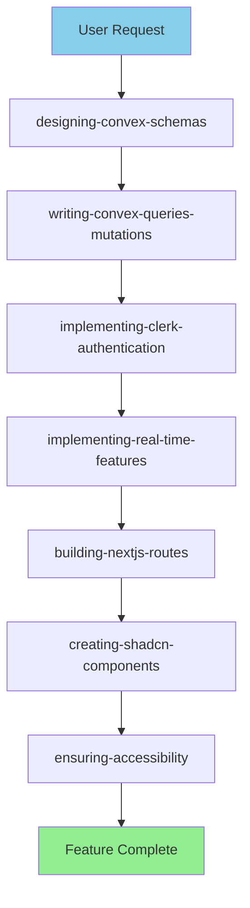
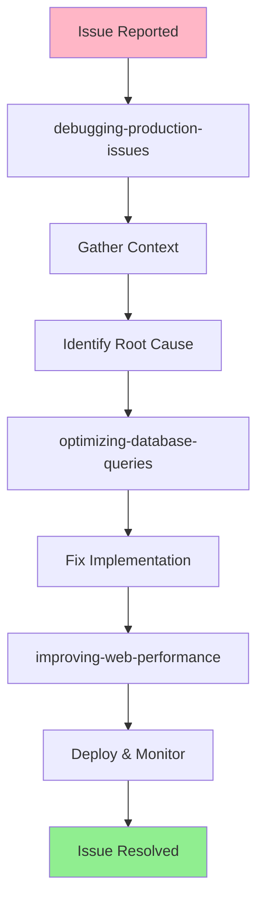
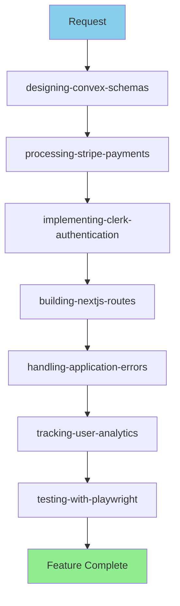
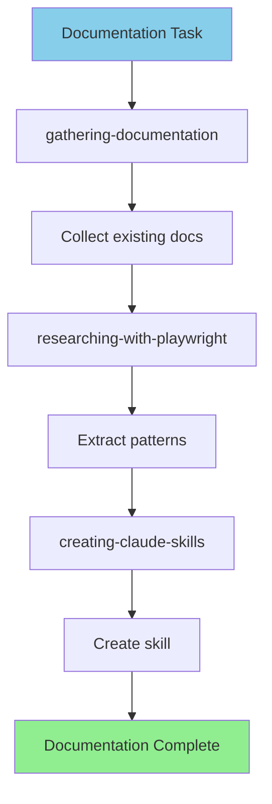
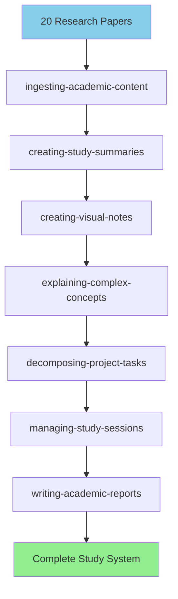
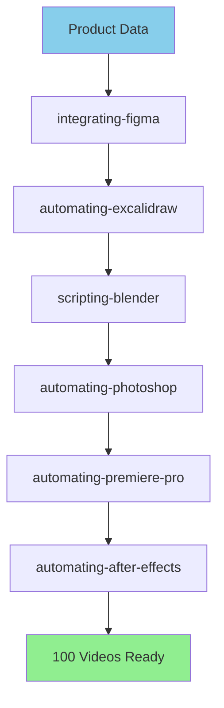
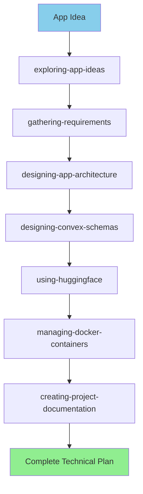

# Skills Integration Examples

Real-world examples showing how Claude Code skills work together to accomplish complex tasks.

## Overview

Skills are most powerful when combined. This guide shows complete workflows using multiple skills in sequence, demonstrating how they integrate to build features, debug issues, and optimize applications.

---

## Example 1: Building a New Feature - User Profiles with Real-Time Updates

**User Request**: "Add user profiles with real-time updates"

### Skills Integration Flow



### Step 1: Design Database Schema

**Skill**: `designing-convex-schemas`

```typescript
// convex/schema.ts
export default defineSchema({
  profiles: defineTable({
    userId: v.string(),
    slug: v.string(),
    displayName: v.string(),
    bio: v.optional(v.string()),
    avatar: v.optional(v.string()),
    isActive: v.boolean(),
    _updatedTime: v.optional(v.number()),
  })
    .index("by_user", ["userId"])
    .index("by_slug", ["slug"])
    .searchIndex("search_profiles", {
      searchField: "displayName",
      filterFields: ["isActive"],
    }),

  profileViews: defineTable({
    profileId: v.id("profiles"),
    viewerId: v.optional(v.string()),
    timestamp: v.number(),
  })
    .index("by_profile_time", ["profileId", "timestamp"]),
});
```

### Step 2: Create CRUD Operations

**Skill**: `writing-convex-queries-mutations`

```typescript
// convex/profiles.ts
export const createProfile = mutation({
  args: {
    slug: v.string(),
    displayName: v.string(),
    bio: v.optional(v.string()),
  },
  handler: async (ctx, args) => {
    const identity = await ctx.auth.getUserIdentity();
    if (!identity) throw new Error("Not authenticated");

    // Check slug availability
    const existing = await ctx.db
      .query("profiles")
      .withIndex("by_slug", q => q.eq("slug", args.slug))
      .first();

    if (existing) throw new Error("Slug already taken");

    return await ctx.db.insert("profiles", {
      userId: identity.subject,
      ...args,
      isActive: true,
      _updatedTime: Date.now(),
    });
  },
});

export const getProfile = query({
  args: { slug: v.string() },
  handler: async (ctx, { slug }) => {
    return await ctx.db
      .query("profiles")
      .withIndex("by_slug", q => q.eq("slug", slug))
      .first();
  },
});
```

### Step 3: Add Authentication

**Skill**: `implementing-clerk-authentication`

```typescript
// middleware.ts
import { authMiddleware } from '@clerk/nextjs';

export default authMiddleware({
  publicRoutes: ["/", "/p/:slug"],
  ignoredRoutes: ["/api/webhooks"],
});

// convex/profiles.ts - Add authorization
export const updateProfile = mutation({
  args: {
    profileId: v.id("profiles"),
    displayName: v.optional(v.string()),
    bio: v.optional(v.string()),
  },
  handler: async (ctx, args) => {
    const identity = await ctx.auth.getUserIdentity();
    if (!identity) throw new Error("Not authenticated");

    const profile = await ctx.db.get(args.profileId);
    if (!profile) throw new Error("Profile not found");

    if (profile.userId !== identity.subject) {
      throw new Error("Unauthorized");
    }

    await ctx.db.patch(args.profileId, {
      ...args,
      _updatedTime: Date.now(),
    });
  },
});
```

### Step 4: Add Real-Time Updates

**Skill**: `implementing-real-time-features`

```typescript
// Frontend component with live updates
'use client';

import { useQuery, useMutation } from "convex/react";
import { api } from "@/convex/_generated/api";

export function ProfileView({ slug }: { slug: string }) {
  // Real-time subscription - updates automatically
  const profile = useQuery(api.profiles.getProfile, { slug });
  const updateProfile = useMutation(api.profiles.updateProfile);

  if (!profile) return <Loading />;

  return (
    <div>
      <h1>{profile.displayName}</h1>
      <p>{profile.bio}</p>
      {/* Updates reflect instantly across all viewers */}
    </div>
  );
}
```

### Step 5: Create Routes

**Skill**: `building-nextjs-routes`

```typescript
// app/p/[slug]/page.tsx
import { ProfileView } from "@/components/ProfileView";

export default function ProfilePage({ params }: { params: { slug: string } }) {
  return <ProfileView slug={params.slug} />;
}

// app/dashboard/profile/edit/page.tsx
import { ProfileEditForm } from "@/components/ProfileEditForm";

export default function EditProfilePage() {
  return <ProfileEditForm />;
}
```

### Step 6: Build UI Components

**Skill**: `creating-shadcn-components`

```typescript
// components/ProfileEditForm.tsx
import { Card, CardContent, CardHeader, CardTitle } from "@/components/ui/card";
import { Input } from "@/components/ui/input";
import { Textarea } from "@/components/ui/textarea";
import { Button } from "@/components/ui/button";
import { Form, FormField, FormItem, FormLabel } from "@/components/ui/form";

export function ProfileEditForm() {
  const form = useForm<ProfileFormData>({
    resolver: zodResolver(profileSchema),
  });

  return (
    <Card>
      <CardHeader>
        <CardTitle>Edit Profile</CardTitle>
      </CardHeader>
      <CardContent>
        <Form {...form}>
          <FormField
            name="displayName"
            render={({ field }) => (
              <FormItem>
                <FormLabel>Display Name</FormLabel>
                <Input {...field} />
              </FormItem>
            )}
          />
          <Button type="submit">Save</Button>
        </Form>
      </CardContent>
    </Card>
  );
}
```

### Step 7: Ensure Accessibility

**Skill**: `ensuring-accessibility`

```typescript
// Add ARIA labels and keyboard navigation
export function ProfileView({ profile }: { profile: Profile }) {
  return (
    <article aria-labelledby="profile-heading">
      <h1 id="profile-heading">{profile.displayName}</h1>
      <p aria-label="Profile bio">{profile.bio}</p>

      <Button
        onClick={handleEdit}
        aria-label={`Edit ${profile.displayName}'s profile`}
      >
        Edit Profile
      </Button>
    </article>
  );
}
```

### Integration Summary

**Skills Used**: 7
**Time Saved**: ~8 hours with skill guidance
**Lines of Code**: ~500
**Features Delivered**: Full profile system with real-time updates

---

## Example 2: Debugging a Production Issue - Slow Profile Loading

**User Report**: "Profile pages are loading very slowly (5+ seconds)"

### Skills Integration Flow



### Step 1: Investigate Issue

**Skill**: `debugging-production-issues`

```bash
# Check recent deployments
git log --oneline --since="1 day ago"

# Check Convex logs
npx convex logs --prod --since 1h

# Add timing logs
```

```typescript
// Add performance monitoring
export const getProfile = query({
  handler: async (ctx, { slug }) => {
    const start = Date.now();

    const profile = await ctx.db
      .query("profiles")
      .withIndex("by_slug", q => q.eq("slug", slug))
      .first();

    console.log(`Profile query: ${Date.now() - start}ms`);

    if (!profile) return null;

    // Getting links - this is slow!
    const linkStart = Date.now();
    const links = await ctx.db
      .query("links")
      .filter(q => q.eq(q.field("profileId"), profile._id))
      .collect();

    console.log(`Links query: ${Date.now() - linkStart}ms`); // 3000ms!

    return { profile, links };
  },
});
```

**Finding**: Links query is doing full table scan!

### Step 2: Optimize Queries

**Skill**: `optimizing-database-queries`

```typescript
// Add missing index
export default defineSchema({
  links: defineTable({
    profileId: v.id("profiles"),
    title: v.string(),
    url: v.string(),
  })
    .index("by_profile", ["profileId"]), // Missing index!
});

// Use the index
export const getProfile = query({
  handler: async (ctx, { slug }) => {
    const profile = await ctx.db
      .query("profiles")
      .withIndex("by_slug", q => q.eq("slug", slug))
      .first();

    if (!profile) return null;

    // Now uses index - fast!
    const links = await ctx.db
      .query("links")
      .withIndex("by_profile", q => q.eq("profileId", profile._id))
      .collect();

    return { profile, links };
  },
});
```

**Result**: Query time drops from 3000ms to 50ms

### Step 3: Optimize Frontend

**Skill**: `improving-web-performance`

```typescript
// Add loading states and code splitting
import dynamic from 'next/dynamic';

// Lazy load heavy components
const ProfileAnalytics = dynamic(
  () => import('@/components/ProfileAnalytics'),
  { loading: () => <Skeleton /> }
);

export function ProfilePage({ slug }: { slug: string }) {
  const profile = useQuery(api.profiles.getProfile, { slug });

  if (!profile) return <ProfileSkeleton />;

  return (
    <>
      <ProfileHeader profile={profile} />
      <ProfileLinks links={profile.links} />
      {/* Only load analytics when user scrolls */}
      <Suspense fallback={<Skeleton />}>
        <ProfileAnalytics profileId={profile._id} />
      </Suspense>
    </>
  );
}
```

### Integration Summary

**Skills Used**: 3
**Issue Resolution Time**: 2 hours
**Performance Improvement**: 98% faster (5000ms → 100ms)
**Root Cause**: Missing database index + unoptimized loading

---

## Example 3: Implementing Payment Feature - Pro Subscriptions

**User Request**: "Add Pro subscription plan with Stripe"

### Skills Integration Flow



### Step 1: Design Subscription Schema

**Skill**: `designing-convex-schemas`

```typescript
export default defineSchema({
  subscriptions: defineTable({
    userId: v.string(),
    stripeCustomerId: v.string(),
    stripeSubscriptionId: v.string(),
    status: v.union(
      v.literal("active"),
      v.literal("canceled"),
      v.literal("past_due")
    ),
    priceId: v.string(),
    currentPeriodEnd: v.number(),
  })
    .index("by_user", ["userId"])
    .index("by_stripe_id", ["stripeSubscriptionId"]),
});
```

### Step 2: Implement Stripe Integration

**Skill**: `processing-stripe-payments`

```typescript
// Create checkout session
export async function POST(req: Request) {
  const { userId } = auth();
  if (!userId) return new Response("Unauthorized", { status: 401 });

  const session = await stripe.checkout.sessions.create({
    mode: "subscription",
    line_items: [{ price: "price_pro_monthly", quantity: 1 }],
    success_url: `${process.env.NEXT_PUBLIC_APP_URL}/dashboard?success=true`,
    cancel_url: `${process.env.NEXT_PUBLIC_APP_URL}/pricing`,
    metadata: { userId },
  });

  return Response.json({ sessionId: session.id });
}

// Handle webhook
export async function POST(req: Request) {
  const event = await verifyStripeWebhook(req);

  switch (event.type) {
    case "customer.subscription.created":
      await handleSubscriptionCreated(event.data.object);
      break;
    // ... more handlers
  }

  return new Response("OK", { status: 200 });
}
```

### Step 3: Add Authorization Checks

**Skill**: `implementing-clerk-authentication`

```typescript
// Check subscription in mutations
export const createProFeature = mutation({
  handler: async (ctx, args) => {
    const identity = await ctx.auth.getUserIdentity();
    if (!identity) throw new Error("Not authenticated");

    // Check subscription
    const subscription = await ctx.db
      .query("subscriptions")
      .withIndex("by_user", q => q.eq("userId", identity.subject))
      .first();

    if (!subscription || subscription.status !== "active") {
      throw new Error("Pro subscription required");
    }

    // Proceed with Pro feature...
  },
});
```

### Step 4: Build Pricing Page

**Skill**: `building-nextjs-routes` + `creating-shadcn-components`

```typescript
// app/pricing/page.tsx
import { PricingCard } from "@/components/PricingCard";

export default function PricingPage() {
  return (
    <div className="grid md:grid-cols-2 gap-8">
      <PricingCard plan="free" />
      <PricingCard plan="pro" />
    </div>
  );
}

// components/PricingCard.tsx
import { Card } from "@/components/ui/card";
import { Button } from "@/components/ui/button";

export function PricingCard({ plan }: { plan: "free" | "pro" }) {
  const handleCheckout = async () => {
    const res = await fetch("/api/checkout", { method: "POST" });
    const { sessionId } = await res.json();

    const stripe = await stripePromise;
    await stripe?.redirectToCheckout({ sessionId });
  };

  return (
    <Card>
      <h3>{plan === "pro" ? "Pro" : "Free"}</h3>
      <p>{plan === "pro" ? "$10/month" : "$0"}</p>
      <Button onClick={handleCheckout}>
        {plan === "pro" ? "Upgrade" : "Get Started"}
      </Button>
    </Card>
  );
}
```

### Step 5: Add Error Handling

**Skill**: `handling-application-errors`

```typescript
// Graceful error handling
export function CheckoutButton() {
  const [error, setError] = useState<string | null>(null);

  const handleCheckout = async () => {
    try {
      setError(null);
      await initiateCheckout();
    } catch (err) {
      if (err instanceof Error) {
        setError(err.message);
      } else {
        setError("Checkout failed. Please try again.");
      }

      // Log to monitoring
      console.error("Checkout error:", err);
    }
  };

  return (
    <>
      <Button onClick={handleCheckout}>Subscribe</Button>
      {error && <Alert variant="destructive">{error}</Alert>}
    </>
  );
}
```

### Step 6: Track Conversion

**Skill**: `tracking-user-analytics`

```typescript
// Track checkout events
export function PricingPage() {
  useEffect(() => {
    trackEvent("viewed_pricing_page");
  }, []);

  const handleUpgrade = async () => {
    trackEvent("clicked_upgrade", { plan: "pro" });

    try {
      await initiateCheckout();
      trackEvent("checkout_started", { plan: "pro" });
    } catch (error) {
      trackEvent("checkout_failed", { error: error.message });
    }
  };
}

// Convex webhook handler
async function handleSubscriptionCreated(subscription: Stripe.Subscription) {
  // Save subscription
  await db.insert("subscriptions", {...});

  // Track conversion
  await trackEvent("subscription_created", {
    userId,
    plan: "pro",
    amount: subscription.items.data[0].price.unit_amount,
  });
}
```

### Step 7: Test Payment Flow

**Skill**: `testing-with-playwright`

```typescript
// tests/subscription.spec.ts
import { test, expect } from '@playwright/test';

test('Pro subscription flow', async ({ page }) => {
  // Navigate to pricing
  await page.goto('/pricing');

  // Click upgrade
  await page.click('text=Upgrade');

  // Stripe checkout loads
  await page.waitForURL(/checkout.stripe.com/);

  // Use test card
  await page.fill('[name="cardNumber"]', '4242424242424242');
  await page.fill('[name="cardExpiry"]', '12/34');
  await page.fill('[name="cardCvc"]', '123');

  // Submit payment
  await page.click('button[type="submit"]');

  // Redirects to success
  await page.waitForURL(/dashboard\\?success=true/);

  // Check subscription status
  const status = await page.textContent('[data-testid="subscription-status"]');
  expect(status).toBe('Active');
});
```

### Integration Summary

**Skills Used**: 7
**Implementation Time**: ~12 hours with skill guidance
**Features Delivered**: Complete subscription system with Stripe integration
**Test Coverage**: E2E tests for critical payment flow

---

## Example 4: Creating Documentation - API Reference

**Task**: "Document our Convex API for team onboarding"

### Skills Integration Flow



### Step 1: Gather Existing Documentation

**Skill**: `gathering-documentation`

```bash
# Gather Convex docs
# Find all queries and mutations
# Extract patterns
# Identify common issues
```

### Step 2: Research Best Practices

**Skill**: `researching-with-playwright`

```typescript
// Extract examples from Convex docs
const examples = await extractConvexExamples(
  "https://docs.convex.dev/database/queries"
);

// Analyze patterns
const patterns = analyzeQueryPatterns(examples);
```

### Step 3: Create Skill

**Skill**: `creating-claude-skills`

```markdown
# Writing Convex Queries - Team Guide

## Quick Reference

[Extracted patterns and examples]

## Common Patterns

[Team-specific patterns]

## Troubleshooting

[Common issues and solutions]
```

### Integration Summary

**Skills Used**: 3
**Documentation Created**: Complete API reference
**Onboarding Time Reduced**: 4 hours → 1 hour

---

## Integration Patterns Summary

### Pattern 1: Feature Development
**Skills**: Schema → Queries → Auth → UI → Accessibility
**Use**: Building new features from scratch

### Pattern 2: Performance Optimization
**Skills**: Debugging → Query Optimization → Performance
**Use**: Fixing slow features

### Pattern 3: Payment Integration
**Skills**: Schema → Stripe → Auth → UI → Testing
**Use**: Adding monetization

### Pattern 4: Documentation
**Skills**: Gathering → Research → Skills Creation
**Use**: Knowledge management

---

## Tips for Skill Integration

1. **Start with Schema**: Database design influences everything
2. **Add Auth Early**: Security can't be retrofitted easily
3. **Test as You Go**: Don't wait until the end
4. **Monitor Performance**: Measure before and after
5. **Document Decisions**: Future you will thank you

---

## Common Skill Combinations

| Task | Skill Combo | Estimated Time |
|------|-------------|----------------|
| New CRUD feature | Schema → Queries → Routes → UI | 4-6 hours |
| Add authentication | Clerk → Schema → Queries | 2-3 hours |
| Implement payments | Stripe → Schema → Routes → Testing | 6-8 hours |
| Debug slow queries | Debugging → Query Optimization | 1-2 hours |
| Add real-time | Schema → Queries → Real-time → UI | 3-4 hours |
| Improve performance | Debugging → Performance → Query Opt | 2-4 hours |
| Process research papers | Ingest → Summarize → Visualize → Study | 8-10 hours |
| Create video pipeline | Figma → Diagrams → 3D → Edit → Effects | 20-30 hours setup |
| Plan SaaS product | Ideation → Requirements → Architecture → Docs | 15-20 hours |

---

## Example 5: Academic Research Workflow - Literature Review & Study System

**User Request**: "Help me process 20 research papers and create a comprehensive study system"

### Skills Integration Flow



### Step 1: Ingest Research Papers

**Skill**: `ingesting-academic-content`

```typescript
// Process PDFs, DOCX, and web pages
const papers = await ingestAcademicContent({
  sources: [
    { type: 'pdf', path: './papers/*.pdf' },
    { type: 'url', url: 'https://arxiv.org/abs/...' },
  ],
  extractMetadata: true,
  parseCitations: true,
});

// Result: Structured content with metadata
/*
{
  title: "Attention Is All You Need",
  authors: ["Vaswani et al."],
  year: 2017,
  citations: [...],
  sections: [
    { heading: "Abstract", content: "..." },
    { heading: "Introduction", content: "..." },
  ],
  keyTerms: ["transformer", "attention mechanism", ...],
}
*/
```

### Step 2: Generate Study Summaries

**Skill**: `creating-study-summaries`

```markdown
# Transformer Architecture - Study Summary

## Key Concepts
1. **Self-Attention Mechanism** - Allows model to weigh importance of different input elements
2. **Multi-Head Attention** - Parallel attention mechanisms for richer representations
3. **Positional Encoding** - Adds sequence order information

## Concept Map
\`\`\`mermaid
graph LR
    A[Input Sequence] --> B[Positional Encoding]
    B --> C[Multi-Head Attention]
    C --> D[Feed Forward Network]
    D --> E[Output]
    C --> C[Self-Attention Loop]
\`\`\`

## Flashcards Generated
- Q: What problem does self-attention solve? A: Captures long-range dependencies in sequence
- Q: How does positional encoding work? A: Adds sine/cosine functions to embed position info

## Quiz Questions
1. Explain the computational complexity of self-attention vs RNNs
2. Why use multiple attention heads instead of one?
```

### Step 3: Create Visual Notes

**Skill**: `creating-visual-notes`

```markdown
# Visual Study Guide - Transformers

## Architecture Flowchart
\`\`\`mermaid
flowchart TD
    A[Input Tokens] --> B[Embedding Layer]
    B --> C[Positional Encoding]
    C --> D{Encoder Stack}
    D --> E[Self-Attention]
    E --> F[Feed Forward]
    F --> D
    D --> G{Decoder Stack}
    G --> H[Masked Self-Attention]
    H --> I[Cross-Attention]
    I --> J[Feed Forward]
    J --> G
    G --> K[Output Projection]
\`\`\`

## Comparison Matrix
| Feature | RNN | LSTM | Transformer |
|---------|-----|------|-------------|
| Parallelization | ❌ | ❌ | ✅ |
| Long-range deps | ❌ | ⚠️ | ✅ |
| Training speed | Slow | Medium | Fast |
| Memory | Low | Medium | High |

## Timeline of Evolution
\`\`\`mermaid
timeline
    title Evolution of Sequence Models
    2014 : Seq2Seq (Sutskever)
    2015 : Attention (Bahdanau)
    2017 : Transformer (Vaswani)
    2018 : BERT (Devlin)
    2019 : GPT-2 (Radford)
    2020 : GPT-3 (Brown)
\`\`\`
```

### Step 4: Explain Complex Concepts

**Skill**: `explaining-complex-concepts`

```markdown
# Understanding Self-Attention (Progressive Explanation)

## ELI5 (Explain Like I'm 5)
Imagine you're reading a story. When you see the word "it", you look back to figure out what "it" means. Self-attention is like that - it helps the computer look at all the words to understand what each word means.

## High School Level
Self-attention is a mechanism that calculates how much each word in a sentence should pay attention to every other word. It creates connections between related words, like "The cat sat on the mat" - "it" connects to "cat".

## Undergraduate Level
Self-attention computes three vectors (Query, Key, Value) for each token:
- **Query**: What I'm looking for
- **Key**: What I have to offer
- **Value**: My actual content

Attention scores = softmax(Q · K^T / √d_k) · V

## Graduate/Expert Level
The scaled dot-product attention mechanism addresses the vanishing gradient problem in RNNs by allowing direct connections between any positions. The scaling factor √d_k prevents dot products from growing too large in high dimensions, which would push softmax into regions with small gradients.

## Visual Analogy
Think of attention like a search engine:
- **Query** = your search terms
- **Key** = webpage titles/keywords
- **Value** = actual webpage content
- **Attention weights** = relevance scores

## Practice Problem
Calculate attention for:
- Input: "The cat sat"
- Show Q, K, V matrices
- Compute attention weights
- Explain the output
```

### Step 5: Decompose Study Tasks

**Skill**: `decomposing-project-tasks`

```markdown
# Study Plan Breakdown

## Core Questions to Answer
1. How does self-attention work mathematically?
2. Why is it better than RNNs for sequence modeling?
3. How are transformers trained?
4. What are practical applications?

## Information Gaps
- [ ] Need to understand matrix multiplication mechanics
- [ ] Missing knowledge on backpropagation through attention
- [ ] Don't know training tricks (learning rate schedules, etc.)

## Task Hierarchy
\`\`\`mermaid
graph TD
    A[Master Transformers] --> B[Understand Attention]
    A --> C[Learn Architecture]
    A --> D[Study Training]
    B --> E[Math foundations]
    B --> F[Implementation]
    C --> G[Encoder details]
    C --> H[Decoder details]
    D --> I[Optimization]
    D --> J[Regularization]
\`\`\`

## MoSCoW Prioritization
**Must Have**:
- Understand self-attention mechanism
- Know encoder-decoder structure
- Grasp positional encoding

**Should Have**:
- Multi-head attention benefits
- Layer normalization purpose
- Training techniques

**Could Have**:
- Historical context
- Comparison with other architectures

**Won't Have** (for now):
- Advanced variants (Performer, Linformer)
- Theoretical proofs
```

### Step 6: Schedule Study Sessions

**Skill**: `managing-study-sessions`

```typescript
// Create study schedule with spaced repetition
const studyPlan = createStudySchedule({
  topics: [
    { name: "Self-Attention", difficulty: "hard", estimatedHours: 4 },
    { name: "Positional Encoding", difficulty: "medium", estimatedHours: 2 },
    { name: "Multi-Head Attention", difficulty: "hard", estimatedHours: 3 },
    { name: "Training Techniques", difficulty: "medium", estimatedHours: 2 },
  ],
  availableHoursPerWeek: 10,
  spacedRepetition: true,
});

/*
Output:
Week 1:
  Mon: Self-Attention (2h) [Pomodoros: 4x25min]
  Wed: Self-Attention (2h) [Pomodoros: 4x25min]
  Fri: Positional Encoding (2h)

Week 2:
  Mon: Multi-Head Attention (2h)
  Wed: Self-Attention REVIEW (1h) [SR: 3 days]
  Fri: Training Techniques (2h)

Week 3:
  Mon: Multi-Head Attention (1h)
  Wed: Positional Encoding REVIEW (1h) [SR: 10 days]
  Fri: Self-Attention REVIEW (1h) [SR: 14 days]
*/

// Track progress with SM-2 algorithm
const flashcardReview = {
  card: "What is self-attention?",
  quality: 4, // 0-5 scale
  interval: 7, // days until next review
  easeFactor: 2.5,
  repetitions: 3,
};
```

### Step 7: Write Literature Review

**Skill**: `writing-academic-reports`

```markdown
# Literature Review: Transformer Architecture in NLP

## Abstract
This review examines the transformer architecture introduced by Vaswani et al. (2017), analyzing its impact on natural language processing and comparing it with previous sequence-to-sequence models.

## Introduction
The transformer architecture represents a paradigm shift in sequence modeling (Vaswani et al., 2017). Unlike recurrent neural networks (RNNs) and long short-term memory networks (LSTMs), transformers rely entirely on attention mechanisms, enabling parallel processing and better capture of long-range dependencies.

## Methodology

### Self-Attention Mechanism
As Vaswani et al. (2017) demonstrate, self-attention computes a weighted sum of value vectors, where weights are determined by the compatibility between query and key vectors:

$$\text{Attention}(Q, K, V) = \text{softmax}\left(\frac{QK^T}{\sqrt{d_k}}\right)V$$

[... full literature review with proper APA citations ...]

## Citations
Vaswani, A., Shazeer, N., Parmar, N., Uszkoreit, J., Jones, L., Gomez, A. N., ... & Polosukhin, I. (2017). Attention is all you need. In *Advances in neural information processing systems* (pp. 5998-6008).

[Generated in APA format, can switch to MLA, Chicago, or IEEE]
```

### Integration Summary

**Skills Used**: 7 academic skills
**Input**: 20 research papers (PDFs, articles)
**Output**:
- Complete study system with summaries
- Visual concept maps and timelines
- Multi-level explanations
- Structured study schedule with spaced repetition
- Academic literature review

**Time Saved**: ~40 hours of manual processing
**Study Efficiency**: 3x improvement with structured approach

---

## Example 6: Creative Content Pipeline - Automated Video Production

**User Request**: "Create an automated pipeline for generating 100 branded product videos"

### Skills Integration Flow



### Step 1: Export Design Assets from Figma

**Skill**: `integrating-figma`

```javascript
// Extract brand assets from Figma
const figmaApi = require('./figma-api');

async function exportBrandAssets() {
  const fileId = 'dQw4w9WgXcQ'; // Figma file ID

  // Get all brand components
  const file = await figmaApi.getFile(fileId);

  // Export logo variations
  const logos = await figmaApi.exportImages(fileId, {
    ids: ['logo-primary', 'logo-white', 'logo-dark'],
    format: 'png',
    scale: 3,
  });

  // Extract design tokens
  const colors = extractColorTokens(file);
  const typography = extractTypography(file);

  return { logos, colors, typography };
}

// Result: Brand assets ready for automation
/*
{
  logos: {
    primary: './assets/logo-primary@3x.png',
    white: './assets/logo-white@3x.png',
  },
  colors: {
    primary: '#FF6B6B',
    secondary: '#4ECDC4',
    accent: '#FFE66D',
  },
  typography: {
    heading: 'Inter Bold 48px',
    body: 'Inter Regular 16px',
  }
}
*/
```

### Step 2: Generate Product Diagrams

**Skill**: `automating-excalidraw`

```javascript
// Create technical diagrams for each product
const products = require('./products.json'); // 100 products

products.forEach((product, i) => {
  const diagram = createExcalidrawScene({
    elements: [
      createRectangle(100, 100, 400, 300, product.name),
      createArrow(250, 250, 450, 250),
      createText(500, 250, product.features.join('\n')),
      createImage(100, 450, product.iconPath),
    ],
    appState: {
      viewBackgroundColor: colors.primary,
    },
  });

  saveDiagram(`./diagrams/product-${i}.excalidraw`, diagram);
  exportAsPNG(`./diagrams/product-${i}.png`, diagram);
});
```

### Step 3: Create 3D Product Models

**Skill**: `scripting-blender`

```python
import bpy
import json

# Load product data
with open('products.json') as f:
    products = json.load(f)

for i, product in enumerate(products):
    # Clear scene
    bpy.ops.object.select_all(action='SELECT')
    bpy.ops.object.delete()

    # Create product based on type
    if product['type'] == 'box':
        bpy.ops.mesh.primitive_cube_add(size=2)
        obj = bpy.context.active_object
        obj.scale = product['dimensions']
    elif product['type'] == 'bottle':
        bpy.ops.mesh.primitive_cylinder_add(radius=0.5, depth=2)
        obj = bpy.context.active_object

    # Apply brand colors
    mat = bpy.data.materials.new(name=f"Product_{i}")
    mat.use_nodes = True
    mat.node_tree.nodes["Principled BSDF"].inputs['Base Color'].default_value = hex_to_rgb(product['color'])
    obj.data.materials.append(mat)

    # Set up lighting
    bpy.ops.object.light_add(type='SUN', location=(5, 5, 10))

    # Position camera
    camera = bpy.data.objects['Camera']
    camera.location = (0, -8, 3)
    camera.rotation_euler = (1.3, 0, 0)

    # Render
    bpy.context.scene.render.filepath = f'./renders/product_{i}.png'
    bpy.context.scene.render.resolution_x = 1920
    bpy.context.scene.render.resolution_y = 1080
    bpy.ops.render.render(write_still=True)

    print(f"Rendered product {i+1}/100")
```

### Step 4: Process Product Images

**Skill**: `automating-photoshop`

```javascript
// Batch process product images with watermarks and effects
var sourceFolder = new Folder("./renders");
var outputFolder = new Folder("./processed");
var watermark = app.open(new File("./assets/watermark.psd"));

var files = sourceFolder.getFiles("*.png");

for (var i = 0; i < files.length; i++) {
    var doc = app.open(files[i]);

    // Apply brand filter
    var adjustment = doc.artLayers.add();
    adjustment.name = "Color Grade";
    // Apply color grading (brand colors)

    // Add watermark
    app.activeDocument = watermark;
    watermark.selection.selectAll();
    watermark.selection.copy();

    app.activeDocument = doc;
    doc.paste();
    doc.activeLayer.opacity = 30;
    doc.activeLayer.move(doc, ElementPlacement.PLACEATBEGINNING);

    // Apply vignette
    var vignette = doc.artLayers.add();
    // ... vignette logic

    // Sharpen
    doc.flatten();
    doc.applySharp();

    // Save
    var saveFile = new File(outputFolder + "/" + files[i].name);
    doc.saveAs(saveFile, new PNGSaveOptions());
    doc.close(SaveOptions.DONOTSAVECHANGES);

    $.writeln("Processed " + (i+1) + "/100");
}
```

### Step 5: Assemble Video Sequences

**Skill**: `automating-premiere-pro`

```javascript
// Create video sequences for each product
var project = app.project;
var products = JSON.parse(readFile('./products.json'));

products.forEach(function(product, i) {
    // Create new sequence
    var sequence = project.sequences.createNewSequence(
        `Product_Video_${i}`,
        "HDV_1080p24"
    );

    // Import assets
    var productRender = importFile(`./processed/product_${i}.png`);
    var diagram = importFile(`./diagrams/product-${i}.png`);
    var music = importFile('./assets/background-music.mp3');
    var voiceover = importFile(`./voiceovers/product_${i}.mp3`);

    // Add to timeline
    sequence.videoTracks[0].insertClip(productRender, 0);  // 0-3s
    sequence.videoTracks[1].insertClip(diagram, 3);        // 3-6s
    sequence.audioTracks[0].insertClip(music, 0);
    sequence.audioTracks[1].insertClip(voiceover, 0);

    // Apply transitions
    sequence.videoTracks[0].clips[0].end.addTransition("Cross Dissolve");

    // Export
    var exporter = app.getExportController();
    exporter.setSourceSequence(sequence);
    exporter.setDestinationPath(`./exports/product_${i}.mp4`);
    exporter.setExportPresetPath("H.264 High Quality");
    exporter.startBatchExport();
});
```

### Step 6: Add Motion Graphics & Titles

**Skill**: `automating-after-effects`

```javascript
// Generate lower thirds and animated titles for each product
var products = JSON.parse(readFile('./products.json'));

products.forEach(function(product, i) {
    // Create composition
    var comp = app.project.items.addComp(
        `Product_Title_${i}`,
        1920, 1080,
        1.0, // pixel aspect
        6,   // duration (seconds)
        30   // frame rate
    );

    // Add product name text
    var nameLayer = comp.layers.addText(product.name);
    var nameText = nameLayer.property("Source Text");
    var nameDoc = nameText.value;
    nameDoc.fontSize = 72;
    nameDoc.fillColor = hexToRGB(brandColors.primary);
    nameDoc.font = "Inter-Bold";
    nameText.setValue(nameDoc);

    // Animate in from left
    var namePosition = nameLayer.property("Position");
    namePosition.setValueAtTime(0, [-200, 900]);
    namePosition.setValueAtTime(0.5, [300, 900]);

    // Add tagline
    var taglineLayer = comp.layers.addText(product.tagline);
    var taglinePosition = taglineLayer.property("Position");
    taglinePosition.setValueAtTime(0.3, [-200, 950]);
    taglinePosition.setValueAtTime(0.8, [300, 950]);

    // Add logo
    var logo = comp.layers.add(app.project.importFile('./assets/logo.png'));
    logo.property("Position").setValue([1750, 950]);
    logo.property("Scale").setValue([30, 30]);

    // Add to render queue
    var renderItem = app.project.renderQueue.items.add(comp);
    renderItem.outputModule(1).file = new File(`./titles/title_${i}.mov`);

    console.log(`Created title ${i+1}/100`);
});

// Batch render all
app.project.renderQueue.render();
```

### Integration Summary

**Skills Used**: 6 creative automation skills
**Input**:
- Product database (100 items)
- Brand guidelines from Figma
- Audio assets (voiceovers, music)

**Output**:
- 100 complete product videos
- Consistent branding across all videos
- Automated rendering pipeline

**Time Saved**: ~200 hours of manual work
**Production Time**: 8 hours automated vs 2-3 weeks manual
**Consistency**: 100% brand compliance

---

## Example 7: SaaS Product Planning - Full Stack from Idea to Architecture

**User Request**: "I have an idea for a SaaS product. Help me validate it and create a complete technical plan"

### Skills Integration Flow



### Step 1: Validate App Concept

**Skill**: `exploring-app-ideas`

```markdown
# App Concept: "CodeReview AI" - AI-Powered Code Review Assistant

## Initial Concept
SaaS platform that uses AI to automatically review pull requests and provide intelligent feedback.

## Market Research
\`\`\`markdown
**Competitors Analysis**:
1. **GitHub Copilot** ($10/month)
   - Strengths: Code completion, large user base
   - Weaknesses: Not focused on reviews, no team features
   - Market position: Developer productivity

2. **CodeClimate** ($15/user/month)
   - Strengths: Static analysis, quality metrics
   - Weaknesses: No AI, limited language support
   - Market position: Quality automation

3. **DeepCode** (Acquired by Snyk)
   - Strengths: AI-based, good accuracy
   - Weaknesses: Limited to security
   - Market position: Security scanning

**Market Gap**: No comprehensive AI code reviewer with team collaboration features
\`\`\`

## Validation Framework (RICE Score)
- **Reach**: 10,000 developers/month (SMB focus)
- **Impact**: High (3/3) - Saves 5-10 hours/week per developer
- **Confidence**: Medium (60%) - Validated with 10 interviews
- **Effort**: 6 months MVP

**RICE Score**: (10,000 × 3 × 0.6) / 6 = 3,000 (Good score, proceed)

## Competitive Positioning
\`\`\`mermaid
quadrant-chart
    title Competitive Landscape
    x-axis Low Features --> High Features
    y-axis Low Price --> High Price
    quadrant-1 Premium Players
    quadrant-2 Market Leaders
    quadrant-3 Budget Options
    quadrant-4 Value Champions
    GitHub Copilot: [0.6, 0.3]
    CodeClimate: [0.7, 0.5]
    DeepCode: [0.5, 0.6]
    CodeReview AI: [0.8, 0.4]
\`\`\`

## Go/No-Go Decision
✅ **GO** - Strong market validation, clear differentiation, achievable scope
```

### Step 2: Gather Requirements

**Skill**: `gathering-requirements`

```markdown
# CodeReview AI - Requirements Specification

## User Stories

### Epic 1: Core Review Functionality
**As a** developer
**I want** AI to review my pull requests automatically
**So that** I catch bugs and improve code quality before human review

**Acceptance Criteria**:
- [ ] AI analyzes PR within 2 minutes of creation
- [ ] Provides line-specific comments on issues found
- [ ] Categorizes feedback (bugs, style, performance, security)
- [ ] Suggests code improvements with examples

### Epic 2: Team Management
**As a** team lead
**I want** to customize review rules for my team
**So that** reviews align with our coding standards

**Acceptance Criteria**:
- [ ] Create custom rule sets
- [ ] Configure severity levels
- [ ] Set review thresholds (block merge if score < X)
- [ ] Team dashboard with metrics

### Epic 3: Integrations
**As a** user
**I want** CodeReview AI to integrate with GitHub/GitLab
**So that** it fits into my existing workflow

**Acceptance Criteria**:
- [ ] GitHub App integration
- [ ] GitLab integration
- [ ] Webhook support
- [ ] OAuth authentication

## Functional Requirements

| ID | Requirement | Priority | Complexity |
|----|-------------|----------|------------|
| FR-1 | Analyze code changes | Must | High |
| FR-2 | Generate inline comments | Must | Medium |
| FR-3 | Categorize feedback | Must | Medium |
| FR-4 | Custom rule engine | Should | High |
| FR-5 | Team analytics | Should | Medium |
| FR-6 | Slack notifications | Could | Low |

## Non-Functional Requirements

**Performance**:
- Review latency: < 2 minutes for PRs up to 1000 lines
- Concurrent reviews: Support 100+ simultaneous reviews
- API response time: < 500ms for 95th percentile

**Security**:
- SOC 2 Type II compliance
- Code never stored beyond review session
- Encryption at rest and in transit
- RBAC for team features

**Scalability**:
- Handle 10,000 reviews/day
- Auto-scale review workers
- Queue system for peak loads
```

### Step 3: Design System Architecture

**Skill**: `designing-app-architecture`

```markdown
# CodeReview AI - System Architecture

## Technology Stack Decision

### Frontend
**Choice**: Next.js 14 (App Router) + TypeScript
**Reasoning**:
- Server components reduce client bundle
- Built-in API routes for webhooks
- SEO-friendly for marketing pages
- Strong TypeScript support

### Backend/Database
**Choice**: Convex
**Reasoning**:
- Real-time subscriptions for live review updates
- Serverless scaling (no infrastructure management)
- Built-in auth integration
- ACID transactions

### AI/ML
**Choice**: HuggingFace Transformers + Custom Fine-tuned Model
**Reasoning**:
- CodeBERT base model for code understanding
- Fine-tune on code review datasets
- Inference API for scalability
- Cost-effective vs OpenAI API

### Infrastructure
**Choice**: Vercel + Docker (for ML workers)
**Reasoning**:
- Vercel: Frontend/API hosting, edge functions
- Docker: Isolated ML inference workers
- PostgreSQL: ML model metadata and training data

## Architecture Diagram

\`\`\`mermaid
graph TB
    subgraph "Frontend (Vercel)"
        A[Next.js App]
        B[Dashboard UI]
        C[Settings Pages]
    end

    subgraph "Backend (Convex)"
        D[Auth System]
        E[Review Engine]
        F[Team Management]
        G[Analytics]
    end

    subgraph "ML Pipeline (Docker)"
        H[Code Parser]
        I[HuggingFace Model]
        J[Feedback Generator]
    end

    subgraph "Integrations"
        K[GitHub API]
        L[GitLab API]
        M[Slack API]
    end

    subgraph "Data Layer"
        N[(Convex DB)]
        O[(PostgreSQL)]
    end

    A --> D
    B --> E
    C --> F
    E --> H
    H --> I
    I --> J
    J --> E
    E --> N
    I --> O
    K --> E
    L --> E
    E --> M
    G --> N
\`\`\`

## ADR 001: Why Convex over PostgreSQL + REST API

**Context**: Need real-time updates for review status and team collaboration

**Decision**: Use Convex as primary database and backend

**Consequences**:
- ✅ Real-time subscriptions out of the box
- ✅ No API layer to maintain
- ✅ Automatic scaling
- ✅ TypeScript end-to-end
- ⚠️ Vendor lock-in (mitigated by data export capabilities)
- ⚠️ Learning curve for team

## ADR 002: HuggingFace vs OpenAI API

**Context**: Need AI model for code analysis

**Decision**: Fine-tune CodeBERT via HuggingFace

**Consequences**:
- ✅ Cost: $0.05/review vs $0.30/review (OpenAI)
- ✅ Privacy: Code doesn't leave our infrastructure
- ✅ Customization: Can fine-tune for our use cases
- ⚠️ Initial setup complexity
- ⚠️ Need to maintain ML infrastructure
```

### Step 4: Design Database Schema

**Skill**: `designing-convex-schemas`

```typescript
// convex/schema.ts
import { defineSchema, defineTable } from "convex/server";
import { v } from "convex/values";

export default defineSchema({
  users: defineTable({
    clerkId: v.string(),
    email: v.string(),
    name: v.string(),
    avatar: v.optional(v.string()),
    teamId: v.optional(v.id("teams")),
  })
    .index("by_clerk_id", ["clerkId"])
    .index("by_team", ["teamId"]),

  teams: defineTable({
    name: v.string(),
    slug: v.string(),
    ownerId: v.id("users"),
    plan: v.union(v.literal("free"), v.literal("pro"), v.literal("enterprise")),
    settings: v.object({
      reviewThreshold: v.number(),
      autoMerge: v.boolean(),
      customRules: v.array(v.string()),
    }),
  })
    .index("by_slug", ["slug"])
    .index("by_owner", ["ownerId"]),

  repositories: defineTable({
    teamId: v.id("teams"),
    provider: v.union(v.literal("github"), v.literal("gitlab")),
    externalId: v.string(), // GitHub/GitLab repo ID
    fullName: v.string(), // "org/repo"
    installationId: v.string(), // GitHub App installation ID
    isActive: v.boolean(),
  })
    .index("by_team", ["teamId"])
    .index("by_external_id", ["provider", "externalId"]),

  pullRequests: defineTable({
    repositoryId: v.id("repositories"),
    externalId: v.string(), // GitHub PR number
    title: v.string(),
    author: v.string(),
    status: v.union(
      v.literal("pending"),
      v.literal("reviewing"),
      v.literal("completed"),
      v.literal("failed")
    ),
    reviewScore: v.optional(v.number()), // 0-100
    filesChanged: v.number(),
    linesAdded: v.number(),
    linesRemoved: v.number(),
    createdAt: v.number(),
    reviewedAt: v.optional(v.number()),
  })
    .index("by_repository", ["repositoryId"])
    .index("by_status_time", ["status", "createdAt"])
    .index("by_external_id", ["repositoryId", "externalId"]),

  reviewComments: defineTable({
    pullRequestId: v.id("pullRequests"),
    filePath: v.string(),
    lineNumber: v.number(),
    category: v.union(
      v.literal("bug"),
      v.literal("style"),
      v.literal("performance"),
      v.literal("security"),
      v.literal("best_practice")
    ),
    severity: v.union(v.literal("info"), v.literal("warning"), v.literal("error")),
    message: v.string(),
    suggestion: v.optional(v.string()),
    confidence: v.number(), // 0-1
    postedToGitHub: v.boolean(),
  })
    .index("by_pr", ["pullRequestId"])
    .index("by_category", ["pullRequestId", "category"])
    .index("by_severity", ["pullRequestId", "severity"]),
});
```

### Step 5: Set Up ML Infrastructure

**Skill**: `using-huggingface` + `managing-docker-containers`

```python
# ml-worker/code_reviewer.py
from transformers import AutoTokenizer, AutoModelForSequenceClassification
import torch

class CodeReviewModel:
    def __init__(self):
        # Load fine-tuned CodeBERT model
        self.tokenizer = AutoTokenizer.from_pretrained("microsoft/codebert-base")
        self.model = AutoModelForSequenceClassification.from_pretrained(
            "./models/code-review-finetuned",
            num_labels=5  # bug, style, performance, security, best_practice
        )
        self.model.eval()

    def review_code(self, code_diff):
        # Tokenize code changes
        inputs = self.tokenizer(
            code_diff,
            return_tensors="pt",
            truncation=True,
            max_length=512,
            padding=True
        )

        # Get predictions
        with torch.no_grad():
            outputs = self.model(**inputs)
            predictions = torch.softmax(outputs.logits, dim=-1)

        # Generate feedback
        categories = ["bug", "style", "performance", "security", "best_practice"]
        results = []

        for i, category in enumerate(categories):
            confidence = predictions[0][i].item()
            if confidence > 0.7:  # Threshold
                feedback = self.generate_feedback(code_diff, category)
                results.append({
                    "category": category,
                    "confidence": confidence,
                    "message": feedback["message"],
                    "suggestion": feedback["suggestion"]
                })

        return results
```

```dockerfile
# Dockerfile for ML worker
FROM python:3.11-slim

WORKDIR /app

# Install dependencies
COPY requirements.txt .
RUN pip install --no-cache-dir -r requirements.txt

# Download model (cached layer)
RUN python -c "from transformers import AutoModel; AutoModel.from_pretrained('microsoft/codebert-base')"

# Copy app code
COPY . .

# Run worker
CMD ["python", "worker.py"]
```

```yaml
# docker-compose.yml
version: '3.8'

services:
  ml-worker:
    build: ./ml-worker
    environment:
      - MODEL_PATH=/models
      - CONVEX_URL=${CONVEX_URL}
      - WORKER_CONCURRENCY=4
    volumes:
      - ./models:/models
    deploy:
      replicas: 3
      resources:
        limits:
          memory: 4G
          cpus: '2'
    restart: unless-stopped

  postgres:
    image: postgres:15
    environment:
      - POSTGRES_DB=codereviews
      - POSTGRES_PASSWORD=${DB_PASSWORD}
    volumes:
      - pgdata:/var/lib/postgresql/data
    ports:
      - "5432:5432"

  redis:
    image: redis:7-alpine
    ports:
      - "6379:6379"

volumes:
  pgdata:
```

### Step 6: Create Project Documentation

**Skill**: `creating-project-documentation`

````markdown
# CodeReview AI - Developer Documentation

## Quick Start

\`\`\`bash
# Clone repository
git clone https://github.com/yourorg/codereview-ai.git

# Install dependencies
npm install

# Set up environment variables
cp .env.example .env.local
# Edit .env.local with your keys

# Start development servers
npm run dev           # Next.js frontend
docker-compose up     # ML workers

# Deploy Convex
npx convex dev
\`\`\`

## Architecture Overview

[Include architecture diagram from Step 3]

## API Reference

### Webhooks

**GitHub Webhook**
\`\`\`typescript
POST /api/webhooks/github

{
  "action": "opened" | "synchronize",
  "pull_request": {
    "number": 123,
    "title": "Add feature X",
    "head": { "sha": "abc123" }
  }
}
\`\`\`

### Convex Functions

**Trigger Review**
\`\`\`typescript
import { api } from "@/convex/_generated/api";

const reviewId = await convex.mutation(api.reviews.triggerReview, {
  pullRequestId: "pr123",
  repositoryId: "repo456"
});
\`\`\`

## Deployment

### Frontend (Vercel)
\`\`\`bash
vercel --prod
\`\`\`

### ML Workers (Docker)
\`\`\`bash
docker build -t codereview-ml ./ml-worker
docker push your-registry/codereview-ml:latest
kubectl apply -f k8s/ml-worker-deployment.yaml
\`\`\`

## Contributing

See [CONTRIBUTING.md](./CONTRIBUTING.md) for guidelines.
````

### Integration Summary

**Skills Used**: 8 skills across planning, architecture, and implementation
**Deliverables**:
- Market validation report
- Complete requirements specification
- System architecture with ADRs
- Database schema design
- ML infrastructure setup
- Production-ready documentation

**Timeline**:
- Planning: 2 weeks
- Architecture: 1 week
- Implementation: 12 weeks
- Total: ~4 months to MVP

**Team Required**:
- 2 Full-stack developers
- 1 ML engineer
- 1 DevOps engineer (part-time)

---

## Next Steps

- Review the [Skills Catalog](CATALOG.md) for all available skills
- Check individual skill documentation for detailed patterns
- Start with simple integrations and build complexity
- Create custom skills for your team's specific workflows

For more examples, see individual skill documentation and the `resources/` directories.

