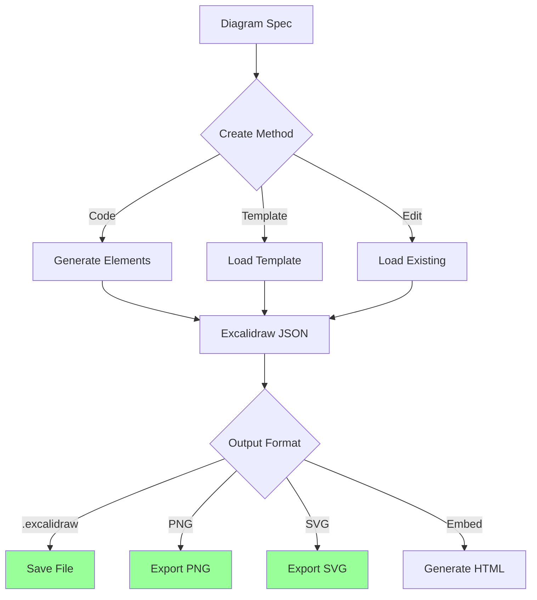

# Automating Excalidraw

Programmatically create, edit, and export Excalidraw diagrams for documentation, architecture diagrams, and visual communication.

## What This Skill Does

Automate Excalidraw diagram workflows:

- **Diagram generation**: Create diagrams from code
- **File manipulation**: Read, edit, save .excalidraw files
- **Export automation**: Generate PNG, SVG, PDF outputs
- **Template creation**: Build reusable diagram templates
- **Integration**: Embed diagrams in docs and apps
- **Batch processing**: Generate multiple diagrams

## Quick Start

### Create Diagram from Code

```javascript
node scripts/create-diagram.js flowchart output.excalidraw
```

### Export to PNG

```bash
node scripts/export-diagram.js input.excalidraw output.png
```

### Generate from Template

```bash
node scripts/generate-from-template.js architecture.template.json diagram.excalidraw
```

---

## Excalidraw Automation Workflow



---

## Understanding Excalidraw Files

### File Structure

```json
{
  "type": "excalidraw",
  "version": 2,
  "source": "https://excalidraw.com",
  "elements": [
    {
      "type": "rectangle",
      "id": "unique-id-1",
      "x": 100,
      "y": 100,
      "width": 200,
      "height": 100,
      "angle": 0,
      "strokeColor": "#000000",
      "backgroundColor": "#ffffff",
      "fillStyle": "hachure",
      "strokeWidth": 1,
      "roughness": 1,
      "opacity": 100,
      "groupIds": [],
      "roundness": null,
      "seed": 123456
    },
    {
      "type": "text",
      "id": "unique-id-2",
      "x": 150,
      "y": 130,
      "text": "Hello World",
      "fontSize": 20,
      "fontFamily": 1,
      "textAlign": "center",
      "verticalAlign": "middle"
    }
  ],
  "appState": {
    "viewBackgroundColor": "#ffffff",
    "gridSize": null
  },
  "files": {}
}
```

### Element Types

- `rectangle` - Rectangles and squares
- `diamond` - Diamond shapes
- `ellipse` - Circles and ellipses
- `arrow` - Arrows connecting elements
- `line` - Lines and polylines
- `text` - Text labels
- `image` - Embedded images
- `freedraw` - Hand-drawn paths

---

## Programmatic Diagram Creation

### Basic Shapes

```javascript
// lib/excalidraw.js
function generateId() {
  return Math.random().toString(36).substring(2, 15);
}

function createRectangle(x, y, width, height, text = '') {
  const id = generateId();

  return [
    {
      type: 'rectangle',
      id,
      x,
      y,
      width,
      height,
      angle: 0,
      strokeColor: '#000000',
      backgroundColor: '#ffffff',
      fillStyle: 'hachure',
      strokeWidth: 1,
      strokeStyle: 'solid',
      roughness: 1,
      opacity: 100,
      groupIds: [],
      roundness: { type: 3 },
      seed: Math.floor(Math.random() * 1000000),
      version: 1,
      versionNonce: Math.floor(Math.random() * 1000000),
      isDeleted: false
    },
    text ? createText(x + width / 2, y + height / 2, text, id) : null
  ].filter(Boolean);
}

function createText(x, y, text, containerId = null) {
  return {
    type: 'text',
    id: generateId(),
    x: x - (text.length * 5),  // Rough centering
    y: y - 10,
    width: text.length * 10,
    height: 25,
    text,
    fontSize: 20,
    fontFamily: 1,
    textAlign: 'center',
    verticalAlign: 'middle',
    containerId,
    originalText: text,
    angle: 0,
    strokeColor: '#000000',
    backgroundColor: 'transparent',
    fillStyle: 'hachure',
    strokeWidth: 1,
    strokeStyle: 'solid',
    roughness: 1,
    opacity: 100,
    groupIds: [],
    roundness: null,
    seed: Math.floor(Math.random() * 1000000),
    version: 1,
    versionNonce: Math.floor(Math.random() * 1000000),
    isDeleted: false
  };
}

function createArrow(startX, startY, endX, endY) {
  return {
    type: 'arrow',
    id: generateId(),
    x: startX,
    y: startY,
    width: endX - startX,
    height: endY - startY,
    angle: 0,
    strokeColor: '#000000',
    backgroundColor: 'transparent',
    fillStyle: 'hachure',
    strokeWidth: 1,
    strokeStyle: 'solid',
    roughness: 1,
    opacity: 100,
    groupIds: [],
    roundness: { type: 2 },
    seed: Math.floor(Math.random() * 1000000),
    version: 1,
    versionNonce: Math.floor(Math.random() * 1000000),
    isDeleted: false,
    points: [[0, 0], [endX - startX, endY - startY]],
    lastCommittedPoint: null,
    startBinding: null,
    endBinding: null,
    startArrowhead: null,
    endArrowhead: 'arrow'
  };
}
```

### Building Complete Diagrams

```javascript
// scripts/create-flowchart.js
import fs from 'fs/promises';

async function createFlowchart(steps, outputFile) {
  const elements = [];

  let y = 100;
  const x = 300;
  const spacing = 150;

  for (let i = 0; i < steps.length; i++) {
    // Create step box
    const box = createRectangle(x, y, 200, 80, steps[i]);
    elements.push(...box);

    // Add arrow to next step
    if (i < steps.length - 1) {
      const arrow = createArrow(
        x + 100,
        y + 80,
        x + 100,
        y + spacing
      );
      elements.push(arrow);
    }

    y += spacing;
  }

  const diagram = {
    type: 'excalidraw',
    version: 2,
    source: 'https://excalidraw.com',
    elements,
    appState: {
      viewBackgroundColor: '#ffffff'
    },
    files: {}
  };

  await fs.writeFile(outputFile, JSON.stringify(diagram, null, 2));
  console.log(`✓ Created flowchart: ${outputFile}`);
}

// Usage
const steps = [
  'User Request',
  'Validate Input',
  'Process Data',
  'Generate Response',
  'Return Result'
];

await createFlowchart(steps, 'flowchart.excalidraw');
```

### Architecture Diagrams

```javascript
async function createArchitectureDiagram(components, outputFile) {
  const elements = [];

  // Create layers
  const layers = {
    frontend: { y: 100, components: [] },
    backend: { y: 300, components: [] },
    database: { y: 500, components: [] }
  };

  // Organize components by layer
  components.forEach(comp => {
    layers[comp.layer].components.push(comp);
  });

  // Draw each layer
  Object.entries(layers).forEach(([layerName, layer]) => {
    const componentsCount = layer.components.length;
    const totalWidth = componentsCount * 180 + (componentsCount - 1) * 50;
    let x = (800 - totalWidth) / 2;

    layer.components.forEach((comp, i) => {
      // Create component box
      const box = createRectangle(x, layer.y, 150, 100, comp.name);
      elements.push(...box);

      // Store position for connections
      layer.components[i].position = { x: x + 75, y: layer.y + 100 };

      x += 200;
    });
  });

  // Add connections
  components.forEach(comp => {
    if (comp.connections) {
      comp.connections.forEach(targetName => {
        const target = components.find(c => c.name === targetName);
        if (target && target.position) {
          const arrow = createArrow(
            comp.position.x,
            comp.position.y,
            target.position.x,
            target.position.y
          );
          elements.push(arrow);
        }
      });
    }
  });

  const diagram = {
    type: 'excalidraw',
    version: 2,
    source: 'https://excalidraw.com',
    elements,
    appState: { viewBackgroundColor: '#ffffff' },
    files: {}
  };

  await fs.writeFile(outputFile, JSON.stringify(diagram, null, 2));
}

// Usage
const components = [
  { layer: 'frontend', name: 'Next.js App', connections: ['API Gateway'] },
  { layer: 'backend', name: 'API Gateway', connections: ['User Service', 'Auth Service'] },
  { layer: 'backend', name: 'User Service', connections: ['PostgreSQL'] },
  { layer: 'backend', name: 'Auth Service', connections: ['PostgreSQL'] },
  { layer: 'database', name: 'PostgreSQL' }
];

await createArchitectureDiagram(components, 'architecture.excalidraw');
```

---

## Export Automation

### Using Excalidraw CLI

```bash
# Install CLI
npm install -g @excalidraw/cli

# Export to PNG
excalidraw-cli export diagram.excalidraw diagram.png

# Export to SVG
excalidraw-cli export diagram.excalidraw diagram.svg --type svg

# Export with specific dimensions
excalidraw-cli export diagram.excalidraw diagram.png --width 1920 --height 1080
```

### Programmatic Export

```javascript
// scripts/export-diagram.js
import { chromium } from 'playwright';
import fs from 'fs/promises';
import path from 'path';

async function exportDiagram(inputFile, outputFile, format = 'png') {
  const diagramData = await fs.readFile(inputFile, 'utf-8');

  const browser = await chromium.launch();
  const page = await browser.newPage();

  // Load Excalidraw
  await page.goto('https://excalidraw.com/');

  // Wait for app to load
  await page.waitForSelector('.excalidraw');

  // Import diagram
  await page.evaluate((data) => {
    const scene = JSON.parse(data);
    window.App.importScene(scene);
  }, diagramData);

  // Wait for render
  await page.waitForTimeout(1000);

  // Export
  if (format === 'png') {
    await page.click('[aria-label="Export"]');
    await page.click('text=PNG');
    const [download] = await Promise.all([
      page.waitForEvent('download'),
      page.click('button:has-text("Export")')
    ]);
    await download.saveAs(outputFile);
  } else if (format === 'svg') {
    await page.click('[aria-label="Export"]');
    await page.click('text=SVG');
    const [download] = await Promise.all([
      page.waitForEvent('download'),
      page.click('button:has-text("Export")')
    ]);
    await download.saveAs(outputFile);
  }

  await browser.close();
  console.log(`✓ Exported to ${outputFile}`);
}

// Usage
await exportDiagram('diagram.excalidraw', 'output.png', 'png');
```

### Batch Export

```javascript
async function batchExport(inputDir, outputDir, format = 'png') {
  const files = await fs.readdir(inputDir);
  const excalidrawFiles = files.filter(f => f.endsWith('.excalidraw'));

  for (const file of excalidrawFiles) {
    const inputPath = path.join(inputDir, file);
    const outputPath = path.join(
      outputDir,
      file.replace('.excalidraw', `.${format}`)
    );

    await exportDiagram(inputPath, outputPath, format);
  }

  console.log(`✓ Exported ${excalidrawFiles.length} diagrams`);
}
```

---

## Templates and Reusability

### Creating Templates

```javascript
// templates/architecture-template.json
{
  "type": "template",
  "placeholders": {
    "frontend": { "layer": "frontend", "x": 100, "y": 100 },
    "api": { "layer": "backend", "x": 100, "y": 300 },
    "database": { "layer": "database", "x": 100, "y": 500 }
  },
  "connections": [
    { "from": "frontend", "to": "api" },
    { "from": "api", "to": "database" }
  ],
  "style": {
    "strokeColor": "#000000",
    "backgroundColor": "#e3f2fd"
  }
}
```

### Using Templates

```javascript
async function generateFromTemplate(templateFile, data, outputFile) {
  const template = JSON.parse(await fs.readFile(templateFile, 'utf-8'));
  const elements = [];

  // Create elements from placeholders
  Object.entries(template.placeholders).forEach(([key, placeholder]) => {
    if (data[key]) {
      const box = createRectangle(
        placeholder.x,
        placeholder.y,
        200,
        100,
        data[key]
      );
      elements.push(...box);
    }
  });

  // Add connections
  template.connections.forEach(({ from, to }) => {
    const fromPos = template.placeholders[from];
    const toPos = template.placeholders[to];

    const arrow = createArrow(
      fromPos.x + 100,
      fromPos.y + 100,
      toPos.x + 100,
      toPos.y
    );
    elements.push(arrow);
  });

  const diagram = {
    type: 'excalidraw',
    version: 2,
    source: 'https://excalidraw.com',
    elements,
    appState: { viewBackgroundColor: '#ffffff' },
    files: {}
  };

  await fs.writeFile(outputFile, JSON.stringify(diagram, null, 2));
}

// Usage
await generateFromTemplate(
  'templates/architecture-template.json',
  {
    frontend: 'React App',
    api: 'Express API',
    database: 'MongoDB'
  },
  'my-architecture.excalidraw'
);
```

---

## Integration Patterns

### Documentation Generation

```javascript
// Generate architecture diagram from code
async function generateFromCode(srcDir, outputFile) {
  // Analyze code structure
  const structure = await analyzeCodebase(srcDir);

  // Create diagram
  const components = structure.services.map((service, i) => ({
    layer: service.type === 'frontend' ? 'frontend' : 'backend',
    name: service.name,
    connections: service.dependencies
  }));

  await createArchitectureDiagram(components, outputFile);
}
```

### Markdown Embedding

```markdown
# Architecture


<!-- Auto-generated from architecture.excalidraw -->
```

### Next.js Integration

```typescript
// app/diagrams/[id]/page.tsx
import fs from 'fs/promises';
import path from 'path';

export async function generateStaticParams() {
  const files = await fs.readdir('./diagrams');
  return files
    .filter(f => f.endsWith('.excalidraw'))
    .map(f => ({ id: f.replace('.excalidraw', '') }));
}

export default async function DiagramPage({ params }: { params: { id: string } }) {
  const diagramPath = path.join('./diagrams', `${params.id}.excalidraw`);
  const diagram = await fs.readFile(diagramPath, 'utf-8');

  return (
    <div>
      <h1>{params.id}</h1>
      <ExcalidrawViewer data={JSON.parse(diagram)} />
    </div>
  );
}
```

---

## Best Practices

### Diagram Organization
1. Use descriptive IDs for elements
2. Group related elements
3. Maintain consistent spacing
4. Use layers for complex diagrams

### Performance
1. Minimize element count
2. Avoid complex paths
3. Optimize export resolution
4. Cache generated diagrams

### Version Control
1. Store .excalidraw files in git
2. Track template changes
3. Document diagram purpose
4. Include export scripts

---

## Advanced Topics

For detailed information:
- **Complex Layouts**: `resources/layout-algorithms.md`
- **Custom Shapes**: `resources/custom-shapes.md`
- **Animation**: `resources/diagram-animation.md`

## References

- [Excalidraw GitHub](https://github.com/excalidraw/excalidraw)
- [Excalidraw Libraries](https://libraries.excalidraw.com/)
- [File Format Spec](https://github.com/excalidraw/excalidraw/tree/master/src/packages/excalidraw#exportToSvg)

