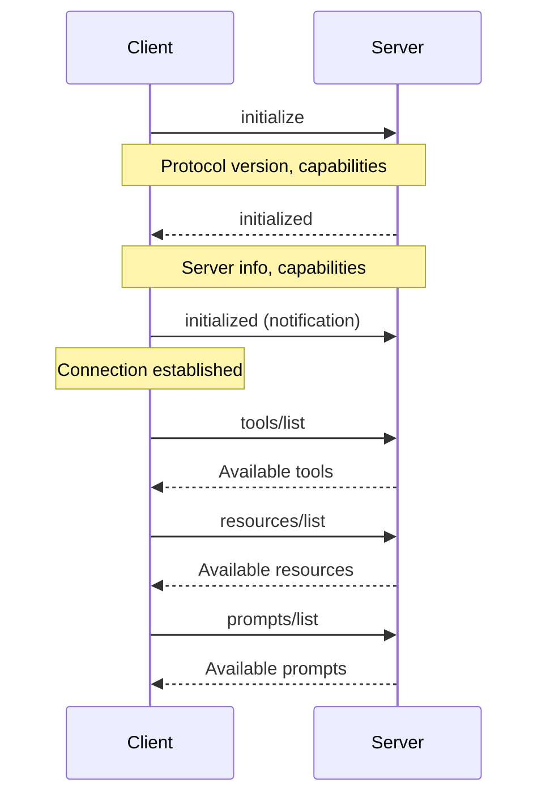
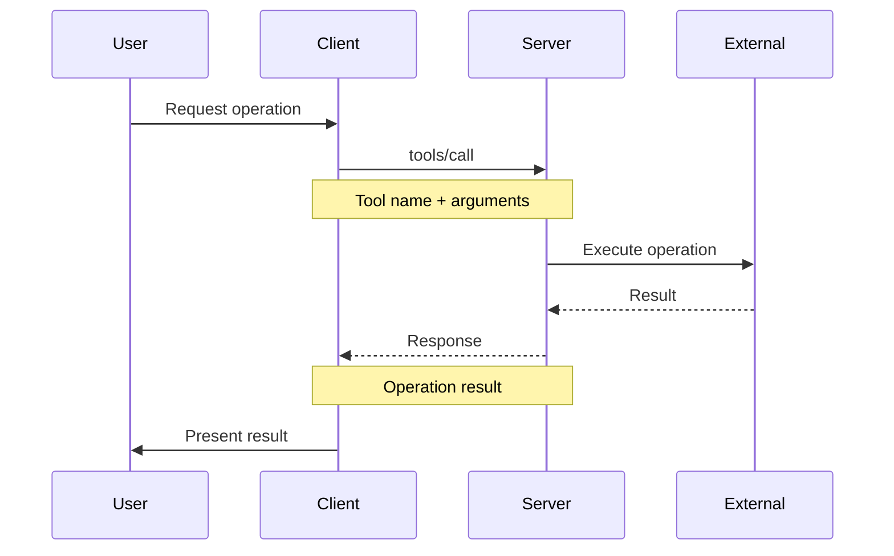

# MCP Architecture Deep Dive

## Protocol Overview

Model Context Protocol (MCP) is an open standard that defines how AI applications connect to external systems. It provides a universal interface for accessing data sources, tools, and workflows.

## Core Architecture

```
┌─────────────────────────────────────────────────────────────┐
│                         MCP Ecosystem                        │
│                                                              │
│  ┌────────────────┐         ┌──────────────────────────┐   │
│  │   AI Client    │◄────────┤   MCP Protocol Layer     │   │
│  │ (Claude Code)  │         │  - JSON-RPC 2.0          │   │
│  └────────────────┘         │  - Capability Negotiation│   │
│                             │  - Request Routing       │   │
│                             └────────┬─────────────────┘   │
│                                      │                      │
│              ┌───────────────────────┼───────────────┐     │
│              │                       │               │     │
│              ▼                       ▼               ▼     │
│     ┌────────────────┐    ┌────────────────┐ ┌──────────┐ │
│     │  MCP Server 1  │    │  MCP Server 2  │ │  Server N│ │
│     │  (Filesystem)  │    │    (GitHub)    │ │          │ │
│     └───────┬────────┘    └───────┬────────┘ └────┬─────┘ │
│             │                     │                │       │
│             ▼                     ▼                ▼       │
│     ┌────────────────┐    ┌────────────────┐ ┌──────────┐ │
│     │  Local Files   │    │   GitHub API   │ │ Custom   │ │
│     └────────────────┘    └────────────────┘ └──────────┘ │
└─────────────────────────────────────────────────────────────┘
```

## Protocol Layers

### Layer 1: Transport

Handles communication between client and server:

**Stdio Transport**:
```
┌─────────┐    stdin/stdout    ┌─────────┐
│ Client  │ ◄─────────────────► │ Server  │
└─────────┘                     └─────────┘
```

**HTTP/SSE Transport**:
```
┌─────────┐    HTTP requests    ┌─────────┐
│ Client  │ ─────────────────► │ Server  │
└─────────┘ ◄───────────────── └─────────┘
             Server-sent events
```

### Layer 2: JSON-RPC 2.0

All messages use JSON-RPC 2.0 format:

**Request**:
```json
{
  "jsonrpc": "2.0",
  "id": 1,
  "method": "tools/call",
  "params": {
    "name": "search_files",
    "arguments": {
      "query": "*.ts"
    }
  }
}
```

**Response**:
```json
{
  "jsonrpc": "2.0",
  "id": 1,
  "result": {
    "files": ["index.ts", "types.ts"]
  }
}
```

**Error**:
```json
{
  "jsonrpc": "2.0",
  "id": 1,
  "error": {
    "code": -32600,
    "message": "Invalid request"
  }
}
```

### Layer 3: MCP Protocol

Defines specific methods and capabilities:

**Initialization**:
```json
{
  "method": "initialize",
  "params": {
    "protocolVersion": "2024-11-05",
    "capabilities": {
      "roots": { "listChanged": true }
    },
    "clientInfo": {
      "name": "claude-code",
      "version": "1.0.0"
    }
  }
}
```

**Capability Discovery**:
```json
{
  "method": "tools/list",
  "params": {}
}
```

**Operation Execution**:
```json
{
  "method": "tools/call",
  "params": {
    "name": "tool_name",
    "arguments": { ... }
  }
}
```

## Server Capabilities

### 1. Prompts

Servers expose reusable prompt templates:

**Server Implementation**:
```typescript
server.setRequestHandler("prompts/list", async () => ({
  prompts: [
    {
      name: "code-review",
      description: "Comprehensive code review",
      arguments: [
        {
          name: "file_path",
          description: "Path to file",
          required: true
        },
        {
          name: "focus",
          description: "Areas to focus on",
          required: false
        }
      ]
    }
  ]
}));

server.setRequestHandler("prompts/get", async (request) => ({
  description: "Review this code...",
  messages: [
    {
      role: "user",
      content: {
        type: "text",
        text: `Review ${request.params.arguments.file_path}`
      }
    }
  ]
}));
```

**Client Usage**:
```typescript
// List available prompts
const prompts = await client.request("prompts/list");

// Get specific prompt
const prompt = await client.request("prompts/get", {
  name: "code-review",
  arguments: { file_path: "src/index.ts" }
});
```

### 2. Resources

Servers provide access to external data:

**Server Implementation**:
```typescript
server.setRequestHandler("resources/list", async () => ({
  resources: [
    {
      uri: "file:///project/src/index.ts",
      name: "Main Entry Point",
      description: "Application entry point",
      mimeType: "text/typescript"
    }
  ]
}));

server.setRequestHandler("resources/read", async (request) => ({
  contents: [
    {
      uri: request.params.uri,
      mimeType: "text/typescript",
      text: fileContents
    }
  ]
}));
```

**Resource URI Schemes**:
- `file://` - Local files
- `http://` / `https://` - Web resources
- `db://` - Database connections
- `custom://` - Custom schemes

### 3. Tools

Servers expose callable functions:

**Server Implementation**:
```typescript
server.setRequestHandler("tools/list", async () => ({
  tools: [
    {
      name: "search_codebase",
      description: "Search for patterns in code",
      inputSchema: {
        type: "object",
        properties: {
          pattern: {
            type: "string",
            description: "Search pattern"
          },
          fileTypes: {
            type: "array",
            items: { type: "string" },
            description: "File extensions to search"
          }
        },
        required: ["pattern"]
      }
    }
  ]
}));

server.setRequestHandler("tools/call", async (request) => {
  const { pattern, fileTypes } = request.params.arguments;
  const results = await searchFiles(pattern, fileTypes);

  return {
    content: [
      {
        type: "text",
        text: JSON.stringify(results, null, 2)
      }
    ]
  };
});
```

## Communication Flow

### Initialization Sequence



### Tool Execution Flow



## Transport Implementations

### Stdio Transport

**Process Model**:
```
Parent Process (Claude Code)
    │
    ├─ stdin  ───► Child Process (MCP Server)
    │
    └─ stdout ◄─── Child Process
```

**Message Format**:
```
<JSON message>\n<JSON message>\n<JSON message>\n
```

**Benefits**:
- Simple process communication
- No network overhead
- Easy debugging (pipe to/from files)
- Works offline

**Limitations**:
- Local only
- One client per server
- No encryption

### HTTP Transport

**Request-Response Model**:
```
Client                  Server
  │                        │
  ├── POST /mcp ────────►  │
  │   (JSON-RPC request)   │
  │                        │
  │  ◄──── 200 OK ─────────┤
  │   (JSON-RPC response)  │
```

**Benefits**:
- Standard web protocols
- Works remotely
- Load balancing support
- Firewall friendly

**Limitations**:
- Higher latency
- No server-initiated messages
- Requires network

### SSE Transport

**Streaming Model**:
```
Client                  Server
  │                        │
  ├── GET /mcp/sse ──────► │
  │                        │
  │  ◄──── Stream ─────────┤
  │   data: {...}          │
  │   data: {...}          │
  │   data: {...}          │
```

**Benefits**:
- Real-time updates
- Server can push data
- HTTP-based
- Works through proxies

**Limitations**:
- One-way (server to client)
- Requires HTTP/2 or keep-alive
- Browser-oriented

## Security Model

### Authentication

**API Key Authentication**:
```json
{
  "mcpServers": {
    "api": {
      "url": "https://api.example.com/mcp",
      "headers": {
        "Authorization": "Bearer ${API_TOKEN}"
      }
    }
  }
}
```

**OAuth 2.0**:
```typescript
// Server implements OAuth flow
server.setRequestHandler("auth/login", async (request) => {
  const authUrl = generateOAuthUrl();
  return { authUrl };
});

server.setRequestHandler("auth/callback", async (request) => {
  const tokens = await exchangeCodeForTokens(request.params.code);
  return { accessToken: tokens.access_token };
});
```

### Authorization

**Capability-Based**:
```typescript
// Server declares what it can do
{
  capabilities: {
    tools: {},        // Can provide tools
    resources: {},    // Can provide resources
    prompts: {}       // Can provide prompts
  }
}
```

**Permission Scoping**:
```typescript
// Filesystem server restricts access
const allowedPaths = ["/project/src", "/project/docs"];

server.setRequestHandler("resources/read", async (request) => {
  const filePath = uriToPath(request.params.uri);

  if (!isPathAllowed(filePath, allowedPaths)) {
    throw new Error("Access denied");
  }

  return readFile(filePath);
});
```

### Data Privacy

**Sensitive Data Handling**:
```typescript
// Never log sensitive data
server.setRequestHandler("tools/call", async (request) => {
  logger.info("Tool called", {
    name: request.params.name,
    // Don't log arguments (may contain sensitive data)
  });

  const result = await executeTool(request.params);

  return {
    content: [
      {
        type: "text",
        text: sanitizeOutput(result) // Remove sensitive info
      }
    ]
  };
});
```

## Error Handling

### Standard Error Codes

| Code | Meaning | Usage |
|------|---------|-------|
| -32700 | Parse error | Invalid JSON |
| -32600 | Invalid request | Malformed request |
| -32601 | Method not found | Unknown method |
| -32602 | Invalid params | Bad parameters |
| -32603 | Internal error | Server error |

### Custom Error Codes

```typescript
const ERROR_CODES = {
  RESOURCE_NOT_FOUND: -32001,
  UNAUTHORIZED: -32002,
  RATE_LIMIT: -32003,
  TOOL_EXECUTION_FAILED: -32004,
};

server.setRequestHandler("tools/call", async (request) => {
  try {
    return await executeTool(request.params);
  } catch (error) {
    if (error instanceof NotFoundError) {
      throw {
        code: ERROR_CODES.RESOURCE_NOT_FOUND,
        message: error.message,
        data: { resource: error.resourceId }
      };
    }
    throw error;
  }
});
```

## Performance Considerations

### Caching Strategies

**Client-Side Caching**:
```typescript
// Cache resources list
const resourcesCache = new Map();

async function listResources(server) {
  if (!resourcesCache.has(server)) {
    const resources = await server.request("resources/list");
    resourcesCache.set(server, resources);
  }
  return resourcesCache.get(server);
}
```

**Server-Side Caching**:
```typescript
// Cache expensive operations
const searchCache = new LRU({ max: 100 });

server.setRequestHandler("tools/call", async (request) => {
  const cacheKey = JSON.stringify(request.params);

  if (searchCache.has(cacheKey)) {
    return searchCache.get(cacheKey);
  }

  const result = await expensiveSearch(request.params);
  searchCache.set(cacheKey, result);
  return result;
});
```

### Connection Pooling

**HTTP Transport**:
```typescript
const agent = new https.Agent({
  keepAlive: true,
  maxSockets: 10
});

const client = new MCPClient({
  transport: new HttpTransport({
    url: "https://api.example.com/mcp",
    agent
  })
});
```

### Rate Limiting

**Token Bucket Algorithm**:
```typescript
class RateLimiter {
  constructor(tokensPerSecond, maxTokens) {
    this.rate = tokensPerSecond;
    this.max = maxTokens;
    this.tokens = maxTokens;
    this.lastRefill = Date.now();
  }

  async acquire() {
    this.refill();

    if (this.tokens < 1) {
      const waitTime = (1 - this.tokens) * 1000 / this.rate;
      await new Promise(resolve => setTimeout(resolve, waitTime));
      this.refill();
    }

    this.tokens -= 1;
  }

  refill() {
    const now = Date.now();
    const elapsed = (now - this.lastRefill) / 1000;
    this.tokens = Math.min(this.max, this.tokens + elapsed * this.rate);
    this.lastRefill = now;
  }
}

const limiter = new RateLimiter(10, 100); // 10 requests/sec, burst of 100

server.setRequestHandler("tools/call", async (request) => {
  await limiter.acquire();
  return await executeTool(request.params);
});
```

## Version Management

### Protocol Versions

MCP uses semantic versioning for the protocol:

**Current Versions**:
- `2024-11-05` (Latest stable)
- `2024-06-18` (Previous)
- `draft` (Experimental)

**Version Negotiation**:
```json
{
  "method": "initialize",
  "params": {
    "protocolVersion": "2024-11-05",
    "capabilities": { ... }
  }
}
```

**Backward Compatibility**:
```typescript
server.setRequestHandler("initialize", async (request) => {
  const clientVersion = request.params.protocolVersion;

  // Support multiple versions
  if (clientVersion === "2024-11-05" || clientVersion === "2024-06-18") {
    return {
      protocolVersion: clientVersion,
      capabilities: getCapabilitiesForVersion(clientVersion),
      serverInfo: { name: "my-server", version: "1.0.0" }
    };
  }

  throw new Error(`Unsupported protocol version: ${clientVersion}`);
});
```

## Best Practices

### Server Development

1. **Implement graceful shutdown**:
```typescript
process.on('SIGINT', async () => {
  await server.close();
  process.exit(0);
});
```

2. **Validate all inputs**:
```typescript
server.setRequestHandler("tools/call", async (request) => {
  const schema = tools[request.params.name].inputSchema;
  const valid = validate(schema, request.params.arguments);

  if (!valid) {
    throw new Error("Invalid arguments");
  }

  return await executeTool(request.params);
});
```

3. **Log operations**:
```typescript
server.setRequestHandler("tools/call", async (request) => {
  logger.info("Tool execution started", {
    tool: request.params.name,
    requestId: request.id
  });

  const result = await executeTool(request.params);

  logger.info("Tool execution completed", {
    tool: request.params.name,
    requestId: request.id
  });

  return result;
});
```

### Client Integration

1. **Handle connection failures**:
```typescript
try {
  await client.connect();
} catch (error) {
  console.error("Failed to connect to MCP server:", error);
  // Fallback or retry logic
}
```

2. **Implement timeouts**:
```typescript
const timeout = 30000; // 30 seconds

const result = await Promise.race([
  client.request("tools/call", params),
  new Promise((_, reject) =>
    setTimeout(() => reject(new Error("Timeout")), timeout)
  )
]);
```

3. **Monitor server health**:
```typescript
setInterval(async () => {
  try {
    await client.request("ping");
  } catch (error) {
    console.warn("Server health check failed:", error);
    // Attempt reconnection
  }
}, 60000); // Check every minute
```

---

This architecture enables flexible, scalable integration between AI applications and external systems while maintaining security, performance, and reliability.

