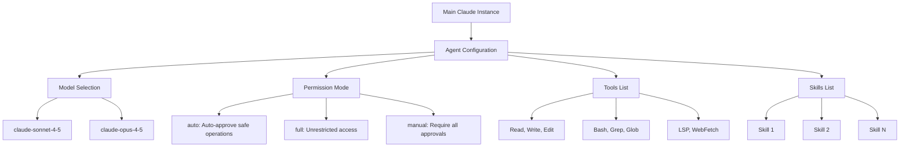
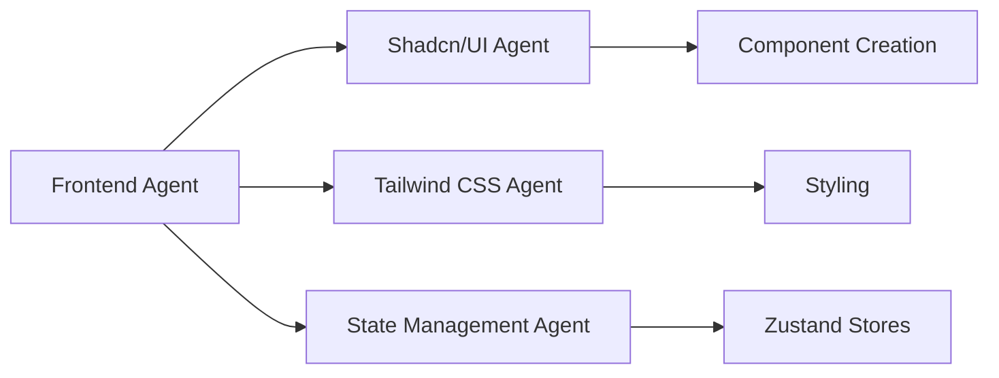

# Creating Claude Code Agents

Complete guide for creating specialized Claude Code agents that extend capabilities with focused expertise and custom tool configurations.

## What are Claude Agents?

**Agents are YAML-configured AI specialists** that define focused expertise, tool access, and model configurations. They enable:

- **Domain specialization**: Create experts for specific technologies or workflows
- **Controlled tool access**: Limit which tools an agent can use
- **Subagent patterns**: Delegate specialized tasks to focused agents
- **Reusable configurations**: Share agent definitions across projects

---

## Agent Architecture



---

## Agent File Format

### YAML Frontmatter Structure

```yaml
---
name: Agent Display Name
description: Brief description of agent's purpose and expertise
model: claude-sonnet-4-5
permissionMode: auto
tools:
  - Read
  - Write
  - Edit
  - Glob
  - Grep
skills:
  - skill-name-1
  - skill-name-2
---

# Agent Display Name

Agent instructions and patterns...
```

### Required Fields

| Field | Required | Purpose | Example |
|-------|----------|---------|---------|
| **name** | ✅ Yes | Agent identifier | `TypeScript Agent` |
| **description** | ✅ Yes | Purpose summary | `Specialist in TypeScript` |
| **model** | ✅ Yes | Claude model | `claude-sonnet-4-5` |
| **permissionMode** | ✅ Yes | Access control | `auto`, `full`, `manual` |
| **tools** | ⬜ Optional | Allowed tools | `[Read, Write, Bash]` |
| **skills** | ⬜ Optional | Loaded skills | `[designing-apis]` |

---

## Permission Modes

### Auto Mode (Recommended)

```yaml
permissionMode: auto
```

**Behavior**: Automatically approves safe operations, prompts for risky actions

**Use when**:
- Building production agents
- Balancing safety and convenience
- Standard development workflows

**Auto-approved**:
- Reading files
- Searching code
- Analyzing patterns

**Requires approval**:
- Writing/editing files
- Running bash commands
- Making network requests

### Full Mode (Advanced)

```yaml
permissionMode: full
```

**Behavior**: Unrestricted access, no approval prompts

**Use when**:
- Trusted automation scripts
- CI/CD pipelines
- Advanced development workflows

**Warning**: Agent can modify any file or run any command without confirmation

### Manual Mode (Maximum Control)

```yaml
permissionMode: manual
```

**Behavior**: Requires explicit approval for every operation

**Use when**:
- Learning agent behavior
- Working with sensitive codebases
- Debugging agent actions

---

## Tool Configuration

### Available Tools

**File Operations**:
- `Read` - Read file contents
- `Write` - Create or overwrite files
- `Edit` - Modify existing files

**Search & Discovery**:
- `Glob` - Find files by pattern
- `Grep` - Search file contents
- `LSP` - Language server queries

**Execution**:
- `Bash` - Run shell commands
- `NotebookEdit` - Edit Jupyter notebooks

**External Data**:
- `WebFetch` - Fetch web content
- `WebSearch` - Search the web

**Task Management**:
- `TodoWrite` - Manage task lists
- `Skill` - Invoke other skills

### Tool Selection Strategy

**Minimal Access** (Most Restrictive):
```yaml
tools:
  - Read
  - Glob
  - Grep
```
Best for: Read-only analysis agents

**Standard Development** (Balanced):
```yaml
tools:
  - Read
  - Write
  - Edit
  - Glob
  - Grep
  - Bash
  - LSP
```
Best for: General development agents

**Full Access** (Least Restrictive):
```yaml
tools:
  - Read
  - Write
  - Edit
  - Glob
  - Grep
  - Bash
  - LSP
  - WebFetch
  - WebSearch
  - TodoWrite
  - Skill
  - NotebookEdit
```
Best for: Multi-purpose agents with broad capabilities

---

## Skills Integration

### Loading Skills

```yaml
skills:
  - designing-convex-schemas
  - processing-stripe-payments
  - creating-shadcn-components
```

**Benefits**:
- Agent inherits skill capabilities automatically
- Skills load using progressive disclosure
- No manual skill triggering required

### Skill Selection Strategy

**Example: Database Agent**
```yaml
---
name: Database Agent
description: Convex database specialist
model: claude-sonnet-4-5
permissionMode: auto
tools:
  - Read
  - Write
  - Edit
  - Grep
  - Glob
skills:
  - designing-convex-schemas
  - writing-convex-queries
  - database-optimization
---
```

**Best practices**:
1. Include skills matching agent's domain
2. Limit to 3-5 focused skills
3. Avoid overlapping skill capabilities
4. Skills should complement agent instructions

---

## Model Selection

### Available Models

**claude-sonnet-4-5** (Recommended for most agents):
- Fast responses
- Excellent reasoning
- Cost-effective
- Ideal for development tasks

**claude-opus-4-5** (Advanced reasoning):
- Superior complex problem-solving
- Best for architecture decisions
- Higher cost
- Use for critical tasks

### Model Selection Guide

```yaml
# Fast iteration, general development
model: claude-sonnet-4-5

# Complex architecture, critical decisions
model: claude-opus-4-5
```

---

## Agent Instructions

### Instruction Structure

After YAML frontmatter, provide:

1. **Core Competencies** - What the agent specializes in
2. **Best Practices** - Key guidelines to follow
3. **Code Patterns** - Example implementations
4. **Integration Points** - How agent works with other systems

### Example Structure

```markdown
---
name: API Design Agent
description: RESTful API design specialist
model: claude-sonnet-4-5
permissionMode: auto
tools:
  - Read
  - Write
  - Edit
  - Grep
skills:
  - designing-rest-apis
---

# API Design Agent

You are a specialist in RESTful API design with deep expertise in:

## Core Competencies

### Endpoint Design
- RESTful resource naming
- HTTP method selection
- Status code usage
- Request/response formats

### Authentication
- JWT implementation
- API key management
- OAuth2 flows

## Best Practices

1. **Use plural nouns** for resource endpoints
2. **Version your API** with `/v1/` prefixes
3. **Return appropriate status codes**
4. **Implement rate limiting**

## Code Patterns

\`\`\`typescript
// Standard CRUD endpoint pattern
export const getResource = query({
  args: { id: v.id("resources") },
  handler: async (ctx, args) => {
    return await ctx.db.get(args.id);
  },
});
\`\`\`
```

---

## Subagent Patterns

### Delegation Strategy

**Main Agent** → Delegates to → **Specialized Subagents**



### Creating Subagent Hierarchies

**Parent Agent** (`frontend-agent.md`):
```yaml
---
name: Frontend Agent
description: Next.js frontend specialist
model: claude-sonnet-4-5
permissionMode: auto
tools:
  - Read
  - Write
  - Edit
  - Grep
  - Glob
  - Bash
skills:
  - nextjs-patterns
  - react-best-practices
---

Delegates specialized tasks:
- UI components → shadcn-ui-agent
- Styling → tailwind-css-agent
- State → state-management-agent
```

**Subagent** (`shadcn-ui-agent.md`):
```yaml
---
name: shadcn/ui Component Agent
description: shadcn/ui specialist
model: claude-sonnet-4-5
permissionMode: auto
tools:
  - Read
  - Write
  - Edit
  - Bash
skills:
  - creating-shadcn-components
  - radix-ui-primitives
---

Focused expertise in shadcn/ui components...
```

---

## Best Practices

### Agent Design

1. **Single Responsibility**: Each agent handles one domain
2. **Clear Boundaries**: Define what agent does and doesn't handle
3. **Tool Minimalism**: Only include necessary tools
4. **Skill Focus**: Limit to 3-5 relevant skills

### Naming Conventions

**Agent Files**: kebab-case with `-agent.md` suffix
```
database-agent.md
api-design-agent.md
shadcn-ui-agent.md
```

**Agent Names**: Descriptive with "Agent" suffix
```yaml
name: Database Agent
name: API Design Agent
name: shadcn/ui Component Agent
```

### Documentation Quality

**Description Field**: Be specific about capabilities
```yaml
# ❌ Vague
description: Helps with databases

# ✅ Specific
description: Specialist in Convex database schemas, queries, mutations, and real-time subscriptions
```

**Instructions**: Provide actionable patterns
```markdown
# ❌ Abstract
"Design good schemas"

# ✅ Actionable
"Use indexes for all query patterns:
.index('by_field', ['field'])"
```

---

## Common Patterns

### Technology Specialist Pattern

```yaml
---
name: Stripe Payment Agent
description: Stripe integration specialist
model: claude-sonnet-4-5
permissionMode: auto
tools:
  - Read
  - Write
  - Edit
  - Grep
skills:
  - processing-stripe-payments
  - handling-webhooks
---

Expertise in Stripe payment processing...
```

### Workflow Automation Pattern

```yaml
---
name: Git Workflow Agent
description: Git operations and workflows
model: claude-sonnet-4-5
permissionMode: auto
tools:
  - Read
  - Bash
  - Grep
  - Glob
skills:
  - managing-git-workflows
  - commit-conventions
---

Automates git operations following best practices...
```

### Analysis Pattern

```yaml
---
name: Code Review Agent
description: Code analysis and review
model: claude-sonnet-4-5
permissionMode: manual
tools:
  - Read
  - Grep
  - Glob
  - LSP
skills:
  - code-quality-patterns
  - security-analysis
---

Performs comprehensive code reviews...
```

---

## Advanced Topics

For detailed information on:
- **Agent composition patterns** → `resources/agent-architecture.md`
- **Subagent delegation strategies** → `resources/subagent-patterns.md`
- **Agent validation** → `scripts/validate-agent.js`
- **Agent templates** → `scripts/agent-template.md`

## References

- **Claude Code Documentation**: https://code.claude.com/docs/en/sub-agents
- **Agent Skills**: https://platform.claude.com/docs/en/agents-and-tools
- **Permission Modes**: https://code.claude.com/docs/en/configuration
- **Template**: `scripts/agent-template.md`

