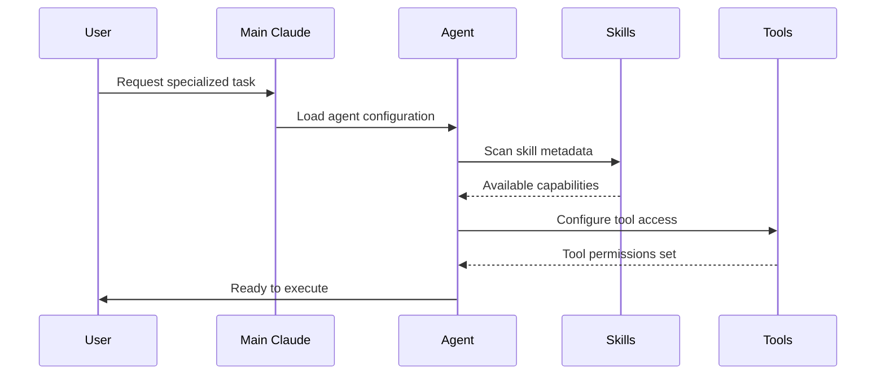
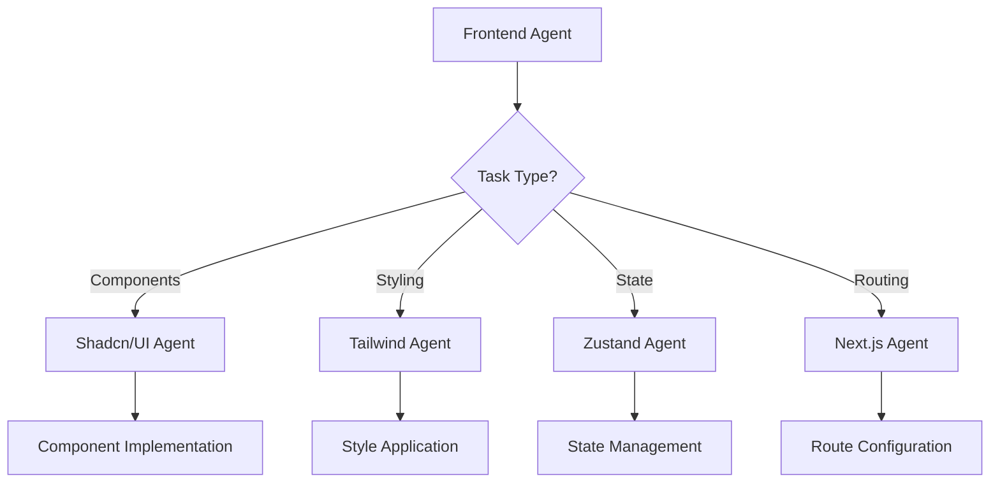
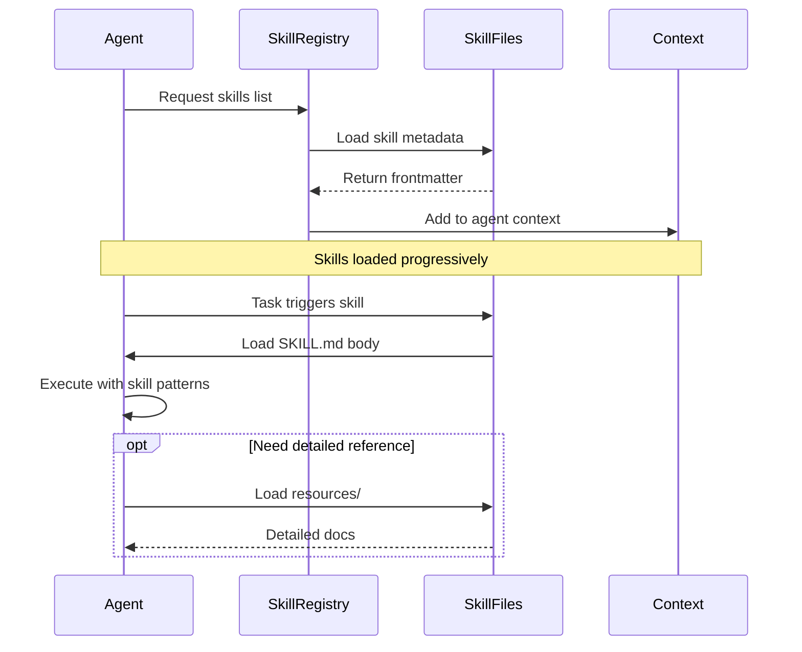

# Agent Architecture Deep Dive

## Overview

Claude Code agents are YAML-configured AI specialists that provide focused expertise through controlled tool access, skills integration, and model selection. This document explores the architectural patterns and design principles for creating effective agent systems.

## Core Architecture Components

```
┌─────────────────────────────────────────────────────────┐
│                    Agent Definition                      │
│  ┌────────────────────────────────────────────────────┐ │
│  │  YAML Frontmatter                                   │ │
│  │  - name: Agent identifier                          │ │
│  │  - description: Purpose and capabilities           │ │
│  │  - model: AI model selection                       │ │
│  │  - permissionMode: Access control                  │ │
│  │  - tools: Available operations                     │ │
│  │  - skills: Loaded capabilities                     │ │
│  └────────────────────────────────────────────────────┘ │
│                                                          │
│  ┌────────────────────────────────────────────────────┐ │
│  │  Agent Instructions                                 │ │
│  │  - Core competencies                               │ │
│  │  - Best practices                                  │ │
│  │  - Code patterns                                   │ │
│  │  - Integration points                              │ │
│  └────────────────────────────────────────────────────┘ │
└─────────────────────────────────────────────────────────┘
```

## Agent Lifecycle

### 1. Discovery

When invoked, Claude Code:
1. Reads agent YAML configuration
2. Validates required fields
3. Initializes model with specified version
4. Configures permission mode
5. Loads tools list
6. Scans skills metadata

### 2. Loading



### 3. Execution

During task execution:
- Agent follows instructions from markdown body
- Uses only tools listed in configuration
- Automatically loads relevant skills
- Respects permission mode boundaries
- Maintains model-specific behavior

### 4. Delegation (Subagents)

Agents can reference other agents for specialized tasks:



## Permission Mode Deep Dive

### Auto Mode Architecture

```
┌─────────────────────────────────────────┐
│         User Request                     │
└──────────────┬──────────────────────────┘
               │
               ▼
┌─────────────────────────────────────────┐
│     Permission Evaluator                 │
│  ┌──────────────────────────────────┐   │
│  │ Is operation safe?               │   │
│  │ - Read files? → Auto-approve     │   │
│  │ - Search code? → Auto-approve    │   │
│  │ - Write files? → Request approval│   │
│  │ - Run bash? → Request approval   │   │
│  └──────────────────────────────────┘   │
└──────────────┬──────────────────────────┘
               │
       ┌───────┴───────┐
       │               │
       ▼               ▼
┌─────────────┐ ┌─────────────┐
│ Auto Execute│ │ User Prompt │
└─────────────┘ └─────────────┘
```

**Auto-approved operations:**
- Read, Glob, Grep (read-only)
- LSP queries
- WebFetch/WebSearch (with rate limits)

**Requires approval:**
- Write, Edit, NotebookEdit
- Bash commands
- TodoWrite modifications
- Skill invocations

### Full Mode Architecture

```
┌─────────────────────────────────────────┐
│         User Request                     │
└──────────────┬──────────────────────────┘
               │
               ▼
┌─────────────────────────────────────────┐
│     Direct Execution                     │
│  All operations execute immediately     │
│  No permission checks                   │
│  Maximum automation                     │
└──────────────┬──────────────────────────┘
               │
               ▼
┌─────────────────────────────────────────┐
│         Operation Result                 │
└─────────────────────────────────────────┘
```

**Use cases:**
- CI/CD pipelines
- Automated testing
- Batch processing
- Trusted scripts

**Risks:**
- Unintended file modifications
- Destructive bash commands
- No safety net

### Manual Mode Architecture

```
┌─────────────────────────────────────────┐
│         User Request                     │
└──────────────┬──────────────────────────┘
               │
               ▼
┌─────────────────────────────────────────┐
│     Every Operation                      │
│  ┌──────────────────────────────────┐   │
│  │ User approval required for:      │   │
│  │ - Every Read                     │   │
│  │ - Every Write                    │   │
│  │ - Every Search                   │   │
│  │ - Every Bash command             │   │
│  │ - Every Web request              │   │
│  └──────────────────────────────────┘   │
└──────────────┬──────────────────────────┘
               │
               ▼
┌─────────────────────────────────────────┐
│         User Approval                    │
└─────────────────────────────────────────┘
```

**Use cases:**
- Learning agent behavior
- Sensitive codebases
- Security auditing
- Debugging

## Tool Access Patterns

### Layered Access Model

```
┌────────────────────────────────────────────┐
│  Layer 1: Read-Only (Safest)               │
│  Tools: Read, Glob, Grep, LSP              │
│  Use: Analysis, review, research           │
└────────────────────────────────────────────┘
         │
         ▼
┌────────────────────────────────────────────┐
│  Layer 2: Local Modification               │
│  Layer 1 + Write, Edit, NotebookEdit       │
│  Use: Development, refactoring             │
└────────────────────────────────────────────┘
         │
         ▼
┌────────────────────────────────────────────┐
│  Layer 3: System Execution                 │
│  Layer 2 + Bash                            │
│  Use: Build, test, deploy                  │
└────────────────────────────────────────────┘
         │
         ▼
┌────────────────────────────────────────────┐
│  Layer 4: External Access                  │
│  Layer 3 + WebFetch, WebSearch             │
│  Use: Research, documentation gathering    │
└────────────────────────────────────────────┘
         │
         ▼
┌────────────────────────────────────────────┐
│  Layer 5: Full Capability (Most Flexible)  │
│  All tools including TodoWrite, Skill      │
│  Use: Complete automation                  │
└────────────────────────────────────────────┘
```

### Tool Selection Matrix

| Agent Type | Read | Write | Edit | Bash | Grep | Glob | LSP | Web | Other |
|-----------|------|-------|------|------|------|------|-----|-----|-------|
| **Analyzer** | ✅ | ❌ | ❌ | ❌ | ✅ | ✅ | ✅ | ❌ | ❌ |
| **Developer** | ✅ | ✅ | ✅ | ✅ | ✅ | ✅ | ✅ | ❌ | ❌ |
| **Researcher** | ✅ | ✅ | ✅ | ❌ | ✅ | ✅ | ✅ | ✅ | ❌ |
| **Automator** | ✅ | ✅ | ✅ | ✅ | ✅ | ✅ | ✅ | ✅ | ✅ |

## Skills Integration Architecture

### Skills Loading Pipeline



### Skills Combination Patterns

**Technology Stack Pattern:**
```yaml
# Full-stack agent combining multiple technology skills
skills:
  - nextjs-app-router
  - convex-database
  - clerk-authentication
  - stripe-payments
```

**Domain Expertise Pattern:**
```yaml
# Specialized domain agent
skills:
  - designing-rest-apis
  - api-versioning
  - rate-limiting
  - api-documentation
```

**Workflow Pattern:**
```yaml
# Process-oriented agent
skills:
  - git-workflows
  - commit-conventions
  - pr-automation
  - deployment-strategies
```

## Model Selection Impact

### Sonnet 4.5 Characteristics

**Strengths:**
- Fast response time (1-3s)
- Excellent code generation
- Strong pattern recognition
- Cost-effective at scale

**Best for:**
- Rapid development iterations
- Standard CRUD operations
- Template application
- Refactoring tasks

**Limitations:**
- Complex architectural decisions
- Novel problem-solving
- Multi-step reasoning chains

### Opus 4.5 Characteristics

**Strengths:**
- Superior reasoning depth
- Architectural insight
- Novel problem-solving
- Complex pattern synthesis

**Best for:**
- System architecture
- Algorithm design
- Performance optimization
- Security analysis

**Considerations:**
- Slower response time (3-8s)
- Higher cost per request
- Best for critical decisions

### Model Selection Matrix

| Task Complexity | Iteration Speed | Model Choice |
|----------------|-----------------|--------------|
| Low | High | Sonnet 4.5 |
| Medium | High | Sonnet 4.5 |
| High | Medium | Opus 4.5 |
| Critical | Low | Opus 4.5 |

## Agent Composition Patterns

### Specialization Hierarchy

```
Main Application Agent
├── Backend Agent
│   ├── Database Agent (Convex)
│   ├── API Agent (REST)
│   └── Auth Agent (Clerk)
├── Frontend Agent
│   ├── UI Component Agent (shadcn/ui)
│   ├── Styling Agent (Tailwind)
│   └── State Agent (Zustand)
└── DevOps Agent
    ├── CI/CD Agent
    ├── Monitoring Agent
    └── Deployment Agent
```

### Horizontal Integration

```
Feature Implementation
├── Planning Agent (Architecture)
├── Development Agent (Implementation)
├── Testing Agent (Quality)
└── Documentation Agent (Knowledge)
```

### Vertical Slicing

```
Payment Feature
├── Stripe Agent (Integration)
├── Webhook Agent (Events)
├── UI Agent (Checkout)
└── Analytics Agent (Tracking)
```

## Agent Communication

### Direct Reference Pattern

```markdown
<!-- In parent-agent.md -->
For UI components, delegate to shadcn-ui-agent.
For styling, delegate to tailwind-agent.
For state management, delegate to zustand-agent.
```

### Shared Skills Pattern

```yaml
# parent-agent.md
skills:
  - shared-patterns
  - typescript-types

# child-agent.md
skills:
  - shared-patterns  # Same skill
  - specialized-feature
```

### Context Passing

Agents share context through:
1. File system state (written files)
2. Todo list state (TodoWrite)
3. Explicit instructions in delegation
4. Shared skill knowledge

## Performance Considerations

### Context Window Management

**Efficient agent design:**
- Limit skills to 3-5 per agent
- Use progressive disclosure
- Link to resources vs. inline docs
- Keep instructions under 500 lines

**Context usage breakdown:**
```
Agent Configuration:     ~200 tokens
Agent Instructions:    ~2,000 tokens
Skills Metadata:         ~500 tokens
Loaded Skill Bodies:   ~3,000 tokens per skill
Resources:            As-needed
─────────────────────────────────────
Typical Total:        ~8,000 tokens
```

### Tool Call Optimization

**Minimize tool calls:**
- Batch file reads with Glob + Read
- Use Grep for content search vs. multiple Reads
- Combine Edit operations
- Cache LSP results

**Parallel tool execution:**
```javascript
// ✅ Good: Parallel execution
await Promise.all([
  readFile('schema.ts'),
  readFile('queries.ts'),
  readFile('mutations.ts'),
]);

// ❌ Bad: Sequential execution
await readFile('schema.ts');
await readFile('queries.ts');
await readFile('mutations.ts');
```

## Security Considerations

### Principle of Least Privilege

**Agent tool access:**
1. Start with minimal tools
2. Add tools as needed
3. Document why each tool is required
4. Review tool usage periodically

### Permission Mode Selection

```yaml
# Development (local, trusted code)
permissionMode: auto

# Production automation (tested scripts)
permissionMode: full

# Sensitive operations (security review)
permissionMode: manual
```

### Sensitive Data Handling

**Agents should never:**
- Log API keys or secrets
- Write credentials to files
- Echo sensitive environment variables
- Expose authentication tokens

**Pattern for sensitive operations:**
```markdown
When handling authentication:
1. Read from environment variables
2. Never log credential values
3. Use secure parameter passing
4. Clear sensitive data after use
```

## Testing Agent Configurations

### Validation Checklist

```bash
# 1. Validate YAML syntax
node scripts/validate-agent.js agent.md

# 2. Test permission mode behavior
# - Verify auto-approvals work
# - Test approval prompts appear
# - Confirm full mode access

# 3. Verify tool access
# - Each tool works as expected
# - Restricted tools are blocked
# - Error messages are clear

# 4. Test skills loading
# - Skills load progressively
# - Patterns are available
# - Resources load on demand

# 5. Validate model behavior
# - Response quality matches model
# - Performance expectations met
# - Cost aligns with usage
```

### Common Issues

**Issue: Agent not loading skills**
```yaml
# ❌ Wrong
skills:
  skill-name-1  # Missing dash

# ✅ Correct
skills:
  - skill-name-1
```

**Issue: Tool access denied**
```yaml
# ❌ Missing required tool
tools:
  - Read
  - Grep
# Trying to Write → Error

# ✅ Include necessary tools
tools:
  - Read
  - Write
  - Grep
```

**Issue: Permission prompts unexpected**
```yaml
# ❌ Wrong mode for use case
permissionMode: manual  # Too restrictive for dev

# ✅ Match mode to context
permissionMode: auto    # Better for development
```

## Best Practices Summary

### Design Principles

1. **Single Responsibility**: One domain per agent
2. **Minimal Tools**: Only what's necessary
3. **Focused Skills**: 3-5 related skills maximum
4. **Clear Instructions**: Actionable patterns, not abstract concepts
5. **Progressive Disclosure**: Link to resources for depth

### Configuration Principles

1. **Appropriate Model**: Match complexity to model capability
2. **Right Permission Mode**: Balance safety and convenience
3. **Tool Minimalism**: Start small, expand as needed
4. **Skill Relevance**: Only load domain-specific skills
5. **Clear Documentation**: Explain agent purpose and usage

### Composition Principles

1. **Hierarchical Organization**: Parent agents delegate to specialists
2. **Shared Knowledge**: Common skills across related agents
3. **Context Efficiency**: Minimize token usage through smart loading
4. **Clear Boundaries**: Define what each agent handles
5. **Testing Strategy**: Validate each agent independently

---

This architecture enables building sophisticated agent systems while maintaining clarity, security, and performance.

