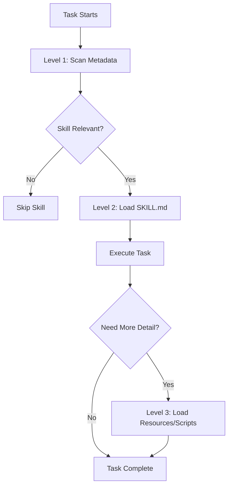
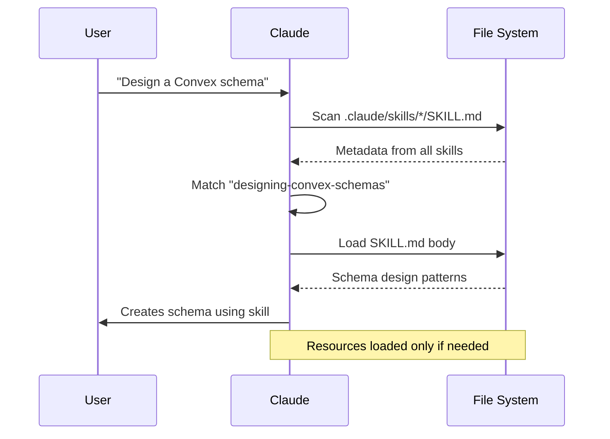

# Creating Claude Code Skills

Complete guide for creating skills that extend Claude Code with your team's expertise and workflows.

## What are Claude Skills?

**Skills are folders of instructions, scripts, and resources** that Claude can discover and load dynamically to perform specialized tasks. They follow Anthropic's progressive disclosure architecture for efficient, context-aware loading.

### Key Concepts

- **Filesystem-based**: Skills are folders, not databases
- **Progressive disclosure**: Load information only when needed (3-level architecture)
- **Auto-discovery**: Claude finds and loads relevant skills automatically
- **Portable**: Skills work across projects and teams
- **Composable**: Agents can reference multiple skills

---

## Progressive Disclosure Architecture

Skills use a 3-level loading system to minimize context usage:



**Level 1: Metadata** (~100 tokens, always loaded)
- `name`: Skill identifier
- `description`: What it does + when to use it

**Level 2: SKILL.md Body** (<5k tokens, loaded when triggered)
- Concise instructions
- Quick reference patterns
- Links to resources

**Level 3: Resources/Scripts** (unlimited, loaded as needed)
- Detailed documentation
- Reference guides
- Executable utilities

---

## Skill Folder Structure

```
skill-name/
├── SKILL.md              # Required: Instructions with YAML frontmatter
├── scripts/              # Optional: Executable Python/JS/TS utilities
│   └── utility.py
└── resources/            # Optional: Reference docs, templates, data
    └── reference.md
```

### File Requirements

| File | Required | Purpose | Size Limit |
|------|----------|---------|------------|
| **SKILL.md** | ✅ Yes | Main instructions | < 500 lines |
| **scripts/** | ⬜ Optional | Executable code | None |
| **resources/** | ⬜ Optional | Reference docs | None |

---

## SKILL.md Format

### YAML Frontmatter

```markdown
---
name: skill-name
description: What the skill does and when to use it (max 1024 chars)
---

# Skill Title

[Concise instructions under 500 lines]
```

**Frontmatter Rules:**
- **name**: Use gerund form (verb + -ing): `processing-pdfs`, `analyzing-data`
- **description**: Include WHAT it does + WHEN to use it (max 1024 chars)
- **No other fields**: Only `name` and `description` in frontmatter

### Description Format

❌ **Bad** (vague):
```yaml
description: Helps with Stripe payments
```

✅ **Good** (specific + when to use):
```yaml
description: Processes Stripe payments including subscriptions, webhooks, and checkout flows. Use when implementing payment processing, handling Stripe webhooks, or managing customer billing.
```

---

## Naming Conventions

### Skill Names

Always use **gerund form** (verb + -ing):

| ✅ Correct | ❌ Incorrect |
|-----------|-------------|
| `processing-pdfs` | `pdf-processor` |
| `analyzing-data` | `data-analyzer` |
| `designing-schemas` | `schema-designer` |
| `validating-forms` | `form-validator` |

### File Names

- **Folders**: kebab-case `skill-name`
- **Main file**: Always `SKILL.md` (uppercase)
- **Scripts**: kebab-case `utility-name.py`
- **Resources**: kebab-case `reference-doc.md`
- **Paths**: Always use forward slashes `/` not backslashes `\`

---

## Writing Style

### Voice and Tone

**✅ Use third person** (skill perspective):
```markdown
Processes Excel files with formulas and formatting.
```

**❌ Avoid first/second person**:
```markdown
I can help you process Excel files.
```

### Conciseness

**Keep SKILL.md under 500 lines** total:
- Quick start section
- Essential patterns
- Link to `resources/` for details

**Example structure:**
```markdown
## Quick Start
[Essential patterns]

## Common Patterns
[Frequently used examples]

## Best Practices
[Key guidelines]

For advanced usage, see resources/advanced-patterns.md
```

---

## Scripts Directory

**Purpose**: Executable utilities that solve specific problems

### When to Use Scripts

✅ **Good use cases:**
- Deterministic operations (validation, formatting)
- Data processing utilities
- Code generation templates
- Test utilities

❌ **Not for:**
- Just code examples (put in SKILL.md)
- Non-executable documentation (put in resources/)

### Script Best Practices

```typescript
// scripts/validate-schema.ts

/**
 * Validates Convex schema structure
 * Usage: node validate-schema.ts path/to/schema.ts
 */

import fs from 'fs';
import path from 'path';

function validateSchema(filePath: string): boolean {
  // Actual validation logic
  const content = fs.readFileSync(filePath, 'utf-8');

  // Check for required patterns
  if (!content.includes('defineSchema')) {
    console.error('Missing defineSchema export');
    return false;
  }

  console.log('✓ Schema valid');
  return true;
}

// Make executable
if (require.main === module) {
  const schemaPath = process.argv[2];
  const result = validateSchema(schemaPath);
  process.exit(result ? 0 : 1);
}

export { validateSchema };
```

**Key points:**
- Add usage documentation
- Make scripts executable
- Export functions for testing
- Handle errors gracefully
- Provide clear output

---

## Resources Directory

**Purpose**: Detailed reference documentation that doesn't fit in SKILL.md

### When to Use Resources

✅ **Good use cases:**
- Complete API references
- Advanced patterns and techniques
- Large data sets or templates
- In-depth explanations

### Resource Organization

```
resources/
├── api-reference.md       # Complete API documentation
├── advanced-patterns.md   # Complex usage patterns
├── examples/              # Subdirectories allowed
│   ├── basic.md
│   └── advanced.md
└── templates/
    └── template.json
```

**Best practices:**
- Add table of contents for files > 100 lines
- Link from SKILL.md: `See resources/api-reference.md`
- Keep one level deep (SKILL.md → resources/doc.md)
- Use descriptive filenames

---

## Progressive Disclosure in Practice

### Example: `processing-pdfs` Skill

**SKILL.md** (Level 2 - ~400 lines):
```markdown
---
name: processing-pdfs
description: Extracts text and tables from PDF files, fills PDF forms. Use when working with PDFs or when user mentions PDF processing.
---

# Processing PDFs

## Quick Start

```python
# Extract text
from pypdf import PdfReader
reader = PdfReader("document.pdf")
text = reader.pages[0].extract_text()
```

## Common Patterns
[Essential patterns here]

For complete API reference, see resources/pypdf-api.md
For form filling examples, see resources/form-templates.md
```

**resources/pypdf-api.md** (Level 3 - unlimited):
```markdown
# PyPDF Complete API Reference

## Table of Contents
- PdfReader Methods
- PdfWriter Methods
- ...

[Comprehensive 1000+ line reference]
```

**Scripts** (Level 3 - loaded when executed):
```python
# scripts/extract-tables.py
# Executable utility for table extraction
```

---

## Skill Discovery and Loading



**Discovery process:**
1. User provides task description
2. Claude scans all skill metadata (names + descriptions)
3. Claude identifies relevant skills based on description match
4. Claude loads SKILL.md body for matched skills
5. Claude uses patterns from skill to complete task
6. Claude loads resources/scripts only if explicitly referenced or needed

---

## Creating Your First Skill

### Step 1: Create Folder Structure

```bash
mkdir -p .claude/skills/my-skill/scripts
mkdir -p .claude/skills/my-skill/resources
```

### Step 2: Write SKILL.md

```markdown
---
name: my-skill
description: Brief description of what it does and when to use it.
---

# My Skill

## Quick Start
[Essential patterns]

## Best Practices
[Key guidelines]
```

### Step 3: Add Scripts (Optional)

```typescript
// scripts/utility.ts
export function myUtility() {
  // Implementation
}
```

### Step 4: Add Resources (Optional)

```markdown
<!-- resources/advanced.md -->
# Advanced Patterns

Detailed documentation...
```

### Step 5: Test

- Create a task that should trigger your skill
- Verify Claude loads and uses the skill
- Check that resources are loaded only when needed

---

## Best Practices Summary

### Metadata
- ✅ Use gerund naming (`processing-data` not `data-processor`)
- ✅ Description includes what + when (max 1024 chars)
- ✅ No extra YAML fields

### Content
- ✅ SKILL.md under 500 lines
- ✅ Third person voice
- ✅ Concise, actionable instructions
- ✅ Link to resources for details

### Structure
- ✅ Scripts are executable utilities
- ✅ Resources are reference docs
- ✅ One level deep (SKILL.md → resource)
- ✅ Forward slashes in paths

### Progressive Disclosure
- ✅ Metadata always loaded (~100 tokens)
- ✅ SKILL.md loaded when relevant (<5k tokens)
- ✅ Resources loaded as needed (unlimited)

---

## Common Mistakes

| ❌ Mistake | ✅ Correct |
|-----------|----------|
| Name: `pdf-processor` | Name: `processing-pdfs` |
| "I can help you..." | "Processes files..." |
| 800-line SKILL.md | <500 lines + resources |
| Scripts with just examples | Executable utilities |
| Path: `resources\file.md` | Path: `resources/file.md` |
| Extra YAML fields | Only name + description |

---

## Advanced Topics

For detailed information on:
- **Progressive disclosure architecture** → `resources/progressive-disclosure.md`
- **Real-world skill examples** → `resources/skill-examples.md`
- **Using skills with Claude API** → `resources/api-usage.md`

## References

- **Official Docs**: https://platform.claude.com/docs/en/agents-and-tools/agent-skills/overview
- **Best Practices**: https://platform.claude.com/docs/en/agents-and-tools/agent-skills/best-practices
- **GitHub Examples**: https://github.com/anthropics/skills
- **Skill Template**: `scripts/skill-template.md`

