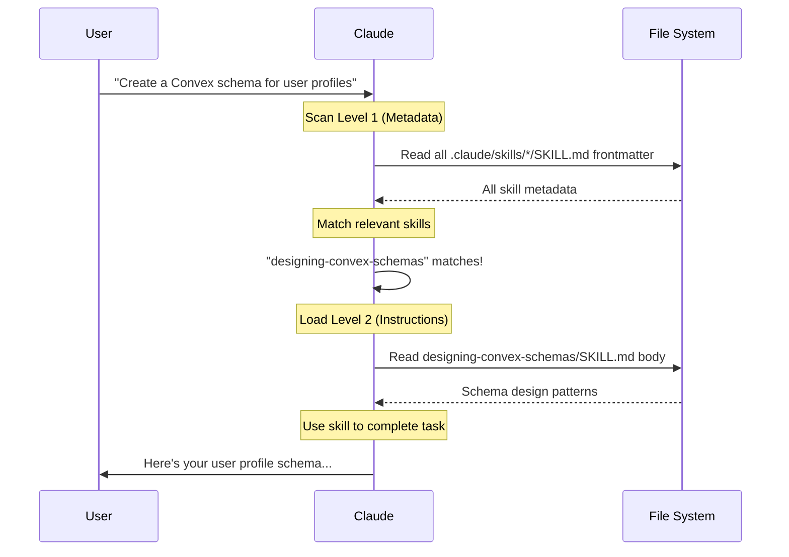
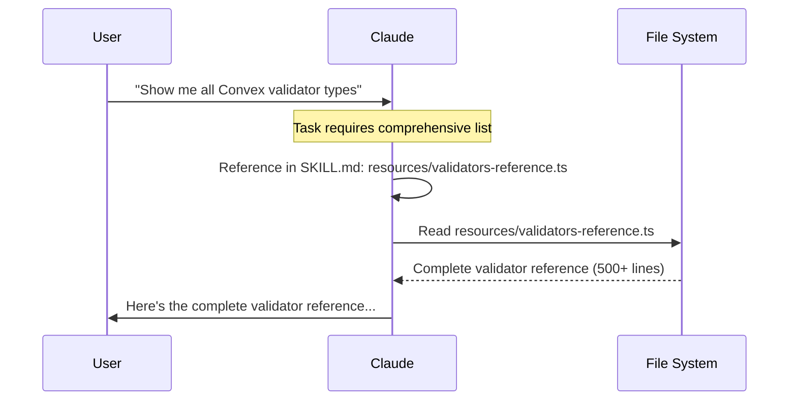

# Progressive Disclosure Architecture

## Overview

Progressive disclosure is the core design principle that makes Claude Skills flexible and scalable. Like a well-organized manual with a table of contents, specific chapters, and detailed appendices, skills let Claude load information only as needed.

## The 3-Level Architecture

```
┌─────────────────────────────────────────────────────────────┐
│ Level 1: Metadata (Always Loaded)                           │
│ ┌─────────────────────────────────────────────────────────┐ │
│ │ name: processing-pdfs                                    │ │
│ │ description: Extracts text and tables from PDF files... │ │
│ └─────────────────────────────────────────────────────────┘ │
│ ~100 tokens • Loaded for ALL skills                         │
└─────────────────────────────────────────────────────────────┘
                              ↓
                    (if relevant to task)
                              ↓
┌─────────────────────────────────────────────────────────────┐
│ Level 2: SKILL.md Body (Loaded When Triggered)              │
│ ┌─────────────────────────────────────────────────────────┐ │
│ │ # Processing PDFs                                        │ │
│ │                                                          │ │
│ │ ## Quick Start                                           │ │
│ │ [Essential patterns and examples]                        │ │
│ │                                                          │ │
│ │ ## Best Practices                                        │ │
│ │ [Key guidelines]                                         │ │
│ │                                                          │ │
│ │ For details: resources/pypdf-api.md                      │ │
│ └─────────────────────────────────────────────────────────┘ │
│ <5,000 tokens • <500 lines • Concise instructions           │
└─────────────────────────────────────────────────────────────┘
                              ↓
                    (if explicitly referenced)
                              ↓
┌─────────────────────────────────────────────────────────────┐
│ Level 3: Resources & Scripts (Loaded As Needed)             │
│ ┌─────────────────────────────────────────────────────────┐ │
│ │ resources/pypdf-api.md                                   │ │
│ │ - Complete API reference                                 │ │
│ │ - 1000+ lines of detailed documentation                  │ │
│ │                                                          │ │
│ │ scripts/extract-tables.py                                │ │
│ │ - Executable utility for table extraction                │ │
│ └─────────────────────────────────────────────────────────┘ │
│ Unlimited size • Only loaded when needed                    │
└─────────────────────────────────────────────────────────────┘
```

## Why Progressive Disclosure?

### Context Window Efficiency

Claude has a large but finite context window. Progressive disclosure ensures:

1. **Efficient scanning**: All skill metadata fits in ~2,000 tokens (20 skills × ~100 tokens)
2. **Selective loading**: Only relevant skills load their full instructions
3. **On-demand details**: Deep documentation loaded only when explicitly needed

### Example: Cost Comparison

**Without Progressive Disclosure:**
- 20 skills × 5,000 tokens each = 100,000 tokens always loaded
- User asks simple question → 100,000 tokens wasted

**With Progressive Disclosure:**
- Level 1: 20 skills × 100 tokens = 2,000 tokens always loaded
- Level 2: 1 relevant skill × 5,000 tokens = 5,000 additional tokens
- Level 3: 0 tokens (not needed)
- **Total: 7,000 tokens** (93% savings)

## Level 1: Metadata

### Purpose
Enable Claude to quickly scan all available skills and identify which are relevant to the current task.

### Structure
```yaml
---
name: skill-identifier
description: What it does + when to use it
---
```

### Best Practices

**Name Field:**
- Use gerund form (verb + -ing)
- Kebab-case format
- Descriptive and specific

**Description Field:**
- Max 1024 characters
- Include WHAT the skill does
- Include WHEN to use it
- Be specific, not vague

### Good vs Bad Examples

#### ❌ Bad Description (Vague)
```yaml
description: Helps with database stuff
```

**Problems:**
- Too vague ("stuff")
- No indication of WHEN to use
- Doesn't specify which database

#### ✅ Good Description (Specific)
```yaml
description: Designs Convex database schemas with TypeScript validators, indexes, and relationships. Use when creating or modifying Convex schema.ts files, defining tables, adding validators, or setting up indexes.
```

**Why it works:**
- Specific technology (Convex)
- Clear capabilities (schemas, validators, indexes, relationships)
- Explicit use cases (creating schema.ts, defining tables, etc.)
- Easy to match against task descriptions

## Level 2: SKILL.md Body

### Purpose
Provide concise, actionable instructions for using the skill without overwhelming the context window.

### Size Constraints
- **Target**: < 500 lines
- **Rationale**: Keeps instructions focused and context-efficient
- **Strategy**: Link to `resources/` for comprehensive details

### Content Organization

**Essential Sections:**
1. **Quick Start** - Get running immediately
2. **Common Patterns** - Frequently used examples
3. **Best Practices** - Key guidelines
4. **References** - Links to resources and documentation

**Optional Sections:**
- Error Handling
- Advanced Usage (with links to resources)
- Related Skills

### Writing Style

**Voice**: Third person
```markdown
✅ Processes files with validation
❌ I can help you process files
```

**Tone**: Concise and actionable
```markdown
✅ Extract text: reader.pages[0].extract_text()
❌ To extract text, you would want to use the extract_text() method on a page object, which can be accessed through the pages property of the reader instance...
```

**Code Examples**: Show, don't tell
```markdown
✅
## Basic Usage
\`\`\`python
reader = PdfReader("file.pdf")
text = reader.pages[0].extract_text()
\`\`\`

❌
## Basic Usage
First, you need to import PdfReader. Then you create an instance by passing the filename. After that, you can access pages and extract text.
```

### Linking to Resources

**Pattern**: Brief instruction + link to detailed resource

```markdown
## Advanced Validation

For complex validation patterns:
- Custom validators: `resources/custom-validators.md`
- Performance tuning: `resources/optimization.md`
- Migration strategies: `resources/migrations.md`
```

## Level 3: Resources & Scripts

### Purpose
Provide unlimited detailed documentation and executable utilities without impacting the main skill's token count.

### When to Use Resources

**Good use cases:**
- Complete API references (100+ lines)
- Advanced patterns and techniques
- Troubleshooting guides
- Large data sets or templates

**Example: Convex Validators**

**SKILL.md** (Level 2):
```markdown
## Common Validators
- `v.string()` - String values
- `v.number()` - Numbers
- `v.boolean()` - Booleans
- `v.id("table")` - Table references

For complete validator reference, see resources/validators-reference.ts
```

**resources/validators-reference.ts** (Level 3):
```typescript
// 500+ lines of comprehensive validator examples
export const primitiveExamples = { ... }
export const arrayExamples = { ... }
export const objectExamples = { ... }
// ... extensive documentation
```

### When to Use Scripts

**Good use cases:**
- Validation utilities
- Code generators
- Data processors
- Testing utilities

**Example: Skill Validation**

**SKILL.md** (Level 2):
```markdown
## Validation

Validate your skill structure:
\`\`\`bash
node scripts/validate-skill.js path/to/skill
\`\`\`
```

**scripts/validate-skill.js** (Level 3):
```javascript
// Executable script that validates:
// - YAML frontmatter
// - File structure
// - Naming conventions
// - etc.
```

## Loading Behavior

### Automatic Loading (Levels 1-2)



### Explicit Loading (Level 3)

Level 3 (resources/scripts) is only loaded when:
1. **Explicitly referenced** in SKILL.md
2. **User requests** detailed information
3. **Claude determines** it's necessary



## Best Practices

### Do's ✅

1. **Keep metadata descriptive** - Easy matching = better auto-discovery
2. **Keep SKILL.md concise** - Under 500 lines forces clarity
3. **Link generously** - Point to resources for details
4. **Organize resources** - Group related content
5. **Make scripts executable** - Provide actual utilities

### Don'ts ❌

1. **Don't put everything in SKILL.md** - Use resources for details
2. **Don't duplicate content** - Reference, don't repeat
3. **Don't skip metadata** - Description quality matters
4. **Don't use deep nesting** - Keep one level deep
5. **Don't make scripts just examples** - Make them functional

## Real-World Example

**Skill**: `processing-stripe-payments`

### Level 1 (Metadata)
```yaml
---
name: processing-stripe-payments
description: Processes Stripe payments including subscriptions, webhooks, and checkout flows. Use when implementing payment processing, handling Stripe webhooks, or managing customer billing.
---
```
**Token cost**: ~50 tokens

### Level 2 (SKILL.md - 450 lines)
```markdown
# Processing Stripe Payments

## Quick Start
[Essential Stripe patterns - 200 lines]

## Common Patterns
[Frequently used examples - 150 lines]

## Best Practices
[Key guidelines - 100 lines]

For advanced topics:
- Complete webhook reference: resources/webhooks.md
- Security best practices: resources/security.md
- Testing strategies: resources/testing.md
```
**Token cost**: ~3,000 tokens (loaded when relevant)

### Level 3 (Resources - unlimited)
```markdown
<!-- resources/webhooks.md (800 lines) -->
# Complete Stripe Webhook Reference

[Comprehensive documentation with all webhook types,
 handling patterns, error scenarios, etc.]
```
**Token cost**: ~5,000 tokens (loaded only when needed)

### Total Cost Analysis

**Scenario 1: User asks about unrelated task**
- Level 1 loaded: 50 tokens
- Level 2 not loaded: 0 tokens
- Level 3 not loaded: 0 tokens
- **Total: 50 tokens**

**Scenario 2: User implements basic Stripe payment**
- Level 1 loaded: 50 tokens
- Level 2 loaded: 3,000 tokens
- Level 3 not loaded: 0 tokens
- **Total: 3,050 tokens**

**Scenario 3: User needs comprehensive webhook reference**
- Level 1 loaded: 50 tokens
- Level 2 loaded: 3,000 tokens
- Level 3 (webhooks.md) loaded: 5,000 tokens
- **Total: 8,050 tokens**

## Summary

Progressive disclosure makes skills:
- **Efficient**: Load only what's needed
- **Scalable**: Support unlimited skills without context bloat
- **Discoverable**: Metadata enables automatic relevance matching
- **Comprehensive**: Unlimited detail available via resources
- **Maintainable**: Clear separation of concerns

**Key Principle**: Information is organized like a book - start with the index, read relevant chapters, consult appendices as needed.

