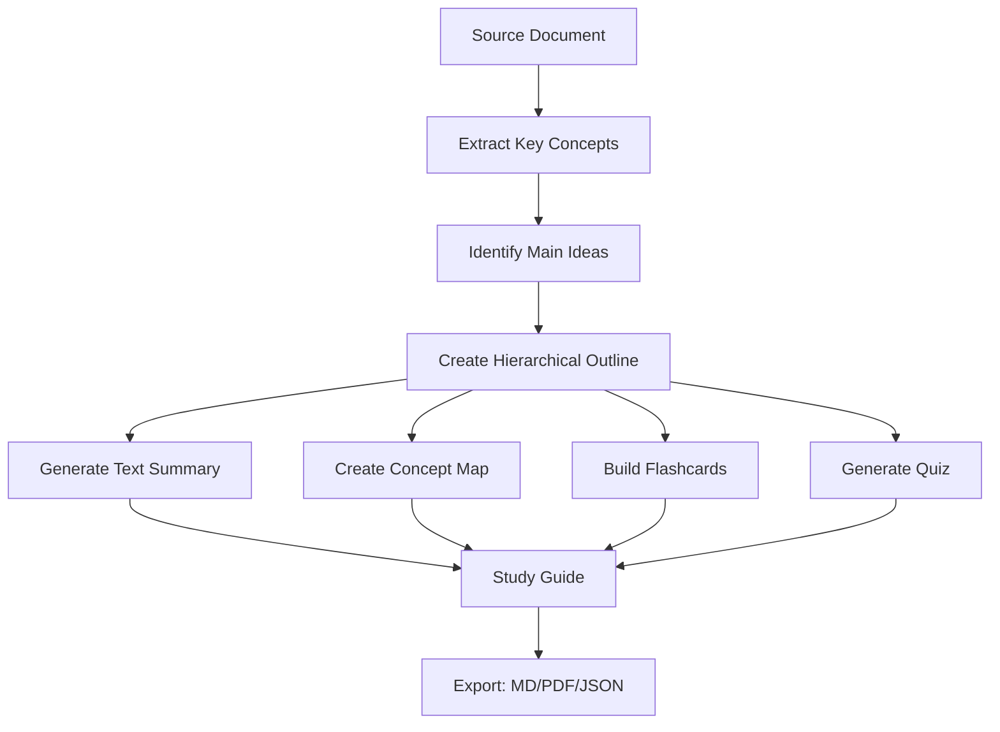
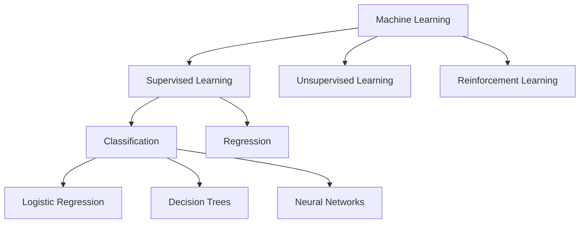
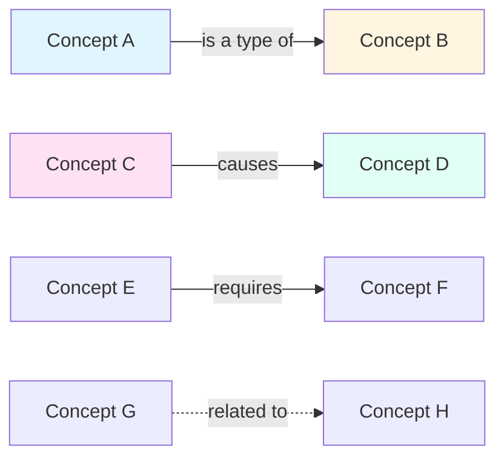
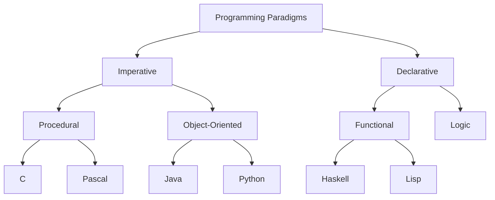
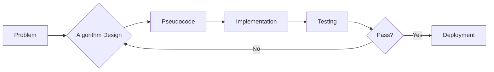

# Creating Study Summaries

Transforms dense academic content into concise, learnable summaries with multiple formats optimized for retention and understanding.

## What This Skill Does

Creates multi-format study materials from source content:

- **Key concepts extraction**: Identifies and organizes main ideas
- **Chapter/section summaries**: Condenses long-form content
- **Concept maps**: Visual relationship diagrams (Mermaid)
- **Flashcards**: Spaced repetition-ready Q&A pairs
- **Practice quizzes**: Multiple choice, short answer, true/false
- **Study guides**: Structured review documents

## Quick Start

### Generate Summary

```bash
# Create comprehensive summary from document
node scripts/generate-summary.js input.json summary.md

# Options: --format (markdown, json, html)
# --depth (brief, standard, detailed)
```

### Create Flashcards

```bash
# Extract definitions and create Anki-compatible flashcards
node scripts/create-flashcards.js input.json flashcards.txt

# Formats: Anki, Quizlet, JSON
```

### Generate Quiz

```bash
# Create practice questions from content
node scripts/generate-quiz.js input.json quiz.md --questions 20
```

---

## Summary Generation Workflow



---

## Key Concepts Extraction

### Automatic Concept Identification

**Methods**:
1. **Frequency Analysis**: Terms appearing multiple times
2. **Position Weighting**: Headings, bold text, definitions
3. **Semantic Analysis**: Noun phrases, technical terms
4. **Context Clues**: "important," "key," "definition"

**Example Output**:
```javascript
{
  primaryConcepts: [
    {
      term: "Neural Network",
      definition: "Computing system inspired by biological neural networks",
      importance: 0.95,
      occurrences: 47,
      relatedTerms: ["deep learning", "artificial neuron", "backpropagation"]
    }
  ],
  secondaryConcepts: [...],
  supportingTerms: [...]
}
```

### Concept Hierarchy



---

## Chapter Summarization

### Multi-Level Summaries

**Brief (1-2 sentences)**:
> Chapter 1 introduces machine learning fundamentals and covers supervised vs. unsupervised learning paradigms. Key algorithms include linear regression, decision trees, and neural networks.

**Standard (1 paragraph)**:
> Chapter 1: Introduction to Machine Learning provides a comprehensive overview of ML fundamentals. The chapter defines machine learning as the study of algorithms that improve through experience. It distinguishes between three main paradigms: supervised learning (labeled data), unsupervised learning (unlabeled data), and reinforcement learning (reward-based). The chapter covers essential algorithms including linear regression for prediction, decision trees for classification, and introduces neural networks as powerful function approximators. Key concepts include training data, model evaluation, and the bias-variance tradeoff.

**Detailed (multiple paragraphs)**:
> [Expanded summary with subsections, examples, and key formulas]

### Summary Template

```markdown
# Chapter X: [Title]

## Overview
[2-3 sentence chapter overview]

## Key Concepts
1. **Concept 1**: Definition and importance
2. **Concept 2**: Definition and importance
3. **Concept 3**: Definition and importance

## Main Ideas

### Section X.1: [Title]
- Point 1
- Point 2
- Point 3

### Section X.2: [Title]
- Point 1
- Point 2

## Important Formulas
- Formula 1: `E = mc²` - Energy-mass equivalence
- Formula 2: `F = ma` - Newton's second law

## Examples
- Example 1: [Brief description]
- Example 2: [Brief description]

## Review Questions
1. What is...?
2. Explain the difference between...
3. Why is... important?

## Key Takeaways
- Takeaway 1
- Takeaway 2
- Takeaway 3
```

---

## Concept Map Generation

### Relationship Types



### Hierarchical Concept Map



### Process Flow Concept Map



---

## Flashcard Creation

### Card Types

**Basic (Front/Back)**:
```
Front: What is a neural network?
Back: A computing system inspired by biological neural networks, consisting of interconnected nodes (neurons) that process information.
```

**Cloze Deletion**:
```
A {{c1::neural network}} is composed of interconnected {{c2::nodes}} that process information through {{c3::weighted connections}}.
```

**Image Occlusion**:
```
[Diagram with parts labeled, some hidden for recall]
```

### Flashcard Generation Rules

1. **One concept per card**: Focus on single fact
2. **Clear questions**: No ambiguity
3. **Concise answers**: 1-3 sentences max
4. **Include context**: Enough information to recall
5. **Add examples**: When helpful for understanding

### Output Formats

**Anki Format (CSV)**:
```csv
"What is backpropagation?","Algorithm for training neural networks by propagating errors backward through the network to update weights."
"Define gradient descent","Optimization algorithm that iteratively moves toward a minimum by following the negative gradient."
```

**Quizlet Format (Text)**:
```
Neural Network	Computing system inspired by biological neural networks
Backpropagation	Algorithm for training neural networks by error propagation
Gradient Descent	Optimization algorithm following negative gradient
```

**JSON Format**:
```json
{
  "cards": [
    {
      "id": 1,
      "front": "What is a neural network?",
      "back": "Computing system inspired by biological neural networks",
      "tags": ["machine-learning", "neural-networks"],
      "difficulty": "easy"
    }
  ]
}
```

---

## Quiz Generation

### Question Types

**Multiple Choice**:
```markdown
**Question 1**: What is the primary purpose of backpropagation?

A) Forward pass computation
B) Weight initialization
C) Error gradient calculation ✓
D) Data preprocessing

*Explanation*: Backpropagation calculates error gradients to update network weights during training.
```

**True/False**:
```markdown
**Question 2**: Neural networks always require labeled data for training.

**Answer**: False

*Explanation*: Unsupervised learning and reinforcement learning don't require labeled data.
```

**Short Answer**:
```markdown
**Question 3**: Explain the bias-variance tradeoff in 2-3 sentences.

*Sample Answer*: The bias-variance tradeoff describes the balance between model complexity and generalization. High bias (underfitting) means the model is too simple. High variance (overfitting) means the model is too complex and fits noise in the training data.
```

**Fill in the Blank**:
```markdown
**Question 4**: The ________ function introduces non-linearity into neural networks, allowing them to learn complex patterns.

**Answer**: activation

*Accepted alternatives*: activation function, nonlinear activation
```

### Difficulty Levels

**Easy**: Direct recall from text
```
What does "ML" stand for?
```

**Medium**: Requires understanding
```
Explain the difference between supervised and unsupervised learning.
```

**Hard**: Application and synthesis
```
Given a dataset with 1000 samples and 50 features, which algorithm would you choose and why?
```

### Quiz Templates

**Practice Quiz**:
```markdown
# Chapter 5 Practice Quiz
**Time**: 30 minutes | **Questions**: 20 | **Points**: 100

## Instructions
- Choose the best answer for multiple choice
- Show your work for calculation problems
- Write clearly for short answer questions

## Questions

### Multiple Choice (2 points each)

1. [Question]
   A) Option A
   B) Option B
   C) Option C ✓
   D) Option D

[... more questions ...]

## Answer Key
[Provided separately or at end]
```

---

## Study Guide Templates

### Complete Study Guide

```markdown
# Study Guide: Machine Learning Fundamentals

## Chapter Overview
[Comprehensive chapter summary]

## Learning Objectives
By mastering this material, you will be able to:
- ☐ Define machine learning and its key paradigms
- ☐ Explain the difference between supervised and unsupervised learning
- ☐ Implement basic ML algorithms
- ☐ Evaluate model performance

## Vocabulary

| Term | Definition | Example |
|------|------------|---------|
| Supervised Learning | Learning from labeled data | Email spam classification |
| Overfitting | Model too complex for data | Memorizing training data |

## Key Concepts

### 1. Machine Learning Paradigms

**Supervised Learning**
- Uses labeled training data
- Goal: Learn mapping from inputs to outputs
- Examples: Classification, regression

**Unsupervised Learning**
- Uses unlabeled data
- Goal: Discover patterns or structure
- Examples: Clustering, dimensionality reduction

### 2. Model Evaluation

[Detailed explanations...]

## Concept Map
```mermaid
[Mermaid diagram]
```

## Practice Problems

### Problem 1
[Question]

**Solution**:
[Step-by-step solution]

## Flashcards
[Key terms and definitions]

## Sample Questions
[Practice quiz questions]

## Additional Resources
- Textbook pages: 45-89
- Online resources: [links]
- Videos: [links]
```

---

## Best Practices

### For Effective Summaries

1. **Maintain Accuracy**: Don't oversimplify to the point of error
2. **Preserve Context**: Include enough detail for understanding
3. **Use Active Voice**: "The algorithm processes..." not "The data is processed..."
4. **Include Examples**: Concrete examples aid comprehension
5. **Highlight Relationships**: Show how concepts connect

### For Flashcards

1. **Atomic Cards**: One fact per card
2. **No Lists**: Break lists into individual cards
3. **Both Directions**: Create reverse cards when appropriate
4. **Add Images**: Visual cues improve retention
5. **Regular Review**: Space repetition is key

### For Quizzes

1. **Varied Difficulty**: Mix easy, medium, and hard questions
2. **Comprehensive Coverage**: Test all major concepts
3. **Clear Explanations**: Provide detailed answer explanations
4. **Realistic Format**: Match actual exam style when possible
5. **Progressive Complexity**: Start easy, build to complex

---

## Customization Options

### Summary Depth

```javascript
const summaryOptions = {
  depth: 'standard',  // brief, standard, detailed
  format: 'markdown', // markdown, json, html
  includeExamples: true,
  includeFormulas: true,
  maxLength: 500,     // words per section
  focusAreas: ['definitions', 'key-concepts', 'processes']
};
```

### Flashcard Settings

```javascript
const flashcardOptions = {
  format: 'anki',           // anki, quizlet, json
  cardType: 'basic',        // basic, cloze, image-occlusion
  maxCardsPerConcept: 3,
  includeDiagrams: false,
  difficulty: 'mixed',      // easy, medium, hard, mixed
  tags: ['chapter-5', 'ml-fundamentals']
};
```

### Quiz Configuration

```javascript
const quizOptions = {
  questionCount: 20,
  questionTypes: ['multiple-choice', 'true-false', 'short-answer'],
  difficulty: 'mixed',
  includeExplanations: true,
  randomize: true,
  timeLimit: 30  // minutes
};
```

---

## Integration with Learning Tools

### Anki Integration

```bash
# Export flashcards directly to Anki
node scripts/create-flashcards.js input.json output.apkg --format anki
```

### Notion Integration

```bash
# Create Notion-compatible database
node scripts/generate-summary.js input.json --format notion-csv
```

### PDF Export

```bash
# Generate printable study guide
node scripts/generate-summary.js input.json study-guide.md
pandoc study-guide.md -o study-guide.pdf
```

---

## Advanced Features

For detailed information:
- **Spaced Repetition Algorithms**: `resources/spaced-repetition.md`
- **Summary Templates Library**: `resources/summary-templates.md`
- **Concept Map Patterns**: `resources/concept-map-patterns.md`
- **Quiz Question Bank**: `resources/question-templates.md`

## References

- Cornell Note-Taking System for summary structure
- Bloom's Taxonomy for question difficulty levels
- Cognitive Load Theory for information chunking
- Dual Coding Theory for visual + text summaries

