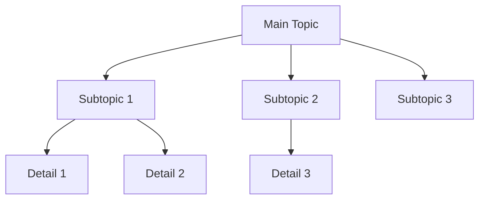
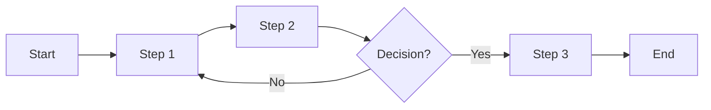
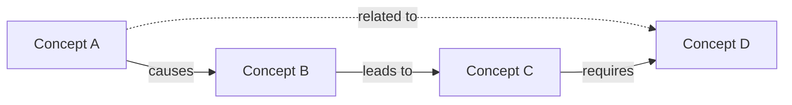
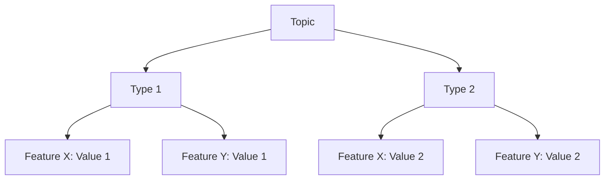

# Concept Map Patterns

Visual organization methods for study summaries using Mermaid diagrams.

## Hierarchical Maps

## Process Flow Maps

## Relationship Maps

## Comparison Maps

## Best Practices

1. Use consistent color coding for related concepts
2. Limit to 7-10 nodes per diagram for clarity
3. Use different arrow types for relationship types
4. Add brief labels to connections
5. Organize spatially (top-down for hierarchy, left-right for process)

