# Creating Visual Notes

Transform text-based notes into visual formats that enhance understanding, retention, and recall through spatial organization and visual encoding.

## What This Skill Does

Converts notes into multiple visual formats:

- **Mind maps**: Hierarchical concept organization (Mermaid)
- **Concept maps**: Relationship networks with labeled connections
- **Flowcharts**: Process and decision flows
- **Timelines**: Chronological event visualization
- **Comparison tables**: Feature matrices and side-by-side analysis
- **Sketchnotes**: Visual note-taking patterns with icons and structure

## Quick Start

### Generate Mind Map

```bash
node scripts/generate-mindmap.js notes.txt mindmap.md
```

### Create Timeline

```bash
node scripts/create-timeline.js events.json timeline.md
```

### Build Comparison Table

```bash
node scripts/build-comparison-table.js items.json comparison.md
```

---

## Visual Note Creation Workflow

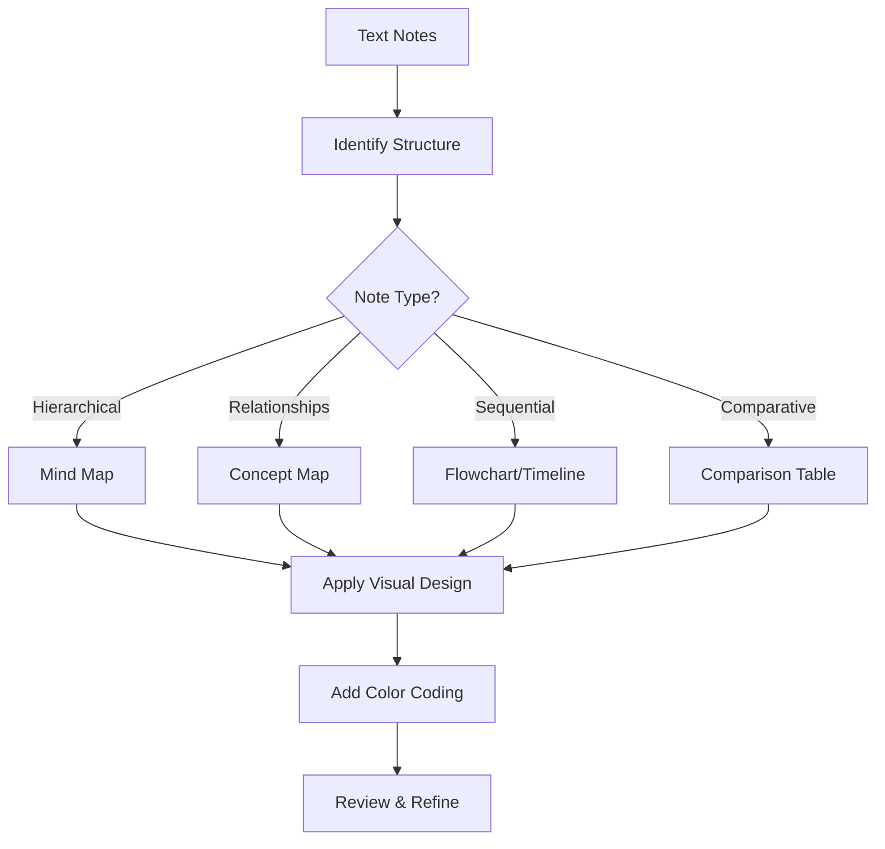

---

## Mind Maps

### Basic Mind Map Structure

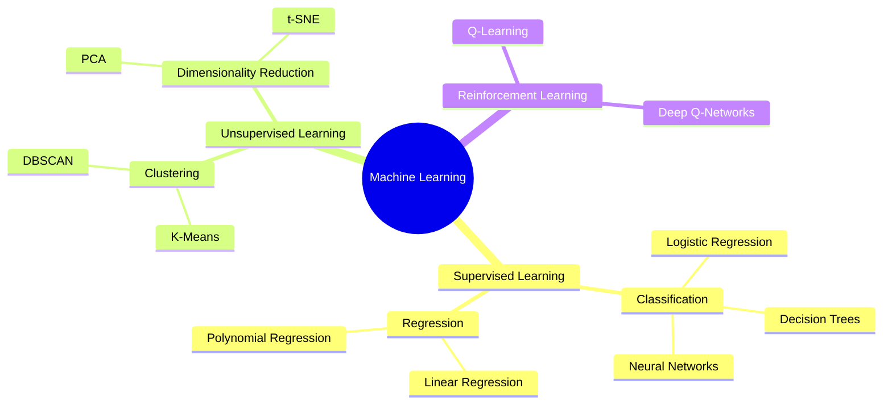

### Hierarchical Mind Map (Tree Style)

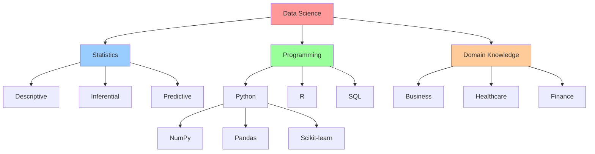

### Radial Mind Map Pattern

```
                    Classification
                          |
        Linear -------- ML Core -------- Neural Nets
                          |
                     Clustering
                          |
                    Dimensionality
                     Reduction
```

---

## Concept Maps (Relationship Maps)

### Labeled Relationships

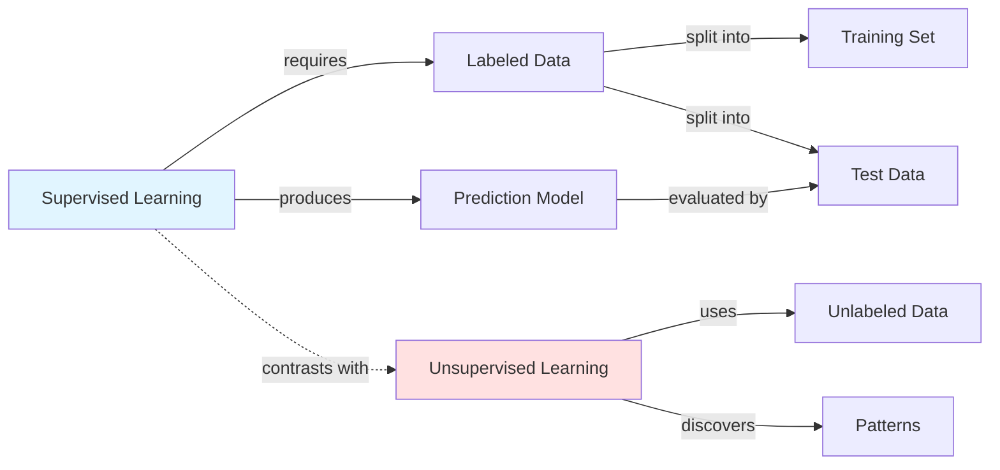

### Concept Network with Categories

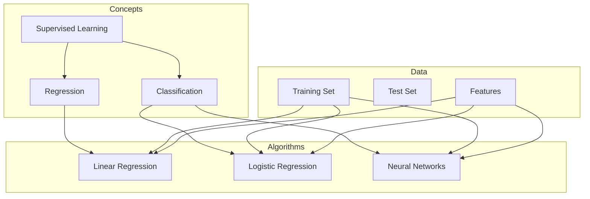

---

## Flowcharts and Process Diagrams

### Decision Flowchart

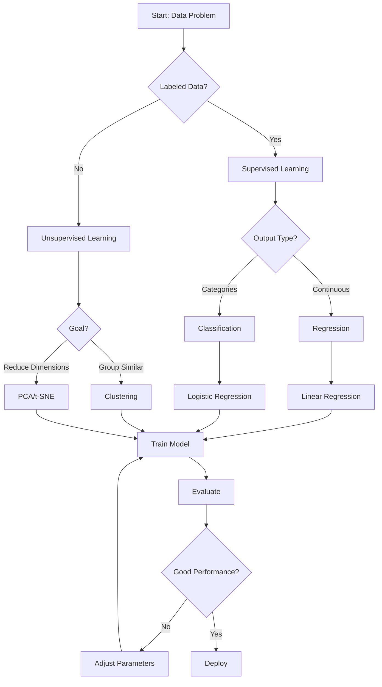

### Linear Process Flow

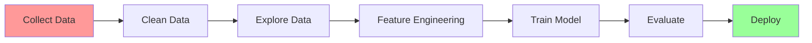

### Swimlane Diagram (Multi-Actor Process)

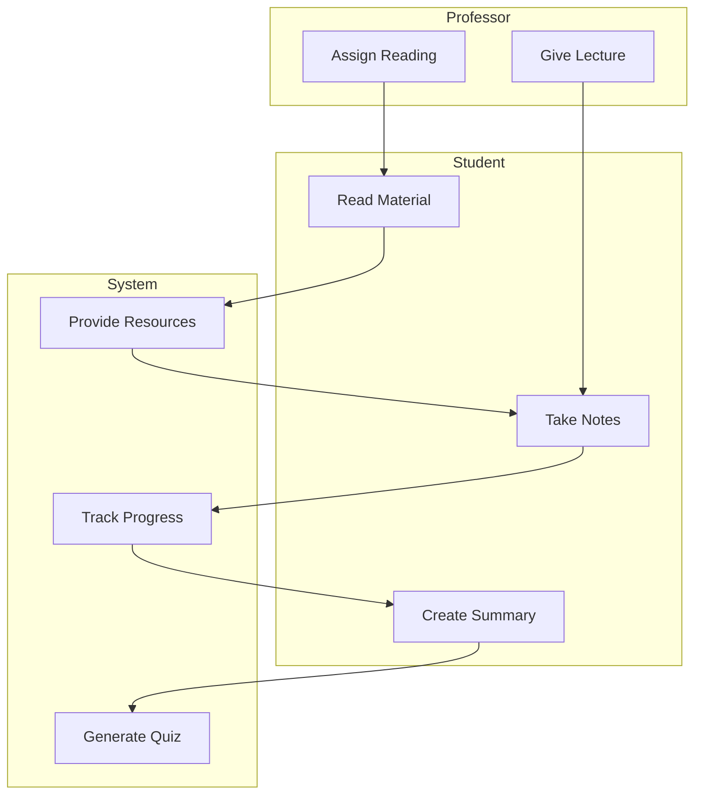

---

## Timelines

### Historical Timeline

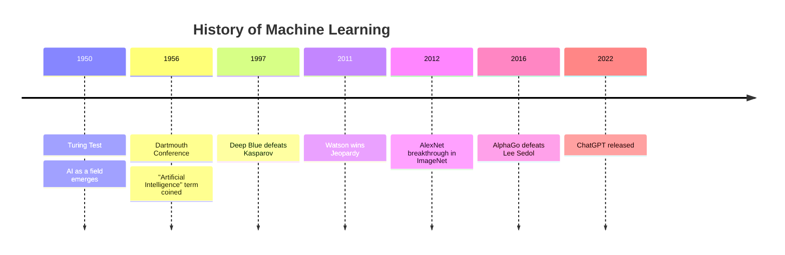

### Project Timeline (Gantt-style)

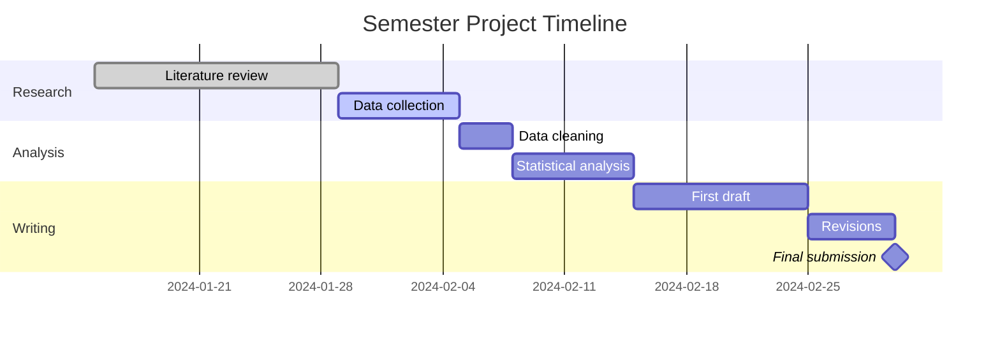

### Simple Text Timeline

```
1950s ─────► 1990s ─────► 2010s ─────► 2020s
  │             │            │            │
  │             │            │            │
Symbolic AI   Statistical  Deep         Generative
  Expert        ML          Learning     AI
  Systems       SVMs        CNNs         GPT/DALL-E
                            RNNs         Stable Diffusion
```

---

## Comparison Tables and Matrices

### Feature Comparison Matrix

| Algorithm | Type | Data Needs | Interpretability | Speed | Accuracy |
|-----------|------|------------|------------------|-------|----------|
| Linear Regression | Supervised | Low | ⭐⭐⭐ | ⚡⚡⚡ | ⭐⭐ |
| Decision Tree | Supervised | Medium | ⭐⭐⭐ | ⚡⚡ | ⭐⭐ |
| Neural Network | Supervised | High | ⭐ | ⚡ | ⭐⭐⭐ |
| K-Means | Unsupervised | Low | ⭐⭐ | ⚡⚡⚡ | ⭐⭐ |

### Two-Way Comparison Table

```markdown
| Aspect | Supervised Learning | Unsupervised Learning |
|--------|--------------------|-----------------------|
| **Data** | Labeled (inputs + outputs) | Unlabeled (inputs only) |
| **Goal** | Predict outputs for new inputs | Discover patterns/structure |
| **Examples** | Classification, Regression | Clustering, Dim. reduction |
| **Algorithms** | Linear Reg., Neural Nets | K-Means, PCA |
| **Evaluation** | Accuracy, precision, recall | Silhouette score, elbow method |
| **Use Cases** | Spam detection, price prediction | Customer segmentation, anomaly detection |
```

### Pros/Cons Matrix

```
┌─────────────────────┬────────────────────┬───────────────────┐
│     Algorithm       │   Advantages       │   Disadvantages   │
├─────────────────────┼────────────────────┼───────────────────┤
│ Linear Regression   │ • Fast             │ • Assumes linear  │
│                     │ • Interpretable    │   relationship    │
│                     │ • Low data needs   │ • Sensitive to    │
│                     │                    │   outliers        │
├─────────────────────┼────────────────────┼───────────────────┤
│ Neural Network      │ • High accuracy    │ • "Black box"     │
│                     │ • Handles complex  │ • Needs lots of   │
│                     │   patterns         │   data            │
│                     │ • Versatile        │ • Computationally │
│                     │                    │   expensive       │
└─────────────────────┴────────────────────┴───────────────────┘
```

---

## Sketchnote Patterns

### Cornell Note Visual Template

```
┌────────────────────────────────────────────────────┐
│ Topic: Machine Learning Fundamentals               │
│ Date: Jan 15, 2024                                 │
├──────────────┬─────────────────────────────────────┤
│              │                                      │
│ KEY CONCEPTS │         VISUAL NOTES                │
│              │                                      │
│ • Supervised │    [Diagram of labeled data]        │
│   Learning   │         ↓                            │
│              │    [Algorithm box]                   │
│              │         ↓                            │
│ • Features   │    [Prediction output]              │
│              │                                      │
│ • Training   │    Training = Learning patterns     │
│   vs Testing │    Testing = Checking accuracy      │
│              │                                      │
│              │    [Icon: Brain] → [Icon: Computer] │
│              │                                      │
│ • Models     │    Types of Models:                 │
│              │    🔹 Linear (simple)               │
│              │    🔹 Tree (decisions)              │
│              │    🔹 Neural (complex)              │
│              │                                      │
├──────────────┴─────────────────────────────────────┤
│ SUMMARY:                                           │
│ ML = Computers learning patterns from data         │
│ Supervised = Learn from labeled examples           │
│ Goal = Make accurate predictions on new data       │
└────────────────────────────────────────────────────┘
```

### Visual Vocabulary

**Common Icons for Concepts**:
```
📊 Data/Statistics      💡 Idea/Concept
🔄 Process/Cycle        ⚠️  Warning/Important
📈 Growth/Increase      ✓ Success/Correct
📉 Decline/Decrease     ✗ Error/Incorrect
🎯 Goal/Target          🔍 Analysis/Detail
⚡ Speed/Quick          🐌 Slow/Gradual
💰 Cost/Money           ⏰ Time/Deadline
👥 People/Users         🖥️  Computer/System
📚 Learning/Study       🧠 Intelligence/Thinking
```

**Visual Connectors**:
```
──► Leads to           ⟷  Bidirectional
┄┄► Weak connection    ⇉  Strong connection
─┬─ Branches           ═══► Important path
 │
 └─► Alternative
```

---

## Color Coding Systems

### Subject-Based Color Coding

- 🔴 **Red**: Important/Critical/Errors
- 🟠 **Orange**: Warnings/Cautions
- 🟡 **Yellow**: Examples/Illustrations
- 🟢 **Green**: Definitions/Terminology
- 🔵 **Blue**: Processes/Methods
- 🟣 **Purple**: Questions/To Research
- ⚫ **Black**: Main content/Body

### Bloom's Taxonomy Color Coding

- **Level 1 (Remember)**: Light Blue
- **Level 2 (Understand)**: Blue
- **Level 3 (Apply)**: Green
- **Level 4 (Analyze)**: Yellow
- **Level 5 (Evaluate)**: Orange
- **Level 6 (Create)**: Red

### Semantic Color Coding

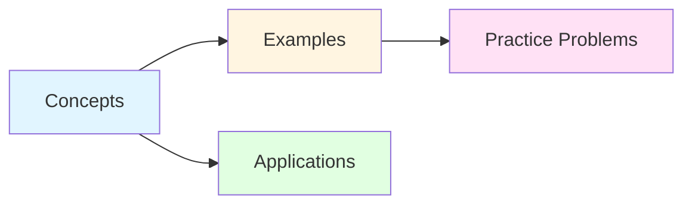

---

## Layout Patterns

### Radial Layout (Central Focus)

```
           Topic 2
               |
Topic 1 ── MAIN IDEA ── Topic 3
               |
           Topic 4
```

### Hierarchical Layout (Top-Down)

```
         Main Topic
            |
    ┌───────┴───────┐
    |               |
SubTopic 1    SubTopic 2
    |               |
  ┌─┴─┐           ┌─┴─┐
Detail Detail  Detail Detail
```

### Sequential Layout (Left-Right)

```
Step 1 → Step 2 → Step 3 → Step 4 → Result
```

### Matrix Layout (Grid)

```
        Category A | Category B | Category C
Item 1      ✓     |     ✗      |     ✓
Item 2      ✗     |     ✓      |     ✓
Item 3      ✓     |     ✓      |     ✗
```

---

## Best Practices

### Visual Note Design Principles

1. **Hierarchy**: Use size/color/position to show importance
2. **Grouping**: Related items close together
3. **White Space**: Don't overcrowd - breathing room improves clarity
4. **Consistency**: Same symbols/colors mean same things
5. **Emphasis**: Highlight key information (bold, color, boxes)

### Mermaid Diagram Tips

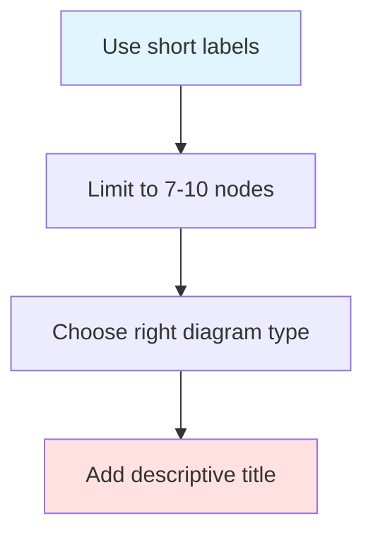

**Diagram Type Selection**:
- **Hierarchy**: Tree diagram, mind map
- **Process**: Flowchart, sequence diagram
- **Relationships**: Graph, network diagram
- **Time**: Timeline, Gantt chart
- **Comparison**: Table, matrix

### Memory Enhancement Through Visualization

**Dual Coding**: Combine text + visual for better retention
**Spatial Memory**: Use position to encode relationships
**Color Associations**: Consistent color use creates mental links
**Personal Icons**: Create your own symbol system

---

## Conversion Examples

### Text to Mind Map

**Text Notes**:
```
Machine Learning Types:
- Supervised Learning (uses labeled data)
  - Classification (categories)
  - Regression (continuous values)
- Unsupervised Learning (no labels)
  - Clustering (group similar items)
  - Dimensionality Reduction (simplify data)
```

**Mind Map**:
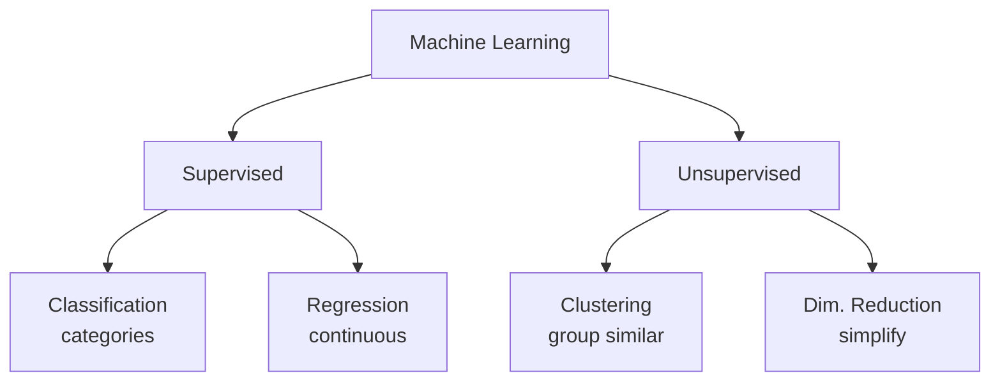

### Text to Comparison Table

**Text Notes**:
```
Python vs R for Data Science:
Python is general-purpose, easier to learn, better for production.
R is statistics-focused, great for visualization, academic preference.
Both have good ML libraries.
```

**Comparison Table**:

| Aspect | Python | R |
|--------|--------|---|
| **Purpose** | General-purpose | Statistics-focused |
| **Learning Curve** | Easier | Steeper |
| **Production Use** | ⭐⭐⭐ | ⭐ |
| **Visualization** | ⭐⭐ | ⭐⭐⭐ |
| **ML Libraries** | ⭐⭐⭐ | ⭐⭐⭐ |
| **Community** | Large, diverse | Academic |

---

## Advanced Features

For detailed information:
- **Visual Note Patterns**: `resources/visual-note-patterns.md`
- **Mermaid Examples Library**: `resources/mermaid-examples.md`
- **Color Coding Systems**: `resources/color-coding-systems.md`
- **Sketchnote Templates**: `resources/sketchnote-templates.md`

## References

- Visual Learning Theory (Paivio)
- Cognitive Load Theory
- Sketchnoting techniques (Mike Rohde)
- Mind mapping methodology (Tony Buzan)
- Information design principles (Edward Tufte)

