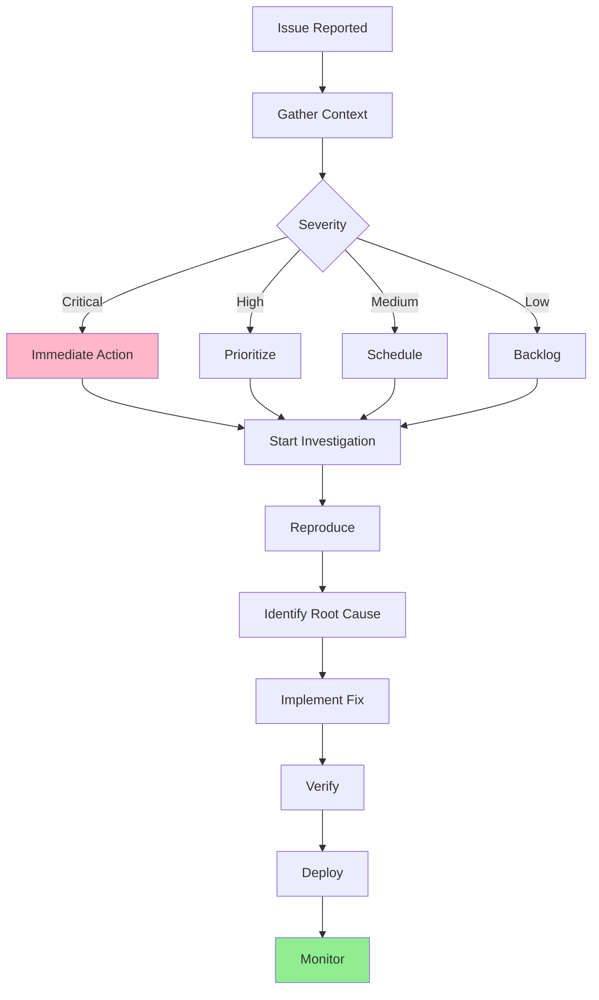
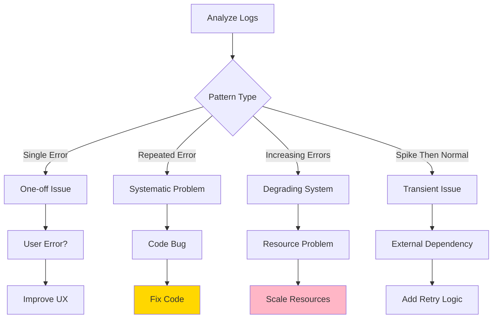
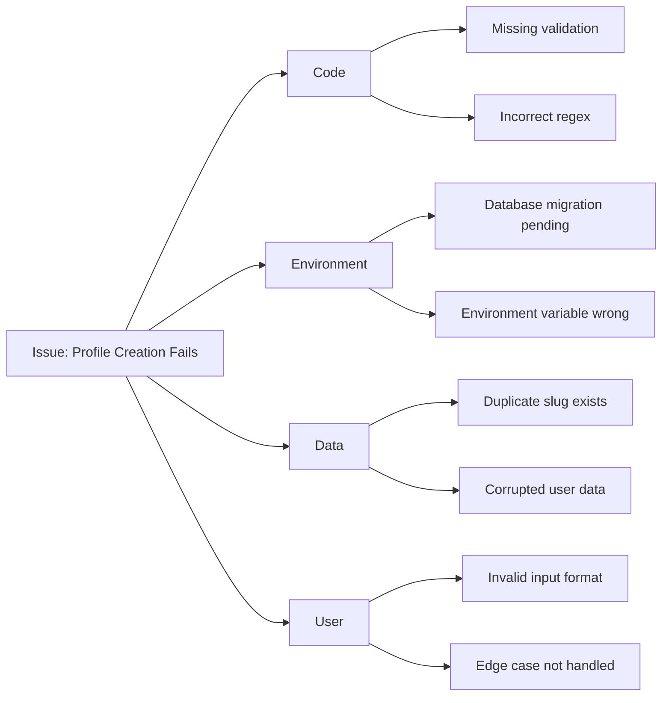

# Debugging Production Issues

Comprehensive workflow for investigating and resolving production issues with minimal downtime and maximum insight.

## Quick Start Investigation



## Step 1: Gather Context

### Essential Information Checklist

```typescript
interface IssueContext {
  // What
  symptom: string;              // "Users can't log in"
  errorMessage?: string;        // Exact error text

  // When
  firstOccurrence: Date;        // When did it start?
  frequency: "always" | "intermittent" | "once";

  // Who
  affectedUsers: "all" | "some" | "one";
  userIds?: string[];           // Specific user IDs

  // Where
  environment: "production" | "staging";
  region?: string;              // Geographic location
  device?: "mobile" | "desktop" | "both";
  browser?: string;

  // How
  reproducible: boolean;
  stepsToReproduce?: string[];
}
```

### Quick Context Commands

```bash
# Check recent deployments
git log --oneline --since="1 day ago"

# Check Convex logs (last hour)
npx convex logs --prod --since 1h

# Check Next.js/Vercel logs
vercel logs --prod --since 1h

# Check Stripe webhook events
stripe events list --limit 20

# Check Clerk webhook logs
# View in Clerk Dashboard → Webhooks → Event History
```

## Step 2: Reproduce the Issue

### Reproduction Strategies

**1. Direct Reproduction**
```typescript
// Try exact user flow
async function reproduceIssue() {
  // 1. Sign in as test user
  await signIn("test@example.com");

  // 2. Navigate to problem area
  await goto("/dashboard");

  // 3. Perform action
  await click("#create-profile");

  // 4. Observe error
  // Document: What happened vs. what should happen
}
```

**2. Log Analysis Pattern**
```bash
# Search for error patterns
npx convex logs --prod | grep "ERROR"

# Filter by function
npx convex logs --prod --function profiles:createProfile

# Search by user
npx convex logs --prod | grep "userId: user_123"

# Time-based search
npx convex logs --prod --since "2024-01-15T14:30:00Z"
```

**3. User Impersonation (Clerk)**
```typescript
// In Clerk Dashboard
// Users → Find user → "Sign in as"
// Reproduces issue with exact user context
```

## Step 3: Analyze Logs

### Convex Log Analysis

```typescript
// Add comprehensive logging to functions
export const debugFunction = mutation({
  handler: async (ctx, args) => {
    console.log("START:", {
      function: "debugFunction",
      args,
      timestamp: Date.now(),
    });

    try {
      const result = await performOperation(ctx, args);

      console.log("SUCCESS:", {
        function: "debugFunction",
        result,
        duration: Date.now() - startTime,
      });

      return result;
    } catch (error) {
      console.error("ERROR:", {
        function: "debugFunction",
        error: error instanceof Error ? error.message : "Unknown",
        stack: error instanceof Error ? error.stack : undefined,
        args,
      });

      throw error;
    }
  },
});
```

### Log Pattern Recognition



## Step 4: Common Issue Patterns

### Database Issues

**Symptom**: Slow queries or timeouts
```typescript
// Check for missing indexes
export const slowQuery = query({
  handler: async (ctx) => {
    // ❌ Full table scan
    const results = await ctx.db
      .query("profiles")
      .filter(q => q.eq(q.field("userId"), "user_123"))
      .collect();

    // ✅ Use index
    const results = await ctx.db
      .query("profiles")
      .withIndex("by_user", q => q.eq("userId", "user_123"))
      .collect();
  },
});
```

**Diagnostic Query**:
```typescript
// Add timing logs
const start = Date.now();
const results = await ctx.db.query("profiles").collect();
console.log(`Query took: ${Date.now() - start}ms`);
```

### Authentication Issues

**Symptom**: Users can't access protected routes
```typescript
// Debug middleware
export default authMiddleware({
  debug: true, // Enable in staging to see logs
  publicRoutes: ["/", "/api/webhook"],
  afterAuth(auth, req) {
    console.log("Auth check:", {
      userId: auth.userId,
      path: req.url,
      isPublic: req.url.startsWith("/api/webhook"),
    });
  },
});
```

### Payment Issues

**Symptom**: Webhooks not processing
```typescript
// Webhook debug endpoint
export async function POST(req: Request) {
  const body = await req.text();

  // Log everything for debugging
  console.log("Webhook received:", {
    headers: Object.fromEntries(req.headers),
    bodyLength: body.length,
    timestamp: Date.now(),
  });

  try {
    const event = stripe.webhooks.constructEvent(
      body,
      req.headers.get("stripe-signature")!,
      process.env.STRIPE_WEBHOOK_SECRET!
    );

    console.log("Event verified:", {
      type: event.type,
      id: event.id,
    });

    // Process event...
  } catch (error) {
    console.error("Webhook error:", error);
    return new Response("Error", { status: 400 });
  }
}
```

## Step 5: Performance Profiling

### Frontend Performance

```typescript
// Add performance marks
export function ProfilePage() {
  useEffect(() => {
    performance.mark("profile-render-start");

    return () => {
      performance.mark("profile-render-end");
      performance.measure(
        "profile-render",
        "profile-render-start",
        "profile-render-end"
      );

      const measure = performance.getEntriesByName("profile-render")[0];
      console.log(`Profile render took: ${measure.duration}ms`);
    };
  }, []);

  // Component code...
}
```

### Backend Performance

```typescript
// Function timing wrapper
export function withTiming<T extends (...args: any[]) => any>(
  fn: T,
  name: string
): T {
  return (async (...args: any[]) => {
    const start = Date.now();
    try {
      const result = await fn(...args);
      console.log(`${name} took ${Date.now() - start}ms`);
      return result;
    } catch (error) {
      console.error(`${name} failed after ${Date.now() - start}ms`);
      throw error;
    }
  }) as T;
}

// Usage
export const getProfile = query({
  handler: withTiming(async (ctx, { profileId }) => {
    return await ctx.db.get(profileId);
  }, "getProfile"),
});
```

## Step 6: Root Cause Analysis

### 5 Whys Technique

```
Problem: Users can't create profiles

Why? → Profile creation mutation fails
Why? → Slug validation throws error
Why? → Slug contains invalid characters
Why? → Input sanitization missing
Why? → Requirements changed, code not updated

Root Cause: Missing input validation after requirement change
Fix: Add input sanitization before validation
```

### Fishbone Diagram Approach



## Step 7: Implement Fix

### Production Fix Strategy

```typescript
// 1. Add feature flag for new code
export const createProfile = mutation({
  handler: async (ctx, args) => {
    const useNewValidation = process.env.NEW_VALIDATION === "true";

    if (useNewValidation) {
      // New validation logic (can toggle off if issues)
      await validateProfileNew(args);
    } else {
      // Old validation logic (fallback)
      await validateProfileOld(args);
    }

    // Rest of function...
  },
});

// 2. Deploy with flag OFF
// 3. Test in production with flag ON for test users
// 4. Gradually roll out
// 5. Remove flag once stable
```

### Rollback Plan

```bash
# Always have rollback ready
git tag pre-fix-$(date +%Y%m%d-%H%M%S)
git push origin pre-fix-$(date +%Y%m%d-%H%M%S)

# Deploy fix
vercel --prod

# If issues:
git revert HEAD
vercel --prod
```

## Step 8: Verify Fix

### Verification Checklist

```typescript
interface VerificationSteps {
  reproduced: boolean;          // Could you reproduce initially?
  fixApplied: boolean;          // Is fix deployed?
  issueGone: boolean;           // Can you confirm fix works?
  noNewErrors: boolean;         // No new errors introduced?
  monitoringSetup: boolean;     // Alerts configured?
  documentationUpdated: boolean; // Runbook updated?
}
```

### Post-Deploy Monitoring

```bash
# Watch logs for 10 minutes
npx convex logs --prod --follow

# Check error rates
# In Convex Dashboard → Logs → Filter by ERROR

# Monitor user reports
# Check support channels

# Verify metrics
# Check analytics for success rates
```

## Best Practices

### 1. Always Log Context
```typescript
// ❌ Bad
console.error("Error creating profile");

// ✅ Good
console.error("Error creating profile", {
  userId: user._id,
  slug: args.slug,
  error: error instanceof Error ? error.message : "Unknown",
  timestamp: Date.now(),
  function: "createProfile",
});
```

### 2. Use Structured Logging
```typescript
interface LogEntry {
  level: "DEBUG" | "INFO" | "WARN" | "ERROR";
  message: string;
  context: Record<string, any>;
  timestamp: number;
  function: string;
}

function log(entry: LogEntry) {
  console.log(JSON.stringify(entry));
}

// Easy to search and parse
```

### 3. Add Health Checks
```typescript
// app/api/health/route.ts
export async function GET() {
  const checks = {
    database: await checkDatabase(),
    stripe: await checkStripe(),
    clerk: await checkClerk(),
  };

  const healthy = Object.values(checks).every(c => c.status === "ok");

  return Response.json(
    { healthy, checks },
    { status: healthy ? 200 : 503 }
  );
}
```

### 4. Implement Error Boundaries
```typescript
// components/ErrorBoundary.tsx
export class ErrorBoundary extends React.Component {
  componentDidCatch(error: Error, errorInfo: React.ErrorInfo) {
    // Log to monitoring service
    console.error("React error:", {
      error: error.message,
      stack: error.stack,
      componentStack: errorInfo.componentStack,
    });
  }

  render() {
    if (this.state.hasError) {
      return <ErrorFallback />;
    }
    return this.props.children;
  }
}
```

### 5. Document Known Issues
```markdown
# Known Issues

## Intermittent Profile Creation Delays

**Symptom**: Profile creation takes 5-10 seconds occasionally

**Cause**: Convex cold start after inactivity

**Workaround**: None needed, resolves automatically

**Fix**: Considering moving to always-warm tier

**Monitoring**: Alert if >30s average
```

## Production Debugging Checklist

- [ ] Issue severity assessed
- [ ] Context gathered (what, when, who, where, how)
- [ ] Recent deployments reviewed
- [ ] Logs analyzed for patterns
- [ ] Issue reproduced (or attempt documented)
- [ ] Root cause identified with 5 Whys
- [ ] Fix implemented with feature flag
- [ ] Rollback plan prepared
- [ ] Fix deployed to production
- [ ] Verification completed
- [ ] Monitoring configured
- [ ] Runbook/documentation updated
- [ ] Post-mortem scheduled (if critical)

## Tools Reference

```bash
# Convex
npx convex logs --prod --follow
npx convex dashboard
npx convex data --prod

# Vercel
vercel logs --prod --follow
vercel inspect [deployment-url]

# Stripe
stripe listen --forward-to localhost:3000/api/webhooks/stripe
stripe events list

# Git
git log --oneline --since="1 day ago" --all
git bisect start  # Find breaking commit

# Performance
lighthouse [url] --view
```

