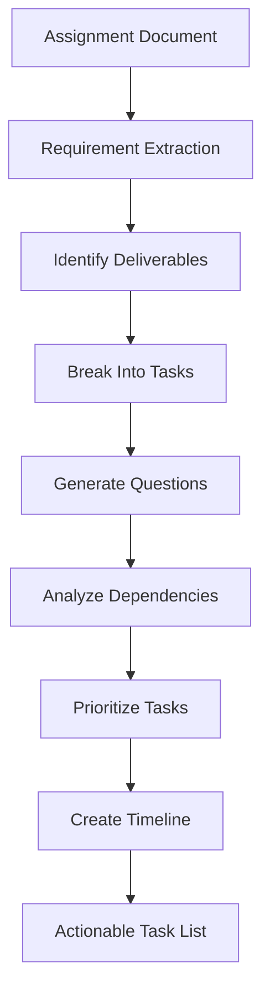
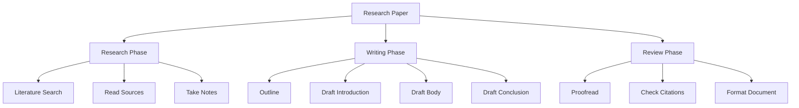
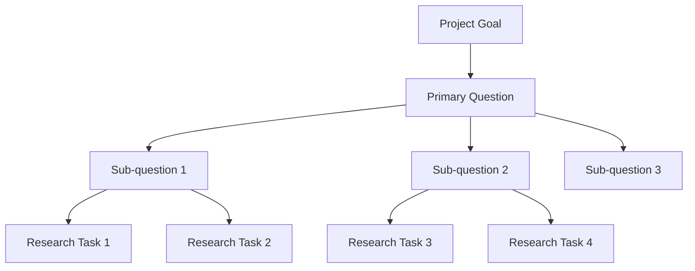
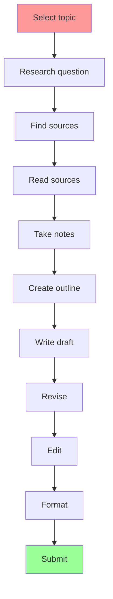
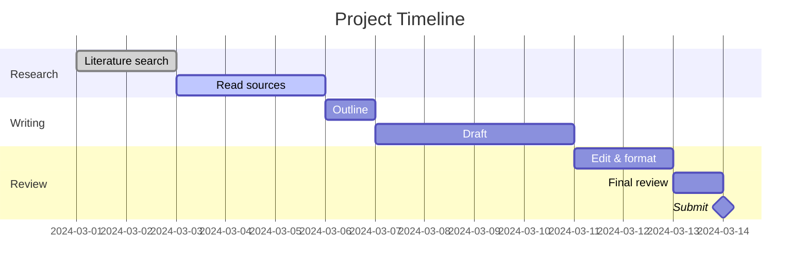

# Decomposing Project Tasks

Systematic approach to breaking down complex academic assignments into actionable, prioritized tasks with clear success criteria.

## What This Skill Does

Transforms overwhelming projects into structured task lists:

- **Requirement analysis**: Extract explicit and implicit requirements
- **Task decomposition**: Break into atomic, actionable items
- **Core question identification**: Find fundamental questions to answer
- **Information gap analysis**: Identify missing knowledge
- **Research question generation**: Create focused inquiry questions
- **Task prioritization**: MoSCoW, Eisenhower Matrix, dependency mapping

## Quick Start

### Analyze Requirements

```bash
node scripts/analyze-requirements.js assignment.txt requirements.json
```

### Generate Core Questions

```bash
node scripts/generate-questions.js requirements.json questions.md
```

### Prioritize Tasks

```bash
node scripts/prioritize-tasks.js tasks.json prioritized.json --method moscow
```

---

## Task Decomposition Workflow



---

## Requirement Analysis

### Extraction Patterns

**Explicit Requirements** (stated directly):
```
"Write a 10-page research paper on..."
"Include at least 5 academic sources"
"Due date: March 15, 2024"
```

**Implicit Requirements** (inferred):
```
"Research paper" → implies literature review, citations, formal writing
"Academic sources" → implies peer-reviewed journals, not blogs
"10 pages" → implies ~2500-3000 words, proper formatting
```

### Requirement Categories

```javascript
{
  deliverables: [
    {
      type: "research_paper",
      length: "10 pages",
      format: "APA",
      topic: "Machine Learning in Healthcare"
    }
  ],
  constraints: [
    { type: "deadline", value: "2024-03-15" },
    { type: "sources", value: "minimum 5 academic" },
    { type: "originality", value: "must be original research" }
  ],
  grading_criteria: [
    { aspect: "content", weight: 40 },
    { aspect: "research", weight: 30 },
    { aspect: "writing", weight: 20 },
    { aspect: "formatting", weight: 10 }
  ]
}
```

---

## Task Decomposition Strategies

### Work Breakdown Structure (WBS)



### Atomic Task Breakdown

**Large Task**: "Write research paper on ML in healthcare"

**Atomic Tasks**:
1. Define specific research question
2. Search Google Scholar for "machine learning healthcare"
3. Read abstract of 10 papers, select 5 most relevant
4. Read full text of selected papers
5. Create citation entries for sources
6. Outline paper structure (intro, 3 body sections, conclusion)
7. Write introduction (300 words)
8. Write body section 1 (600 words)
9. Write body section 2 (600 words)
10. Write body section 3 (600 words)
11. Write conclusion (300 words)
12. Add in-text citations
13. Create references page
14. Proofread and edit
15. Format according to APA guidelines

### SMART Task Criteria

Each task should be:
- **S**pecific: Clear action and outcome
- **M**easurable: Know when it's done
- **A**chievable: Can be completed
- **R**elevant: Contributes to goal
- **T**ime-bound: Has deadline

**Bad**: "Research the topic"
**Good**: "Read 5 peer-reviewed papers on ML in healthcare and take notes on key findings (2 hours)"

---

## Core Question Identification

### Question Hierarchy



### Question Types

**Foundational Questions** (must answer first):
- What is machine learning?
- How is ML used in healthcare?
- What are the main applications?

**Core Questions** (main investigation):
- How effective is ML for disease diagnosis?
- What are the limitations of ML in healthcare?
- What ethical concerns exist?

**Supporting Questions** (provide context):
- What datasets are used?
- How accurate are ML models?
- What regulations apply?

### Question Generation Framework

**Bloom's Taxonomy Levels**:

1. **Remember**: What is...? List the...
2. **Understand**: Explain... Describe...
3. **Apply**: How would you use...?
4. **Analyze**: What are the differences between...?
5. **Evaluate**: What is the best approach...?
6. **Create**: How would you design...?

**Example Progression**:
- Remember: What is machine learning?
- Understand: Explain how neural networks work
- Apply: How would you apply ML to diagnose diabetes?
- Analyze: Compare supervised vs unsupervised learning in healthcare
- Evaluate: Which ML approach is most effective for cancer detection?
- Create: Design an ML system for patient risk assessment

---

## Information Gap Analysis

### Gap Identification Matrix

| Required Knowledge | Current Level | Gap | Priority |
|-------------------|---------------|-----|----------|
| ML fundamentals | Beginner | Large | High |
| Healthcare domain | None | Complete | High |
| Python programming | Intermediate | Small | Medium |
| Statistics | Basic | Medium | High |
| Ethics in AI | None | Complete | Medium |

### Gap Filling Strategies

```javascript
const gaps = [
  {
    topic: "ML fundamentals",
    currentLevel: "beginner",
    targetLevel: "intermediate",
    actions: [
      "Read: 'Introduction to Machine Learning' chapters 1-3",
      "Watch: Andrew Ng's ML course lectures 1-5",
      "Practice: Complete 3 basic ML tutorials"
    ],
    estimatedTime: "8 hours"
  }
];
```

### Research Question Generation

**From Gaps**:
- Gap: Don't understand neural networks
- Question: How do neural networks process medical images?

**From Requirements**:
- Requirement: Discuss ethical implications
- Question: What privacy concerns arise from ML in healthcare?

**From Curiosity**:
- Interest: Real-world impact
- Question: What ML healthcare applications are FDA-approved?

---

## Task Prioritization Methods

### MoSCoW Method

**Must Have** (Critical for minimum viable submission):
- Complete required deliverables
- Meet word count and format requirements
- Submit by deadline
- Include minimum number of sources

**Should Have** (Important but not critical):
- Strong thesis statement
- Logical flow and organization
- Varied source types
- Proper grammar and style

**Could Have** (Nice to have if time permits):
- Additional supporting examples
- Graphs or visualizations
- Extended literature review
- Expert interviews

**Won't Have** (Explicitly out of scope):
- Original data collection (unless required)
- Building working ML models
- Comprehensive history of AI

### Eisenhower Matrix

```
                    URGENT              NOT URGENT
IMPORTANT     | Must do NOW          | Schedule
              | - Final proofread   | - Research
              | - Submit paper      | - Outline
              | - Fix citations     | - First draft
              |---------------------|-------------------
NOT IMPORTANT | Delegate/Minimize   | Eliminate
              | - Format tweaks     | - Perfectionism
              | - Minor edits       | - Tangential research
```

### Dependency Mapping



**Critical Path**: A → B → C → D → E → F → G → H → I → J → K

### Time-Based Prioritization

```javascript
const tasks = [
  {
    name: "Research sources",
    duration: 4,  // hours
    deadline: 10, // days from now
    urgency: (10 - 4/8) / 10 // = 0.95 (do soon)
  },
  {
    name: "Write draft",
    duration: 8,
    deadline: 5,
    urgency: (5 - 8/8) / 5 // = 0.8 (very urgent)
  }
];

// Sort by urgency
tasks.sort((a, b) => b.urgency - a.urgency);
```

---

## Estimation Techniques

### Time Estimation

**Bottom-up Estimation**:
```
Research (5 sources × 30 min each) = 2.5 hours
Note-taking = 1 hour
Outline = 0.5 hours
Writing (2500 words ÷ 250 words/hour) = 10 hours
Editing = 2 hours
Formatting = 1 hour
Buffer (20%) = 3.4 hours
---
Total: ~20 hours
```

**Three-Point Estimation**:
```
Optimistic: 15 hours
Most Likely: 20 hours
Pessimistic: 30 hours

Expected = (O + 4M + P) / 6 = (15 + 80 + 30) / 6 = 20.8 hours
```

### Complexity Assessment

**Low Complexity**:
- Clear requirements
- Familiar topic
- Ample time
- Resources available

**High Complexity**:
- Ambiguous requirements
- Unfamiliar topic
- Tight deadline
- Limited resources

---

## Task Templates

### Research Task Template

```markdown
## Task: [Task Name]

**Type**: Research
**Priority**: Must Have / Should Have / Could Have
**Estimated Time**: X hours
**Dependencies**: [List tasks that must be completed first]
**Due Date**: YYYY-MM-DD

### Objective
[What needs to be accomplished]

### Deliverable
[Specific output expected]

### Acceptance Criteria
- [ ] Criterion 1
- [ ] Criterion 2
- [ ] Criterion 3

### Resources Needed
- Resource 1
- Resource 2

### Questions to Answer
1. Question 1?
2. Question 2?

### Notes
[Additional context]
```

### Writing Task Template

```markdown
## Task: Write [Section Name]

**Word Count**: 500-600 words
**Estimated Time**: 2 hours
**Dependencies**: Research complete, outline approved

### Key Points to Cover
1. Point 1
2. Point 2
3. Point 3

### Structure
- Opening (50 words)
- Body (400 words)
- Closing (50 words)

### Sources to Cite
- [Source 1]
- [Source 2]

### Success Criteria
- [ ] Meets word count
- [ ] Covers all key points
- [ ] Includes citations
- [ ] Clear and logical flow
```

---

## Progress Tracking

### Task Status Board

```
TO DO           IN PROGRESS      REVIEW          DONE
--------        -----------      ------          ----
Research Q4     Write intro      Outline         Select topic
Find source 5   Take notes       Research Q1-3   Research plan
                                 Find sources
```

### Milestone Tracking



---

## Best Practices

### Decomposition Principles

1. **One action per task**: "Read Chapter 1" not "Read book"
2. **Clear verbs**: Read, Write, Analyze, Create, Submit
3. **Measurable outcomes**: Know when task is complete
4. **Appropriate granularity**: Not too large, not too small (30 min - 4 hours ideal)
5. **Independent tasks**: Can be done in any order when possible

### Avoiding Common Mistakes

**Too Vague**: "Work on paper"
**Better**: "Write introduction section (300 words)"

**Too Large**: "Complete research"
**Better**: "Read 5 papers and extract key quotes"

**No Success Criteria**: "Edit draft"
**Better**: "Proofread draft, fix grammar errors, verify all citations"

---

## Advanced Features

For detailed information:
- **Question Frameworks**: `resources/question-frameworks.md`
- **Decomposition Strategies**: `resources/decomposition-strategies.md`
- **Estimation Techniques**: `resources/estimation-guide.md`
- **Prioritization Methods**: `resources/prioritization-methods.md`

## References

- Work Breakdown Structure (WBS) methodology
- MoSCoW prioritization method
- Eisenhower Decision Matrix
- Bloom's Taxonomy for question generation
- Agile task decomposition principles

