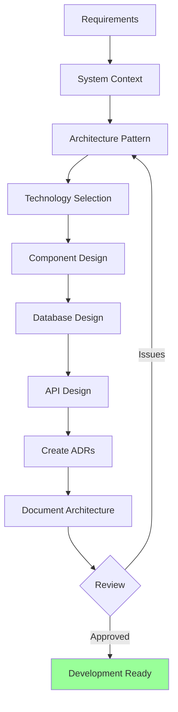
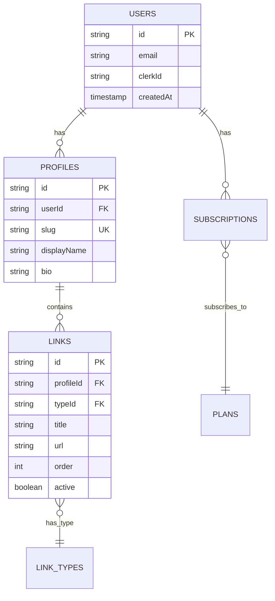

# Designing App Architecture

Comprehensive framework for designing scalable, maintainable application architecture from scratch.

## What This Skill Does

Transforms requirements into technical architecture:

- **System design patterns**: Monolith, microservices, serverless
- **Technology stack selection**: Framework, database, hosting evaluation
- **Database schema design**: Tables, relationships, indexes
- **API design**: RESTful, GraphQL, RPC patterns
- **Architecture Decision Records**: Document key decisions
- **Component design**: Separation of concerns, modularity

## Quick Start

### Generate Architecture Diagram

```bash
node scripts/generate-architecture-diagram.js requirements.json architecture.mmd
```

### Create ADR

```bash
node scripts/create-adr.js "Use Convex for backend" adrs/001-convex-backend.md
```

### Suggest Tech Stack

```bash
node scripts/suggest-tech-stack.js requirements.json tech-stack.md
```

---

## Architecture Design Workflow



---

## System Design Patterns

### Monolithic Architecture

**When to use**:
- Small to medium applications
- Simple deployment requirements
- Single team development
- Tight deadline (faster initial development)

**Pros**:
- Simple to develop and test
- Easy to deploy
- No network latency between components
- Easier to debug

**Cons**:
- Harder to scale
- Tight coupling
- Difficult to adopt new technologies
- Longer deployment times as app grows

**Example Stack**:
```
Frontend: Next.js (App Router)
Backend: Next.js API routes
Database: PostgreSQL
Hosting: Vercel
```

### Microservices Architecture

**When to use**:
- Large, complex applications
- Multiple teams
- Need to scale components independently
- Different technologies for different services

**Pros**:
- Independent scaling
- Technology flexibility
- Fault isolation
- Team autonomy

**Cons**:
- Complex deployment
- Network latency
- Data consistency challenges
- Higher operational overhead

**Example Stack**:
```
Frontend: Next.js
Auth Service: Clerk
API Gateway: Kong/Express
User Service: Node.js + MongoDB
Payment Service: Node.js + Stripe
Messaging: RabbitMQ
```

### Serverless Architecture

**When to use**:
- Variable/unpredictable traffic
- Event-driven workloads
- Low operational overhead required
- Cost optimization priority

**Pros**:
- Auto-scaling
- Pay per use
- No server management
- High availability

**Cons**:
- Cold start latency
- Vendor lock-in
- Debugging complexity
- Statelessness constraints

**Example Stack**:
```
Frontend: Next.js on Vercel
Backend: Convex (serverless functions + DB)
Auth: Clerk
Payments: Stripe
Storage: Convex File Storage
```

### Backend-as-a-Service (BaaS)

**When to use**:
- MVP/prototype development
- Startup with limited backend expertise
- Need to ship quickly
- Focus on frontend innovation

**Pros**:
- Rapid development
- Built-in features (auth, DB, real-time)
- Managed infrastructure
- Type-safe end-to-end

**Cons**:
- Platform lock-in
- Less control
- Cost at scale
- Limited customization

**Example Stack** (LinkWave pattern):
```
Frontend: Next.js
Backend: Convex (all-in-one)
Auth: Clerk
Payments: Stripe
Hosting: Vercel
```

---

## Technology Stack Selection

### Decision Matrix

```javascript
const criteria = {
  techFit: { weight: 0.25 },        // Matches requirements
  teamExpertise: { weight: 0.20 },  // Team knows it
  community: { weight: 0.15 },      // Support/libraries
  performance: { weight: 0.15 },    // Speed/efficiency
  scalability: { weight: 0.10 },    // Growth potential
  cost: { weight: 0.10 },           // Development + hosting
  documentation: { weight: 0.05 }   // Learning resources
};

const options = [
  {
    name: "Next.js + Convex",
    techFit: 9,
    teamExpertise: 8,
    community: 8,
    performance: 8,
    scalability: 9,
    cost: 9,
    documentation: 8
  },
  {
    name: "React + Node.js + PostgreSQL",
    techFit: 8,
    teamExpertise: 9,
    community: 10,
    performance: 7,
    scalability: 8,
    cost: 6,
    documentation: 9
  }
];

function calculateScore(option, criteria) {
  let total = 0;
  for (const [key, config] of Object.entries(criteria)) {
    total += option[key] * config.weight;
  }
  return total;
}
```

### Frontend Framework Comparison

| Framework | Best For | Learning Curve | Performance | Ecosystem |
|-----------|----------|----------------|-------------|-----------|
| **Next.js 14** | Full-stack apps | Medium | Excellent | Rich |
| **React** | SPAs | Medium | Good | Vast |
| **Vue** | Progressive enhancement | Easy | Good | Growing |
| **Svelte** | Performance-critical | Easy | Excellent | Smaller |

**Recommendation for most apps**: Next.js 14 with App Router

### Backend Framework Comparison

| Framework | Type | Best For | Complexity |
|-----------|------|----------|------------|
| **Convex** | BaaS | Rapid dev, real-time | Low |
| **Next.js API** | API Routes | Simple APIs | Low |
| **Express** | Framework | Custom APIs | Medium |
| **NestJS** | Framework | Enterprise | High |
| **tRPC** | RPC | Type-safe | Medium |

### Database Selection

**Relational (SQL)**:
```
PostgreSQL: General purpose, robust
MySQL: Web apps, read-heavy
SQLite: Embedded, simple apps
```

**Use when**:
- Complex relationships
- ACID transactions required
- Structured data
- Ad-hoc queries needed

**Document (NoSQL)**:
```
MongoDB: Flexible schemas
Convex: Real-time + queries
Firebase: Real-time sync
```

**Use when**:
- Flexible schema
- Rapid iteration
- Real-time updates
- Nested documents

**Key-Value**:
```
Redis: Caching, sessions
DynamoDB: High throughput
```

**Use when**:
- Simple lookups
- High performance
- Caching layer

### Hosting Platform Selection

| Platform | Best For | Pricing | DX |
|----------|----------|---------|-----|
| **Vercel** | Next.js | Free tier → $20/mo | Excellent |
| **Railway** | Full-stack | $5/mo → Usage | Good |
| **AWS** | Enterprise | Complex | Medium |
| **DigitalOcean** | VPS | $6/mo → $X | Medium |
| **Cloudflare** | Edge apps | Free → $X | Good |

---

## Component Architecture

### Layered Architecture

```
┌─────────────────────────────────────┐
│     Presentation Layer              │  Next.js pages/components
│     (UI, routing, state)            │
└─────────────────────────────────────┘
              ↓
┌─────────────────────────────────────┐
│     Application Layer               │  Business logic, use cases
│     (Services, hooks)               │
└─────────────────────────────────────┘
              ↓
┌─────────────────────────────────────┐
│     Domain Layer                    │  Entities, value objects
│     (Models, validation)            │
└─────────────────────────────────────┘
              ↓
┌─────────────────────────────────────┐
│     Data Layer                      │  Convex queries/mutations
│     (DB, APIs, external services)   │
└─────────────────────────────────────┘
```

### Component Organization (Next.js)

```
app/
├── (auth)/                 # Route group
│   ├── login/
│   └── signup/
├── (dashboard)/
│   ├── layout.tsx         # Nested layout
│   ├── page.tsx
│   └── settings/
│       └── page.tsx
├── api/                   # API routes
│   └── webhooks/
│       └── stripe/
│           └── route.ts
├── layout.tsx             # Root layout
└── page.tsx               # Home

components/
├── ui/                    # shadcn/ui components
│   ├── button.tsx
│   └── card.tsx
├── features/              # Feature-specific
│   ├── auth/
│   │   ├── LoginForm.tsx
│   │   └── SignupForm.tsx
│   └── dashboard/
│       └── Stats.tsx
└── shared/                # Shared components
    ├── Header.tsx
    └── Footer.tsx

lib/
├── utils.ts               # Utility functions
├── validations.ts         # Zod schemas
└── hooks/                 # Custom hooks
    └── useUser.ts

convex/
├── schema.ts              # Database schema
├── auth.ts                # Auth functions
├── users.ts               # User queries/mutations
└── _generated/            # Auto-generated types
```

---

## Database Schema Design

### Entity-Relationship Modeling



### Normalization Guidelines

**1NF (First Normal Form)**:
- Atomic values (no arrays in single field)
- Each column has unique name
- Order doesn't matter

**2NF (Second Normal Form)**:
- Must be in 1NF
- No partial dependencies on composite key

**3NF (Third Normal Form)**:
- Must be in 2NF
- No transitive dependencies

**Example**:

❌ **Denormalized** (avoid unless intentional):
```javascript
{
  orderId: "123",
  customerName: "John",
  customerEmail: "john@example.com",
  items: "Book,Pen,Notebook",  // Array in string
  prices: "10,2,5"
}
```

✅ **Normalized**:
```javascript
// Orders table
{ orderId: "123", customerId: "456" }

// Customers table
{ customerId: "456", name: "John", email: "john@example.com" }

// OrderItems table
{ orderId: "123", itemId: "789", price: 10 }
{ orderId: "123", itemId: "790", price: 2 }
{ orderId: "123", itemId: "791", price: 5 }
```

### Index Strategy

**When to index**:
- Primary keys (automatic)
- Foreign keys (always)
- Columns in WHERE clauses
- Columns in JOIN conditions
- Columns in ORDER BY
- Unique constraints

**When NOT to index**:
- Small tables (< 1000 rows)
- Columns with low cardinality (few distinct values)
- Frequently updated columns
- Rarely queried columns

**Convex index example**:
```typescript
.index("by_user", ["userId"])
.index("by_slug", ["slug"])
.index("by_user_created", ["userId", "_creationTime"])
.searchIndex("search_profiles", {
  searchField: "displayName",
  filterFields: ["userId"]
})
```

---

## API Design

### RESTful API Patterns

**Resource naming**:
```
GET    /api/users           # List users
POST   /api/users           # Create user
GET    /api/users/:id       # Get user
PATCH  /api/users/:id       # Update user
DELETE /api/users/:id       # Delete user

GET    /api/users/:id/posts # Nested resources
```

**Response format**:
```typescript
// Success
{
  "data": { /* resource */ },
  "meta": {
    "timestamp": "2024-01-01T00:00:00Z"
  }
}

// Error
{
  "error": {
    "code": "INVALID_INPUT",
    "message": "Email is required",
    "details": {
      "field": "email",
      "issue": "required"
    }
  }
}
```

### GraphQL Patterns

**Schema design**:
```graphql
type User {
  id: ID!
  email: String!
  profile: Profile
  posts: [Post!]!
}

type Profile {
  id: ID!
  userId: ID!
  displayName: String!
  bio: String
}

type Query {
  user(id: ID!): User
  users(limit: Int, offset: Int): [User!]!
}

type Mutation {
  createUser(input: CreateUserInput!): User!
  updateProfile(id: ID!, input: UpdateProfileInput!): Profile!
}
```

### tRPC Patterns (Type-safe)

```typescript
export const appRouter = router({
  user: {
    get: publicProcedure
      .input(z.object({ id: z.string() }))
      .query(async ({ input }) => {
        return await db.user.findUnique({ where: { id: input.id } });
      }),

    create: publicProcedure
      .input(z.object({
        email: z.string().email(),
        name: z.string()
      }))
      .mutation(async ({ input }) => {
        return await db.user.create({ data: input });
      })
  }
});
```

---

## Architecture Decision Records (ADRs)

### ADR Template

```markdown
# ADR-[NUMBER]: [Title]

**Date**: [YYYY-MM-DD]
**Status**: [Proposed / Accepted / Deprecated / Superseded by ADR-XXX]
**Deciders**: [Names]

## Context

[Describe the forces at play: technical, business, project constraints]

## Decision

[The change we're proposing or have agreed to implement]

## Consequences

### Positive
- [Good consequence 1]
- [Good consequence 2]

### Negative
- [Bad consequence 1]
- [Mitigation for bad consequence]

### Neutral
- [Other effects]

## Alternatives Considered

### Option 1: [Alternative]
**Pros**: [Benefits]
**Cons**: [Drawbacks]
**Why rejected**: [Reason]

### Option 2: [Alternative]
**Pros**: [Benefits]
**Cons**: [Drawbacks]
**Why rejected**: [Reason]

## References
- [Link to discussion]
- [Related documentation]
```

### Example ADR

```markdown
# ADR-001: Use Convex for Backend

**Date**: 2024-01-15
**Status**: Accepted
**Deciders**: Technical Lead, CTO

## Context

We need a backend solution for a real-time task management app. Requirements:
- Real-time data synchronization
- Type-safe client-server communication
- Rapid development (3-month timeline)
- Small team (2 developers)
- Scalable to 10k users initially

## Decision

Use Convex as all-in-one backend (database + functions + real-time + files).

## Consequences

### Positive
- One platform for DB + backend + real-time (reduces complexity)
- Type-safe end-to-end (TypeScript everywhere)
- No separate backend repository/deployment
- Built-in real-time subscriptions
- Serverless scaling
- Fast development velocity

### Negative
- Platform lock-in (harder to migrate later)
- Less control over infrastructure
- Pricing may increase at scale
- Smaller community than PostgreSQL/MongoDB

### Neutral
- Team needs to learn Convex (estimated 1 week)
- Convex patterns differ from traditional REST APIs

## Alternatives Considered

### Option 1: Next.js API Routes + PostgreSQL + Prisma
**Pros**: Mature ecosystem, full control, easy to hire for
**Cons**: More boilerplate, manual real-time setup, more moving parts
**Why rejected**: Real-time is critical and would require WebSocket setup

### Option 2: Firebase
**Pros**: Real-time built-in, generous free tier
**Cons**: NoSQL only, less type-safety, complex security rules
**Why rejected**: Prefer TypeScript type-safety and relational queries

## References
- Convex docs: https://docs.convex.dev
- Team decision doc: [link]
```

---

## Best Practices

### Architecture Principles

**SOLID Principles**:
- **S**ingle Responsibility: One reason to change
- **O**pen/Closed: Open for extension, closed for modification
- **L**iskov Substitution: Subtypes must be substitutable
- **I**nterface Segregation: Many specific interfaces > one general
- **D**ependency Inversion: Depend on abstractions

**DRY**: Don't Repeat Yourself
**KISS**: Keep It Simple, Stupid
**YAGNI**: You Aren't Gonna Need It

### Scalability Considerations

**Horizontal vs Vertical Scaling**:
```
Vertical (scale up): Add more CPU/RAM to server
  - Simpler
  - Limited by hardware
  - Single point of failure

Horizontal (scale out): Add more servers
  - More complex
  - Unlimited potential
  - Requires load balancing
```

**Caching Strategy**:
```
L1: Browser cache (assets)
L2: CDN (static files)
L3: Application cache (Redis)
L4: Database cache (query cache)
```

### Security Architecture

**Defense in Depth**:
```
1. Network: HTTPS, firewall, DDoS protection
2. Application: Input validation, auth, CSRF protection
3. Data: Encryption at rest, encrypted backups
4. Access: RBAC, principle of least privilege
```

---

## Advanced Topics

For detailed information:
- **Architecture Patterns**: `resources/architecture-patterns.md`
- **Tech Stack Guide**: `resources/tech-stack-guide.md`
- **ADR Templates**: `resources/adr-template.md`
- **Database Design**: `resources/database-design.md`
- **API Design Principles**: `resources/api-design.md`

## References

- Clean Architecture (Robert C. Martin)
- Domain-Driven Design (Eric Evans)
- Building Microservices (Sam Newman)
- ADR documentation: https://adr.github.io
- AWS Well-Architected Framework

