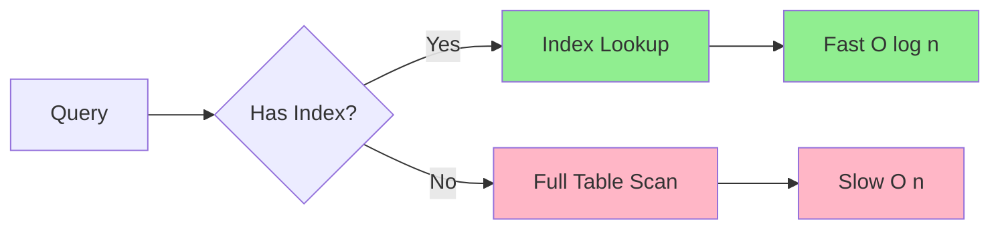
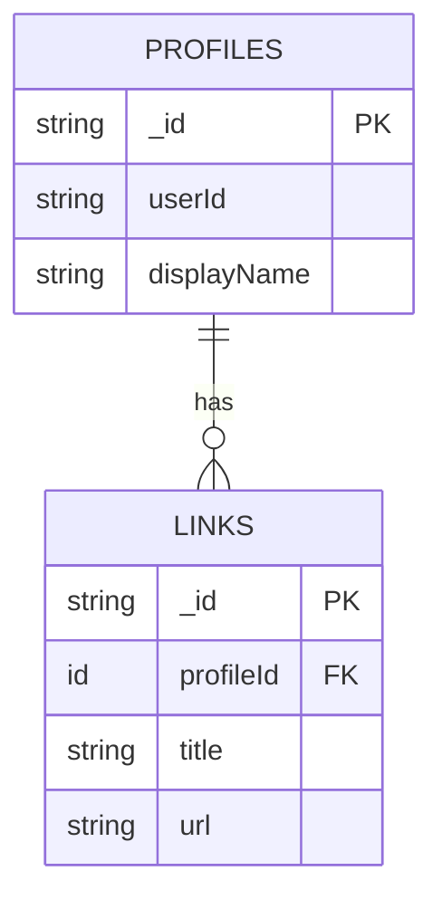

# Designing Convex Schemas

Comprehensive guide for creating type-safe Convex database schemas with validators, indexes, and relationships.

## Quick Start

### Basic Schema Structure

```typescript
import { defineSchema, defineTable } from "convex/server";
import { v } from "convex/values";

export default defineSchema({
  profiles: defineTable({
    userId: v.string(),
    slug: v.string(),
    displayName: v.string(),
    bio: v.optional(v.string()),
  })
    .index("by_user", ["userId"])
    .index("by_slug", ["slug"]),
});
```

## Common Validators

### Primitive Types
```typescript
v.string()          // String values
v.number()          // Numbers (int or float)
v.boolean()         // Boolean true/false
v.null()            // Null value
v.id("tableName")   // Reference to another table
```

### Optional and Nullable
```typescript
v.optional(v.string())           // string | undefined
v.union(v.string(), v.null())    // string | null
v.union(v.string(), v.null(), v.number())  // string | null | number
```

### Collections
```typescript
v.array(v.string())              // string[]
v.array(v.object({               // Array of objects
  title: v.string(),
  value: v.number(),
}))
```

### Objects
```typescript
v.object({
  field1: v.string(),
  field2: v.number(),
  nested: v.object({
    deep: v.boolean(),
  }),
})
```

### Literals and Unions
```typescript
// Enum-like types
v.union(
  v.literal("ACTIVE"),
  v.literal("INACTIVE"),
  v.literal("PENDING")
)

// Mixed type unions
v.union(v.string(), v.number())
```

### Record Objects
```typescript
v.record(v.string(), v.boolean())  // { [key: string]: boolean }
v.record(v.string(), v.any())      // { [key: string]: any }
```

## Index Patterns

### Single Field Index
```typescript
.index("by_slug", ["slug"])
.index("by_user", ["userId"])
```

### Compound Index
**Order matters!** Fields must be queried in index order.

```typescript
// Good: Can query by userId, or userId+timestamp
.index("by_user_time", ["userId", "timestamp"])

// Usage: ctx.db.query("table").withIndex("by_user_time", q =>
//   q.eq("userId", userId).gt("timestamp", startTime)
// )
```

**Index Query Flow:**


### Search Index
```typescript
.searchIndex("search_profiles", {
  searchField: "displayName",
  filterFields: ["userId", "isActive"],
})

// Usage: ctx.db.query("profiles").withSearchIndex("search_profiles", q =>
//   q.search("searchField", "john").eq("isActive", true)
// )
```

## Relationship Patterns

### One-to-Many
```typescript
export default defineSchema({
  profiles: defineTable({
    userId: v.string(),
    displayName: v.string(),
  })
    .index("by_user", ["userId"]),

  links: defineTable({
    profileId: v.id("profiles"),  // Foreign key
    title: v.string(),
    url: v.string(),
  })
    .index("by_profile", ["profileId"]),
});
```

**Schema Relationships Diagram:**


### Circular References
Make one reference nullable to allow sequential creation:

```typescript
users: defineTable({
  name: v.string(),
  preferencesId: v.union(v.id("preferences"), v.null()),
}),
preferences: defineTable({
  userId: v.union(v.id("users"), v.null()),
  theme: v.string(),
}),
```

## Polymorphic Patterns

### Discriminated Unions in Tables
```typescript
links: defineTable({
  profileId: v.id("profiles"),
  type: v.union(
    v.literal("URL"),
    v.literal("EMAIL"),
    v.literal("TIMER")
  ),
  title: v.string(),

  // Type-specific fields (all optional)
  url: v.optional(v.string()),
  email: v.optional(v.string()),
  startDate: v.optional(v.number()),
  endDate: v.optional(v.number()),
})
  .index("by_profile", ["profileId"])
  .index("by_type", ["type"]),
```

## Automatic Fields

Every document automatically includes:
- `_id`: Generated document ID
- `_creationTime`: Timestamp (milliseconds since epoch)

Add `_updatedTime` manually if needed:

```typescript
profiles: defineTable({
  // ... fields
  _updatedTime: v.optional(v.number()),
}),

// In mutation
await ctx.db.patch(profileId, {
  ...updates,
  _updatedTime: Date.now(),
});
```

## TypeScript Integration

### Generated Types
```typescript
import { Doc, Id } from "../convex/_generated/dataModel";

// Document type
type Profile = Doc<"profiles">;

// ID type
type ProfileId = Id<"profiles">;

// Use in functions
function displayProfile(profile: Doc<"profiles">) {
  console.log(profile.displayName);
}
```

### Type Inference
```typescript
// Infer types from validators
const profileValidator = v.object({
  displayName: v.string(),
  bio: v.optional(v.string()),
});

// TypeScript knows the shape
type ProfileData = {
  displayName: string;
  bio?: string;
};
```

## Best Practices

1. **Always index query fields**: If you filter by it, create an index
2. **Use compound indexes carefully**: Order matters for query efficiency
3. **Prefer `_creationTime`**: Built-in, no manual tracking needed
4. **Add `_updatedTime` manually**: Not automatic, update explicitly
5. **Use `v.id()` for references**: Type-safe foreign keys
6. **Keep schemas explicit**: Avoid `v.any()` when possible
7. **Plan for growth**: Consider staged indexes for large tables
8. **Document complex types**: Add comments for polymorphic patterns

## Query Optimization

### Index Selection
```typescript
// Efficient: Uses index
ctx.db.query("profiles")
  .withIndex("by_user", q => q.eq("userId", userId))
  .collect()

// Inefficient: Full table scan
ctx.db.query("profiles")
  .filter(q => q.eq(q.field("userId"), userId))
  .collect()
```

### Compound Index Usage
```typescript
// Index: ["userId", "timestamp"]

// ✅ Good: Queries in order
.withIndex("by_user_time", q =>
  q.eq("userId", userId).gt("timestamp", start)
)

// ❌ Bad: Skips userId
.withIndex("by_user_time", q =>
  q.gt("timestamp", start)  // Compile error!
)
```

## Validation

Schema validation runs on:
- `db.insert()`
- `db.patch()`
- `db.replace()`

Disable validation (not recommended):
```typescript
export default defineSchema({
  // ... tables
}, { schemaValidation: false });
```

## Advanced Patterns

For complex patterns including schema migrations, staged indexes, and advanced TypeScript patterns, see:
- `resources/advanced-patterns.md`
- `resources/convex-types.md`

For complete validator reference and examples:
- `scripts/validators-reference.ts`
- `scripts/index-patterns.ts`

