# Convex Schema Architecture Diagrams

Comprehensive visual guide to understanding Convex database schemas, relationships, and query patterns.

## Full LinkWave Schema Architecture

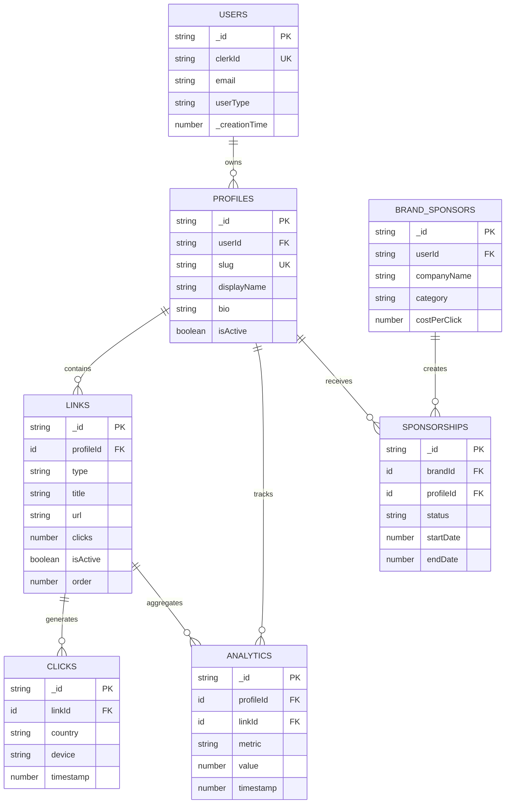

## Index Strategy Flow

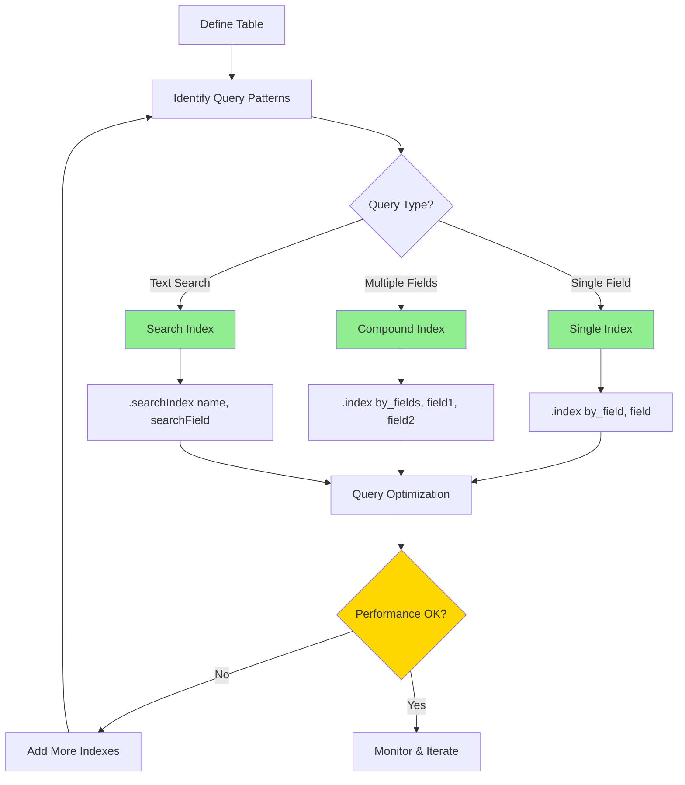

## Compound Index Query Paths

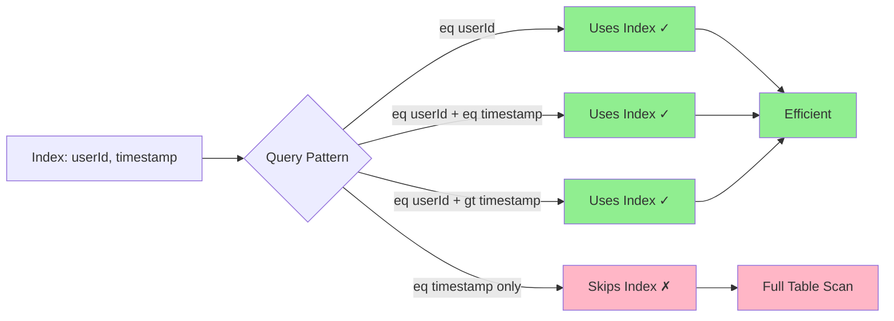

## Data Flow: Create Profile with Links

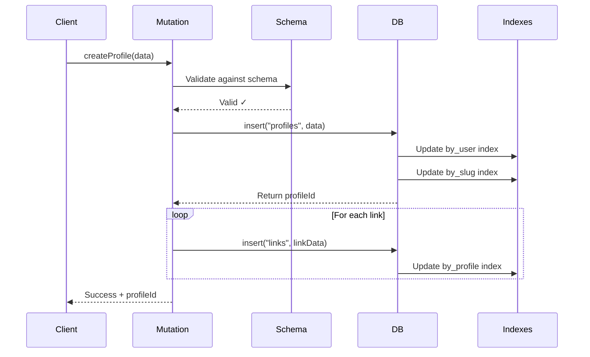

## Polymorphic Links Pattern

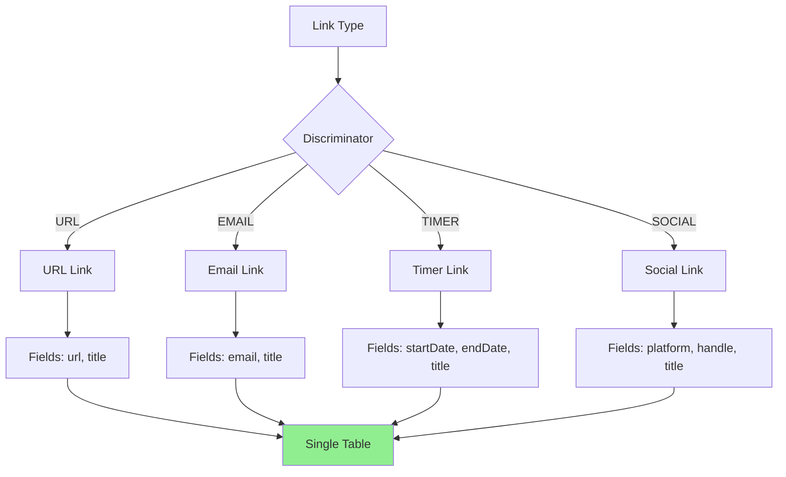

## Schema Validation Pipeline

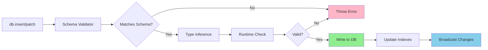

## Index Performance Comparison

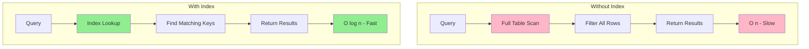

## Schema Evolution Strategy

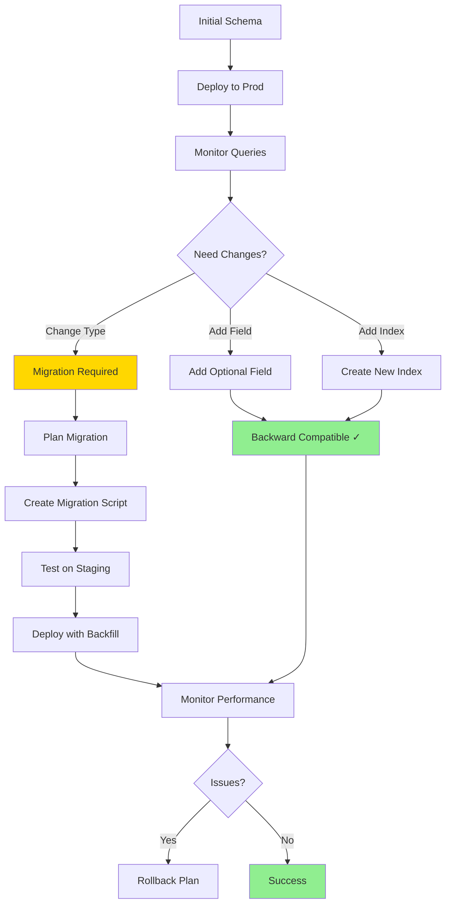

## Type Safety Flow

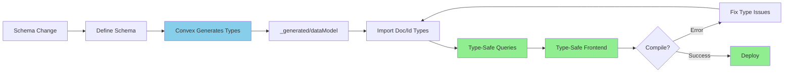

## Search Index Architecture

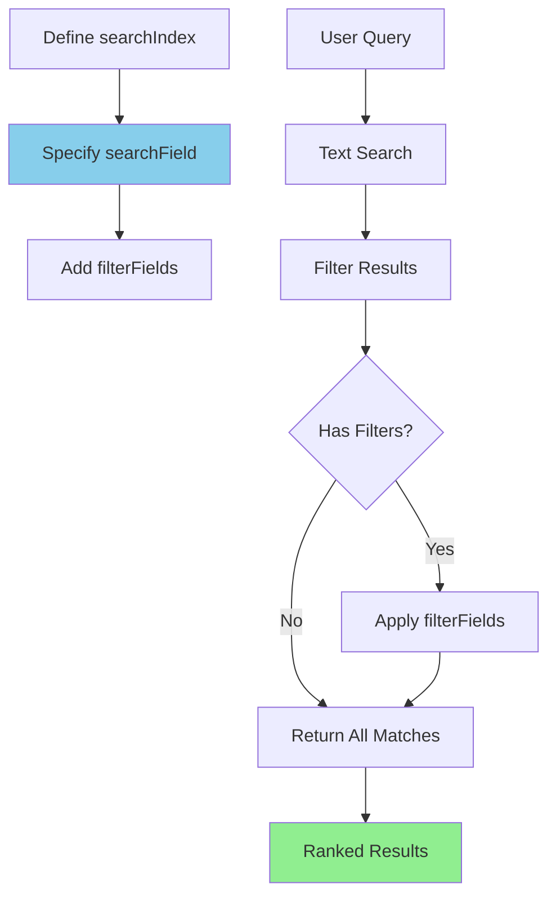

## Best Practices Decision Tree

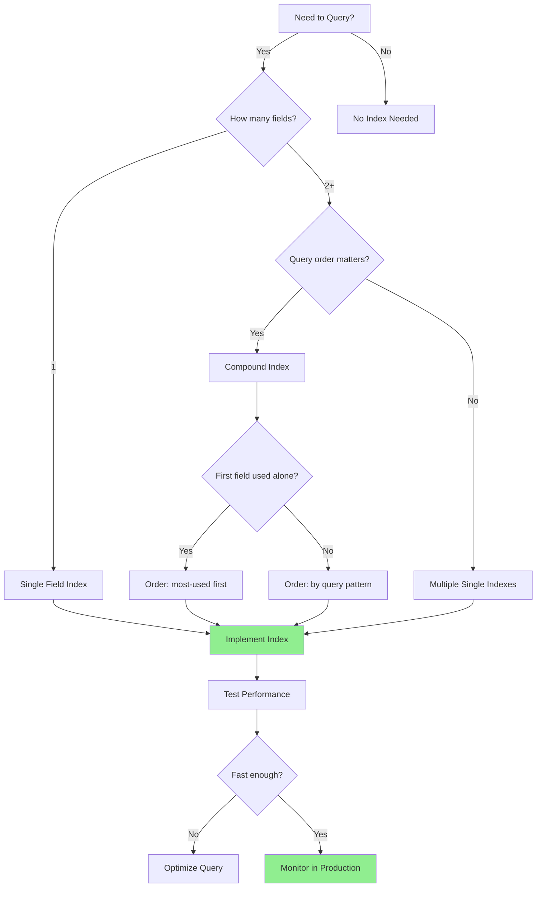

## Real-World Example: Analytics System

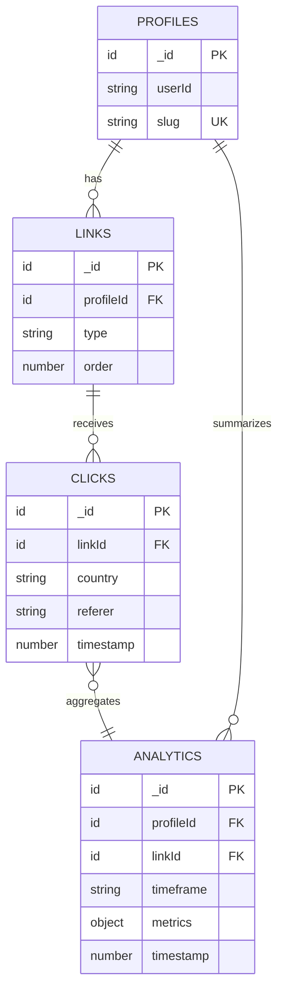

**Indexes Required:**
```typescript
clicks: defineTable({...})
  .index("by_link_time", ["linkId", "timestamp"])
  .index("by_country", ["country"])

analytics: defineTable({...})
  .index("by_profile_time", ["profileId", "timeframe", "timestamp"])
  .index("by_link_time", ["linkId", "timeframe", "timestamp"])
```

## Circular Reference Resolution

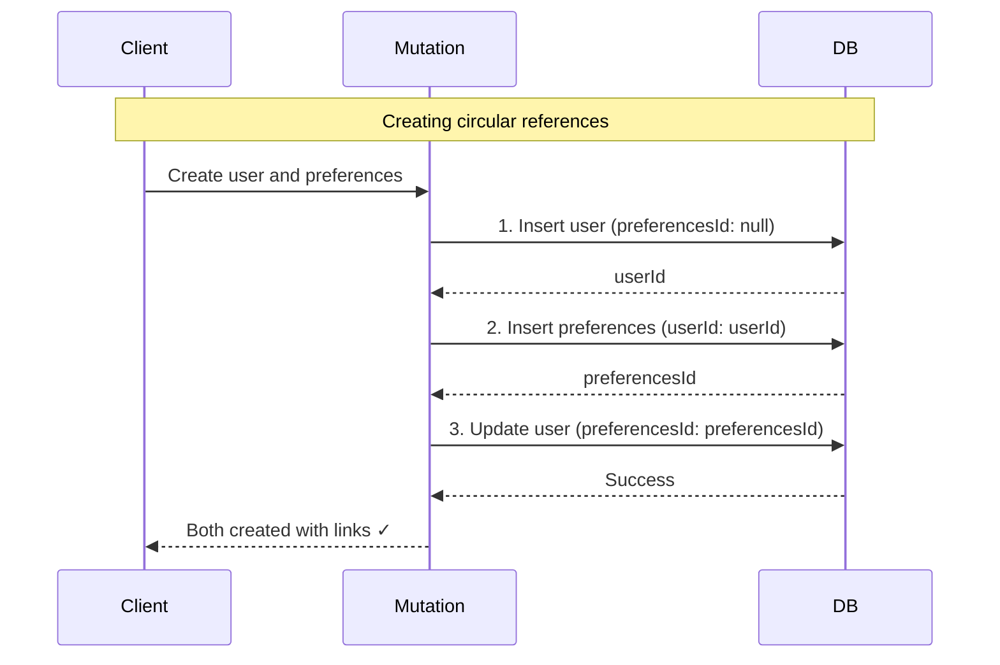

## Query Optimization Workflow

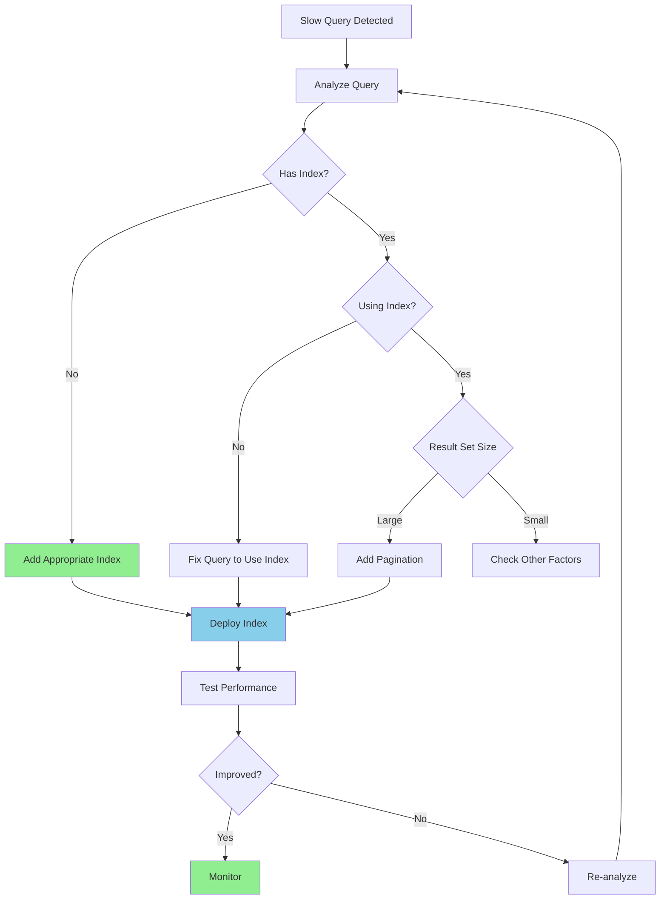

