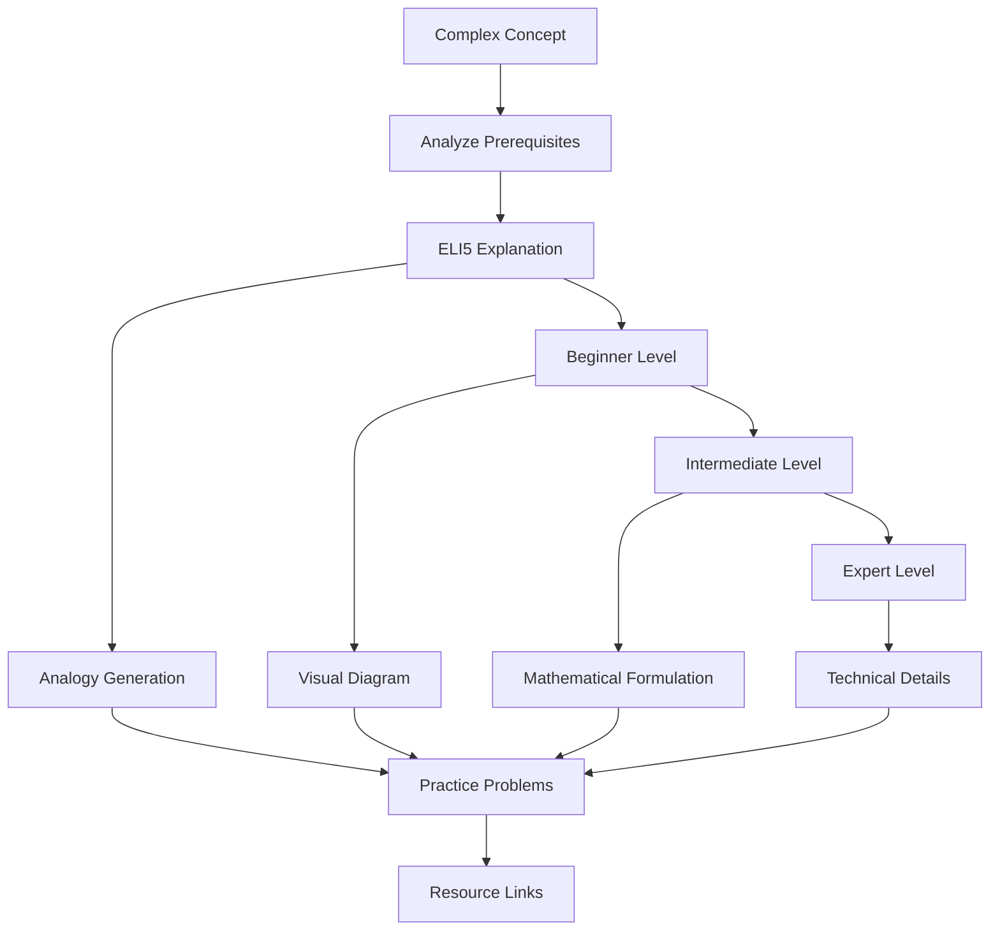
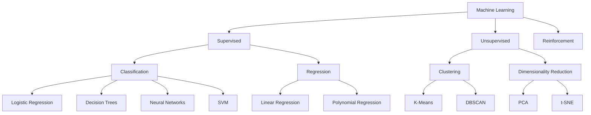
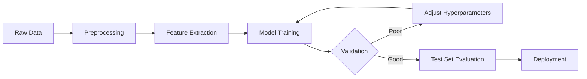
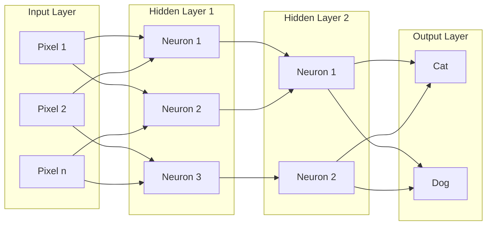
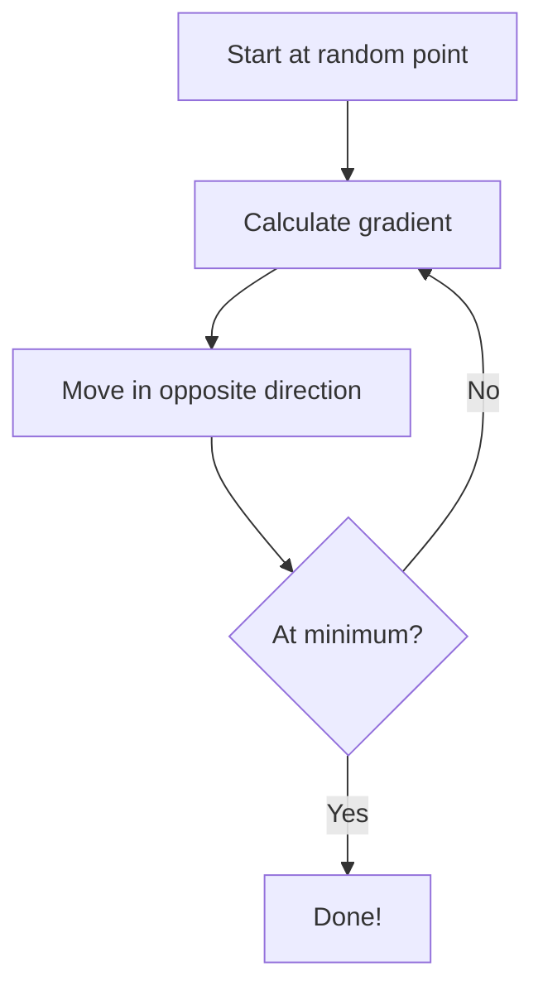

# Explaining Complex Concepts

Multi-layered explanation system that adapts to your knowledge level and uses diverse teaching methods for deep conceptual understanding.

## What This Skill Does

Creates comprehensive explanations through multiple modalities:

- **Progressive complexity**: ELI5 → Beginner → Intermediate → Expert
- **Visual diagrams**: Mermaid flowcharts, concept maps, ASCII diagrams
- **Real-world analogies**: Relatable comparisons for abstract concepts
- **Multiple representations**: Text, visual, mathematical, procedural
- **Practice problems**: Graduated difficulty exercises
- **Resource curation**: Web articles, videos, interactive tools

## Quick Start

### Generate Multi-Level Explanation

```bash
node scripts/generate-explanation.js "neural networks" explanation.md
```

### Create Analogy

```bash
node scripts/create-analogy.js "quantum superposition" analogy.md
```

### Find Resources

```bash
node scripts/find-resources.js "machine learning" resources.json
```

---

## Progressive Explanation Workflow



---

## Progressive Complexity Levels

### ELI5 (Explain Like I'm 5)

**Example: Neural Networks**

> Imagine your brain is like a big team of helpers. Each helper has a special job - some recognize colors, some recognize shapes, and some recognize sounds. When you see a cat, all these helpers work together. The color helper says "I see orange!" The shape helper says "I see pointy ears!" The sound helper says "I hear meowing!" All the helpers vote together and decide "This is a cat!"
>
> A neural network is like this team of helpers in a computer. It learns by practicing a lot, just like you learned to recognize cats by seeing many cats.

**Characteristics**:
- Simple vocabulary (no jargon)
- Concrete, familiar examples
- Everyday analogies
- Short sentences
- Story-like narrative

---

### Beginner Level

**Example: Neural Networks**

> A neural network is a computer program inspired by how our brains work. It consists of layers of connected nodes (called "neurons"). Each connection has a "weight" that determines how important it is.
>
> Here's how it learns:
> 1. **Input**: You give it data (like a picture of a cat)
> 2. **Processing**: The network processes this through multiple layers
> 3. **Output**: It makes a guess ("This is a cat")
> 4. **Learning**: If wrong, it adjusts the weights to improve
>
> Through thousands of examples, the network learns to recognize patterns. It's like learning to ride a bike - you fall at first, but your brain adjusts until you get it right.

**Characteristics**:
- Introduces key terms with explanations
- Step-by-step process
- Simple analogies still present
- Basic cause-and-effect
- Visual aids helpful

---

### Intermediate Level

**Example: Neural Networks**

> Neural networks are computational models organized in interconnected layers:
>
> **Architecture**:
> - **Input Layer**: Receives raw data (pixels, numbers, text)
> - **Hidden Layers**: Extract progressively abstract features
> - **Output Layer**: Produces final prediction
>
> **Learning Process (Backpropagation)**:
> 1. **Forward Pass**: Data flows through network, producing prediction
> 2. **Loss Calculation**: Compare prediction to actual answer using loss function
> 3. **Backward Pass**: Calculate gradients of loss with respect to each weight
> 4. **Weight Update**: Adjust weights using gradient descent: `w = w - α∇L`
>
> **Key Concepts**:
> - **Activation Functions**: Introduce non-linearity (ReLU, sigmoid, tanh)
> - **Learning Rate (α)**: Controls size of weight updates
> - **Overfitting**: Network memorizes training data instead of learning patterns
>
> Neural networks excel at pattern recognition but require substantial training data and computational resources.

**Characteristics**:
- Technical terminology defined
- Mathematical notation introduced
- Multiple layers of detail
- Discusses trade-offs and limitations
- Assumes some background knowledge

---

### Expert Level

**Example: Neural Networks**

> Neural networks are differentiable parametric functions approximating arbitrary mappings f: ℝⁿ → ℝᵐ through composition of affine transformations and non-linear activations:
>
> `h₁ = σ(W₁x + b₁)`
> `h₂ = σ(W₂h₁ + b₂)`
> `ŷ = Wₙhₙ₋₁ + bₙ`
>
> **Optimization**: Minimize empirical risk via stochastic gradient descent:
> `θₜ₊₁ = θₜ - ηₜ∇ℒ(fθₜ(xᵢ), yᵢ)`
>
> **Universal Approximation**: A feedforward network with single hidden layer containing finite neurons can approximate any continuous function on compact subsets of ℝⁿ (Cybenko, 1989).
>
> **Generalization**: Bound on test error derives from:
> - Rademacher complexity of hypothesis class
> - VC dimension considerations
> - PAC learning framework
>
> **Modern Architectures**:
> - **CNNs**: Leverage spatial invariance via convolution operators
> - **RNNs/LSTMs**: Model temporal dependencies through recurrent connections
> - **Transformers**: Attention mechanisms: `Attention(Q,K,V) = softmax(QKᵀ/√dₖ)V`
>
> Critical challenges include vanishing/exploding gradients, mode collapse (GANs), adversarial robustness, and theoretical understanding of deep network optimization landscapes.

**Characteristics**:
- Assumes deep technical knowledge
- Mathematical rigor
- References to literature
- Discusses open research questions
- Minimal hand-holding

---

## Visual Explanation Methods

### Concept Hierarchy Diagram



### Process Flow Diagram



### System Architecture Diagram



### ASCII Diagrams (for simple concepts)

```
Neural Network Layer:

Input     Weights    Hidden     Output
  x1 -----> w1 -----> h1 -----> y1
          /    \    /    \    /
  x2 ----/      \--/      \--/
        /        /\        \
  x3 --/        /  \        \-> y2
               w2   w3

Forward Pass: h = σ(Wx + b)
Backward Pass: ∇W = ∂L/∂W
```

---

## Analogy Library

### Computer Science Analogies

**RAM vs Storage**:
> **RAM** is like your desk - limited space, but you can access things quickly. **Storage** (hard drive) is like filing cabinets - lots of space, but slower to retrieve.

**Recursion**:
> Imagine Russian nesting dolls. Opening one reveals a smaller version inside. Recursion is when a problem contains a smaller version of itself, until you reach the smallest doll (base case).

**API (Application Programming Interface)**:
> An API is like a restaurant menu. You don't need to know how the kitchen prepares food (implementation). You just order from the menu (API), and food arrives. The menu provides a simple interface to complex cooking processes.

**Pointers** (Programming):
> A pointer is like a house address. Instead of carrying the entire house around, you just write down "123 Main St." The address (pointer) tells you where to find the house (data) when you need it.

---

### Mathematics Analogies

**Derivatives**:
> A derivative tells you how fast something is changing, like a car's speedometer. Position is like distance traveled, and velocity (derivative of position) tells you how quickly your position is changing right now.

**Integration**:
> If derivatives are speedometers, integrals are odometers. If you know your speed at every moment during a trip, integration adds up all those speeds to tell you total distance traveled.

**Probability**:
> Probability is like weather forecasting. "70% chance of rain" doesn't mean it will rain for 70% of the day. It means that in similar conditions in the past, it rained 7 out of 10 times.

**Logarithms**:
> Logarithms answer: "How many times do I multiply to get this number?" If 2³ = 8, then log₂(8) = 3. It's like asking "How many times did I fold this paper to get 8 layers?"

---

### Physics Analogies

**Quantum Superposition**:
> Imagine a coin spinning in the air. While spinning, it's neither heads nor tails - it's both. Only when it lands (measurement) does it become one or the other. Quantum particles exist in multiple states until observed.

**Entropy**:
> Entropy is like messiness. A clean room (low entropy) naturally becomes messy over time (high entropy). It takes energy to clean it again. The universe tends toward maximum entropy, like your room tends toward maximum mess.

**Electric Current**:
> Electric current is like water flowing through pipes. Voltage is the water pressure, current is the flow rate, and resistance is pipe narrowness. More pressure or wider pipes means more flow.

---

## Multiple Representation Strategy

**Concept: Gradient Descent**

**Text Explanation**:
> Gradient descent is an optimization algorithm that iteratively moves toward a minimum by following the negative gradient (steepest descent direction).

**Visual Diagram**:


**Mathematical Formulation**:
> `θₜ₊₁ = θₜ - α∇J(θₜ)`
> where α is learning rate and ∇J is gradient of cost function

**Analogy**:
> Imagine you're hiking down a mountain in fog (can't see the bottom). At each step, you feel which direction is steepest downward and take a step that way. Repeat until you reach flat ground (minimum).

**Code Example**:
```python
def gradient_descent(f, df, x0, learning_rate=0.01, iterations=100):
    x = x0
    for _ in range(iterations):
        gradient = df(x)  # Calculate gradient
        x = x - learning_rate * gradient  # Update position
    return x
```

**Practice Problem**:
> Find the minimum of f(x) = x² using gradient descent starting from x=5. Show 3 iterations with learning rate α=0.1.

---

## Practice Problem Generation

### Difficulty Progression

**Level 1 - Recognition**:
> Which of these is NOT a supervised learning algorithm?
> A) Linear Regression  B) K-Means  C) Logistic Regression  D) Decision Tree

**Level 2 - Application**:
> Given a dataset with 1000 samples and 2 features, sketch what a decision tree might look like for binary classification.

**Level 3 - Analysis**:
> A neural network achieves 99% training accuracy but only 70% test accuracy. What problem is this? Suggest three solutions.

**Level 4 - Synthesis**:
> Design a machine learning system to detect fraudulent credit card transactions. Specify: data needed, algorithm choice, evaluation metrics, and potential challenges.

---

## Resource Curation Strategy

### Resource Types by Learning Style

**Visual Learners**:
- YouTube explanations (3Blue1Brown, StatQuest)
- Interactive visualizations (Distill.pub)
- Infographics and diagrams

**Reading Learners**:
- Textbooks and papers
- Blog posts and tutorials
- Documentation

**Hands-On Learners**:
- Jupyter notebooks
- Interactive coding environments (Colab)
- Practice problems and projects

**Auditory Learners**:
- Podcasts
- Lecture recordings
- Audiobook versions

### Quality Criteria

**Trustworthy Sources**:
- ✅ Educational institutions (.edu)
- ✅ Peer-reviewed publications
- ✅ Established experts in field
- ✅ Well-maintained documentation
- ❌ Random blogs without credentials
- ❌ Outdated content (>5 years for tech)

---

## Explanation Frameworks

### Feynman Technique

1. **Choose concept**: Select what to explain
2. **Teach it simple**: Explain as if teaching a child
3. **Identify gaps**: Where did explanation break down?
4. **Review & simplify**: Fill gaps, simplify language
5. **Use analogies**: Create relatable comparisons

### Bloom's Taxonomy Progression

**Remember**: Define neural network
**Understand**: Explain how neural network learns
**Apply**: Use neural network to classify images
**Analyze**: Compare neural network to decision tree
**Evaluate**: Assess when neural network is best choice
**Create**: Design neural network architecture for problem

---

## Advanced Features

For detailed information:
- **Analogy Library**: `resources/analogy-library.md`
- **Explanation Frameworks**: `resources/explanation-frameworks.md`
- **Visual Patterns**: `resources/visual-explanation-patterns.md`
- **Practice Problem Bank**: `resources/practice-problems.md`

## References

- Feynman Technique for learning
- Dual Coding Theory (Paivio)
- Cognitive Load Theory (Sweller)
- Bloom's Taxonomy for knowledge levels
- Analogical reasoning research

