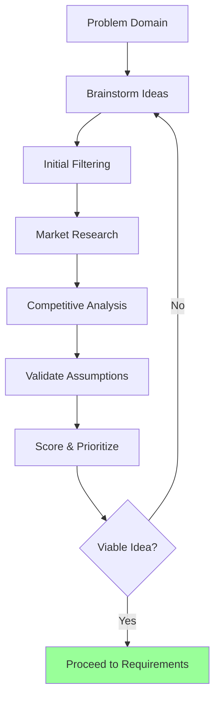
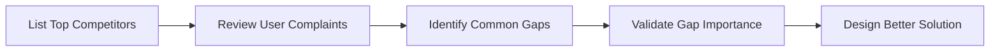
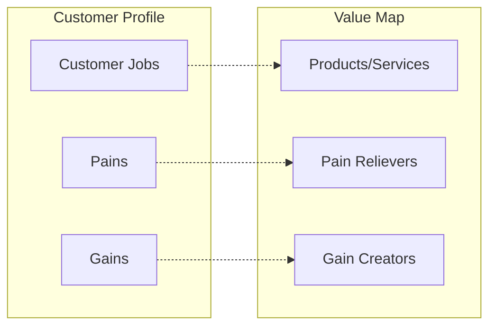

# Exploring App Ideas

Systematic framework for brainstorming, validating, and prioritizing application ideas through research-driven evaluation.

## What This Skill Does

Transforms vague concepts into validated app ideas:

- **Idea generation**: Brainstorming techniques and prompts
- **Market research**: Identify target audience, market size, trends
- **Competitive analysis**: Evaluate existing solutions and gaps
- **Validation frameworks**: Lean Canvas, Value Proposition Canvas
- **Idea scoring**: Quantitative prioritization methods
- **Feasibility assessment**: Technical, market, and resource evaluation

## Quick Start

### Generate Ideas

```bash
node scripts/idea-generator.js topic.txt ideas.json --count 10
```

### Validate Market

```bash
node scripts/validate-market.js idea.json market-report.md
```

### Analyze Competitors

```bash
node scripts/analyze-competitors.js "task management app" competitors.json
```

---

## Idea Generation Workflow



---

## Brainstorming Techniques

### Problem-First Approach

**Start with pain points**:
```
1. Identify a problem you've experienced
2. Research if others have the same problem
3. Brainstorm potential solutions
4. Evaluate solution feasibility
```

**Example**:
- Problem: "I struggle to track multiple project deadlines"
- Research: Search Reddit, forums for similar complaints
- Solutions: Calendar app, task manager, deadline tracker
- Evaluation: Which solution is unique/better?

### SCAMPER Method

**S**ubstitute - **C**ombine - **A**dapt - **M**odify - **P**ut to other use - **E**liminate - **R**everse

```javascript
const scamperPrompts = {
  substitute: "What if we replaced X with Y?",
  combine: "What if we merged feature A with app B?",
  adapt: "How could we adapt Uber's model to X?",
  modify: "What if we made it faster/simpler/prettier?",
  putToOtherUse: "Could this tool work for Y industry?",
  eliminate: "What if we removed the login requirement?",
  reverse: "What if users create content instead of consume?"
};
```

**Example Application**:
- Base: Email app
- Combine: Email + Calendar = Smart scheduling app
- Eliminate: Remove inbox organization = Focus on important emails only
- Reverse: Sender pays to email you = Spam-free inbox

### Trend Surfing

**Identify emerging trends and build on them**:

```
Current Trends (2025/2026):
- AI/ML integration in everyday tools
- Privacy-first applications
- No-code/low-code platforms
- Remote work collaboration
- Sustainability tech
- Web3 and decentralization
```

**Idea Template**:
```
[Trend] + [Industry] + [Pain Point] = App Idea

Example:
AI + Healthcare + Doctor availability = AI symptom checker with triage
Privacy + Social Media + Data ownership = Decentralized social network
No-code + Education + Course creation = Drag-and-drop course builder
```

### Competitor Gap Analysis

**Find what existing apps don't do well**:



**Research Sources**:
- App store reviews (1-3 star reviews are gold)
- Reddit r/[topic] communities
- Product Hunt comments
- Twitter complaints about existing apps
- Customer support forums

---

## Market Research Framework

### Target Audience Definition

**User Persona Template**:
```markdown
## Persona: [Name]

**Demographics**:
- Age: 25-35
- Occupation: Software developer
- Income: $70k-$120k
- Location: Urban areas, US/EU

**Psychographics**:
- Tech-savvy early adopter
- Values efficiency and automation
- Frustrated with existing tools
- Willing to pay for quality solutions

**Behaviors**:
- Uses 5+ productivity apps
- Switches tools frequently (low loyalty)
- Active in online communities
- Researches extensively before buying

**Pain Points**:
1. Too many disconnected tools
2. Steep learning curves
3. Poor mobile experience
4. Lacks customization

**Goals**:
- Streamline workflow
- Reduce context switching
- Improve team collaboration
```

### Market Size Estimation

**TAM-SAM-SOM Framework**:

```
TAM (Total Addressable Market)
  └─ SAM (Serviceable Addressable Market)
       └─ SOM (Serviceable Obtainable Market)
```

**Example: Project Management App**:
```javascript
const marketSize = {
  tam: {
    description: "All businesses worldwide",
    size: "100M businesses",
    revenue: "$500B annually"
  },
  sam: {
    description: "Small-medium tech companies in US/EU",
    size: "5M businesses",
    revenue: "$25B annually"
  },
  som: {
    description: "Realistic 1st year capture (0.1% of SAM)",
    size: "5,000 customers",
    revenue: "$5M annually"
  }
};
```

**Research Sources**:
- Statista market reports
- IBISWorld industry data
- Gartner research
- Census bureau data
- Similar company public filings

### Trend Analysis

**Google Trends Evaluation**:
```
Search: "project management software"
Time Range: Past 5 years
Regions: Worldwide

Indicators to Watch:
✅ Steady upward trend = Growing market
⚠️ Flat line = Mature/saturated market
❌ Declining trend = Shrinking market
```

**Industry Growth Signals**:
- Increasing venture capital funding in space
- New competitors entering market
- Big tech companies investing in area
- Rising social media discussions
- Media coverage increasing

---

## Competitive Analysis

### Competitor Identification

**Sources**:
1. **App Stores**: Search relevant keywords
2. **Product Hunt**: Filter by category
3. **AlternativeTo**: Find similar tools
4. **Crunchbase**: Discover funded startups
5. **G2/Capterra**: B2B software comparison sites

**Competitor Tiers**:
```javascript
const competitors = {
  direct: [
    // Same solution, same audience
    { name: "Asana", users: "100M+", strength: "Brand recognition" }
  ],
  indirect: [
    // Different solution, same problem
    { name: "Notion", users: "50M+", strength: "Flexibility" }
  ],
  potential: [
    // Not competing yet, but could
    { name: "Microsoft Loop", threat: "Distribution power" }
  ]
};
```

### Competitive Feature Matrix

| Feature | Your App | Competitor A | Competitor B | Competitor C |
|---------|----------|--------------|--------------|--------------|
| Task management | ✅ Planned | ✅ Yes | ✅ Yes | ✅ Yes |
| AI automation | ✅ Planned | ❌ No | ⚠️ Basic | ✅ Advanced |
| Mobile app | ✅ Planned | ✅ Yes | ✅ Yes | ❌ No |
| Offline mode | ✅ Planned | ❌ No | ❌ No | ❌ No |
| Pricing | $10/mo | $15/mo | $20/mo | Free |
| User rating | N/A | 4.2⭐ | 3.8⭐ | 4.5⭐ |

**Competitive Advantage Analysis**:
```
Unique differentiators:
✅ Offline-first with sync (competitors are online-only)
✅ AI automation (only 1 competitor has this)
⚠️ Lower price (but may signal lower quality)

Competitive parity:
- Task management (everyone has it)
- Mobile app (standard expectation)

Gaps to fill:
❌ No integrations yet (all competitors have 10+ integrations)
❌ No team features (B competes heavily on collaboration)
```

### SWOT Analysis Template

```markdown
## SWOT: [Your App Idea]

**Strengths** (Internal, Positive):
- Unique offline-first approach
- AI-powered automation
- Simple, focused feature set
- Lower pricing

**Weaknesses** (Internal, Negative):
- No brand recognition
- Limited development resources
- Lack of integrations
- No existing user base

**Opportunities** (External, Positive):
- Growing remote work market
- User frustration with complex tools
- Trend toward privacy/offline apps
- Potential partnerships with [X]

**Threats** (External, Negative):
- Established competitors with loyal users
- Low switching costs (easy to try alternatives)
- Big tech could build similar features
- Market may be saturated
```

---

## Validation Frameworks

### Lean Canvas

**One-page business model**:

```markdown
# Lean Canvas: [App Name]

## Problem
- Top 3 problems users face
- Existing alternatives
- How problems are solved today

## Customer Segments
- Early adopters
- Target audience personas

## Unique Value Proposition
- Single, clear, compelling message
- High-level concept
- Why you're different

## Solution
- Top 3 features
- How you solve the problem

## Channels
- Path to customers
- Free vs. paid channels

## Revenue Streams
- Pricing model
- Lifetime value

## Cost Structure
- Development costs
- Operating costs
- Marketing costs

## Key Metrics
- KPIs to measure success

## Unfair Advantage
- Can't be easily copied or bought
```

**Example: Task Management App**:
```
Problem:
1. Existing tools too complex for simple projects
2. No offline access on mobile
3. Expensive for individual users

Solution:
1. Minimal, focused task management
2. Offline-first with background sync
3. Freemium model ($0-10/mo)

Unique Value Proposition:
"The simplest task manager that works without internet"

Key Metrics:
- Daily active users
- Offline usage percentage
- Free-to-paid conversion rate
```

### Value Proposition Canvas

**Customer Profile + Value Map**:



**Template**:
```javascript
const valueProposition = {
  customerProfile: {
    jobs: [
      "Track project deadlines",
      "Collaborate with team",
      "Access tasks on mobile"
    ],
    pains: [
      "Current tools too complex",
      "No offline access",
      "Expensive pricing"
    ],
    gains: [
      "Simple, intuitive interface",
      "Works anywhere",
      "Affordable pricing"
    ]
  },
  valueMap: {
    products: ["Task management app"],
    painRelievers: [
      "Minimal UI, easy to learn",
      "Offline-first architecture",
      "Freemium model"
    ],
    gainCreators: [
      "Clean design awards",
      "Fast, reliable sync",
      "Free tier with core features"
    ]
  }
};
```

### Assumption Testing

**Identify and validate key assumptions**:

```markdown
## Critical Assumptions

### Assumption 1: Users want simpler tools
**Test**: Survey 100 users of complex tools
**Success Criteria**: 60%+ say "too complex"
**Result**: 73% want simpler alternatives ✅

### Assumption 2: Offline matters
**Test**: Track offline usage in beta
**Success Criteria**: 30%+ use offline mode
**Result**: 12% use offline ❌

### Assumption 3: $10/mo is acceptable
**Test**: Pricing page A/B test
**Success Criteria**: 5%+ conversion at $10
**Result**: 3.2% conversion ⚠️
```

**Validation Methods**:
- **Surveys**: Google Forms, Typeform
- **Landing pages**: Measure interest via signups
- **Interviews**: 1-on-1 with target users
- **Prototype testing**: Figma clickable demos
- **Smoke tests**: "Coming soon" page with email capture

---

## Idea Scoring & Prioritization

### RICE Framework

**Reach × Impact × Confidence ÷ Effort**

```javascript
function calculateRICE(idea) {
  const reach = idea.potentialUsers;      // Users per quarter
  const impact = idea.impactScore;        // 0.25, 0.5, 1, 2, 3
  const confidence = idea.confidencePercent / 100;  // 0-100%
  const effort = idea.developmentMonths;  // Person-months

  return (reach * impact * confidence) / effort;
}

const ideas = [
  {
    name: "Offline task manager",
    potentialUsers: 10000,
    impactScore: 2,      // High impact
    confidencePercent: 80,
    developmentMonths: 6,
    riceScore: (10000 * 2 * 0.8) / 6  // = 2666.67
  },
  {
    name: "AI email assistant",
    potentialUsers: 50000,
    impactScore: 3,      // Massive impact
    confidencePercent: 40,  // Low confidence
    developmentMonths: 12,
    riceScore: (50000 * 3 * 0.4) / 12  // = 5000
  }
];

// Sort by RICE score (higher = better)
ideas.sort((a, b) => b.riceScore - a.riceScore);
```

### Weighted Scoring Model

**Custom criteria with weights**:

```javascript
const scoringCriteria = {
  marketSize: { weight: 0.25, description: "TAM potential" },
  competition: { weight: 0.15, description: "Lower is better" },
  feasibility: { weight: 0.20, description: "Technical ease" },
  passion: { weight: 0.10, description: "Team interest" },
  profitability: { weight: 0.20, description: "Revenue potential" },
  unfairAdvantage: { weight: 0.10, description: "Defensibility" }
};

function scoreIdea(idea, criteria) {
  let totalScore = 0;

  for (const [criterion, config] of Object.entries(criteria)) {
    const score = idea[criterion];  // 1-10 scale
    totalScore += score * config.weight;
  }

  return totalScore;
}

const idea = {
  name: "Privacy-first social network",
  marketSize: 8,          // Large market
  competition: 3,         // Inverted: low competition = high score
  feasibility: 6,         // Moderate complexity
  passion: 9,            // Team is excited
  profitability: 7,      // Good monetization options
  unfairAdvantage: 5     // Some unique features
};

const finalScore = scoreIdea(idea, scoringCriteria);
// = 8*0.25 + 3*0.15 + 6*0.20 + 9*0.10 + 7*0.20 + 5*0.10
// = 2.0 + 0.45 + 1.2 + 0.9 + 1.4 + 0.5
// = 6.45 / 10
```

### Opportunity Matrix

```
              HIGH IMPACT              LOW IMPACT
HIGH EFFORT  | Big Bets              | Money Pit
             | - Build if strategic  | - Avoid
             |                       |
             |---------------------|------------------
LOW EFFORT   | Quick Wins ⭐         | Fill-ins
             | - Prioritize these   | - Do if time permits
```

**Example Classification**:
```javascript
const ideas = [
  { name: "Offline sync", impact: 9, effort: 8 },    // Big Bet
  { name: "Dark mode", impact: 6, effort: 2 },       // Quick Win ⭐
  { name: "3D charts", impact: 3, effort: 9 },       // Money Pit ❌
  { name: "Keyboard shortcuts", impact: 4, effort: 3 } // Fill-in
];
```

---

## Feasibility Assessment

### Technical Feasibility

**Technology Evaluation**:
```markdown
## Required Technologies

### Frontend
- Framework: React, Next.js, Vue
- Skills needed: JavaScript, TypeScript
- Complexity: Medium
- Team expertise: High ✅

### Backend
- Platform: Node.js, Python, Go
- Database: PostgreSQL, MongoDB, Convex
- Complexity: Medium
- Team expertise: Medium ⚠️

### Infrastructure
- Hosting: Vercel, AWS, Railway
- CDN: Cloudflare
- Complexity: Low
- Team expertise: Medium ⚠️

### Third-party Services
- Auth: Clerk, Auth0
- Payments: Stripe
- Email: SendGrid
- Complexity: Low
- Team expertise: High ✅

**Risk Level**: Medium
**Mitigation**: Hire backend contractor for 3 months
```

**Technical Risk Matrix**:
```
Risk: Offline sync complexity
Likelihood: High
Impact: High
Mitigation: Use proven libraries (PouchDB, RxDB)
Fallback: Launch without offline, add later
```

### Market Feasibility

**Market Entry Questions**:
```
1. Is the market growing or shrinking?
   → Growing 15% YoY ✅

2. Can we reach customers affordably?
   → Yes, SEO + content marketing ✅

3. Are users willing to switch?
   → 40% dissatisfied with current tools ✅

4. What's the switching cost?
   → Low, data export is easy ✅

5. Can we compete on price?
   → Yes, lower cost structure ✅

**Verdict**: Market is feasible ✅
```

### Resource Feasibility

**Resource Requirements**:
```javascript
const resourcePlan = {
  team: {
    developers: 2,
    designers: 1,
    marketing: 1
  },
  timeline: "6 months to MVP",
  budget: {
    development: "$50,000",
    design: "$10,000",
    infrastructure: "$2,000/year",
    marketing: "$15,000"
  },
  totalInvestment: "$77,000"
};

// Compare against available resources
const available = {
  team: "2 developers (have), 1 designer (need), 1 marketer (need)",
  timeline: "6 months available ✅",
  budget: "$60,000 available ⚠️"
};
```

---

## Best Practices

### Idea Generation Principles

1. **Quantity over quality initially**: Generate 20+ ideas before evaluating
2. **Solve your own problems**: Best ideas come from personal experience
3. **Research before building**: Spend 20% of time on validation
4. **Talk to users early**: Interview 10+ people before coding
5. **Start small**: MVP should take weeks, not months

### Common Mistakes to Avoid

**Building without validation**:
❌ "I have a great idea, I'll build it and users will come"
✅ "I have an idea, let me talk to 20 potential users first"

**Analysis paralysis**:
❌ "I need to research for 6 months before starting"
✅ "I'll validate the core assumption this week with a landing page"

**Ignoring competition**:
❌ "No one else is doing this" (probably wrong)
✅ "Here's how we're different from the 5 existing solutions"

**Falling in love with the idea**:
❌ "This is brilliant, I won't change it based on feedback"
✅ "Users are saying X, let me pivot to solve that instead"

---

## Decision Framework

### Go/No-Go Checklist

```markdown
## Idea: [App Name]

### Market Validation
- [ ] Market is growing (not shrinking)
- [ ] Target audience is reachable
- [ ] Users have budget to pay
- [ ] Problem is painful (not just "nice to have")

### Competitive Position
- [ ] We have a unique differentiator
- [ ] Competitors have weaknesses we can exploit
- [ ] We can acquire users despite competition
- [ ] We have or can build an unfair advantage

### Feasibility
- [ ] Team has required skills (or can hire)
- [ ] MVP can be built in 3-6 months
- [ ] Budget is available or raiseable
- [ ] Technical risks are manageable

### Business Model
- [ ] Clear path to revenue
- [ ] Users willing to pay
- [ ] Unit economics make sense
- [ ] Scalable distribution channel

### Team Alignment
- [ ] Team is passionate about problem
- [ ] Founders agree on vision
- [ ] Willing to commit 1-2 years
- [ ] Risk tolerance is aligned

**Minimum to proceed**: 15/20 checkboxes ✅

**Decision**: ⬜ GO / ⬜ NO-GO / ⬜ PIVOT
```

---

## Advanced Topics

For detailed information:
- **Brainstorming Methods**: `resources/brainstorming-techniques.md`
- **Validation Frameworks**: `resources/validation-frameworks.md`
- **Market Research Guide**: `resources/market-research-guide.md`
- **Competitive Intelligence**: `resources/competitive-analysis.md`
- **Idea Scoring Models**: `resources/prioritization-models.md`

## References

- Lean Startup methodology (Eric Ries)
- Value Proposition Design (Strategyzer)
- The Mom Test (Rob Fitzpatrick)
- RICE prioritization (Intercom)
- Jobs To Be Done framework (Clayton Christensen)

