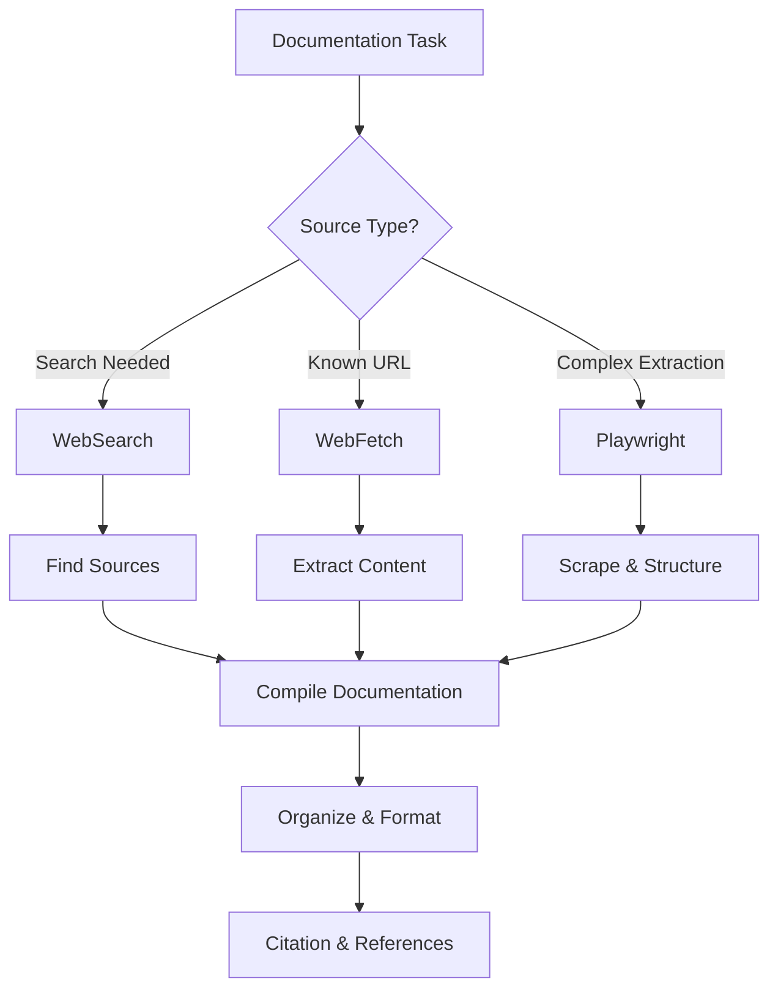

# Gathering Documentation

Complete guide for researching and gathering technical documentation from multiple sources using Claude Code's research tools.

## Research Tools Overview



### Tool Selection Matrix

| Task | WebSearch | WebFetch | Playwright |
|------|-----------|----------|------------|
| Find documentation URLs | ✅ Best | ❌ | ❌ |
| Read single page | ⬜ Okay | ✅ Best | ⬜ Okay |
| Extract structured data | ❌ | ⬜ Okay | ✅ Best |
| Multi-page navigation | ❌ | ❌ | ✅ Best |
| Interactive sites | ❌ | ❌ | ✅ Only option |

---

## Discovery Strategies

### 1. Targeted Search

```typescript
// Find official documentation
const query = "Next.js 14 app router documentation official";
const results = await webSearch(query);

// Filter for official sources
const official = results.filter(r =>
  r.url.includes('nextjs.org') || r.url.includes('vercel.com')
);
```

### 2. API Documentation

```typescript
// Search patterns for API docs
const apiQueries = [
  "Stripe API reference 2024",
  "GitHub REST API v3 documentation",
  "OpenAI API endpoints reference",
];

// Common doc site patterns
const docPatterns = [
  "*/docs/*",
  "*/documentation/*",
  "*/api/*",
  "*/reference/*",
  "*/guide/*",
];
```

### 3. Framework-Specific

```typescript
// Framework documentation URLs
const frameworkDocs = {
  react: "https://react.dev/reference",
  nextjs: "https://nextjs.org/docs",
  vue: "https://vuejs.org/guide/",
  svelte: "https://svelte.dev/docs",
  angular: "https://angular.io/docs",
};
```

---

## WebSearch Workflow

### Basic Search

```typescript
// Search for documentation
const results = await webSearch("Playwright locators documentation");

// Extract URLs
const urls = results.map(r => r.url);

// Filter relevant results
const docUrls = urls.filter(url =>
  url.includes('playwright.dev') &&
  url.includes('/docs/')
);
```

### Advanced Search

```typescript
// Year-specific search
const query2024 = "React Server Components documentation 2024";

// Site-restricted search
const siteQuery = "site:nextjs.org app router documentation";

// Specific topic search
const topicQuery = "Next.js middleware authentication examples";
```

### Search Refinement

```typescript
// Progressive refinement
const searches = [
  "Convex database queries", // Broad
  "Convex database queries typescript", // Add language
  "Convex database queries indexes pagination", // Add specifics
  "site:docs.convex.dev queries indexes", // Site-specific
];

for (const query of searches) {
  const results = await webSearch(query);
  // Evaluate results, refine if needed
}
```

---

## WebFetch Extraction

### Single Page Fetch

```typescript
// Fetch documentation page
const content = await webFetch(
  "https://playwright.dev/docs/locators",
  "Extract all information about Playwright locators including types, examples, and best practices"
);

// Parse and structure
const documentation = {
  url: "https://playwright.dev/docs/locators",
  title: "Playwright Locators",
  content: content,
  fetchedAt: new Date().toISOString(),
};
```

### Multi-Page Fetch

```typescript
// Fetch related pages
const baseUrl = "https://docs.example.com";
const pages = [
  "/getting-started",
  "/core-concepts",
  "/api-reference",
  "/best-practices",
];

const docs = await Promise.all(
  pages.map(async (path) => ({
    path,
    content: await webFetch(
      `${baseUrl}${path}`,
      "Extract main content, code examples, and key concepts"
    ),
  }))
);
```

### Structured Extraction

```typescript
// Extract specific information
const apiDocs = await webFetch(
  "https://api.example.com/reference",
  `Extract in JSON format:
  - Endpoint paths and HTTP methods
  - Request parameters and types
  - Response schemas
  - Example requests and responses
  - Authentication requirements`
);
```

---

## Playwright Scraping

### Documentation Crawler

```typescript
import { chromium } from 'playwright';

async function crawlDocumentation(baseUrl: string) {
  const browser = await chromium.launch();
  const page = await browser.newPage();
  const visited = new Set<string>();
  const docs: any[] = [];

  async function crawl(url: string, depth = 0) {
    if (depth > 3 || visited.has(url)) return;
    visited.add(url);

    await page.goto(url);

    // Extract page content
    const content = await page.evaluate(() => ({
      title: document.title,
      headings: Array.from(document.querySelectorAll('h1, h2, h3')).map(
        h => ({ level: h.tagName, text: h.textContent?.trim() })
      ),
      codeBlocks: Array.from(document.querySelectorAll('pre code')).map(
        code => code.textContent?.trim()
      ),
      links: Array.from(document.querySelectorAll('a[href]')).map(
        a => a.href
      ),
    }));

    docs.push({ url, ...content });

    // Find doc links on same domain
    const docLinks = content.links.filter(
      link => link.startsWith(baseUrl) && link.includes('/docs/')
    );

    // Crawl recursively
    for (const link of docLinks.slice(0, 5)) {
      await crawl(link, depth + 1);
    }
  }

  await crawl(baseUrl);
  await browser.close();
  return docs;
}
```

### API Reference Extraction

```typescript
async function extractAPIReference(url: string) {
  const browser = await chromium.launch();
  const page = await browser.newPage();
  await page.goto(url);

  // Extract API methods
  const methods = await page.locator('.api-method').evaluateAll(elements =>
    elements.map(el => ({
      name: el.querySelector('.method-name')?.textContent?.trim(),
      signature: el.querySelector('.signature')?.textContent?.trim(),
      description: el.querySelector('.description')?.textContent?.trim(),
      parameters: Array.from(el.querySelectorAll('.parameter')).map(p => ({
        name: p.querySelector('.param-name')?.textContent?.trim(),
        type: p.querySelector('.param-type')?.textContent?.trim(),
        description: p.querySelector('.param-desc')?.textContent?.trim(),
      })),
      examples: Array.from(el.querySelectorAll('.example code')).map(
        code => code.textContent?.trim()
      ),
    }))
  );

  await browser.close();
  return methods;
}
```

---

## Organization Patterns

### Hierarchical Structure

```typescript
interface Documentation {
  metadata: {
    source: string;
    title: string;
    version: string;
    fetchedAt: string;
  };
  sections: Section[];
}

interface Section {
  title: string;
  level: number;
  content: string;
  subsections: Section[];
  codeExamples: CodeExample[];
}

interface CodeExample {
  language: string;
  code: string;
  description?: string;
}
```

### Topic-Based Organization

```typescript
const documentation = {
  'getting-started': {
    installation: [...],
    quickstart: [...],
    configuration: [...],
  },
  'core-concepts': {
    architecture: [...],
    dataFlow: [...],
    stateManagement: [...],
  },
  'api-reference': {
    components: [...],
    hooks: [...],
    utilities: [...],
  },
};
```

### Markdown Generation

```typescript
function generateMarkdown(docs: Documentation): string {
  let md = `# ${docs.metadata.title}\n\n`;
  md += `**Version**: ${docs.metadata.version}\n`;
  md += `**Source**: ${docs.metadata.source}\n`;
  md += `**Updated**: ${new Date(docs.metadata.fetchedAt).toLocaleDateString()}\n\n`;

  for (const section of docs.sections) {
    md += generateSection(section);
  }

  return md;
}

function generateSection(section: Section, level = 2): string {
  const heading = '#'.repeat(level);
  let md = `${heading} ${section.title}\n\n`;

  if (section.content) {
    md += `${section.content}\n\n`;
  }

  for (const example of section.codeExamples || []) {
    md += `\`\`\`${example.language}\n${example.code}\n\`\`\`\n\n`;
  }

  for (const subsection of section.subsections || []) {
    md += generateSection(subsection, level + 1);
  }

  return md;
}
```

---

## Research Workflows

### Workflow 1: Library Documentation

```typescript
async function researchLibrary(libraryName: string) {
  console.log(`Researching ${libraryName}...`);

  // Step 1: Find official documentation
  const searchResults = await webSearch(`${libraryName} official documentation`);
  const officialSite = searchResults[0].url;

  // Step 2: Fetch main documentation
  const mainDocs = await webFetch(
    officialSite,
    "Extract installation instructions, quick start guide, and main concepts"
  );

  // Step 3: Find API reference
  const apiResults = await webSearch(`${libraryName} API reference`);
  const apiDocs = await webFetch(
    apiResults[0].url,
    "Extract all API methods, parameters, and return types"
  );

  // Step 4: Gather examples
  const examplesResults = await webSearch(`${libraryName} examples tutorials`);
  const examples = await Promise.all(
    examplesResults.slice(0, 3).map(r =>
      webFetch(r.url, "Extract code examples and explanations")
    )
  );

  // Compile
  return {
    library: libraryName,
    officialDocs: mainDocs,
    apiReference: apiDocs,
    examples: examples,
    sources: [officialSite, ...examplesResults.map(r => r.url)],
  };
}
```

### Workflow 2: Comparative Research

```typescript
async function compareFrameworks(frameworks: string[]) {
  const comparison: any = {};

  for (const framework of frameworks) {
    // Gather key information
    const docs = await webFetch(
      `https://${framework}.dev/docs`,
      `Extract for ${framework}:
      - Installation steps
      - Key features
      - Performance characteristics
      - Learning curve
      - Community size
      - Latest version`
    );

    comparison[framework] = docs;
  }

  // Generate comparison table
  return generateComparisonMarkdown(comparison);
}
```

### Workflow 3: Deep Dive Research

```typescript
async function deepDiveResearch(topic: string) {
  // Phase 1: Discovery
  const overview = await webSearch(`${topic} comprehensive guide`);

  // Phase 2: Official documentation
  const officialDocs = await webFetch(
    overview[0].url,
    "Extract complete technical documentation"
  );

  // Phase 3: Best practices
  const bestPractices = await webSearch(`${topic} best practices 2024`);
  const practices = await Promise.all(
    bestPractices.slice(0, 3).map(r =>
      webFetch(r.url, "Extract best practices and recommendations")
    )
  );

  // Phase 4: Common patterns
  const patterns = await webSearch(`${topic} design patterns examples`);
  const patternDocs = await Promise.all(
    patterns.slice(0, 3).map(r =>
      webFetch(r.url, "Extract code patterns and use cases")
    )
  );

  // Phase 5: Troubleshooting
  const troubleshooting = await webSearch(`${topic} common issues solutions`);

  return {
    topic,
    officialDocs,
    bestPractices: practices,
    patterns: patternDocs,
    troubleshooting,
    researchedAt: new Date().toISOString(),
  };
}
```

---

## Citation Management

### Source Tracking

```typescript
interface Source {
  url: string;
  title: string;
  author?: string;
  publishDate?: string;
  accessDate: string;
  type: 'documentation' | 'article' | 'tutorial' | 'forum';
}

class CitationManager {
  private sources: Map<string, Source> = new Map();

  addSource(source: Source) {
    this.sources.set(source.url, source);
  }

  getCitation(url: string, format: 'markdown' | 'bibtex' = 'markdown'): string {
    const source = this.sources.get(url);
    if (!source) return '';

    if (format === 'markdown') {
      return `[${source.title}](${source.url}) - Accessed ${source.accessDate}`;
    } else {
      return `@misc{${this.generateKey(source)},
  title = {${source.title}},
  url = {${source.url}},
  note = {Accessed: ${source.accessDate}}
}`;
    }
  }

  generateBibliography(): string {
    const citations = Array.from(this.sources.values())
      .map(s => this.getCitation(s.url))
      .join('\n');

    return `## References\n\n${citations}`;
  }

  private generateKey(source: Source): string {
    return source.title.toLowerCase().replace(/\s+/g, '_').substring(0, 20);
  }
}
```

### Usage Example

```typescript
const citations = new CitationManager();

// Add sources during research
const content = await webFetch(url, prompt);
citations.addSource({
  url,
  title: "Playwright Documentation",
  accessDate: new Date().toISOString(),
  type: 'documentation',
});

// Generate bibliography
const bibliography = citations.generateBibliography();
```

---

## Quality Assurance

### Content Validation

```typescript
function validateDocumentation(docs: Documentation): string[] {
  const issues: string[] = [];

  // Check for empty sections
  if (docs.sections.length === 0) {
    issues.push('No sections found');
  }

  // Check for code examples
  const hasCode = docs.sections.some(s => s.codeExamples?.length > 0);
  if (!hasCode) {
    issues.push('No code examples found');
  }

  // Check for broken links (placeholder)
  // Would need to fetch and verify each link

  // Check for outdated content
  const oneYearAgo = Date.now() - 365 * 24 * 60 * 60 * 1000;
  if (new Date(docs.metadata.fetchedAt).getTime() < oneYearAgo) {
    issues.push('Documentation may be outdated');
  }

  return issues;
}
```

### Deduplication

```typescript
function deduplicateContent(docs: Documentation[]): Documentation[] {
  const seen = new Set<string>();
  const unique: Documentation[] = [];

  for (const doc of docs) {
    const key = `${doc.metadata.title}-${doc.metadata.source}`;
    if (!seen.has(key)) {
      seen.add(key);
      unique.push(doc);
    }
  }

  return unique;
}
```

---

## Best Practices

### Research Strategy

1. **Start broad, narrow down**: General search → Specific topics
2. **Verify sources**: Official docs > Community tutorials
3. **Check dates**: Prefer recent documentation
4. **Cross-reference**: Validate across multiple sources
5. **Track sources**: Maintain citation records

### Extraction Guidelines

1. **Extract structure**: Preserve headings and hierarchy
2. **Include examples**: Code examples are essential
3. **Capture context**: Don't just extract code, include explanations
4. **Note limitations**: Document known issues or constraints
5. **Track versions**: Record version numbers

### Organization Tips

1. **Consistent structure**: Use same format across all docs
2. **Clear naming**: Use descriptive file/section names
3. **Separate concerns**: Installation, API, examples, etc.
4. **Version control**: Track changes to gathered docs
5. **Regular updates**: Refresh documentation periodically

---

## Advanced Topics

For detailed information on:
- **Documentation sources** → `resources/documentation-sources.md`
- **Extraction patterns** → `resources/extraction-patterns.md`
- **Documentation crawler** → `scripts/doc-crawler.js`
- **Documentation summarizer** → `scripts/summarize-docs.js`

## References

- **WebSearch Best Practices**: Search query optimization
- **WebFetch Patterns**: Effective content extraction
- **Playwright Scraping**: Advanced scraping techniques
- **Markdown Formatting**: Documentation standards

