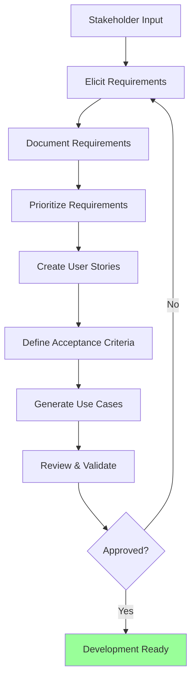

# Gathering Requirements

Systematic approach to capturing, documenting, and prioritizing software requirements for app development.

## What This Skill Does

Transforms ideas into actionable requirements:

- **User story creation**: "As a [user], I want [goal], so that [benefit]"
- **Functional requirements**: What the system must do
- **Non-functional requirements**: How the system must perform
- **Use case documentation**: Detailed interaction scenarios
- **Acceptance criteria**: Testable success conditions
- **Requirements prioritization**: Must-have vs. nice-to-have

## Quick Start

### Extract Requirements

```bash
node scripts/extract-requirements.js product-spec.txt requirements.json
```

### Create User Stories

```bash
node scripts/create-user-stories.js requirements.json user-stories.md
```

### Generate Use Cases

```bash
node scripts/generate-use-cases.js user-stories.md use-cases.md
```

---

## Requirements Workflow



---

## User Story Framework

### Standard Format

```
As a [type of user]
I want [goal/desire]
So that [benefit/value]
```

**Example**:
```
As a project manager
I want to assign tasks to team members
So that everyone knows what they're responsible for
```

### INVEST Criteria

Good user stories are:

- **I**ndependent: Can be developed separately
- **N**egotiable: Details can be discussed
- **V**aluable: Delivers value to users
- **E**stimable: Team can estimate effort
- **S**mall: Completable in one sprint
- **T**estable: Clear acceptance criteria

### User Story Template

```markdown
## [Story Title]

**As a** [user type]
**I want** [capability]
**So that** [business value]

### Acceptance Criteria
- [ ] Given [precondition], when [action], then [result]
- [ ] Given [context], when [event], then [outcome]

### Technical Notes
- [Implementation considerations]
- [Dependencies]
- [Risks]

### Definition of Done
- [ ] Code complete
- [ ] Unit tests written and passing
- [ ] Integration tests passing
- [ ] Code reviewed
- [ ] Documentation updated
- [ ] Deployed to staging
- [ ] QA approved
- [ ] Stakeholder demo complete

**Priority**: Must Have / Should Have / Could Have
**Story Points**: [1, 2, 3, 5, 8, 13]
**Sprint**: [Sprint number or backlog]
```

### Story Examples by Feature

**Authentication**:
```
As a new user
I want to sign up with my email and password
So that I can create an account and access the app

Acceptance Criteria:
- [ ] Email validation (valid format)
- [ ] Password requirements (8+ chars, 1 number, 1 special)
- [ ] Duplicate email handling (clear error message)
- [ ] Confirmation email sent
- [ ] Auto-login after signup
```

**Profile Management**:
```
As a registered user
I want to update my profile information
So that my account details stay current

Acceptance Criteria:
- [ ] Edit display name, bio, avatar
- [ ] Preview changes before saving
- [ ] Validation on all fields
- [ ] Success message on save
- [ ] Changes reflected immediately
```

**Search**:
```
As a user
I want to search for content by keywords
So that I can quickly find what I'm looking for

Acceptance Criteria:
- [ ] Search bar accessible on all pages
- [ ] Results update as I type (debounced)
- [ ] Highlighted matching terms in results
- [ ] Empty state when no results
- [ ] Search history (last 5 searches)
```

---

## Functional Requirements

### Categories

**Core Functionality**:
```markdown
## Authentication & Authorization
- FR-001: System shall allow users to register with email/password
- FR-002: System shall send email verification link
- FR-003: System shall allow password reset via email
- FR-004: System shall support OAuth (Google, GitHub)
- FR-005: System shall enforce role-based access control
```

**Data Management**:
```markdown
## User Data
- FR-101: System shall allow users to create profiles
- FR-102: System shall allow users to update profiles
- FR-103: System shall allow users to delete accounts
- FR-104: System shall export user data on request
```

**Business Logic**:
```markdown
## Task Management
- FR-201: System shall allow creating tasks with title, description, due date
- FR-202: System shall allow assigning tasks to users
- FR-203: System shall send notifications 24h before due date
- FR-204: System shall archive completed tasks
```

### Requirement ID Format

```
[Category]-[Number]: [Requirement statement]

Categories:
- FR: Functional Requirement
- NFR: Non-Functional Requirement
- BR: Business Rule
- CR: Compliance Requirement
```

**Example**:
```
FR-001: User Registration
FR-002: Email Verification
NFR-001: Page Load Performance
NFR-002: Security Standards
BR-001: Payment Processing Rules
CR-001: GDPR Compliance
```

---

## Non-Functional Requirements

### Performance

```markdown
## Performance Requirements

**Response Time**:
- NFR-001: API responses shall complete within 200ms (95th percentile)
- NFR-002: Page load shall complete within 2s on 4G connection
- NFR-003: Search results shall appear within 300ms

**Throughput**:
- NFR-011: System shall handle 1000 concurrent users
- NFR-012: System shall process 10,000 requests/minute

**Scalability**:
- NFR-021: System shall scale horizontally to support 100k users
- NFR-022: Database shall handle 1M records without degradation
```

### Security

```markdown
## Security Requirements

**Authentication**:
- NFR-101: Passwords shall be hashed with bcrypt (cost factor 12)
- NFR-102: Sessions shall expire after 7 days of inactivity
- NFR-103: System shall enforce HTTPS for all connections

**Authorization**:
- NFR-111: API shall validate JWT tokens on every request
- NFR-112: Users shall only access their own data
- NFR-113: Admin actions shall require 2FA

**Data Protection**:
- NFR-121: PII shall be encrypted at rest
- NFR-122: Sensitive data shall not appear in logs
- NFR-123: System shall comply with GDPR
```

### Reliability

```markdown
## Reliability Requirements

**Availability**:
- NFR-201: System uptime shall be 99.9% (8.76 hours downtime/year)
- NFR-202: Planned maintenance windows < 2 hours/month

**Fault Tolerance**:
- NFR-211: System shall gracefully degrade if third-party service fails
- NFR-212: User data shall be backed up every 6 hours
- NFR-213: System shall recover from crashes within 5 minutes

**Data Integrity**:
- NFR-221: Database transactions shall be ACID-compliant
- NFR-222: Data corruption shall be detected and logged
```

### Usability

```markdown
## Usability Requirements

**Learnability**:
- NFR-301: New users shall complete core task within 5 minutes
- NFR-302: Onboarding flow shall have 80%+ completion rate

**Efficiency**:
- NFR-311: Power users shall complete common tasks in < 10 clicks
- NFR-312: Keyboard shortcuts shall be available for all actions

**Accessibility**:
- NFR-321: System shall comply with WCAG 2.1 Level AA
- NFR-322: All features shall be keyboard-navigable
- NFR-323: Color contrast ratio shall be minimum 4.5:1
```

### Compatibility

```markdown
## Compatibility Requirements

**Browsers**:
- NFR-401: Support Chrome (last 2 versions)
- NFR-402: Support Safari (last 2 versions)
- NFR-403: Support Firefox (last 2 versions)
- NFR-404: Support Edge (last 2 versions)

**Devices**:
- NFR-411: Responsive design for mobile (320px+)
- NFR-412: Touch-optimized for tablets
- NFR-413: Optimized for desktop (1024px+)

**Integrations**:
- NFR-421: API shall follow REST conventions
- NFR-422: Webhooks shall retry failed deliveries 3 times
```

---

## Use Case Documentation

### Use Case Template

```markdown
# Use Case: [UC-001] [Title]

## Overview
**Actor**: [Who performs the use case]
**Goal**: [What the actor wants to achieve]
**Preconditions**: [What must be true before starting]
**Postconditions**: [What is true after completion]

## Main Success Scenario

1. [Actor] [performs action]
2. System [responds/validates]
3. [Actor] [next action]
4. System [next response]
5. [Continue numbered steps]
6. Use case ends in success

## Alternative Flows

### 3a. [Condition occurs]
1. System [handles alternative]
2. Return to step 4 of main flow

### 5a. [Error condition]
1. System displays error
2. Use case ends in failure

## Exception Flows

### [Exception name]
**Trigger**: [What causes this exception]
**Response**: [How system handles it]
**Resolution**: [Return to flow or end]

## Business Rules
- [BR-001]: [Related business rule]
- [BR-002]: [Another rule]

## Technical Notes
- [Implementation considerations]
- [Performance requirements]
- [Security considerations]
```

### Example Use Case

```markdown
# Use Case: [UC-002] User Login

## Overview
**Actor**: Registered User
**Goal**: Access protected features by authenticating
**Preconditions**:
- User has registered account
- User knows email and password

**Postconditions**:
- User is authenticated
- Session is created
- User is redirected to dashboard

## Main Success Scenario

1. User navigates to login page
2. System displays email and password fields
3. User enters email address
4. User enters password
5. User clicks "Login" button
6. System validates credentials
7. System creates session token
8. System redirects to dashboard
9. Use case ends in success

## Alternative Flows

### 6a. Invalid credentials
1. System displays error: "Invalid email or password"
2. System clears password field
3. Return to step 3

### 6b. Account not verified
1. System displays: "Please verify email first"
2. System offers to resend verification email
3. Use case ends

### 6c. Account locked
1. System displays: "Account locked due to too many failed attempts"
2. System offers password reset link
3. Use case ends

## Exception Flows

### Network Error
**Trigger**: Request fails due to connectivity
**Response**: System displays "Connection error, please try again"
**Resolution**: User can retry (return to step 5)

### Server Error
**Trigger**: Server returns 500 error
**Response**: System displays generic error message
**Resolution**: Use case ends, error logged

## Business Rules
- BR-001: Lock account after 5 failed login attempts
- BR-002: Session expires after 7 days
- BR-003: Passwords must be 8+ characters

## Technical Notes
- Use bcrypt for password comparison
- Generate JWT token with 7-day expiration
- Set HttpOnly cookie for session
- Redirect preserves intended destination
```

---

## Acceptance Criteria

### Gherkin Format

```gherkin
Feature: User Registration

  Scenario: Successful registration with valid data
    Given I am on the registration page
    When I enter "john@example.com" as email
    And I enter "SecurePass123!" as password
    And I click the "Sign Up" button
    Then I should see a success message
    And I should receive a verification email
    And I should be redirected to the onboarding page

  Scenario: Registration fails with duplicate email
    Given an account exists for "john@example.com"
    And I am on the registration page
    When I enter "john@example.com" as email
    And I enter "AnotherPass456!" as password
    And I click the "Sign Up" button
    Then I should see an error "Email already registered"
    And no new account should be created

  Scenario Outline: Password validation
    Given I am on the registration page
    When I enter "<password>" as password
    Then I should see "<message>"

    Examples:
      | password    | message                              |
      | short       | Password must be at least 8 chars    |
      | noNumbers   | Password must contain a number       |
      | NoSpecial1  | Password must contain special char   |
      | Valid123!   | Password meets requirements          |
```

### Acceptance Criteria Checklist

```markdown
## Feature: [Feature Name]

### Functional Acceptance
- [ ] Feature performs intended function
- [ ] All user stories completed
- [ ] Edge cases handled
- [ ] Error states defined

### Technical Acceptance
- [ ] Code follows style guide
- [ ] No compiler warnings
- [ ] Performance meets NFRs
- [ ] Security review passed

### Quality Acceptance
- [ ] Unit test coverage > 80%
- [ ] Integration tests passing
- [ ] Manual QA completed
- [ ] No critical bugs

### Documentation Acceptance
- [ ] API documented
- [ ] User guide updated
- [ ] Code comments added
- [ ] README current

### Deployment Acceptance
- [ ] Deployed to staging
- [ ] Smoke tests passing
- [ ] Rollback plan documented
- [ ] Monitoring configured
```

---

## Requirements Prioritization

### MoSCoW Method

**Must Have** (Critical for release):
```markdown
- User authentication (no app without login)
- Core data CRUD operations
- Basic search functionality
- Mobile responsiveness
- Security essentials (HTTPS, auth)
```

**Should Have** (Important but not critical):
```markdown
- Advanced search filters
- Email notifications
- Data export
- Profile customization
- Activity history
```

**Could Have** (Nice to have if time):
```markdown
- Dark mode
- Keyboard shortcuts
- Bulk operations
- Advanced analytics
- Social sharing
```

**Won't Have** (Explicitly out of scope):
```markdown
- AI features (future release)
- Multi-language support (v2)
- Native mobile apps (v2)
- Advanced integrations (later)
```

### Kano Model

**Basic Needs** (Must have, dissatisfiers if missing):
- Performance (fast load times)
- Security (safe data)
- Reliability (doesn't crash)

**Performance Needs** (More is better):
- Speed improvements
- More features
- Better UX

**Excitement Needs** (Unexpected delighters):
- AI suggestions
- Delightful animations
- Innovative features

### Weighted Scoring

```javascript
const requirements = [
  {
    id: "FR-001",
    name: "User Registration",
    businessValue: 10,    // 1-10 scale
    userImpact: 9,
    urgency: 10,
    complexity: 3,        // Lower is better
    risk: 2               // Lower is better
  }
];

function calculatePriority(req) {
  const benefit = (req.businessValue + req.userImpact + req.urgency) / 3;
  const cost = (req.complexity + req.risk) / 2;
  return benefit / cost;  // Higher is better
}

// Sort by priority score
requirements.sort((a, b) =>
  calculatePriority(b) - calculatePriority(a)
);
```

---

## Requirements Elicitation Techniques

### Stakeholder Interviews

**Preparation**:
```markdown
## Interview Guide

**Objective**: Understand user needs for [feature]
**Participants**: [Stakeholder names and roles]
**Duration**: 60 minutes

### Questions
1. What problem are you trying to solve?
2. How do you currently solve this?
3. What frustrates you about current solution?
4. What would an ideal solution look like?
5. What are must-have features?
6. What are nice-to-have features?
7. Who else uses this? What do they need?
8. What does success look like?

### Follow-ups
- Can you show me how you do [task] today?
- What happens when [edge case]?
- How often do you need to do this?
```

### User Workshops

**Agenda template**:
```
Hour 1: Problem Definition
- Present current challenges
- Group discussion
- Vote on top 3 problems

Hour 2: Solution Brainstorming
- Individual ideation (10 min)
- Share ideas (20 min)
- Group and cluster (10 min)
- Vote on favorites (10 min)

Hour 3: Requirements Definition
- Break into groups
- Define requirements for top ideas
- Create user stories
- Present to group
```

### Requirements Questionnaire

```markdown
# Requirements Questionnaire

## Project Overview
1. What is the primary purpose of this feature?
2. Who are the target users?
3. What problem does it solve?

## Functional Requirements
4. What actions must users be able to perform?
5. What data needs to be captured/displayed?
6. What are the business rules?

## Non-Functional Requirements
7. What are performance expectations?
8. What are security requirements?
9. What platforms must be supported?

## Constraints
10. What is the timeline?
11. What is the budget?
12. What technical constraints exist?

## Success Criteria
13. How will you measure success?
14. What are KPIs for this feature?
```

---

## Best Practices

### Requirements Quality

**Clear**: Unambiguous and specific
```
❌ System should be fast
✅ System shall load pages in < 2 seconds
```

**Testable**: Can verify if met
```
❌ Users should find it easy
✅ 80% of users complete task without help
```

**Feasible**: Technically achievable
```
❌ System shall predict user thoughts
✅ System shall suggest based on history
```

**Necessary**: Truly required
```
❌ Would be cool to have animations
✅ Animations reduce cognitive load (if proven)
```

### Common Pitfalls

**Too vague**:
- "User-friendly interface" → Define specific usability metrics
- "Fast performance" → Specify response time targets

**Too detailed**:
- Don't specify implementation in requirements
- Focus on WHAT, not HOW

**Missing acceptance criteria**:
- Every requirement needs testable criteria
- Use Given-When-Then format

**Incomplete user stories**:
- Include the "So that" (why/value)
- Don't just list features

---

## Advanced Topics

For detailed information:
- **Elicitation Techniques**: `resources/elicitation-techniques.md`
- **Requirements Templates**: `resources/requirements-templates.md`
- **Use Case Patterns**: `resources/use-case-patterns.md`
- **Acceptance Testing**: `resources/acceptance-testing.md`

## References

- User Stories Applied (Mike Cohn)
- Software Requirements (Karl Wiegers)
- Agile Estimating and Planning (Mike Cohn)
- Behavior-Driven Development (Cucumber/Gherkin)

