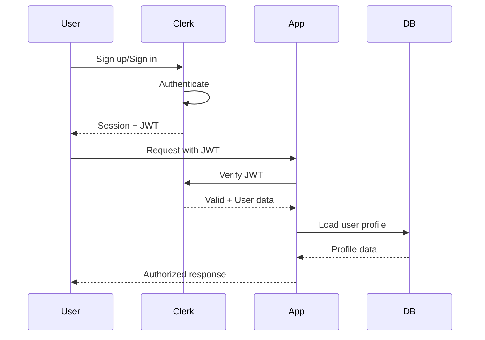
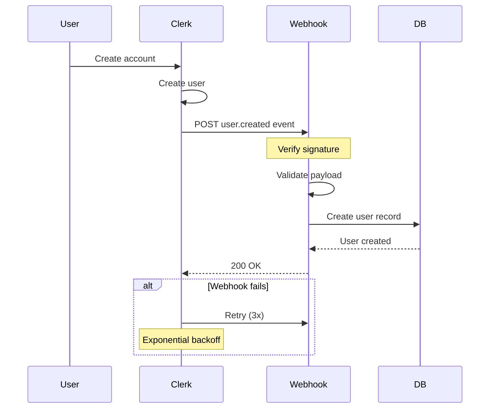

# Implementing Clerk Authentication

Clerk provides drop-in authentication for Next.js with user management, webhooks, and RBAC.

## Quick Start

### 1. Installation & Setup

```bash
npm install @clerk/nextjs
```

**Environment Variables** (`.env.local`):
```bash
NEXT_PUBLIC_CLERK_PUBLISHABLE_KEY=pk_test_...
CLERK_SECRET_KEY=sk_test_...
NEXT_PUBLIC_CLERK_SIGN_IN_URL=/sign-in
NEXT_PUBLIC_CLERK_SIGN_UP_URL=/sign-up
NEXT_PUBLIC_CLERK_AFTER_SIGN_IN_URL=/
NEXT_PUBLIC_CLERK_AFTER_SIGN_UP_URL=/
```

### 2. Wrap App with ClerkProvider

**app/layout.tsx**:
```typescript
import { ClerkProvider } from '@clerk/nextjs';

export default function RootLayout({ children }: { children: React.ReactNode }) {
  return (
    <ClerkProvider>
      <html lang="en">
        <body>{children}</body>
      </html>
    </ClerkProvider>
  );
}
```

### 3. Create Auth Pages

**app/sign-in/[[...sign-in]]/page.tsx**:
```typescript
import { SignIn } from '@clerk/nextjs';

export default function SignInPage() {
  return <SignIn />;
}
```

**app/sign-up/[[...sign-up]]/page.tsx**:
```typescript
import { SignUp } from '@clerk/nextjs';

export default function SignUpPage() {
  return <SignUp />;
}
```

## Protection Patterns

### Server-Side Protection

```typescript
import { auth } from '@clerk/nextjs';
import { redirect } from 'next/navigation';

export default async function DashboardPage() {
  const { userId } = auth();

  if (!userId) {
    redirect('/sign-in');
  }

  return <Dashboard userId={userId} />;
}
```

### Middleware Protection

**middleware.ts**:
```typescript
import { authMiddleware } from '@clerk/nextjs';

export default authMiddleware({
  publicRoutes: ['/'], // Public pages
  ignoredRoutes: ['/api/webhook'], // Skip auth for webhooks
});

export const config = {
  matcher: ['/((?!.+\\.[\\w]+$|_next).*)', '/', '/(api|trpc)(.*)'],
};
```

### Client-Side Protection

```typescript
'use client';

import { useAuth } from '@clerk/nextjs';
import { redirect } from 'next/navigation';

export function ProtectedComponent() {
  const { isLoaded, userId } = useAuth();

  if (!isLoaded) return <Loading />;
  if (!userId) redirect('/sign-in');

  return <Dashboard />;
}
```

## User Management

### Get Current User

```typescript
import { currentUser } from '@clerk/nextjs';

export default async function ProfilePage() {
  const user = await currentUser();

  return (
    <div>
      <h1>{user?.firstName} {user?.lastName}</h1>
      <p>{user?.primaryEmailAddress?.emailAddress}</p>
    </div>
  );
}
```

### Access User Data Client-Side

```typescript
'use client';

import { useUser } from '@clerk/nextjs';

export function UserProfile() {
  const { isLoaded, isSignedIn, user } = useUser();

  if (!isLoaded) return <Loading />;
  if (!isSignedIn) return <SignInPrompt />;

  return <div>Welcome, {user.firstName}!</div>;
}
```

## Webhooks for User Sync

**Authentication Flow:**


### 1. Create Webhook Endpoint

**app/api/webhooks/clerk/route.ts**:
```typescript
import { headers } from 'next/headers';
import { Webhook } from 'svix';
import { WebhookEvent } from '@clerk/nextjs/server';

export async function POST(req: Request) {
  const WEBHOOK_SECRET = process.env.CLERK_WEBHOOK_SECRET;

  if (!WEBHOOK_SECRET) {
    throw new Error('CLERK_WEBHOOK_SECRET is not set');
  }

  // Get headers
  const headerPayload = headers();
  const svix_id = headerPayload.get('svix-id');
  const svix_timestamp = headerPayload.get('svix-timestamp');
  const svix_signature = headerPayload.get('svix-signature');

  if (!svix_id || !svix_timestamp || !svix_signature) {
    return new Response('Missing svix headers', { status: 400 });
  }

  // Get body
  const payload = await req.json();
  const body = JSON.stringify(payload);

  // Verify webhook
  const wh = new Webhook(WEBHOOK_SECRET);
  let evt: WebhookEvent;

  try {
    evt = wh.verify(body, {
      'svix-id': svix_id,
      'svix-timestamp': svix_timestamp,
      'svix-signature': svix_signature,
    }) as WebhookEvent;
  } catch (err) {
    console.error('Webhook verification failed:', err);
    return new Response('Invalid signature', { status: 400 });
  }

  // Handle events
  const { type, data } = evt;

  switch (type) {
    case 'user.created':
      await handleUserCreated(data);
      break;
    case 'user.updated':
      await handleUserUpdated(data);
      break;
    case 'user.deleted':
      await handleUserDeleted(data);
      break;
  }

  return new Response('Webhook processed', { status: 200 });
}

async function handleUserCreated(data: any) {
  // Sync user to your database
  await db.users.create({
    clerkId: data.id,
    email: data.email_addresses[0].email_address,
    firstName: data.first_name,
    lastName: data.last_name,
  });
}
```

### 2. Configure Webhook in Clerk Dashboard

1. Go to Clerk Dashboard → Webhooks
2. Add endpoint: `https://yourdomain.com/api/webhooks/clerk`
3. Subscribe to events: `user.created`, `user.updated`, `user.deleted`
4. Copy webhook secret to `.env.local`

**Webhook Lifecycle:**


## Role-Based Access Control (RBAC)

### 1. Define Roles in Clerk Dashboard

Create roles and permissions in Clerk Dashboard:
- `PROFILE_OWNER` - Can manage their own profile
- `BRAND_SPONSOR` - Can create sponsorships
- `ADMIN` - Full access

### 2. Check Roles Server-Side

```typescript
import { auth } from '@clerk/nextjs';

export default async function AdminPage() {
  const { userId, sessionClaims } = auth();

  const role = sessionClaims?.metadata?.role as string;

  if (role !== 'ADMIN') {
    return <Unauthorized />;
  }

  return <AdminDashboard />;
}
```

### 3. Check Roles in Convex

```typescript
import { requireUserType } from './auth';

export const createSponsorship = mutation({
  handler: async (ctx, args) => {
    // Require BRAND_SPONSOR role
    const user = await requireUserType(['BRAND_SPONSOR'])(ctx, args);

    return await ctx.db.insert('sponsorships', {
      userId: user._id,
      ...args,
    });
  },
});
```

### 4. Custom Authorization Helper

**convex/auth.ts**:
```typescript
export function requireUserType(allowedTypes: string[]) {
  return async (ctx: any, args: any) => {
    const identity = await ctx.auth.getUserIdentity();

    if (!identity) {
      throw new Error('Not authenticated');
    }

    const userType = identity.metadata?.userType;

    if (!allowedTypes.includes(userType)) {
      throw new Error(`Requires one of: ${allowedTypes.join(', ')}`);
    }

    return identity;
  };
}
```

## User Metadata

### Set Public Metadata

```typescript
import { clerkClient } from '@clerk/nextjs';

await clerkClient.users.updateUser(userId, {
  publicMetadata: {
    userType: 'BRAND_SPONSOR',
    slug: 'my-brand',
  },
});
```

### Access Metadata

```typescript
const { sessionClaims } = auth();
const userType = sessionClaims?.metadata?.userType;
```

## Best Practices

1. **Always verify webhooks** - Use Svix signature verification
2. **Use middleware for route protection** - Centralized auth checks
3. **Store minimal user data** - Use Clerk as source of truth
4. **Sync on webhook events** - Keep your DB in sync with Clerk
5. **Use public metadata for roles** - Easy access in session claims
6. **Handle loading states** - Clerk hooks provide `isLoaded` flag
7. **Protect API routes** - Use `auth()` in route handlers
8. **Test webhook locally** - Use Clerk's webhook testing tool

## Common Patterns

### Redirect After Sign-In by Role

```typescript
import { clerkClient } from '@clerk/nextjs';
import { redirect } from 'next/navigation';

export async function GET(req: Request) {
  const { userId } = auth();
  const user = await clerkClient.users.getUser(userId!);

  const userType = user.publicMetadata.userType;

  if (userType === 'BRAND_SPONSOR') {
    redirect('/brand-dashboard');
  } else {
    redirect('/dashboard');
  }
}
```

### Custom User Button

```typescript
import { UserButton } from '@clerk/nextjs';

export function CustomUserButton() {
  return (
    <UserButton
      appearance={{
        elements: {
          avatarBox: 'w-10 h-10',
        },
      }}
      afterSignOutUrl="/"
    />
  );
}
```

## Resources

- [Clerk Documentation](https://clerk.com/docs)
- [Next.js Integration Guide](https://clerk.com/docs/quickstarts/nextjs)
- [Webhook Events Reference](https://clerk.com/docs/users/sync-data)

