# Clerk Authentication Architecture

Visual guide to Clerk authentication flows, RBAC patterns, and webhook integration.

## Complete Authentication Flow

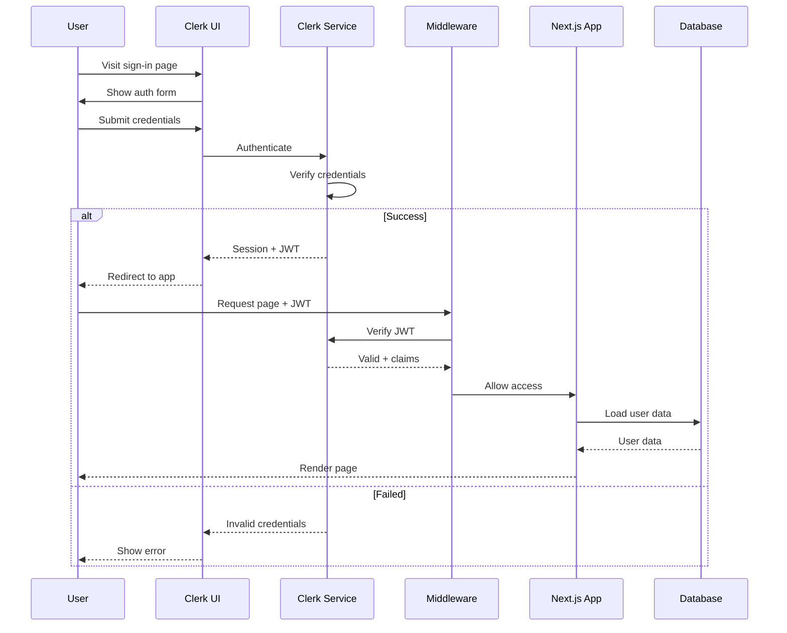

## Middleware Protection Flow

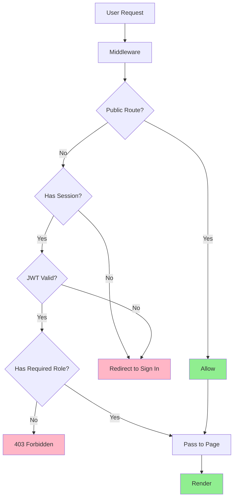

## Role-Based Access Control (RBAC)

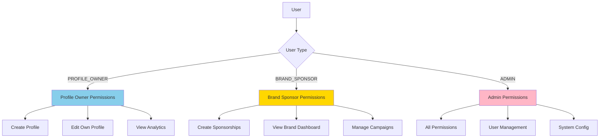

## Webhook Event Processing

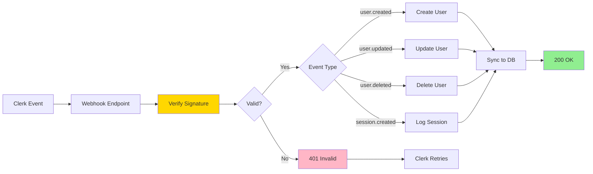

## User Metadata Strategy

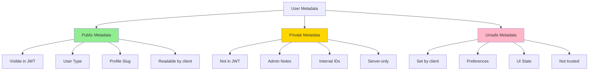

## Authentication States

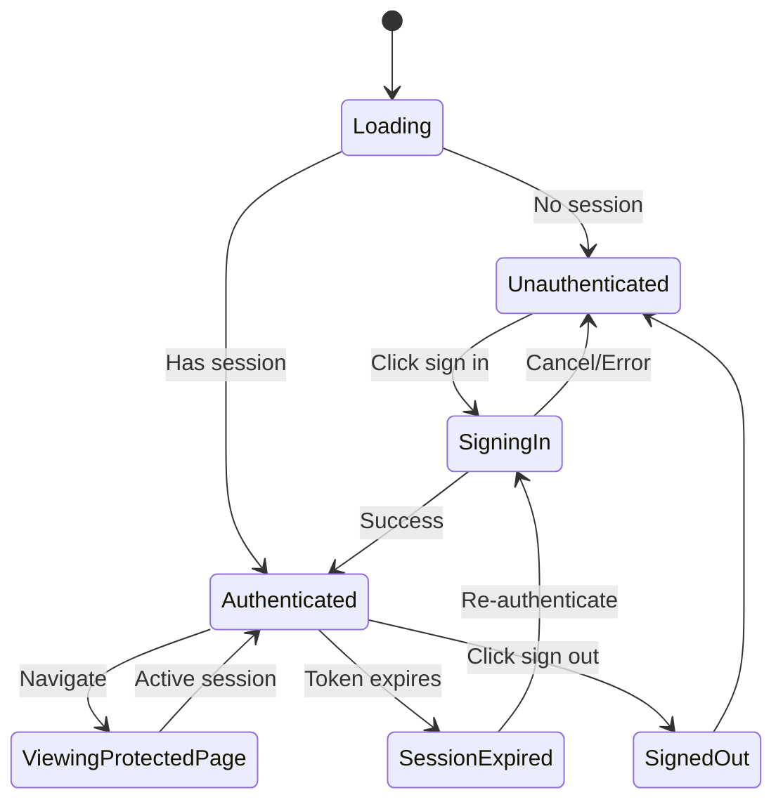

## Multi-Tenant User Flow

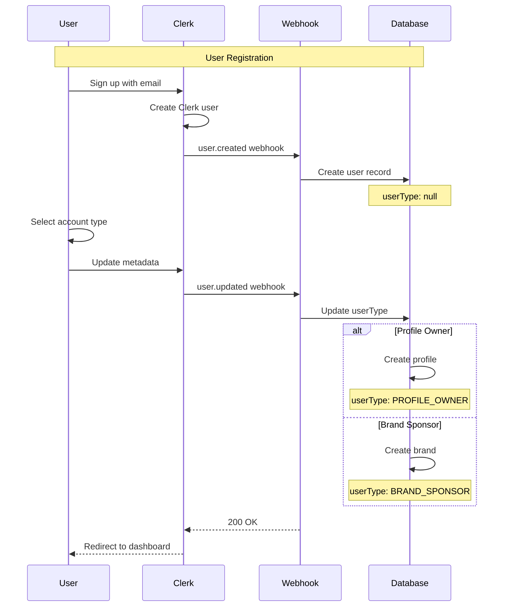

## Session Management

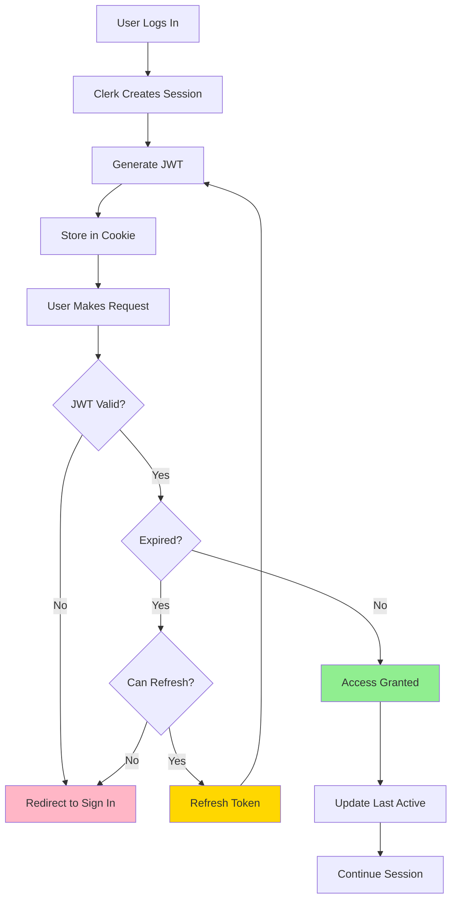

## Server vs Client Authentication

```mermaid
graph TB
    subgraph Server Components
        S1[auth from @clerk/nextjs] --> S2[Get userId]
        S2 --> S3[Check sessionClaims]
        S3 --> S4[Access metadata]
        S4 --> S5[Authorize action]
    end

    subgraph Client Components
        C1[useAuth hook] --> C2[Get isLoaded]
        C2 --> C3[Get userId]
        C3 --> C4[Check isSignedIn]
        C4 --> C5[Render UI]
    end

    subgraph Middleware
        M1[authMiddleware] --> M2[Protect routes]
        M2 --> M3[Set publicRoutes]
        M3 --> M4[Ignore routes]
    end

    style S5 fill:#90EE90
    style C5 fill:#87CEEB
    style M4 fill:#FFD700
```

## Organization & Team Support

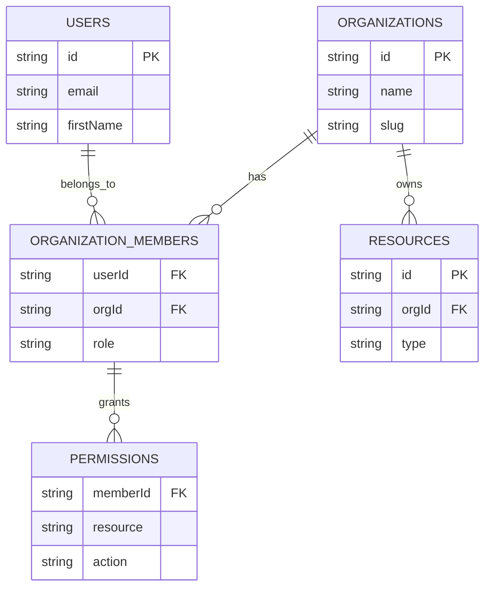

## Custom Sign-In Flow

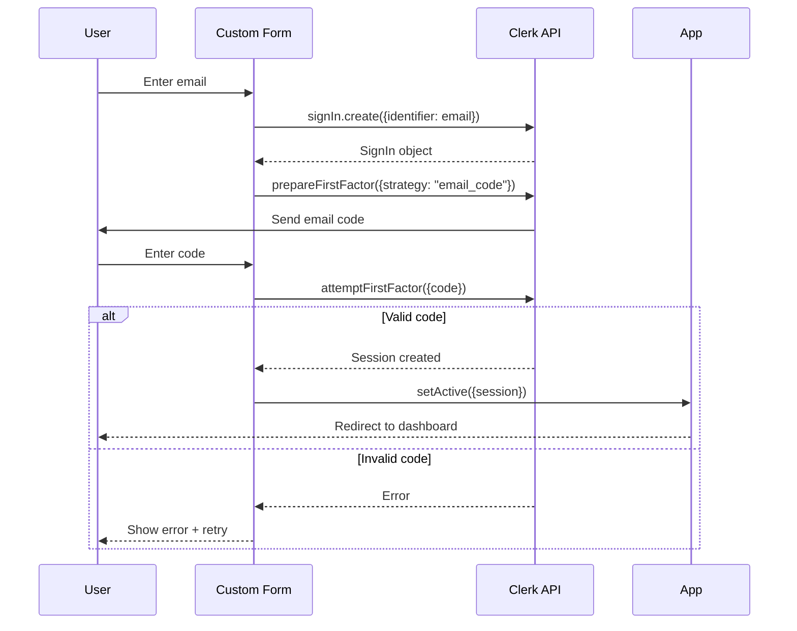

## Social SSO Integration

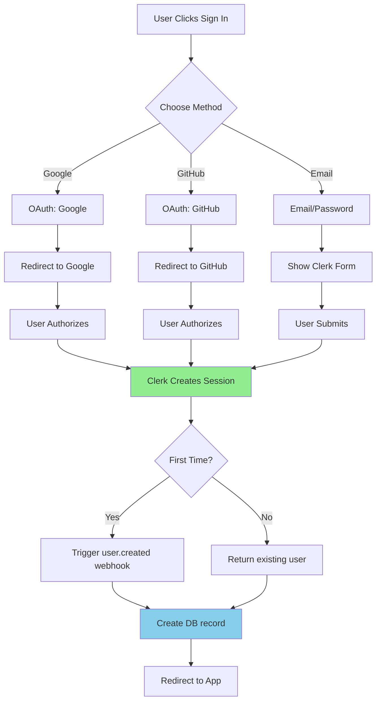

## Authorization Check Pattern

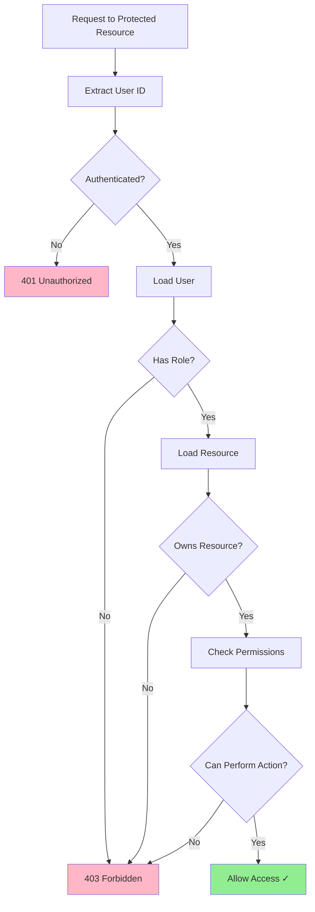

## Webhook Retry Strategy

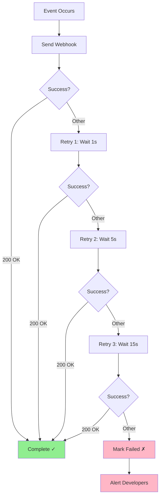

## Multi-Factor Authentication

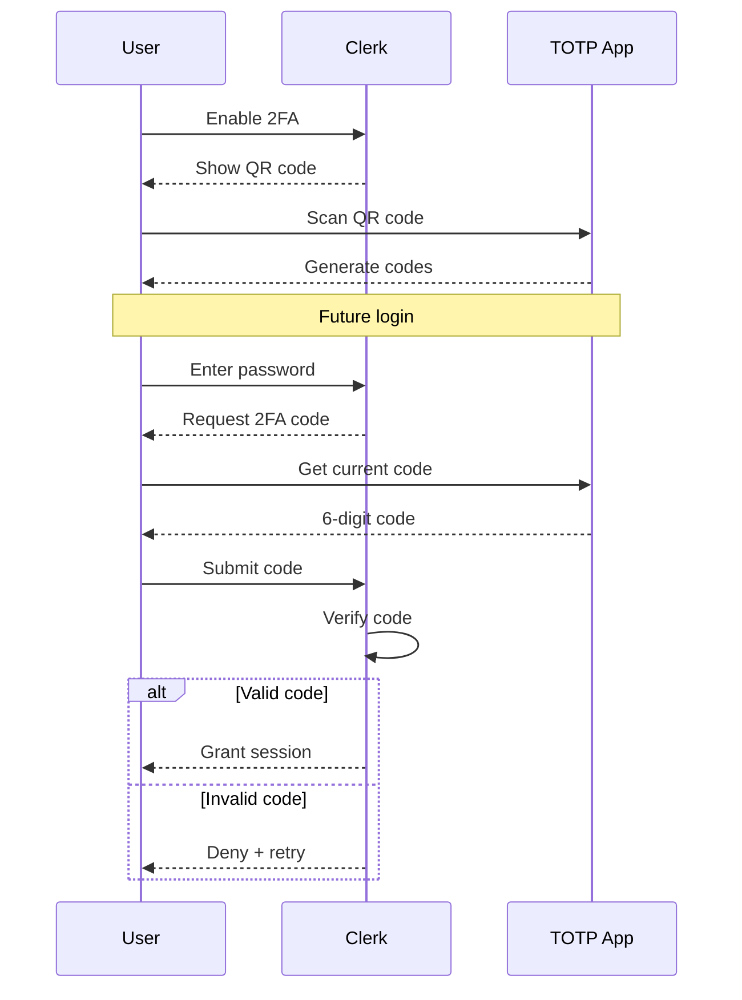

## Convex Integration

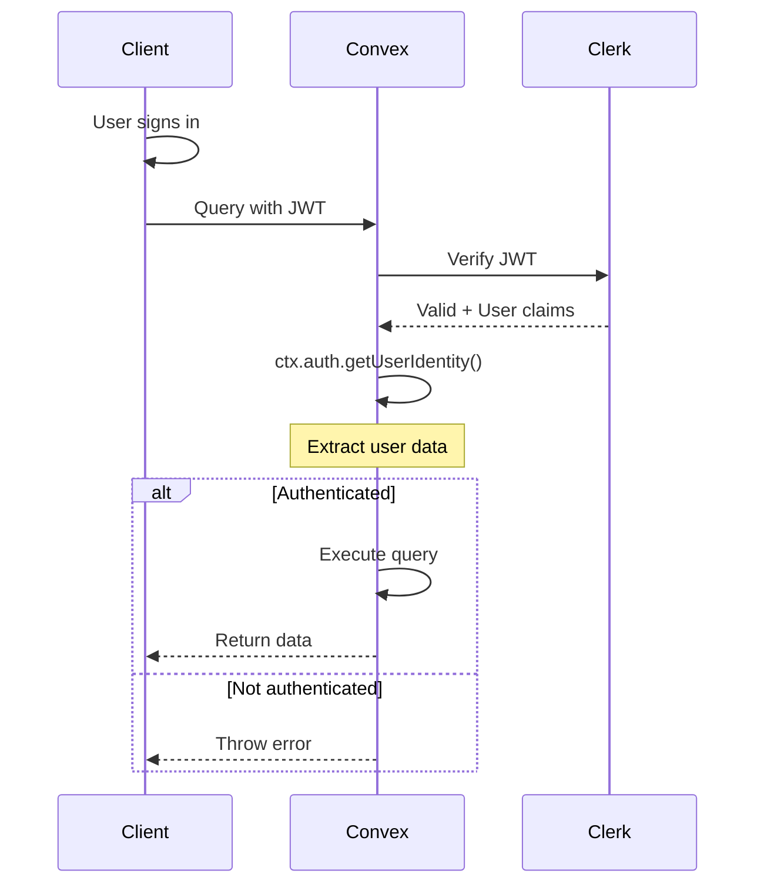

