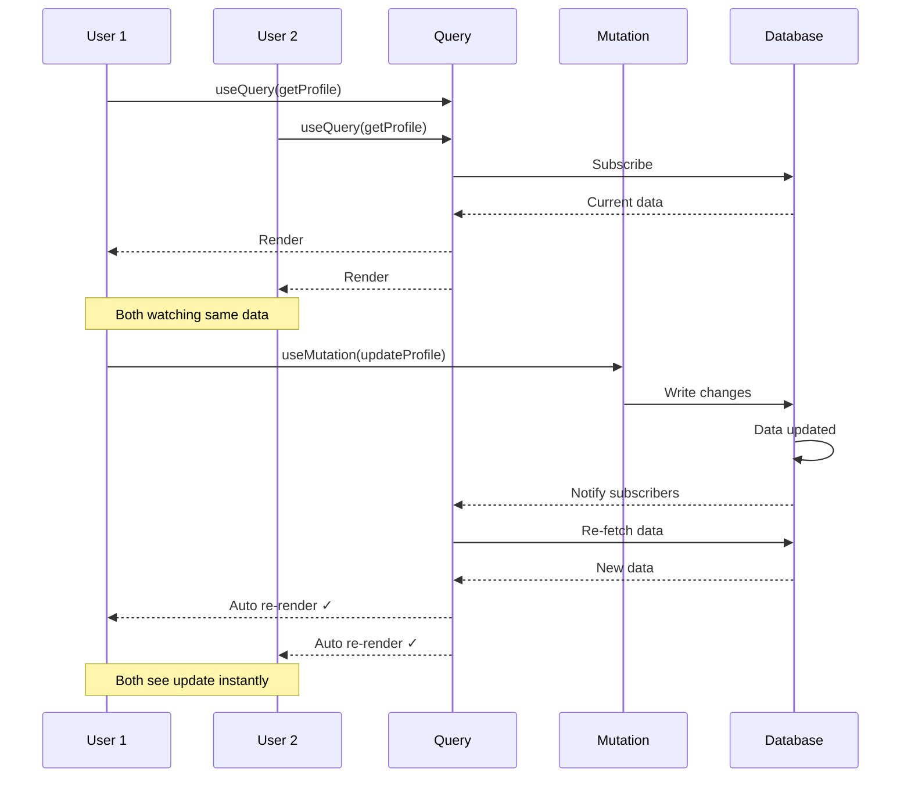
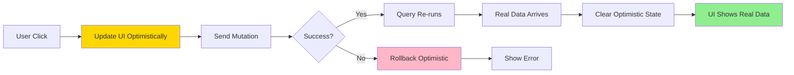
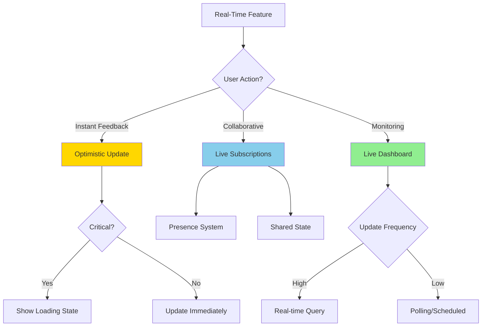

# Implementing Real-Time Features

Comprehensive guide to building real-time features with Convex's reactive subscriptions and optimistic updates.

## Quick Start: Real-Time Data Flow



## Core Concept: Reactive Subscriptions

### Basic Real-Time Query

```typescript
// Backend: Just a normal query
export const getLiveProfile = query({
  args: { profileId: v.id("profiles") },
  handler: async (ctx, { profileId }) => {
    return await ctx.db.get(profileId);
  },
});

// Frontend: Automatic subscriptions
function ProfileView({ profileId }: { profileId: Id<"profiles"> }) {
  // Subscribes to changes automatically
  const profile = useQuery(api.profiles.getLiveProfile, { profileId });

  // When profile changes in DB, component re-renders
  return <div>{profile?.displayName}</div>;
}
```

**How it works:**
1. `useQuery` subscribes to the query
2. Convex watches for data changes
3. When mutation changes watched data, query re-runs
4. Component receives new data and re-renders
5. All happens automatically!

## Pattern 1: Live Dashboard

```typescript
// Real-time analytics dashboard
export const getLiveAnalytics = query({
  args: { profileId: v.id("profiles") },
  handler: async (ctx, { profileId }) => {
    const profile = await ctx.db.get(profileId);

    const links = await ctx.db
      .query("links")
      .withIndex("by_profile", q => q.eq("profileId", profileId))
      .collect();

    const totalClicks = links.reduce((sum, link) => sum + link.clicks, 0);
    const activeLinks = links.filter(l => l.isActive).length;

    return {
      profile,
      links,
      stats: {
        totalClicks,
        activeLinks,
        totalLinks: links.length,
      },
    };
  },
});

// Frontend: Updates live when clicks recorded
function AnalyticsDashboard({ profileId }: Props) {
  const analytics = useQuery(api.analytics.getLiveAnalytics, { profileId });

  if (!analytics) return <Loading />;

  return (
    <Dashboard>
      <Stat label="Total Clicks" value={analytics.stats.totalClicks} />
      <Stat label="Active Links" value={analytics.stats.activeLinks} />
      <LinksList links={analytics.links} />
    </Dashboard>
  );
}

// When click recorded, dashboard updates automatically
export const recordClick = mutation({
  args: { linkId: v.id("links") },
  handler: async (ctx, { linkId }) => {
    const link = await ctx.db.get(linkId);

    await ctx.db.patch(linkId, {
      clicks: link.clicks + 1,
    });

    // All subscribed dashboards update instantly!
  },
});
```

## Pattern 2: Optimistic Updates

```typescript
// Mutation
export const toggleLinkActive = mutation({
  args: { linkId: v.id("links") },
  handler: async (ctx, { linkId }) => {
    const link = await ctx.db.get(linkId);

    await ctx.db.patch(linkId, {
      isActive: !link.isActive,
    });
  },
});

// Frontend with optimistic update
function LinkCard({ link }: { link: Doc<"links"> }) {
  const toggleActive = useMutation(api.links.toggleLinkActive);
  const [optimisticActive, setOptimisticActive] = useState<boolean | null>(null);

  const isActive = optimisticActive ?? link.isActive;

  const handleToggle = async () => {
    // 1. Update UI immediately (optimistic)
    setOptimisticActive(!link.isActive);

    try {
      // 2. Send mutation to server
      await toggleActive({ linkId: link._id });

      // 3. Server mutation completes
      // 4. Query re-runs automatically
      // 5. Component re-renders with real data
      // 6. Clear optimistic state
      setOptimisticActive(null);
    } catch (error) {
      // Rollback on error
      setOptimisticActive(null);
      toast.error("Failed to update link");
    }
  };

  return (
    <Card>
      <h3>{link.title}</h3>
      <Switch checked={isActive} onChange={handleToggle} />
    </Card>
  );
}
```

**Optimistic Update Flow:**


## Pattern 3: Live Collaboration

```typescript
// Real-time presence tracking
export default defineSchema({
  presence: defineTable({
    userId: v.string(),
    profileId: v.id("profiles"),
    lastSeen: v.number(),
    status: v.union(v.literal("online"), v.literal("away")),
  })
    .index("by_profile", ["profileId"])
    .index("by_user_profile", ["userId", "profileId"]),
});

// Update presence
export const updatePresence = mutation({
  args: {
    profileId: v.id("profiles"),
    status: v.union(v.literal("online"), v.literal("away")),
  },
  handler: async (ctx, args) => {
    const identity = await ctx.auth.getUserIdentity();
    if (!identity) throw new Error("Not authenticated");

    const existing = await ctx.db
      .query("presence")
      .withIndex("by_user_profile", q =>
        q.eq("userId", identity.subject).eq("profileId", args.profileId)
      )
      .first();

    if (existing) {
      await ctx.db.patch(existing._id, {
        lastSeen: Date.now(),
        status: args.status,
      });
    } else {
      await ctx.db.insert("presence", {
        userId: identity.subject,
        profileId: args.profileId,
        lastSeen: Date.now(),
        status: args.status,
      });
    }
  },
});

// Query active users
export const getActiveUsers = query({
  args: { profileId: v.id("profiles") },
  handler: async (ctx, { profileId }) => {
    const fiveMinutesAgo = Date.now() - 5 * 60 * 1000;

    return await ctx.db
      .query("presence")
      .withIndex("by_profile", q => q.eq("profileId", profileId))
      .filter(q =>
        q.and(
          q.gte(q.field("lastSeen"), fiveMinutesAgo),
          q.eq(q.field("status"), "online")
        )
      )
      .collect();
  },
});

// Frontend: Show active users live
function ActiveUsers({ profileId }: Props) {
  const activeUsers = useQuery(api.presence.getActiveUsers, { profileId });
  const updatePresence = useMutation(api.presence.updatePresence);

  // Update presence every 30 seconds
  useEffect(() => {
    const interval = setInterval(() => {
      updatePresence({ profileId, status: "online" });
    }, 30000);

    return () => clearInterval(interval);
  }, [profileId]);

  return (
    <div>
      <h3>Active Now ({activeUsers?.length || 0})</h3>
      {activeUsers?.map(user => (
        <UserAvatar key={user.userId} userId={user.userId} />
      ))}
    </div>
  );
}
```

## Pattern 4: Live Notifications

```typescript
// Notification schema
export default defineSchema({
  notifications: defineTable({
    userId: v.string(),
    type: v.string(),
    message: v.string(),
    read: v.boolean(),
    timestamp: v.number(),
  })
    .index("by_user_unread", ["userId", "read"])
    .index("by_user_time", ["userId", "timestamp"]),
});

// Create notification
export const createNotification = mutation({
  args: {
    userId: v.string(),
    type: v.string(),
    message: v.string(),
  },
  handler: async (ctx, args) => {
    await ctx.db.insert("notifications", {
      ...args,
      read: false,
      timestamp: Date.now(),
    });
  },
});

// Live unread count
export const getUnreadCount = query({
  handler: async (ctx) => {
    const identity = await ctx.auth.getUserIdentity();
    if (!identity) return 0;

    const unread = await ctx.db
      .query("notifications")
      .withIndex("by_user_unread", q =>
        q.eq("userId", identity.subject).eq("read", false)
      )
      .collect();

    return unread.length;
  },
});

// Frontend: Live notification badge
function NotificationBell() {
  const unreadCount = useQuery(api.notifications.getUnreadCount);

  return (
    <button className="relative">
      <BellIcon />
      {unreadCount > 0 && (
        <Badge className="absolute -top-1 -right-1">
          {unreadCount}
        </Badge>
      )}
    </button>
  );
}
```

## Pattern 5: Live Search

```typescript
// Live search with search index
export const searchProfiles = query({
  args: { searchTerm: v.string() },
  handler: async (ctx, { searchTerm }) => {
    if (!searchTerm) return [];

    return await ctx.db
      .query("profiles")
      .withSearchIndex("search_profiles", q =>
        q.search("displayName", searchTerm)
      )
      .take(10);
  },
});

// Frontend: Live as-you-type search
function ProfileSearch() {
  const [searchTerm, setSearchTerm] = useState("");

  // Query re-runs on every keystroke
  const results = useQuery(
    api.profiles.searchProfiles,
    searchTerm ? { searchTerm } : "skip"
  );

  return (
    <div>
      <Input
        value={searchTerm}
        onChange={(e) => setSearchTerm(e.target.value)}
        placeholder="Search profiles..."
      />
      <SearchResults results={results} />
    </div>
  );
}
```

## Pattern 6: Live Form Validation

```typescript
// Check slug availability live
export const isSlugAvailable = query({
  args: { slug: v.string() },
  handler: async (ctx, { slug }) => {
    const existing = await ctx.db
      .query("profiles")
      .withIndex("by_slug", q => q.eq("slug", slug))
      .first();

    return !existing;
  },
});

// Frontend: Live validation
function SlugInput() {
  const [slug, setSlug] = useState("");

  // Checks availability in real-time
  const isAvailable = useQuery(
    api.profiles.isSlugAvailable,
    slug ? { slug } : "skip"
  );

  return (
    <div>
      <Input
        value={slug}
        onChange={(e) => setSlug(e.target.value)}
      />
      {slug && (
        <span className={isAvailable ? "text-green" : "text-red"}>
          {isAvailable ? "✓ Available" : "✗ Taken"}
        </span>
      )}
    </div>
  );
}
```

## Performance Optimization

### Debounce Rapid Updates

```typescript
// For search or validation
function useDebounce<T>(value: T, delay: number): T {
  const [debouncedValue, setDebouncedValue] = useState(value);

  useEffect(() => {
    const timer = setTimeout(() => {
      setDebouncedValue(value);
    }, delay);

    return () => clearTimeout(timer);
  }, [value, delay]);

  return debouncedValue;
}

// Usage
function LiveSearch() {
  const [searchTerm, setSearchTerm] = useState("");
  const debouncedSearch = useDebounce(searchTerm, 300);

  // Only queries after 300ms of no typing
  const results = useQuery(
    api.search.searchAll,
    debouncedSearch ? { term: debouncedSearch } : "skip"
  );
}
```

### Conditional Queries

```typescript
// Skip query when not needed
function ConditionalData({ show }: { show: boolean }) {
  // Only subscribes when show is true
  const data = useQuery(
    api.data.getData,
    show ? {} : "skip"
  );

  return show ? <DataView data={data} /> : null;
}
```

### Paginated Real-Time

```typescript
// Combine pagination with real-time
function LivePaginatedList() {
  const { results, status, loadMore } = usePaginatedQuery(
    api.links.getLinks,
    {},
    { initialNumItems: 20 }
  );

  // Each page subscribes to updates
  // New items appear automatically
  return (
    <div>
      {results.map(item => <ItemCard key={item._id} item={item} />)}
      {status === "CanLoadMore" && (
        <button onClick={() => loadMore(20)}>Load More</button>
      )}
    </div>
  );
}
```

## Real-Time Patterns Decision Tree



## Best Practices

### 1. Handle Loading States

```typescript
function Component() {
  const data = useQuery(api.getData);

  // Always handle undefined (loading)
  if (!data) return <Skeleton />;

  return <View data={data} />;
}
```

### 2. Handle Errors

```typescript
function Component() {
  const data = useQuery(api.getData);

  // useQuery can throw
  if (data instanceof Error) {
    return <ErrorBoundary error={data} />;
  }

  if (!data) return <Loading />;

  return <View data={data} />;
}
```

### 3. Avoid Rapid Re-renders

```typescript
// Memoize expensive computations
function Component() {
  const data = useQuery(api.getData);

  const processed = useMemo(() => {
    return expensiveTransform(data);
  }, [data]);

  return <View data={processed} />;
}
```

### 4. Clean Up Subscriptions

```typescript
// Subscriptions auto-cleanup when component unmounts
function Component({ showData }: { showData: boolean }) {
  // Subscription stops when showData becomes false
  const data = useQuery(
    api.getData,
    showData ? {} : "skip"
  );

  return showData ? <View data={data} /> : null;
}
```

## Real-Time Checklist

- [ ] Query subscriptions set up correctly
- [ ] Loading states handled
- [ ] Error states handled
- [ ] Optimistic updates for instant feedback
- [ ] Rollback logic for failed optimistic updates
- [ ] Debouncing for rapid updates (search, validation)
- [ ] Conditional queries to avoid unnecessary subscriptions
- [ ] Pagination for large real-time lists
- [ ] Performance tested with multiple clients
- [ ] Network interruption handled gracefully

## Common Patterns Summary

| Pattern | Use Case | Complexity |
|---------|----------|------------|
| Basic Subscription | Auto-updating data | Low |
| Optimistic Update | Instant feedback | Medium |
| Live Collaboration | Multi-user editing | High |
| Live Notifications | User alerts | Medium |
| Live Search | As-you-type search | Medium |
| Live Validation | Form feedback | Low |
| Live Dashboard | Monitoring | Medium |
| Presence System | Who's online | High |

## Resources

- Convex Real-Time Documentation
- useQuery Hook Reference
- useMutation Hook Reference
- Optimistic Updates Guide

