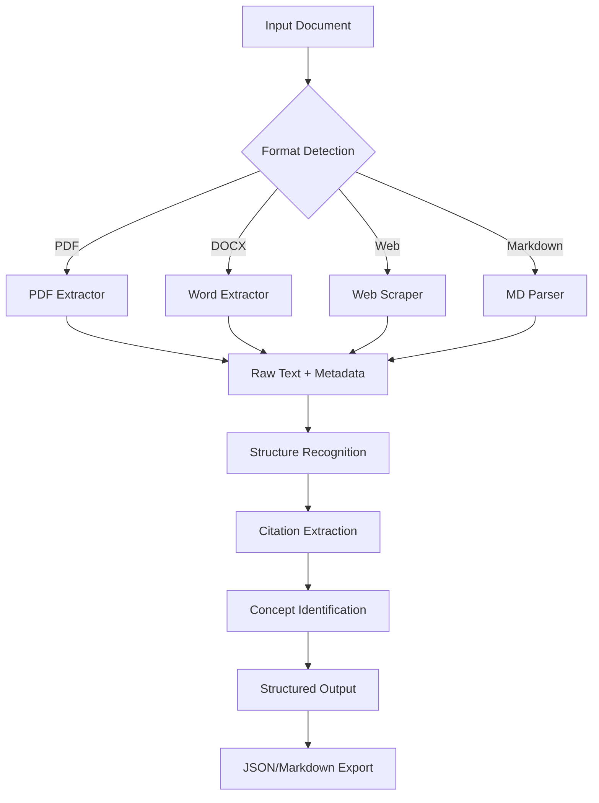

# Ingesting Academic Content

Comprehensive content ingestion system for academic materials supporting multiple formats with intelligent structure recognition and metadata extraction.

## What This Skill Does

Transforms unstructured academic content into structured, analyzable data:

- **Multi-format support**: PDF, DOCX, Markdown, HTML, plain text
- **Metadata extraction**: Title, author, date, key concepts, keywords
- **Structure recognition**: Chapters, sections, subsections, questions, examples
- **Citation extraction**: Bibliographies, in-text citations, reference lists
- **Content classification**: Identifies textbooks, papers, assignments, lecture notes

## Quick Start

### Basic PDF Ingestion

```python
# scripts/ingest-pdf.js
# Extracts text, structure, and metadata from PDF

node scripts/ingest-pdf.js input.pdf output.json
```

### Web Article Extraction

```javascript
// scripts/ingest-web.js
// Extracts article content from URLs

node scripts/ingest-web.js https://example.com/article output.json
```

### Structure Analysis

```python
# scripts/parse-structure.js
# Analyzes document structure and creates outline

node scripts/parse-structure.js document.json structure.json
```

---

## Ingestion Workflow



---

## Content Extraction Patterns

### PDF Documents

**Textbooks and Books:**
```javascript
{
  type: "textbook",
  title: "Introduction to Machine Learning",
  authors: ["Author Name"],
  chapters: [
    {
      number: 1,
      title: "Supervised Learning",
      sections: [
        { title: "Linear Regression", page: 15 },
        { title: "Logistic Regression", page: 32 }
      ]
    }
  ],
  keyConcepts: ["regression", "classification", "neural networks"],
  citations: 147
}
```

**Research Papers:**
```javascript
{
  type: "research_paper",
  title: "Attention Is All You Need",
  authors: ["Vaswani et al."],
  abstract: "...",
  sections: ["Introduction", "Background", "Model Architecture", "Experiments"],
  citations: [
    { authors: "Bahdanau et al.", year: 2014, title: "..." }
  ],
  keyConcepts: ["transformer", "attention mechanism", "self-attention"]
}
```

**Assignment/Problem Sets:**
```javascript
{
  type: "assignment",
  title: "Problem Set 3: Probability Theory",
  dueDate: "2024-03-15",
  questions: [
    {
      number: 1,
      text: "Calculate the probability...",
      points: 10,
      topics: ["conditional probability"]
    }
  ]
}
```

### Web Content

**Article Extraction:**
- Remove navigation, ads, sidebars
- Extract main content body
- Identify author, date, source
- Extract headings and structure
- Preserve code blocks and examples

**Online Course Materials:**
- Extract lesson content
- Identify learning objectives
- Extract embedded videos/resources
- Capture quiz questions
- Map course structure

---

## Structure Recognition

### Heading Detection

**Pattern Recognition:**
```javascript
// Identifies document structure from:
// - Font sizes and weights
// - Numbering patterns (1., 1.1, 1.1.1)
// - Heading markers (Chapter, Section)
// - Table of contents
// - Page breaks

const structurePatterns = {
  chapter: /^Chapter\s+\d+:?\s+(.+)$/i,
  section: /^(\d+\.)+\s+(.+)$/,
  subsection: /^[A-Z]\.\s+(.+)$/,
  question: /^(Question|Q)\s*\d+[:.]\s+(.+)$/i
};
```

### Content Classification

**Document Type Detection:**
- **Textbook**: TOC, chapters, end-of-chapter problems
- **Research Paper**: Abstract, introduction, methodology, results, references
- **Lecture Notes**: Bullet points, definitions, examples, informal structure
- **Assignment**: Questions, points, submission guidelines
- **Lab Report**: Procedure, data, analysis, conclusion

---

## Metadata Extraction

### Automatic Metadata Discovery

```javascript
{
  // Core metadata
  title: "Extracted from first heading or document properties",
  authors: ["From PDF metadata or author line"],
  date: "Publication or creation date",
  source: "Publisher, journal, or university",

  // Academic metadata
  course: "CS 101",
  semester: "Fall 2024",
  instructor: "Prof. Smith",

  // Content metadata
  pageCount: 45,
  wordCount: 12500,
  readingTime: "42 minutes",
  difficulty: "intermediate", // Based on vocabulary complexity

  // Subject classification
  subjects: ["Computer Science", "Machine Learning"],
  topics: ["neural networks", "backpropagation"],
  keywords: ["gradient descent", "activation function"]
}
```

### Citation Extraction

**Reference List Parsing:**
```javascript
// Extracts citations from:
// - Reference sections
// - Bibliography
// - Works Cited
// - In-text citations

const citation = {
  type: "article",
  authors: ["Last, First", "Last2, First2"],
  year: 2023,
  title: "Article Title",
  journal: "Journal Name",
  volume: 15,
  issue: 3,
  pages: "123-145",
  doi: "10.1234/example",
  format: "APA" // Detected citation style
};
```

---

## Format-Specific Handling

### PDF Processing

**Text Extraction:**
```javascript
// Handles:
// - Multi-column layouts
// - Headers/footers removal
// - Figure and table detection
// - Math equation preservation
// - Footnote linking
// - Hyphenation correction
```

**PDF Features:**
- Extract embedded metadata
- Preserve document structure
- Handle scanned PDFs with OCR
- Extract images and diagrams
- Maintain page numbers

### DOCX Processing

**Word Document Features:**
```javascript
// Extracts:
// - Heading styles (Heading 1, 2, 3)
// - Comments and track changes
// - Footnotes and endnotes
// - Tables and lists
// - Document properties
// - Embedded objects
```

### Web Scraping

**Article Extraction:**
```javascript
// Uses readability algorithms to:
// - Identify main content
// - Remove boilerplate
// - Preserve semantic structure
// - Extract media URLs
// - Handle dynamic content
// - Respect robots.txt
```

---

## Concept Identification

### Keyword Extraction

**TF-IDF Based:**
```javascript
// Identifies important terms by:
// - Term frequency in document
// - Inverse document frequency
// - Position in document (headings, bold)
// - Context (definitions, examples)

const concepts = {
  primary: ["neural network", "backpropagation"],
  secondary: ["gradient descent", "activation function"],
  technical: ["relu", "softmax", "dropout"]
};
```

### Definition Detection

**Pattern Matching:**
```javascript
// Identifies definitions from patterns:
// "X is defined as..."
// "X: definition text"
// "X refers to..."
// Bold/italic term followed by explanation
```

---

## Output Formats

### JSON Structure

```json
{
  "metadata": {
    "title": "Document Title",
    "authors": ["Author 1"],
    "date": "2024-01-15",
    "type": "textbook"
  },
  "structure": {
    "chapters": [...],
    "sections": [...],
    "toc": [...]
  },
  "content": {
    "fullText": "...",
    "summary": "...",
    "keyConcepts": [...]
  },
  "citations": [...],
  "media": {
    "images": [...],
    "tables": [...],
    "figures": [...]
  }
}
```

### Markdown Export

```markdown
# Document Title
**Authors**: Author 1, Author 2
**Date**: 2024-01-15

## Chapter 1: Introduction

### Section 1.1: Background

[Content with preserved formatting]

**Key Concepts**: concept1, concept2

**Citations**: [1] Author (2023)...
```

---

## Best Practices

### Pre-Processing

1. **File Validation**: Check format, size, readability
2. **Encoding Detection**: Handle UTF-8, Latin-1, etc.
3. **Backup Original**: Keep source file untouched
4. **Error Handling**: Graceful degradation for corrupt files

### Quality Checks

```javascript
const qualityMetrics = {
  textExtracted: percentage > 90,
  structureDetected: chapters || sections found,
  metadataComplete: title && author present,
  readability: no major formatting errors
};
```

### Performance

- **Chunking**: Process large documents in chunks
- **Caching**: Cache extraction results
- **Parallel Processing**: Multi-file batch ingestion
- **Progress Tracking**: Show extraction progress

---

## Common Patterns

### Batch Processing

```bash
# Process entire folder
for file in textbooks/*.pdf; do
  node scripts/ingest-pdf.js "$file" "output/$(basename "$file" .pdf).json"
done
```

### Custom Extraction

```javascript
// Extract only specific sections
const options = {
  sections: ["Introduction", "Methodology"],
  includeCitations: true,
  extractTables: false
};
```

### Integration with Study Tools

```javascript
// Convert ingested content to flashcards
const flashcards = extractDefinitions(document)
  .map(def => ({
    front: def.term,
    back: def.definition
  }));
```

---

## Troubleshooting

### Common Issues

**Scanned PDFs (Image-based):**
- Run OCR preprocessing (Tesseract)
- Expect lower accuracy
- Manual review recommended

**Complex Layouts:**
- Multi-column detection may fail
- Extract sections individually
- Use layout analysis tools

**Foreign Languages:**
- Specify language for better extraction
- Use language-specific NLP models
- Check encoding compatibility

**Password-Protected Files:**
- Request password from user
- Cannot extract without credentials

---

## Advanced Features

For detailed information:
- **OCR Integration**: `resources/ocr-setup.md`
- **Citation Parsing**: `resources/citation-formats.md`
- **Custom Extractors**: `resources/custom-extractors.md`
- **API Reference**: `resources/api-reference.md`

## Tool Integration

**Compatible with:**
- Zotero for citation management
- Notion/Obsidian for note-taking
- Anki for flashcard generation
- LaTeX for academic writing

## References

- PDF.js for JavaScript PDF parsing
- Tesseract OCR for scanned documents
- Readability.js for web article extraction
- Natural for NLP tasks

