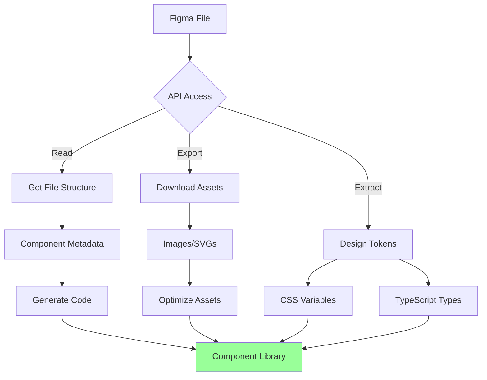

# Integrating Figma

Comprehensive integration with Figma API for design automation, asset export, and design-to-code workflows.

## What This Skill Does

Connects your development workflow to Figma:

- **Design file access**: Read Figma files and components
- **Asset export**: Download images, icons, and graphics
- **Design tokens**: Extract colors, typography, spacing
- **Component inspection**: Get styles and properties
- **Version control**: Track design changes
- **Automation**: Sync designs to code automatically

## Quick Start

### Get File Data

```javascript
node scripts/figma-get-file.js FILE_KEY
```

### Export Assets

```bash
node scripts/figma-export-assets.js FILE_KEY output/
```

### Extract Design Tokens

```bash
node scripts/figma-extract-tokens.js FILE_KEY tokens.json
```

---

## Figma Integration Workflow



---

## API Setup

### Authentication

**Get API token**:
1. Go to Figma → Settings → Personal Access Tokens
2. Generate new token
3. Copy token

**Store securely**:
```bash
# .env
FIGMA_API_TOKEN=your-figma-token-here
```

### Base Configuration

```javascript
// lib/figma.js
const FIGMA_API_TOKEN = process.env.FIGMA_API_TOKEN;
const FIGMA_API_BASE = 'https://api.figma.com/v1';

async function figmaRequest(endpoint) {
  const response = await fetch(`${FIGMA_API_BASE}${endpoint}`, {
    headers: {
      'X-Figma-Token': FIGMA_API_TOKEN
    }
  });

  if (!response.ok) {
    throw new Error(`Figma API error: ${response.statusText}`);
  }

  return await response.json();
}

export { figmaRequest };
```

---

## Reading Figma Files

### Get File Structure

```javascript
// scripts/figma-get-file.js
import { figmaRequest } from '../lib/figma.js';

async function getFile(fileKey) {
  const data = await figmaRequest(`/files/${fileKey}`);

  return {
    name: data.name,
    lastModified: data.lastModified,
    version: data.version,
    document: data.document,
    components: data.components,
    styles: data.styles
  };
}

// Usage
const file = await getFile('your-file-key');
console.log(`File: ${file.name}`);
console.log(`Components: ${Object.keys(file.components).length}`);
```

### Find Components

```javascript
function findComponents(node, components = []) {
  if (node.type === 'COMPONENT') {
    components.push({
      id: node.id,
      name: node.name,
      description: node.description,
      width: node.absoluteBoundingBox.width,
      height: node.absoluteBoundingBox.height
    });
  }

  if (node.children) {
    for (const child of node.children) {
      findComponents(child, components);
    }
  }

  return components;
}

// Usage
const file = await getFile(fileKey);
const components = findComponents(file.document);
console.log(`Found ${components.length} components`);
```

### Get Component Details

```javascript
async function getComponent(fileKey, componentId) {
  const data = await figmaRequest(
    `/files/${fileKey}/nodes?ids=${componentId}`
  );

  const node = data.nodes[componentId].document;

  return {
    id: node.id,
    name: node.name,
    type: node.type,
    styles: extractStyles(node),
    children: node.children
  };
}

function extractStyles(node) {
  return {
    backgroundColor: node.backgroundColor,
    opacity: node.opacity,
    effects: node.effects,
    fills: node.fills,
    strokes: node.strokes,
    cornerRadius: node.cornerRadius,
    padding: node.paddingLeft,
  };
}
```

---

## Exporting Assets

### Export Images

```javascript
// scripts/figma-export-assets.js
import fs from 'fs/promises';
import path from 'path';

async function exportImages(fileKey, nodeIds, outputDir) {
  // Get image URLs
  const response = await figmaRequest(
    `/images/${fileKey}?ids=${nodeIds.join(',')}&format=png&scale=2`
  );

  const images = response.images;

  // Download each image
  for (const [nodeId, url] of Object.entries(images)) {
    const imageResponse = await fetch(url);
    const buffer = await imageResponse.arrayBuffer();

    const filename = `${nodeId}.png`;
    await fs.writeFile(
      path.join(outputDir, filename),
      Buffer.from(buffer)
    );

    console.log(`Exported: ${filename}`);
  }
}

// Usage
await exportImages(
  fileKey,
  ['node-id-1', 'node-id-2'],
  './public/assets'
);
```

### Export SVGs

```javascript
async function exportSVGs(fileKey, nodeIds, outputDir) {
  const response = await figmaRequest(
    `/images/${fileKey}?ids=${nodeIds.join(',')}&format=svg`
  );

  for (const [nodeId, url] of Object.entries(response.images)) {
    const svgResponse = await fetch(url);
    const svgContent = await svgResponse.text();

    await fs.writeFile(
      path.join(outputDir, `${nodeId}.svg`),
      svgContent
    );
  }
}
```

### Batch Export

```javascript
async function batchExport(fileKey, exportConfig) {
  const file = await getFile(fileKey);

  // Find all exportable nodes
  const nodesToExport = findExportableNodes(file.document, exportConfig);

  // Export in batches of 100 (API limit)
  const batchSize = 100;
  for (let i = 0; i < nodesToExport.length; i += batchSize) {
    const batch = nodesToExport.slice(i, i + batchSize);
    await exportImages(
      fileKey,
      batch.map(n => n.id),
      exportConfig.outputDir
    );
  }
}

function findExportableNodes(node, config, results = []) {
  // Match by name pattern
  if (config.pattern && node.name.match(config.pattern)) {
    results.push(node);
  }

  // Match by type
  if (config.types && config.types.includes(node.type)) {
    results.push(node);
  }

  if (node.children) {
    for (const child of node.children) {
      findExportableNodes(child, config, results);
    }
  }

  return results;
}
```

---

## Extracting Design Tokens

### Color Tokens

```javascript
async function extractColors(fileKey) {
  const file = await getFile(fileKey);
  const colors = new Map();

  function processNode(node) {
    if (node.fills) {
      node.fills.forEach(fill => {
        if (fill.type === 'SOLID') {
          const color = rgbToHex(fill.color);
          const name = generateColorName(node.name, color);
          colors.set(name, color);
        }
      });
    }

    if (node.children) {
      node.children.forEach(processNode);
    }
  }

  processNode(file.document);

  return Object.fromEntries(colors);
}

function rgbToHex(color) {
  const r = Math.round(color.r * 255);
  const g = Math.round(color.g * 255);
  const b = Math.round(color.b * 255);
  return `#${r.toString(16).padStart(2, '0')}${g.toString(16).padStart(2, '0')}${b.toString(16).padStart(2, '0')}`;
}

// Output
const colors = await extractColors(fileKey);
/*
{
  "primary": "#3B82F6",
  "secondary": "#8B5CF6",
  "success": "#10B981",
  "error": "#EF4444"
}
*/
```

### Typography Tokens

```javascript
async function extractTypography(fileKey) {
  const file = await getFile(fileKey);
  const typography = {};

  function processNode(node) {
    if (node.type === 'TEXT') {
      const style = node.style;
      const name = node.name.toLowerCase().replace(/\s+/g, '-');

      typography[name] = {
        fontFamily: style.fontFamily,
        fontSize: `${style.fontSize}px`,
        fontWeight: style.fontWeight,
        lineHeight: `${style.lineHeightPx}px`,
        letterSpacing: `${style.letterSpacing}px`
      };
    }

    if (node.children) {
      node.children.forEach(processNode);
    }
  }

  processNode(file.document);
  return typography;
}

// Output
const typography = await extractTypography(fileKey);
/*
{
  "heading-1": {
    "fontFamily": "Inter",
    "fontSize": "48px",
    "fontWeight": 700,
    "lineHeight": "56px",
    "letterSpacing": "-0.5px"
  },
  "body": {
    "fontFamily": "Inter",
    "fontSize": "16px",
    "fontWeight": 400,
    "lineHeight": "24px",
    "letterSpacing": "0px"
  }
}
*/
```

### Spacing Tokens

```javascript
function extractSpacing(fileKey) {
  // Extract common spacing values from padding, gaps, etc.
  const spacingValues = new Set();

  function processNode(node) {
    if (node.paddingLeft) spacingValues.add(node.paddingLeft);
    if (node.paddingRight) spacingValues.add(node.paddingRight);
    if (node.paddingTop) spacingValues.add(node.paddingTop);
    if (node.paddingBottom) spacingValues.add(node.paddingBottom);
    if (node.itemSpacing) spacingValues.add(node.itemSpacing);

    if (node.children) {
      node.children.forEach(processNode);
    }
  }

  const file = await getFile(fileKey);
  processNode(file.document);

  // Create spacing scale
  const spacingScale = Array.from(spacingValues)
    .sort((a, b) => a - b)
    .reduce((acc, value, index) => {
      acc[`space-${index + 1}`] = `${value}px`;
      return acc;
    }, {});

  return spacingScale;
}

// Output
/*
{
  "space-1": "4px",
  "space-2": "8px",
  "space-3": "12px",
  "space-4": "16px",
  "space-5": "24px",
  "space-6": "32px"
}
*/
```

### Generate CSS Variables

```javascript
async function generateCSSVariables(fileKey, outputFile) {
  const colors = await extractColors(fileKey);
  const typography = await extractTypography(fileKey);
  const spacing = await extractSpacing(fileKey);

  let css = ':root {\n';

  // Colors
  css += '  /* Colors */\n';
  for (const [name, value] of Object.entries(colors)) {
    css += `  --color-${name}: ${value};\n`;
  }

  // Typography
  css += '\n  /* Typography */\n';
  for (const [name, styles] of Object.entries(typography)) {
    css += `  --font-${name}-family: ${styles.fontFamily};\n`;
    css += `  --font-${name}-size: ${styles.fontSize};\n`;
    css += `  --font-${name}-weight: ${styles.fontWeight};\n`;
    css += `  --font-${name}-line-height: ${styles.lineHeight};\n`;
  }

  // Spacing
  css += '\n  /* Spacing */\n';
  for (const [name, value] of Object.entries(spacing)) {
    css += `  --${name}: ${value};\n`;
  }

  css += '}\n';

  await fs.writeFile(outputFile, css);
  console.log(`CSS variables written to ${outputFile}`);
}

// Usage
await generateCSSVariables(fileKey, './styles/tokens.css');
```

---

## Component Generation

### React Component from Figma

```javascript
async function generateReactComponent(fileKey, componentId) {
  const component = await getComponent(fileKey, componentId);

  const componentCode = `
import React from 'react';

export interface ${component.name}Props {
  children?: React.ReactNode;
}

export function ${component.name}({ children }: ${component.name}Props) {
  return (
    <div
      style={{
        backgroundColor: '${component.styles.backgroundColor}',
        borderRadius: '${component.styles.cornerRadius}px',
        padding: '${component.styles.padding}px',
        opacity: ${component.styles.opacity}
      }}
    >
      {children}
    </div>
  );
}
  `.trim();

  await fs.writeFile(
    `./components/${component.name}.tsx`,
    componentCode
  );
}
```

### Generate TypeScript Types

```javascript
async function generateTypes(fileKey) {
  const file = await getFile(fileKey);
  const components = findComponents(file.document);

  let types = '// Auto-generated from Figma\n\n';

  for (const component of components) {
    types += `export interface ${component.name}Props {\n`;
    types += `  width?: number; // ${component.width}px\n`;
    types += `  height?: number; // ${component.height}px\n`;
    types += `  children?: React.ReactNode;\n`;
    types += `}\n\n`;
  }

  await fs.writeFile('./types/figma-components.ts', types);
}
```

---

## Webhooks & Automation

### Watch for Changes

```javascript
async function watchFileChanges(fileKey, onChangeCallback) {
  let lastVersion = null;

  setInterval(async () => {
    const file = await getFile(fileKey);

    if (lastVersion && file.version !== lastVersion) {
      console.log('File changed!');
      await onChangeCallback(file);
    }

    lastVersion = file.version;
  }, 60000); // Check every minute
}

// Usage
watchFileChanges(fileKey, async (file) => {
  console.log('Updating design tokens...');
  await generateCSSVariables(fileKey, './styles/tokens.css');
});
```

### Sync Figma to Code

```javascript
async function syncFigmaToCode(fileKey, config) {
  console.log('Syncing Figma file...');

  // Export assets
  if (config.exportAssets) {
    await batchExport(fileKey, config.assets);
  }

  // Extract design tokens
  if (config.extractTokens) {
    await generateCSSVariables(fileKey, config.tokens.output);
  }

  // Generate components
  if (config.generateComponents) {
    const components = await findComponents((await getFile(fileKey)).document);
    for (const component of components) {
      await generateReactComponent(fileKey, component.id);
    }
  }

  console.log('Sync complete!');
}

// Usage
await syncFigmaToCode(fileKey, {
  exportAssets: true,
  assets: {
    pattern: /icon-/,
    outputDir: './public/icons'
  },
  extractTokens: true,
  tokens: {
    output: './styles/tokens.css'
  },
  generateComponents: true
});
```

---

## Best Practices

### Performance

1. **Cache file data**: Store file structure locally
2. **Batch exports**: Export multiple nodes in single request
3. **Rate limiting**: Respect API rate limits (2 requests/second)
4. **Incremental updates**: Only sync changed components

### Organization

1. **Naming conventions**: Use consistent naming in Figma
2. **Component structure**: Organize components in Figma properly
3. **Documentation**: Add descriptions to Figma components
4. **Version control**: Track design token changes in git

### Security

1. **Token storage**: Never commit API tokens
2. **Access control**: Use read-only tokens when possible
3. **Environment variables**: Store tokens in .env
4. **Token rotation**: Regenerate tokens periodically

---

## Common Use Cases

### 1. Icon Library Sync

```javascript
async function syncIconLibrary(fileKey) {
  const file = await getFile(fileKey);

  // Find all icons (assuming they're in "Icons" page)
  const iconsPage = file.document.children.find(
    page => page.name === 'Icons'
  );

  const icons = findExportableNodes(iconsPage, {
    types: ['COMPONENT']
  });

  // Export as SVGs
  await exportSVGs(
    fileKey,
    icons.map(i => i.id),
    './public/icons'
  );

  // Generate TypeScript enum
  const iconNames = icons.map(i => i.name);
  const enumCode = `export enum IconName {\n${iconNames.map(n => `  ${n} = '${n}'`).join(',\n')}\n}`;

  await fs.writeFile('./types/icons.ts', enumCode);
}
```

### 2. Design System Sync

```javascript
async function syncDesignSystem(fileKey) {
  // Extract all design tokens
  const colors = await extractColors(fileKey);
  const typography = await extractTypography(fileKey);
  const spacing = await extractSpacing(fileKey);

  // Generate design system config
  const designSystem = {
    colors,
    typography,
    spacing,
    generatedAt: new Date().toISOString(),
    figmaFileKey: fileKey
  };

  await fs.writeFile(
    './design-system/tokens.json',
    JSON.stringify(designSystem, null, 2)
  );

  // Generate CSS
  await generateCSSVariables(fileKey, './design-system/tokens.css');

  // Generate Tailwind config
  await generateTailwindConfig(designSystem, './tailwind.config.js');
}
```

### 3. Screenshot Generation

```javascript
async function generateScreenshots(fileKey, frames) {
  for (const frame of frames) {
    const response = await figmaRequest(
      `/images/${fileKey}?ids=${frame.id}&format=png&scale=2`
    );

    const imageUrl = response.images[frame.id];
    const imageResponse = await fetch(imageUrl);
    const buffer = await imageResponse.arrayBuffer();

    await fs.writeFile(
      `./screenshots/${frame.name}.png`,
      Buffer.from(buffer)
    );
  }
}
```

---

## Integration Patterns

### Next.js API Route

```typescript
// app/api/figma/assets/route.ts
import { figmaRequest } from '@/lib/figma';

export async function GET(request: Request) {
  const { searchParams } = new URL(request.url);
  const fileKey = searchParams.get('fileKey');
  const nodeId = searchParams.get('nodeId');

  try {
    const response = await figmaRequest(
      `/images/${fileKey}?ids=${nodeId}&format=png`
    );

    return Response.json(response);
  } catch (error) {
    return Response.json({ error: 'Export failed' }, { status: 500 });
  }
}
```

### CLI Tool

```javascript
#!/usr/bin/env node
// bin/figma-sync.js

import { Command } from 'commander';
import { syncFigmaToCode } from '../lib/figma-sync.js';

const program = new Command();

program
  .name('figma-sync')
  .description('Sync Figma designs to code')
  .version('1.0.0');

program
  .command('sync <fileKey>')
  .description('Sync Figma file to local code')
  .option('-a, --assets', 'Export assets')
  .option('-t, --tokens', 'Extract design tokens')
  .option('-c, --components', 'Generate components')
  .action(async (fileKey, options) => {
    await syncFigmaToCode(fileKey, options);
  });

program.parse();
```

---

## Advanced Topics

For detailed information:
- **Asset Optimization**: `resources/asset-optimization.md`
- **Design Token Standards**: `resources/design-tokens.md`
- **Component Generation**: `resources/component-generation.md`
- **Figma Plugins**: `resources/plugin-development.md`

## References

- [Figma API Documentation](https://www.figma.com/developers/api)
- [Figma REST API](https://www.figma.com/developers/api#endpoints)
- [Design Tokens Specification](https://design-tokens.github.io/community-group/)
- [Figma Plugin API](https://www.figma.com/plugin-docs/)

