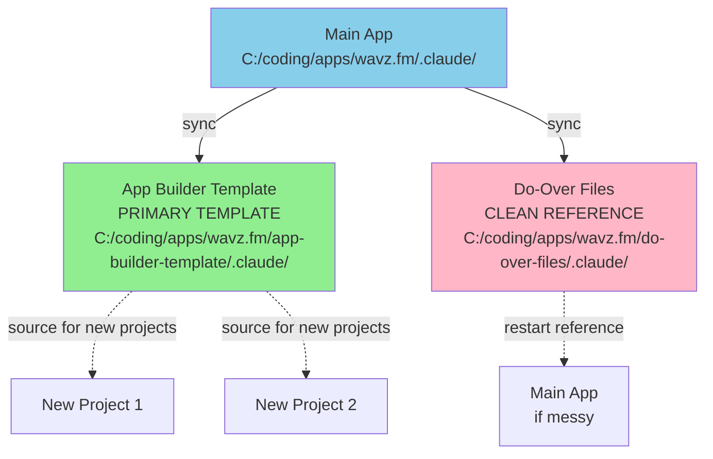
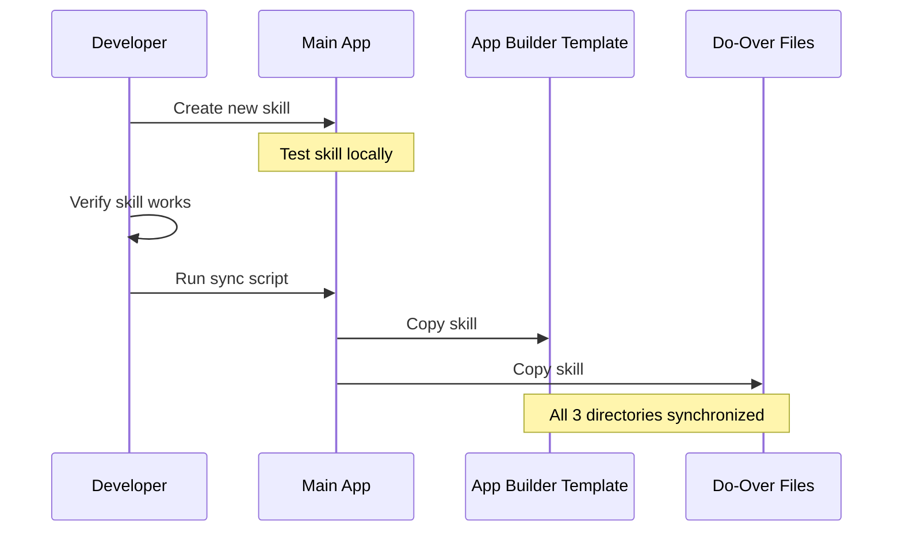

# Maintaining Trinary Sync

Automated synchronization system for Claude Code configurations across three repository directories ensuring consistent development experience.

## What This Skill Does

Keeps Claude Code artifacts synchronized across three critical directories:

1. **Main App**: `C:\coding\apps\wavz.fm\.claude\` - Active development directory
2. **App Builder Template**: `C:\coding\apps\wavz.fm\app-builder-template\.claude\` - **Primary template** for new projects
3. **Do-Over Files**: `C:\coding\apps\wavz.fm\do-over-files\.claude\` - Clean restart reference

**Synchronized Artifacts**:
- Skills (`skills/`)
- Agents (`agents/`)
- MCP configurations (`mcp.json`)
- Subagents (`subagents/`)
- Custom hooks and scripts

## Quick Start

### Sync All Directories

```bash
# Sync everything from main to template and do-over
node scripts/sync-all.js

# Output:
# ✅ Synced 28 skills
# ✅ Synced 19 agents
# ✅ Synced MCP config
```

### Sync Specific Skill

```bash
# Sync a single skill to all locations
node scripts/sync-skill.js designing-convex-schemas

# Output:
# ✅ Synced designing-convex-schemas to:
#    - app-builder-template/.claude/skills/
#    - do-over-files/.claude/skills/
```

### Verify Sync Status

```bash
# Check which directories are out of sync
node scripts/check-sync.js

# Output:
# ⚠️  Out of sync:
#    - app-builder-template missing: explaining-complex-concepts
#    - do-over-files outdated: processing-stripe-payments
```

---

## Trinary Sync Architecture



## Directory Roles

### Main App (`wavz.fm/.claude/`)
**Role**: Active development and testing
- Where new skills/agents are created
- Where changes are tested first
- Source of truth for current state

### App Builder Template (`app-builder-template/.claude/`)
**Role**: **PRIMARY TEMPLATE** for new projects
- **Most important** - used to bootstrap all new projects
- Should always have the latest stable versions
- Must stay in perfect sync with main
- New projects copy from here

### Do-Over Files (`do-over-files/.claude/`)
**Role**: Clean restart reference
- Maintains pristine version of configurations
- Used when main app becomes messy
- Provides clean slate without losing work

---

## Sync Workflow

### After Creating New Skill



### After Modifying Existing Skill

1. **Edit in main app**: Make changes to `.claude/skills/skill-name/`
2. **Test changes**: Verify skill works as expected
3. **Sync to other locations**: Run `node scripts/sync-skill.js skill-name`
4. **Commit all three**: Git commit includes all 3 directories

---

## Sync Scripts

### sync-all.js

**Purpose**: Synchronize entire `.claude/` directory

```javascript
// Syncs:
// - skills/
// - agents/
// - subagents/
// - mcp.json
// - hooks/

node scripts/sync-all.js [--dry-run] [--verbose]

// Options:
// --dry-run: Show what would be synced without copying
// --verbose: Show detailed file-by-file progress
```

**Use Cases**:
- After creating multiple new skills
- After major refactoring
- Weekly sync to ensure no drift
- Before creating new project from template

### sync-skill.js

**Purpose**: Synchronize a single skill

```javascript
node scripts/sync-skill.js <skill-name> [--force]

// Arguments:
// skill-name: Name of skill (e.g., designing-convex-schemas)
//
// Options:
// --force: Overwrite even if destination is newer
```

**Use Cases**:
- After creating new skill
- After modifying existing skill
- Quick sync of single item

### sync-agent.js

**Purpose**: Synchronize a single agent file

```javascript
node scripts/sync-agent.js <agent-name> [--force]

// Arguments:
// agent-name: Agent filename without .md (e.g., convex-database-agent)
```

### check-sync.js

**Purpose**: Verify synchronization status

```javascript
node scripts/check-sync.js [--fix]

// Checks:
// - Missing skills in template/do-over
// - Outdated files (based on mtime)
// - Mismatched file sizes
//
// Options:
// --fix: Automatically sync any differences
```

**Output**:
```
Sync Status Report
==================

✅ In Sync:
   - 25 skills
   - 18 agents
   - mcp.json

⚠️  Out of Sync:
   - app-builder-template missing: skill-a, skill-b
   - do-over-files outdated: agent-x (main: 2024-01-05, do-over: 2024-01-03)

❌ Conflicts:
   - designing-convex-schemas: do-over newer than main (manual review needed)
```

---

## Sync Strategies

### Full Sync (Recommended Weekly)

```bash
# Complete synchronization
node scripts/sync-all.js

# With verification
node scripts/sync-all.js && node scripts/check-sync.js
```

### Incremental Sync (After Each Change)

```bash
# After creating/modifying a skill
node scripts/sync-skill.js new-skill-name

# After updating an agent
node scripts/sync-agent.js agent-name
```

### Verification Sync (Before Important Operations)

```bash
# Before creating new project from template
node scripts/check-sync.js --fix

# Before committing to git
node scripts/check-sync.js
```

---

## Automation Options

### Git Pre-Commit Hook

Automatically sync before each commit:

```bash
#!/bin/bash
# .git/hooks/pre-commit

echo "Checking Claude Code sync status..."
cd "C:/coding/apps/wavz.fm"
node .claude/skills/maintaining-trinary-sync/scripts/check-sync.js

if [ $? -ne 0 ]; then
  echo "⚠️  Directories out of sync. Run: node scripts/sync-all.js"
  exit 1
fi
```

### VS Code Task

Add to `.vscode/tasks.json`:

```json
{
  "label": "Sync Claude Code",
  "type": "shell",
  "command": "node",
  "args": [
    "${workspaceFolder}/.claude/skills/maintaining-trinary-sync/scripts/sync-all.js"
  ],
  "problemMatcher": [],
  "group": "build"
}
```

### NPM Script

Add to `package.json`:

```json
{
  "scripts": {
    "sync:claude": "node .claude/skills/maintaining-trinary-sync/scripts/sync-all.js",
    "sync:check": "node .claude/skills/maintaining-trinary-sync/scripts/check-sync.js"
  }
}
```

---

## Best Practices

### When to Sync

**Always Sync**:
- ✅ After creating new skill
- ✅ After creating new agent
- ✅ After modifying MCP config
- ✅ Before committing to git
- ✅ Before creating new project from template

**Optional Sync**:
- ⚠️ During active development (wait until feature complete)
- ⚠️ Experimental changes (may want to keep isolated)

### Conflict Resolution

**If do-over or template is newer than main**:
1. Review differences
2. Determine which version is correct
3. Use `--force` to overwrite if main is correct
4. Or copy from do-over/template to main if they're correct

**Manual review needed when**:
- File sizes differ significantly
- Last modified dates suggest divergent changes
- Skill structure changed (added/removed files)

### Safety Checks

**Before syncing**:
```bash
# 1. Verify main app works
# Test skills locally first

# 2. Check status
node scripts/check-sync.js

# 3. Dry run
node scripts/sync-all.js --dry-run

# 4. Actual sync
node scripts/sync-all.js

# 5. Verify success
node scripts/check-sync.js
```

---

## Troubleshooting

### Sync Script Fails

**Problem**: Permission denied or file locked

**Solution**:
```bash
# Close editors/IDEs that might lock files
# Run with elevated permissions if needed
# Check file isn't read-only
```

### Directories Out of Sync

**Problem**: check-sync reports many differences

**Solution**:
```bash
# Force full resync
node scripts/sync-all.js --force

# Or sync individually
node scripts/sync-skill.js skill-name --force
```

### Conflicting Changes

**Problem**: Both main and do-over modified same file

**Solution**:
1. Compare files manually
2. Merge changes if both contain improvements
3. Force overwrite one direction with `--force`
4. Document decision in commit message

### New Project Missing Skills

**Problem**: Created project from template but skills missing

**Solution**:
```bash
# Ensure template is up to date first
cd C:/coding/apps/wavz.fm
node .claude/skills/maintaining-trinary-sync/scripts/check-sync.js --fix

# Then recreate project from template
```

---

## File Structure

### What Gets Synced

```
.claude/
├── skills/           # ✅ Synced
│   └── skill-name/
│       ├── SKILL.md
│       ├── scripts/
│       └── resources/
├── agents/           # ✅ Synced
│   └── agent-name.md
├── subagents/        # ✅ Synced
│   └── subagent-name.md
└── mcp.json          # ✅ Synced
```

### What Doesn't Get Synced

```
.claude/
├── .cache/          # ❌ Local only
├── logs/            # ❌ Local only
└── temp/            # ❌ Local only
```

---

## Integration with Git

### Recommended Git Workflow

```bash
# 1. Make changes in main
# ... create/modify skills/agents ...

# 2. Sync to other directories
node scripts/sync-all.js

# 3. Stage all three locations
git add .claude/ app-builder-template/.claude/ do-over-files/.claude/

# 4. Commit with description
git commit -m "Add new skill: feature-name

- Created feature-name skill with scripts and resources
- Synced to app-builder-template and do-over-files"

# 5. Push
git push
```

---

## Advanced Usage

### Selective Sync

Sync only skills, not agents:

```javascript
node scripts/sync-all.js --include skills --exclude agents
```

### Backup Before Sync

```bash
# Create backup of template and do-over
node scripts/backup-before-sync.js
node scripts/sync-all.js
```

### Sync Report

```bash
# Generate detailed sync report
node scripts/sync-all.js --report > sync-report-$(date +%Y%m%d).txt
```

---

## Related Skills

- **creating-claude-skills**: How to create new skills
- **creating-claude-agents**: How to create new agents
- **managing-git-workflows**: Git best practices for Claude Code

## References

- Sync script implementation: `scripts/sync-all.js`
- Conflict resolution guide: `resources/conflict-resolution.md`
- Directory structure reference: `resources/directory-structure.md`

