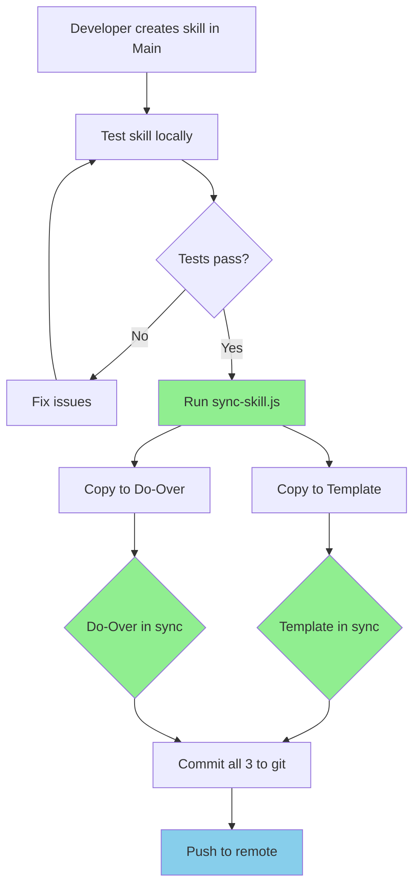

# Directory Structure Reference

Complete guide to the trinary sync directory structure and file organization.

## Overview

The trinary sync system maintains three synchronized `.claude/` directories:

```
C:\coding\apps\wavz.fm\
├── .claude/                           # Main App (Active Development)
├── app-builder-template/.claude/      # PRIMARY TEMPLATE (New Projects)
└── do-over-files/.claude/             # Clean Reference (Restart Source)
```

---

## Directory Roles

### 1. Main App: `wavz.fm/.claude/`

**Purpose**: Active development and testing

**Characteristics**:
- Where all new skills and agents are created
- Where modifications are tested
- May contain experimental features
- Source of truth for current development state

**Workflow**:
1. Create new skill/agent here
2. Test locally
3. Sync to other locations when stable

**When to use**:
- Creating new skills
- Modifying existing skills
- Testing changes
- Daily development work

---

### 2. App Builder Template: `app-builder-template/.claude/`

**Purpose**: **PRIMARY TEMPLATE** for creating new projects

**Characteristics**:
- **Most important directory** - source for all new projects
- Should always contain latest stable versions
- Must stay in perfect sync with main
- Used by `npx create-...` or manual project setup
- Should never have experimental code

**Workflow**:
1. Receives synced skills from main after testing
2. New projects copy from here
3. Always production-ready

**When to use**:
- Starting new projects
- Creating project templates
- Bootstrapping applications

**Critical**:
- New project command should use this directory
- Every sync from main is important
- Never manually edit - always sync from main

---

### 3. Do-Over Files: `do-over-files/.claude/`

**Purpose**: Clean restart reference and backup

**Characteristics**:
- Maintains pristine versions of all configurations
- Used when main app becomes messy
- Provides clean slate without losing work
- Backup in case of accidental deletions

**Workflow**:
1. Receives synced skills from main
2. Sits idle until needed
3. Copied back to main when restart needed

**When to use**:
- Main app has too many experimental changes
- Want to start fresh but keep configurations
- Accidentally deleted/corrupted files in main
- Need known-good versions

---

## File Structure

### Complete .claude/ Directory Layout

```
.claude/
├── agents/                  # ✅ Synced
│   ├── agent-name-1.md
│   ├── agent-name-2.md
│   └── agent-name-3.md
│
├── skills/                  # ✅ Synced
│   ├── skill-name-1/
│   │   ├── SKILL.md         # Required
│   │   ├── scripts/         # Optional
│   │   │   ├── script1.js
│   │   │   └── script2.py
│   │   └── resources/       # Optional
│   │       ├── reference.md
│   │       └── examples.md
│   │
│   └── skill-name-2/
│       └── SKILL.md
│
├── subagents/               # ✅ Synced (if exists)
│   ├── subagent-1.md
│   └── subagent-2.md
│
├── mcp.json                 # ✅ Synced (if exists)
│
├── .cache/                  # ❌ Local only (not synced)
│   └── temp-data/
│
├── logs/                    # ❌ Local only (not synced)
│   └── session-logs/
│
└── temp/                    # ❌ Local only (not synced)
    └── scratch/
```

---

## Synced vs Local Files

### Always Synced

These files/directories are synchronized across all three locations:

**Skills** (`skills/`):
- Complete skill folders
- SKILL.md files
- scripts/ subdirectories
- resources/ subdirectories
- All nested files

**Agents** (`agents/`):
- All .md agent files
- Agent configurations

**Subagents** (`subagents/`):
- All .md subagent files
- Subagent configurations

**MCP Configuration** (`mcp.json`):
- MCP server configurations
- Connection settings

**Hooks** (`hooks/`):
- Pre-commit hooks
- Post-command hooks
- Custom automation scripts

---

### Never Synced (Local Only)

These directories remain local to each location:

**.cache/** - Temporary cache files
- Session caches
- Computed results
- Temporary data
**Why not synced**: Machine-specific, regenerates automatically

**logs/** - Session logs
- Development logs
- Error logs
- Debug output
**Why not synced**: Machine-specific, not needed elsewhere

**temp/** - Temporary files
- Scratch files
- Work in progress
- Experimental code
**Why not synced**: Temporary by nature

**.gitignore** - Git ignore rules
**Why not synced**: May differ per location

---

## Skill Directory Structure

### Complete Skill Layout

```
skills/skill-name/
├── SKILL.md              # ✅ Required - Main instructions
├── scripts/              # ⚠️  Optional - Executable utilities
│   ├── script1.js        # JavaScript utilities
│   ├── script2.py        # Python utilities
│   ├── script3.sh        # Shell scripts
│   └── README.md         # Script documentation
└── resources/            # ⚠️  Optional - Reference documentation
    ├── reference.md      # API references
    ├── examples.md       # Code examples
    ├── troubleshooting.md# Debug guides
    └── diagrams/         # Visual aids
        └── architecture.mmd
```

### SKILL.md Structure

```markdown
---
name: skill-identifier
description: What it does + when to use it (max 1024 chars)
---

# Skill Title

## Quick Start
[Essential getting started info]

## Common Patterns
[Frequently used examples]

## Best Practices
[Key guidelines]

## Advanced Usage
For detailed information:
- Reference: resources/reference.md
- Examples: resources/examples.md
```

---

## Agent File Structure

### Agent .md Layout

```markdown
---
name: Agent Name
description: What the agent specializes in
model: claude-sonnet-4-5
permissionMode: auto
tools:
  - Read
  - Write
  - Edit
  - Bash
skills:
  - skill-name-1
  - skill-name-2
---

Agent system prompt goes here.
Describes what the agent should do.
```

---

## MCP Configuration Structure

### mcp.json Layout

```json
{
  "mcpServers": {
    "server-name": {
      "command": "npx",
      "args": ["@package/server", "arg1", "arg2"],
      "env": {
        "API_KEY": "key-value"
      }
    },
    "another-server": {
      "command": "python",
      "args": ["-m", "module.server"]
    }
  }
}
```

---

## Sync Flow Diagram



---

## Size Considerations

### Typical Directory Sizes

```
Main App (.claude/):
├── skills/ (28 skills)      ~15 MB
├── agents/ (19 agents)      ~500 KB
├── subagents/               ~200 KB
├── mcp.json                 ~5 KB
└── Total                    ~16 MB

Template (.claude/):
└── Same as main             ~16 MB

Do-Over (.claude/):
└── Same as main             ~16 MB

Total across 3 locations:    ~48 MB
```

### Growth Projections

With Phase 2 complete (51 skills):
- Per location: ~30 MB
- Total (3 locations): ~90 MB

---

## Backup Strategy

### Automatic Backups

The trinary system itself provides redundancy:
- **3 copies** of every file
- **2 separate directories** as backup (template + do-over)
- **Git version control** for all three

### Manual Backups

Before major changes:
```bash
# Create dated backup
cp -r .claude .claude.backup-$(date +%Y%m%d)

# Or use git tag
git tag -a backup-$(date +%Y%m%d) -m "Backup before major changes"
```

---

## Migration Guide

### Setting Up Trinary Sync on Existing Project

If you have an existing project with only main `.claude/`:

```bash
# 1. Create template directory
mkdir -p app-builder-template/.claude

# 2. Create do-over directory
mkdir -p do-over-files/.claude

# 3. Initial sync
node .claude/skills/maintaining-trinary-sync/scripts/sync-all.js

# 4. Verify
node .claude/skills/maintaining-trinary-sync/scripts/check-sync.js

# 5. Commit all three
git add .claude/ app-builder-template/.claude/ do-over-files/.claude/
git commit -m "Set up trinary sync system"
```

### Migrating from Do-Over to Main

If main is messy and you want to restart from do-over:

```bash
# 1. Backup main
mv .claude .claude.backup

# 2. Copy from do-over
cp -r do-over-files/.claude .claude

# 3. Test
# Verify skills work

# 4. Resume development
# Continue working in main
```

---

## Best Practices

### Directory Hygiene

**Main App**:
- Keep clean of experimental code after testing
- Delete obsolete skills/agents
- Regular cleanup of local files (.cache, logs)

**Template**:
- **Never edit directly** - always sync from main
- Verify periodically with check-sync.js
- Should be immediately usable for new projects

**Do-Over**:
- Keep pristine - no manual edits
- Use as reference only
- Update via sync only

### Sync Frequency

**After every**:
- New skill created
- New agent created
- MCP config changed
- Skill modified (after testing)

**Weekly**:
- Full sync verification
- Run check-sync.js

**Before**:
- Creating new project
- Major refactoring
- Git commits

---

## Troubleshooting

### Directories Out of Sync

**Symptom**: check-sync.js reports many differences

**Solution**:
```bash
# Review differences
node scripts/check-sync.js

# Fix automatically
node scripts/check-sync.js --fix

# Or manual full sync
node scripts/sync-all.js
```

### Missing Directories

**Symptom**: Sync fails with "directory not found"

**Solution**:
```bash
# Recreate structure
mkdir -p app-builder-template/.claude/skills
mkdir -p app-builder-template/.claude/agents
mkdir -p do-over-files/.claude/skills
mkdir -p do-over-files/.claude/agents

# Run sync again
node scripts/sync-all.js
```

### Merge Conflicts

**Symptom**: Different versions in different locations

**Solution**:
1. Identify which is correct
2. Use --force to overwrite
3. Document decision
4. Commit with explanation

---

## Integration with Other Tools

### Git Hooks

Pre-commit hook to verify sync:
```bash
#!/bin/bash
if ! node .claude/skills/maintaining-trinary-sync/scripts/check-sync.js; then
  echo "Fix sync before committing"
  exit 1
fi
```

### CI/CD

GitHub Actions verification:
```yaml
- name: Verify Trinary Sync
  run: node .claude/skills/maintaining-trinary-sync/scripts/check-sync.js
```

---

## References

- Sync scripts: `../scripts/`
- Skill creation guide: `../../creating-claude-skills/SKILL.md`
- Git workflow integration: `../../managing-git-workflows/SKILL.md`

