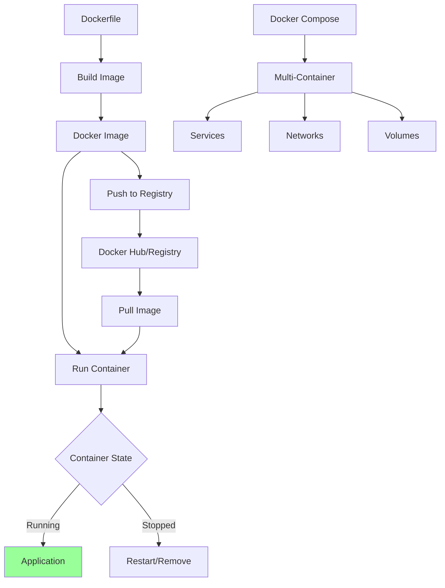

# Managing Docker Containers

Comprehensive guide to Docker container management, from basic commands to production deployments.

## What This Skill Does

Master Docker containerization:

- **Container lifecycle**: Build, run, stop, remove containers
- **Image management**: Create, push, pull, optimize images
- **Docker Compose**: Multi-container orchestration
- **Networking**: Container communication and port mapping
- **Volumes**: Data persistence and sharing
- **Production**: Best practices and optimization

## Quick Start

### Run Container

```bash
docker run -d -p 3000:3000 --name myapp node:18
```

### Build Image

```bash
docker build -t myapp:latest .
```

### Use Docker Compose

```bash
docker-compose up -d
```

---

## Docker Workflow



---

## Basic Commands

### Container Management

```bash
# Run container
docker run -d -p 8080:80 --name web nginx

# List running containers
docker ps

# List all containers
docker ps -a

# Stop container
docker stop web

# Start stopped container
docker start web

# Restart container
docker restart web

# Remove container
docker rm web

# Force remove running container
docker rm -f web

# View container logs
docker logs web
docker logs -f web  # Follow logs

# Execute command in container
docker exec -it web bash
docker exec web ls /app

# Copy files to/from container
docker cp file.txt web:/app/
docker cp web:/app/output.txt ./

# View container stats
docker stats web

# Inspect container
docker inspect web
```

### Image Management

```bash
# List images
docker images

# Pull image
docker pull node:18

# Build image
docker build -t myapp:latest .

# Build with custom Dockerfile
docker build -f Dockerfile.prod -t myapp:prod .

# Tag image
docker tag myapp:latest myapp:v1.0.0

# Push to registry
docker push username/myapp:latest

# Remove image
docker rmi myapp:latest

# Remove unused images
docker image prune

# Remove all unused data
docker system prune -a
```

---

## Dockerfile

### Basic Dockerfile

```dockerfile
# Use official Node.js image
FROM node:18-alpine

# Set working directory
WORKDIR /app

# Copy package files
COPY package*.json ./

# Install dependencies
RUN npm ci --only=production

# Copy application code
COPY . .

# Build application
RUN npm run build

# Expose port
EXPOSE 3000

# Set environment
ENV NODE_ENV=production

# Start application
CMD ["npm", "start"]
```

### Multi-Stage Build

```dockerfile
# Stage 1: Build
FROM node:18-alpine AS builder

WORKDIR /app

COPY package*.json ./
RUN npm ci

COPY . .
RUN npm run build

# Stage 2: Production
FROM node:18-alpine

WORKDIR /app

# Copy only necessary files from builder
COPY --from=builder /app/package*.json ./
COPY --from=builder /app/dist ./dist

# Install only production dependencies
RUN npm ci --only=production

EXPOSE 3000

CMD ["node", "dist/index.js"]
```

### Best Practices Dockerfile

```dockerfile
# Use specific version (not 'latest')
FROM node:18.17.0-alpine3.18

# Create non-root user
RUN addgroup -g 1001 -S nodejs && \
    adduser -S nextjs -u 1001

WORKDIR /app

# Copy package files first (better caching)
COPY --chown=nextjs:nodejs package*.json ./

# Install dependencies
RUN npm ci --only=production && \
    npm cache clean --force

# Copy application code
COPY --chown=nextjs:nodejs . .

# Build if needed
RUN npm run build

# Switch to non-root user
USER nextjs

# Health check
HEALTHCHECK --interval=30s --timeout=3s --start-period=5s --retries=3 \
  CMD node healthcheck.js

EXPOSE 3000

# Use array syntax for CMD
CMD ["node", "server.js"]
```

---

## Docker Compose

### Basic docker-compose.yml

```yaml
version: '3.8'

services:
  app:
    build: .
    ports:
      - "3000:3000"
    environment:
      - NODE_ENV=production
      - DATABASE_URL=postgresql://postgres:password@db:5432/mydb
    depends_on:
      - db
    volumes:
      - ./logs:/app/logs

  db:
    image: postgres:15-alpine
    environment:
      - POSTGRES_USER=postgres
      - POSTGRES_PASSWORD=password
      - POSTGRES_DB=mydb
    volumes:
      - pgdata:/var/lib/postgresql/data
    ports:
      - "5432:5432"

volumes:
  pgdata:
```

### Full-Stack Application

```yaml
version: '3.8'

services:
  # Next.js Frontend
  frontend:
    build:
      context: ./frontend
      dockerfile: Dockerfile
    ports:
      - "3000:3000"
    environment:
      - NEXT_PUBLIC_API_URL=http://api:4000
    depends_on:
      - api
    networks:
      - app-network

  # Express API
  api:
    build:
      context: ./backend
      dockerfile: Dockerfile
    ports:
      - "4000:4000"
    environment:
      - DATABASE_URL=postgresql://postgres:password@db:5432/mydb
      - REDIS_URL=redis://cache:6379
    depends_on:
      db:
        condition: service_healthy
      cache:
        condition: service_started
    networks:
      - app-network

  # PostgreSQL Database
  db:
    image: postgres:15-alpine
    environment:
      - POSTGRES_USER=postgres
      - POSTGRES_PASSWORD=password
      - POSTGRES_DB=mydb
    volumes:
      - postgres_data:/var/lib/postgresql/data
    healthcheck:
      test: ["CMD-SHELL", "pg_isready -U postgres"]
      interval: 10s
      timeout: 5s
      retries: 5
    networks:
      - app-network

  # Redis Cache
  cache:
    image: redis:7-alpine
    command: redis-server --appendonly yes
    volumes:
      - redis_data:/data
    networks:
      - app-network

  # Nginx Reverse Proxy
  nginx:
    image: nginx:alpine
    ports:
      - "80:80"
    volumes:
      - ./nginx.conf:/etc/nginx/nginx.conf:ro
    depends_on:
      - frontend
      - api
    networks:
      - app-network

volumes:
  postgres_data:
  redis_data:

networks:
  app-network:
    driver: bridge
```

### Docker Compose Commands

```bash
# Start services
docker-compose up -d

# Start specific service
docker-compose up -d frontend

# View logs
docker-compose logs -f

# View logs for specific service
docker-compose logs -f api

# List services
docker-compose ps

# Stop services
docker-compose stop

# Stop and remove containers
docker-compose down

# Stop, remove, and delete volumes
docker-compose down -v

# Build services
docker-compose build

# Rebuild without cache
docker-compose build --no-cache

# Execute command in service
docker-compose exec api npm run migrate

# Scale service
docker-compose up -d --scale api=3
```

---

## Networking

### Network Types

```bash
# Create bridge network (default)
docker network create mynetwork

# Create host network
docker network create --driver host mynetwork

# List networks
docker network ls

# Inspect network
docker network inspect mynetwork

# Connect container to network
docker network connect mynetwork container1

# Disconnect
docker network disconnect mynetwork container1

# Remove network
docker network rm mynetwork
```

### Container Communication

```yaml
# docker-compose.yml
services:
  frontend:
    image: myapp-frontend
    networks:
      - frontend-network

  api:
    image: myapp-api
    networks:
      - frontend-network
      - backend-network

  db:
    image: postgres
    networks:
      - backend-network

networks:
  frontend-network:
  backend-network:
```

```bash
# Frontend can reach API at http://api:4000
# API can reach DB at postgresql://db:5432
# Frontend CANNOT reach DB (different network)
```

### Port Mapping

```bash
# Map port 8080 on host to 80 in container
docker run -p 8080:80 nginx

# Map to specific interface
docker run -p 127.0.0.1:8080:80 nginx

# Map random port
docker run -P nginx

# Map multiple ports
docker run -p 3000:3000 -p 3001:3001 myapp
```

---

## Volumes

### Volume Types

**1. Named volumes** (managed by Docker):
```bash
# Create volume
docker volume create mydata

# Use volume
docker run -v mydata:/data myapp

# List volumes
docker volume ls

# Inspect volume
docker volume inspect mydata

# Remove volume
docker volume rm mydata
```

**2. Bind mounts** (host directory):
```bash
# Mount host directory
docker run -v /host/path:/container/path myapp

# Read-only mount
docker run -v /host/path:/container/path:ro myapp

# In docker-compose
services:
  app:
    volumes:
      - ./src:/app/src  # Development
      - data:/app/data  # Named volume
```

**3. tmpfs mounts** (in-memory):
```bash
# Create tmpfs mount
docker run --tmpfs /tmp myapp

# In docker-compose
services:
  app:
    tmpfs:
      - /tmp
```

### Volume Management

```yaml
# docker-compose.yml
version: '3.8'

services:
  app:
    image: myapp
    volumes:
      # Named volume
      - app-data:/app/data

      # Bind mount (development)
      - ./src:/app/src:delegated

      # Read-only config
      - ./config.yml:/app/config.yml:ro

volumes:
  app-data:
    driver: local
    driver_opts:
      type: none
      o: bind
      device: /path/on/host
```

---

## Environment Variables

### Passing Variables

```bash
# Single variable
docker run -e NODE_ENV=production myapp

# Multiple variables
docker run -e NODE_ENV=production -e PORT=3000 myapp

# From file
docker run --env-file .env myapp
```

### .env File

```env
# .env
NODE_ENV=production
PORT=3000
DATABASE_URL=postgresql://localhost/mydb
REDIS_URL=redis://localhost:6379
```

### In Docker Compose

```yaml
services:
  app:
    image: myapp
    environment:
      # Direct values
      - NODE_ENV=production
      - PORT=3000

      # From host environment
      - DATABASE_URL=${DATABASE_URL}

      # From .env file
    env_file:
      - .env
```

---

## Production Best Practices

### Image Optimization

**1. Use multi-stage builds**:
```dockerfile
# Reduces final image size
FROM node:18 AS builder
# ... build steps ...

FROM node:18-alpine
COPY --from=builder /app/dist ./dist
```

**2. Minimize layers**:
```dockerfile
# Bad: Multiple layers
RUN apt-get update
RUN apt-get install -y curl
RUN apt-get install -y git

# Good: Single layer
RUN apt-get update && \
    apt-get install -y curl git && \
    rm -rf /var/lib/apt/lists/*
```

**3. Use .dockerignore**:
```
node_modules
.git
.env
*.md
.DS_Store
npm-debug.log
```

**4. Optimize layer caching**:
```dockerfile
# Copy package files first (changes less often)
COPY package*.json ./
RUN npm ci

# Copy source code last (changes more often)
COPY . .
```

### Security

**1. Don't run as root**:
```dockerfile
USER node  # Built-in non-root user
```

**2. Scan for vulnerabilities**:
```bash
docker scan myapp:latest
```

**3. Use specific image tags**:
```dockerfile
# Bad
FROM node:latest

# Good
FROM node:18.17.0-alpine3.18
```

**4. Remove unnecessary tools**:
```dockerfile
FROM node:18-alpine
# Alpine is minimal, no unnecessary packages
```

### Health Checks

```dockerfile
HEALTHCHECK --interval=30s --timeout=3s --start-period=5s --retries=3 \
  CMD curl -f http://localhost:3000/health || exit 1
```

```yaml
# docker-compose.yml
services:
  app:
    healthcheck:
      test: ["CMD", "curl", "-f", "http://localhost:3000/health"]
      interval: 30s
      timeout: 3s
      retries: 3
      start_period: 40s
```

---

## CI/CD Integration

### GitHub Actions

```yaml
# .github/workflows/docker.yml
name: Build and Push Docker Image

on:
  push:
    branches: [main]

jobs:
  build:
    runs-on: ubuntu-latest

    steps:
      - uses: actions/checkout@v3

      - name: Set up Docker Buildx
        uses: docker/setup-buildx-action@v2

      - name: Login to Docker Hub
        uses: docker/login-action@v2
        with:
          username: ${{ secrets.DOCKER_USERNAME }}
          password: ${{ secrets.DOCKER_PASSWORD }}

      - name: Build and push
        uses: docker/build-push-action@v4
        with:
          context: .
          push: true
          tags: username/myapp:latest
          cache-from: type=registry,ref=username/myapp:latest
          cache-to: type=inline
```

### Build Script

```bash
#!/bin/bash
# scripts/build-docker.sh

set -e

IMAGE_NAME="myapp"
VERSION=$(git describe --tags --always)

echo "Building $IMAGE_NAME:$VERSION"

# Build image
docker build \
  -t $IMAGE_NAME:$VERSION \
  -t $IMAGE_NAME:latest \
  --build-arg VERSION=$VERSION \
  .

# Run tests
docker run --rm $IMAGE_NAME:$VERSION npm test

# Push to registry
docker push $IMAGE_NAME:$VERSION
docker push $IMAGE_NAME:latest

echo "✓ Build complete: $IMAGE_NAME:$VERSION"
```

---

## Troubleshooting

### Common Issues

**1. Container exits immediately**:
```bash
# Check logs
docker logs container_name

# Check exit code
docker inspect container_name --format='{{.State.ExitCode}}'

# Run interactively
docker run -it myapp sh
```

**2. Port already in use**:
```bash
# Find process using port
lsof -i :3000

# Use different port
docker run -p 3001:3000 myapp
```

**3. Permission issues**:
```bash
# Run as current user
docker run --user $(id -u):$(id -g) myapp

# Fix volume permissions
docker run --rm -v myvolume:/data alpine chmod -R 777 /data
```

**4. Out of disk space**:
```bash
# Check disk usage
docker system df

# Clean up
docker system prune -a
docker volume prune
```

---

## Useful Patterns

### Development Setup

```yaml
# docker-compose.dev.yml
version: '3.8'

services:
  app:
    build:
      context: .
      target: development
    volumes:
      - ./src:/app/src  # Hot reload
      - /app/node_modules  # Don't override
    environment:
      - NODE_ENV=development
    command: npm run dev
```

### Database Migrations

```yaml
services:
  migrate:
    image: myapp:latest
    command: npm run migrate
    depends_on:
      db:
        condition: service_healthy
```

### Monitoring

```yaml
services:
  prometheus:
    image: prom/prometheus
    volumes:
      - ./prometheus.yml:/etc/prometheus/prometheus.yml
    ports:
      - "9090:9090"

  grafana:
    image: grafana/grafana
    ports:
      - "3001:3000"
    depends_on:
      - prometheus
```

---

## Advanced Topics

For detailed information:
- **Multi-Container Apps**: `resources/multi-container-apps.md`
- **Docker Orchestration**: `resources/orchestration.md`
- **Production Deployment**: `resources/production-deployment.md`
- **Security Hardening**: `resources/security-hardening.md`

## References

- [Docker Documentation](https://docs.docker.com/)
- [Docker Compose](https://docs.docker.com/compose/)
- [Dockerfile Best Practices](https://docs.docker.com/develop/develop-images/dockerfile_best-practices/)
- [Docker Security](https://docs.docker.com/engine/security/)

