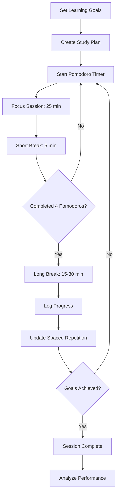
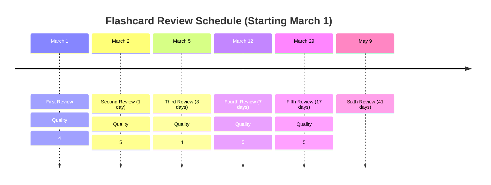
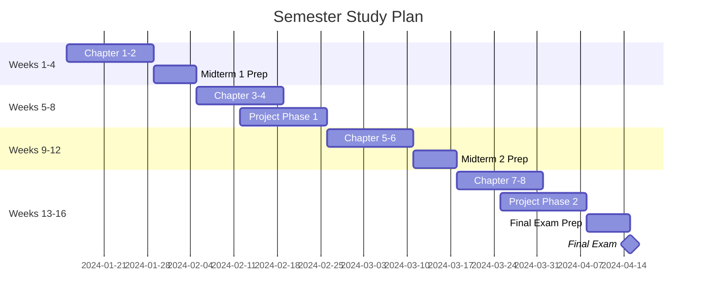
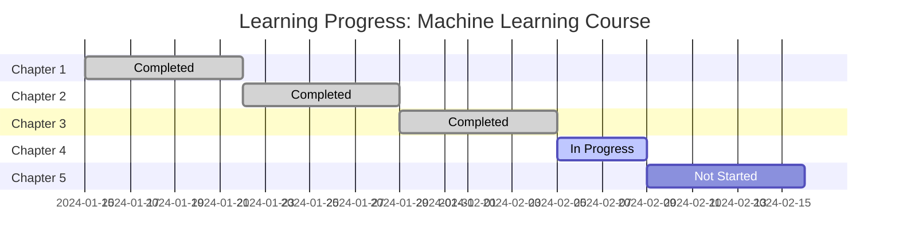

# Managing Study Sessions

Evidence-based study session planning and tracking system that optimizes learning through proven techniques and progress analytics.

## What This Skill Does

Manages all aspects of effective study sessions:

- **Pomodoro technique integration**: 25-min focus + 5-min breaks
- **Spaced repetition**: SM-2 algorithm for optimal review timing
- **Study plan generation**: Personalized schedules based on goals
- **Progress tracking**: Time spent, topics covered, mastery levels
- **Break optimization**: Strategic rest for sustained focus
- **Focus analytics**: Productivity insights and improvements

## Quick Start

### Plan Study Session

```bash
node scripts/plan-session.js topic.json session-plan.md --duration 120
```

### Calculate Spaced Repetition

```bash
node scripts/calculate-spaced-repetition.js flashcards.json schedule.json
```

### Track Progress

```bash
node scripts/track-progress.js session-log.json progress-report.md
```

---

## Study Session Workflow



---

## Pomodoro Technique

### Classic Pomodoro Structure

```
Session 1: ██████████████████████████ (25 min) → ████ (5 min break)
Session 2: ██████████████████████████ (25 min) → ████ (5 min break)
Session 3: ██████████████████████████ (25 min) → ████ (5 min break)
Session 4: ██████████████████████████ (25 min) → ████████████ (15 min break)

Repeat cycle...
```

### Pomodoro Session Template

```markdown
## Study Session: [Topic]
**Date**: 2024-03-15
**Total Time**: 2 hours (4 Pomodoros)

### Pomodoro 1 (9:00-9:25)
**Task**: Read Chapter 5, Sections 5.1-5.2
**Completed**: ✓
**Distractions**: 0
**Focus Level**: 4/5

**Break (9:25-9:30)**: 5 minutes
**Activity**: Stretch, water

### Pomodoro 2 (9:30-9:55)
**Task**: Take notes on Section 5.2
**Completed**: ✓
**Distractions**: 2 (phone notifications)
**Focus Level**: 3/5

**Break (9:55-10:00)**: 5 minutes

### Pomodoro 3 (10:00-10:25)
**Task**: Create flashcards from notes
**Completed**: ✓
**Distractions**: 0
**Focus Level**: 5/5

**Break (10:25-10:30)**: 5 minutes

### Pomodoro 4 (10:30-10:55)
**Task**: Practice problems 1-5
**Completed**: ⚠️  (Completed 3/5)
**Distractions**: 1
**Focus Level**: 4/5

**Long Break (10:55-11:10)**: 15 minutes
**Activity**: Walk outside, snack

---

**Session Summary**:
- Total Pomodoros: 4
- Total Focus Time: 100 minutes
- Average Focus Level: 4/5
- Total Distractions: 3
- Completion Rate: 87.5%
```

### Modified Pomodoro Variations

**Extended Pomodoro** (for deep work):
- Focus: 50 minutes
- Break: 10 minutes
- Long break: 30 minutes (after 2 sessions)

**Short Pomodoro** (for difficult material):
- Focus: 15 minutes
- Break: 3 minutes
- Long break: 10 minutes (after 4 sessions)

**Flexible Pomodoro** (task-based):
- Focus: Until subtask complete (max 45 min)
- Break: Proportional (1 min per 5 min work)

---

## Spaced Repetition System

### SM-2 Algorithm

**Core Principle**: Review material at increasing intervals based on recall quality

**Formula**:
```
If quality ≥ 3:
    interval = previous_interval × easiness_factor
    easiness_factor = max(1.3, ef + (0.1 - (5 - quality) × (0.08 + (5 - quality) × 0.02)))

If quality < 3:
    interval = 1 day (reset)
    repetition = 0 (restart)
```

### Quality Ratings (0-5)

- **5**: Perfect recall, easy
- **4**: Correct, with hesitation
- **3**: Correct, with difficulty
- **2**: Incorrect, but familiar
- **1**: Incorrect, guess
- **0**: Complete blackout

### Spaced Repetition Schedule



### Spaced Repetition Tracking

```javascript
const flashcard = {
  id: "fc_001",
  front: "What is a neural network?",
  back: "Computing system inspired by biological neural networks",
  history: [
    { date: "2024-03-01", quality: 4, interval: 1, easinessFactor: 2.5 },
    { date: "2024-03-02", quality: 5, interval: 3, easinessFactor: 2.6 },
    { date: "2024-03-05", quality: 4, interval: 7, easinessFactor: 2.5 },
    { date: "2024-03-12", quality: 5, interval: 17, easinessFactor: 2.6 }
  ],
  nextReview: "2024-03-29",
  masteryLevel: "proficient"  // learning → proficient → mastered
};
```

### Daily Review Schedule

```markdown
## Today's Review: March 15, 2024

### Due Today (8 cards)
1. Neural network definition - [Review]
2. Backpropagation algorithm - [Review]
3. Gradient descent formula - [Review]
4. Overfitting definition - [Review]
5. Training vs test set - [Review]
6. Activation functions - [Review]
7. Loss function types - [Review]
8. Regularization purpose - [Review]

### Upcoming (Next 3 Days)
- March 16: 5 cards
- March 17: 3 cards
- March 18: 7 cards

### Overdue (2 cards)
- Supervised learning (2 days overdue) - [Priority Review]
- Feature engineering (1 day overdue) - [Priority Review]

**Estimated Time**: 25 minutes (10 cards × 2.5 min avg)
```

---

## Study Plan Generation

### Weekly Study Plan Template

```markdown
# Week 3 Study Plan: Machine Learning Fundamentals
**Period**: March 15-21, 2024
**Goal**: Complete Chapter 5, Master 50 flashcards

## Monday (2 hours)
- **9:00-9:25**: Read Section 5.1 📖
- **9:30-9:55**: Take notes 📝
- **10:00-10:25**: Create flashcards 🃏
- **10:30-10:55**: Review yesterday's cards (SR) 🔄

## Tuesday (2 hours)
- **9:00-9:25**: Read Section 5.2 📖
- **9:30-9:55**: Watch lecture video 🎥
- **10:00-10:25**: Practice problems 1-5 ✏️
- **10:30-10:55**: Review flashcards (SR) 🔄

## Wednesday (1.5 hours)
- **9:00-9:25**: Read Section 5.3 📖
- **9:30-9:55**: Concept map creation 🗺️
- **10:00-10:25**: Quiz practice 📋

## Thursday (2 hours)
- **9:00-9:25**: Review notes from sections 5.1-5.3 📝
- **9:30-9:55**: Practice problems 6-10 ✏️
- **10:00-10:25**: Create summary sheet 📄
- **10:30-10:55**: Flashcard review (SR) 🔄

## Friday (2 hours)
- **9:00-9:25**: Chapter 5 comprehensive review 🔍
- **9:30-9:55**: Practice exam questions 🎓
- **10:00-10:25**: Identify weak areas 🎯
- **10:30-10:55**: Targeted practice 💪

## Saturday (1 hour)
- **10:00-10:25**: Flashcard marathon (SR) 🔄
- **10:30-10:55**: Optional: Additional practice ➕

## Sunday (Rest/Light Review)
- **Evening**: 15-minute flashcard review 🔄

---

**Total Planned Time**: 10.5 hours
**Focus Distribution**:
- Reading: 30%
- Practice: 25%
- Review (SR): 25%
- Note-taking/Synthesis: 20%
```

### Semester Study Plan



---

## Progress Tracking

### Topic Mastery Levels

```javascript
const topicProgress = {
  "Neural Networks": {
    status: "learning",           // not-started, learning, proficient, mastered
    timeSpent: 450,                // minutes
    flashcardsCreated: 23,
    flashcardsMastered: 15,
    practiceProblemsCompleted: 8,
    practiceProblemsCorrect: 6,
    accuracy: 0.75,
    lastReviewed: "2024-03-14",
    nextReview: "2024-03-16",
    confidenceLevel: 7,            // 1-10
    notes: "Need more practice with backpropagation"
  }
};
```

### Progress Visualization



### Study Analytics Dashboard

```markdown
# Study Analytics: Week of March 15-21

## Time Investment
- **Total Study Time**: 12.5 hours
- **Target**: 10 hours ✅
- **Focus Time**: 10 hours (80%)
- **Break Time**: 2.5 hours (20%)

## Productivity Metrics
- **Pomodoros Completed**: 30
- **Average Focus Level**: 4.2/5
- **Distractions**: 8 total (0.27 per Pomodoro)
- **Peak Focus Hours**: 9-11 AM

## Learning Progress
- **Flashcards Reviewed**: 87
- **New Cards Created**: 23
- **Cards Mastered**: 15
- **Average Recall Quality**: 4.1/5

## Topic Coverage
- ✅ Chapter 5 Reading (100%)
- ✅ Practice Problems (80%)
- ⚠️  Concept Maps (60%)
- ❌ Quiz Preparation (30%)

## Weak Areas Identified
1. Backpropagation algorithm (accuracy: 60%)
2. Gradient descent optimization (accuracy: 70%)
3. Overfitting vs underfitting (accuracy: 75%)

## Next Week Goals
- [ ] Complete Chapter 6
- [ ] Master 20 new flashcards
- [ ] Achieve 85%+ on practice quiz
- [ ] Review all weak areas
```

---

## Break Optimization

### Break Activities by Duration

**Micro-breaks (1-2 minutes)**:
- Eye exercises (20-20-20 rule: every 20 min, look 20 feet away for 20 sec)
- Stand and stretch
- Deep breathing
- Drink water

**Short breaks (5 minutes)**:
- Walk around room
- Light stretching
- Healthy snack
- Quick tidying
- Social media (limited)

**Long breaks (15-30 minutes)**:
- Walk outside
- Exercise/yoga
- Full meal
- Power nap (20 min)
- Call friend/family

**Avoid During Breaks**:
- ❌ Work-related content
- ❌ Heavy meals (causes drowsiness)
- ❌ Stressful news/social media
- ❌ Starting new complex tasks

### Break Effectiveness Matrix

| Activity | Energy Restoration | Mental Clarity | Recommended Frequency |
|----------|-------------------|----------------|----------------------|
| Walking outside | ⭐⭐⭐ | ⭐⭐⭐ | Every 2-3 Pomodoros |
| Light stretching | ⭐⭐⭐ | ⭐⭐ | Every Pomodoro |
| Power nap | ⭐⭐⭐ | ⭐⭐⭐ | Once daily (if needed) |
| Hydration | ⭐⭐ | ⭐⭐⭐ | Every Pomodoro |
| Healthy snack | ⭐⭐ | ⭐⭐ | Every 3-4 Pomodoros |
| Social media | ⭐ | ⭐ | Avoid if possible |

---

## Focus Time Optimization

### Peak Performance Times

**Identify Your Chronotype**:

**Morning Lark** (peak: 8-12 PM):
- Schedule difficult material in morning
- Use afternoon for review and practice
- Earlier sleep/wake schedule

**Night Owl** (peak: 4-10 PM):
- Warm-up with easier tasks in morning
- Save demanding work for afternoon/evening
- Later sleep/wake schedule

**Hummingbird** (flexible):
- Multiple shorter study sessions
- Adapt to circumstances
- Mix difficult and easy throughout day

### Environmental Optimization

**Physical Environment**:
- ✅ Clean, organized workspace
- ✅ Good lighting (natural light preferred)
- ✅ Comfortable temperature (68-72°F)
- ✅ Ergonomic seating
- ✅ Minimal visual distractions

**Digital Environment**:
- ✅ Close unnecessary tabs/apps
- ✅ Use website blockers during Pomodoros
- ✅ Phone on silent/airplane mode
- ✅ Notifications disabled
- ✅ Study music/white noise (if helpful)

### Distraction Management

**Before Session**:
```markdown
## Pre-Study Checklist
- [ ] Phone on silent, face-down
- [ ] Close social media tabs
- [ ] Water bottle filled
- [ ] Bathroom break taken
- [ ] Study materials prepared
- [ ] Timer set
- [ ] Goals written down
```

**During Session**:
- **Distraction Log**: Write down distractions without acting on them
- **Two-Minute Rule**: If it takes <2 min, do it during break
- **Scheduled Worry Time**: Set aside 15 min later to address concerns

---

## Study Session Templates

### Exam Preparation Session

```markdown
# Exam Prep Session: Midterm 2
**Date**: March 20, 2024
**Exam Date**: March 25, 2024
**Duration**: 3 hours

## Session Structure

### Hour 1: Active Recall (3 Pomodoros)
- **Pomodoro 1**: Practice quiz (no notes)
- **Pomodoro 2**: Review incorrect answers
- **Pomodoro 3**: Flashcard sprint (50 cards)

### Hour 2: Problem Solving (3 Pomodoros)
- **Pomodoro 4**: Practice problems set 1
- **Pomodoro 5**: Practice problems set 2
- **Pomodoro 6**: Review solutions

### Hour 3: Synthesis (2 Pomodoros)
- **Pomodoro 7**: Create concept map of all topics
- **Pomodoro 8**: Identify and study weak areas

**Long Break**: 30 minutes (lunch)

**Optional Hour 4**: Spaced repetition review
```

### Deep Learning Session

```markdown
# Deep Learning Session: New Chapter
**Date**: March 15, 2024
**Topic**: Chapter 5 - Neural Networks
**Duration**: 2 hours

## Session Goals
1. Read and understand Sections 5.1-5.2
2. Create comprehensive notes
3. Generate 20 flashcards
4. Complete 3 practice problems

## Pomodoro Breakdown
- **Pomodoro 1-2**: Active reading with annotations
- **Pomodoro 3**: Note-taking and synthesis
- **Pomodoro 4**: Flashcard creation
- **Pomodoro 5**: Practice problems
- **Pomodoro 6**: Review and self-quiz

**Success Criteria**:
- [ ] Can explain main concepts without notes
- [ ] Created quality flashcards for all key terms
- [ ] Solved practice problems correctly
```

---

## Advanced Features

For detailed information:
- **Spaced Repetition Science**: `resources/spaced-repetition-science.md`
- **Study Techniques Guide**: `resources/study-techniques.md`
- **Focus Optimization**: `resources/focus-optimization.md`
- **Session Templates**: `resources/session-templates.md`

## References

- Pomodoro Technique (Francesco Cirillo)
- SM-2 Algorithm (SuperMemo)
- Spaced Repetition research (Ebbinghaus, Piotr Woźniak)
- Peak Performance research (circadian rhythms)
- Cognitive Load Theory for learning optimization

