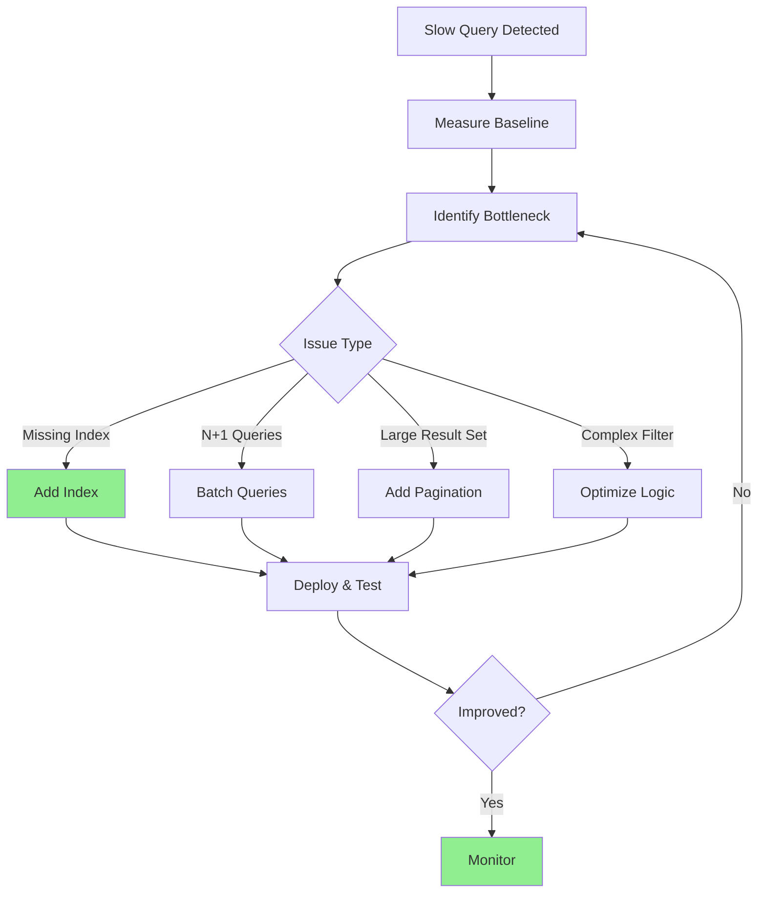
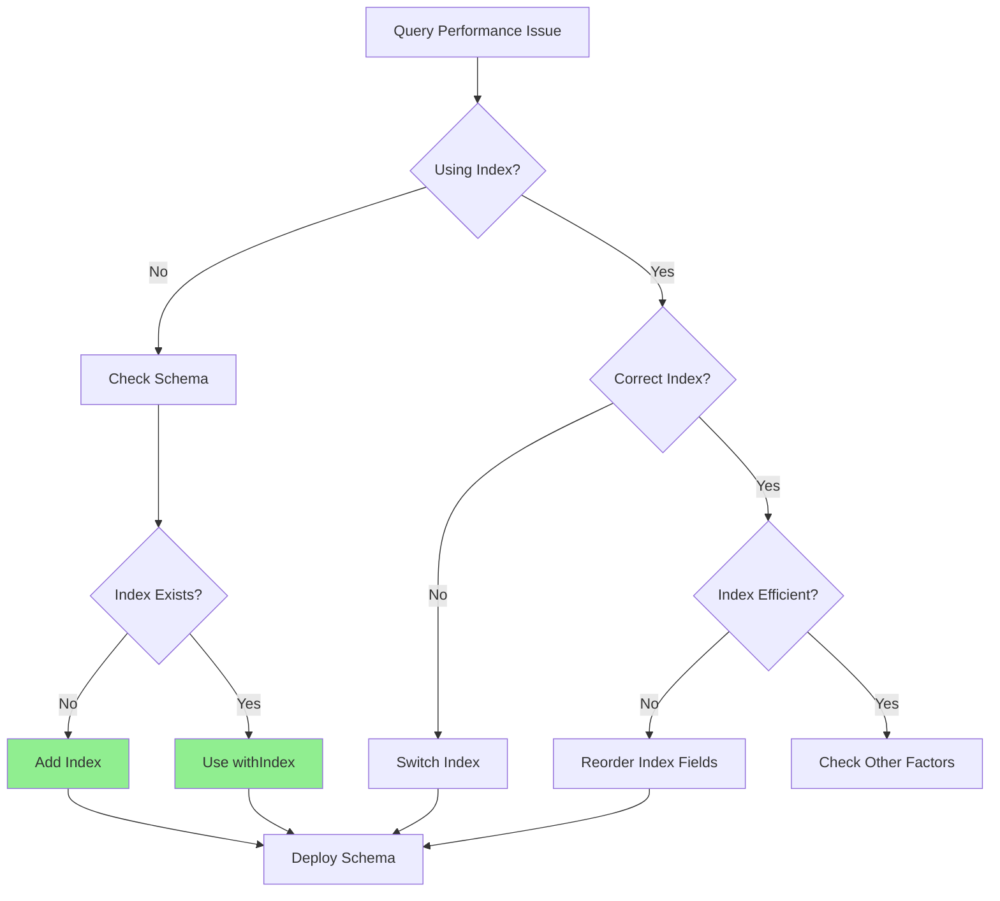

# Optimizing Database Queries

Comprehensive workflow for identifying, analyzing, and resolving database performance bottlenecks in Convex.

## Quick Start: Performance Audit



## Step 1: Measure Performance

### Add Timing Instrumentation

```typescript
// Wrapper for timing queries
async function timeQuery<T>(
  name: string,
  fn: () => Promise<T>
): Promise<T> {
  const start = Date.now();
  try {
    const result = await fn();
    const duration = Date.now() - start;

    console.log(`Query "${name}" took ${duration}ms`);

    if (duration > 1000) {
      console.warn(`⚠️ Slow query: "${name}" took ${duration}ms`);
    }

    return result;
  } catch (error) {
    console.error(`Query "${name}" failed after ${Date.now() - start}ms`);
    throw error;
  }
}

// Usage
export const getProfileWithLinks = query({
  handler: async (ctx, { profileId }) => {
    const profile = await timeQuery("get-profile", () =>
      ctx.db.get(profileId)
    );

    const links = await timeQuery("get-links", () =>
      ctx.db
        .query("links")
        .withIndex("by_profile", q => q.eq("profileId", profileId))
        .collect()
    );

    return { profile, links };
  },
});
```

### Performance Benchmarks

```typescript
// Expected query times (Convex)
const PERFORMANCE_THRESHOLDS = {
  get: 50,           // db.get() by ID
  indexQuery: 100,   // Query with index
  scanQuery: 500,    // Full table scan (avoid!)
  aggregate: 200,    // Aggregation operations
  mutation: 300,     // Simple mutation
};

function warnIfSlow(operation: string, duration: number) {
  const threshold = PERFORMANCE_THRESHOLDS[operation];
  if (duration > threshold) {
    console.warn(`Slow ${operation}: ${duration}ms (threshold: ${threshold}ms)`);
  }
}
```

## Step 2: Index Analysis

### Check Index Usage



### Index Effectiveness Patterns

```typescript
// Schema with indexes
export default defineSchema({
  links: defineTable({
    profileId: v.id("profiles"),
    type: v.string(),
    isActive: v.boolean(),
    order: v.number(),
    timestamp: v.number(),
  })
    // Good: Can query by profile
    .index("by_profile", ["profileId"])

    // Better: Can query active links per profile
    .index("by_profile_active", ["profileId", "isActive"])

    // Best: Can query active links per profile, sorted by order
    .index("by_profile_active_order", ["profileId", "isActive", "order"])

    // Also useful: Time-based queries
    .index("by_profile_time", ["profileId", "timestamp"])
});
```

### Query Index Usage

```typescript
// ❌ SLOW: Full table scan
export const getBadLinks = query({
  handler: async (ctx, { profileId }) => {
    return await ctx.db
      .query("links")
      .filter(q => q.eq(q.field("profileId"), profileId))
      .collect();
  },
});
// Scans ALL links in table!

// ✅ FAST: Index lookup
export const getGoodLinks = query({
  handler: async (ctx, { profileId }) => {
    return await ctx.db
      .query("links")
      .withIndex("by_profile", q => q.eq("profileId", profileId))
      .collect();
  },
});
// Only scans links for this profile

// ⚡ FASTEST: Compound index
export const getBestLinks = query({
  handler: async (ctx, { profileId }) => {
    return await ctx.db
      .query("links")
      .withIndex("by_profile_active", q =>
        q.eq("profileId", profileId).eq("isActive", true)
      )
      .collect();
  },
});
// Pre-filtered to active links only
```

## Step 3: Avoid N+1 Queries

### Problem Pattern

```typescript
// ❌ BAD: N+1 Query Problem
export const getProfilesWithLinks = query({
  handler: async (ctx) => {
    // 1 query: Get all profiles
    const profiles = await ctx.db.query("profiles").take(10);

    // N queries: Get links for each profile (10 more queries!)
    const profilesWithLinks = await Promise.all(
      profiles.map(async (profile) => ({
        ...profile,
        links: await ctx.db
          .query("links")
          .withIndex("by_profile", q => q.eq("profileId", profile._id))
          .collect(),
      }))
    );

    return profilesWithLinks;
  },
});
// Total: 11 queries (1 + 10)
```

### Solution: Batch Queries

```typescript
// ✅ GOOD: Batch Query
export const getProfilesWithLinks = query({
  handler: async (ctx) => {
    // 1 query: Get profiles
    const profiles = await ctx.db.query("profiles").take(10);
    const profileIds = profiles.map(p => p._id);

    // 1 query: Get all links for these profiles
    const allLinks = await ctx.db
      .query("links")
      .withIndex("by_profile")
      .filter(q =>
        q.or(
          ...profileIds.map(id => q.eq(q.field("profileId"), id))
        )
      )
      .collect();

    // Group links by profile (in memory)
    const linksByProfile = new Map<Id<"profiles">, Doc<"links">[]>();
    for (const link of allLinks) {
      const existing = linksByProfile.get(link.profileId) || [];
      linksByProfile.set(link.profileId, [...existing, link]);
    }

    // Combine results
    return profiles.map(profile => ({
      ...profile,
      links: linksByProfile.get(profile._id) || [],
    }));
  },
});
// Total: 2 queries (1 + 1)
```

### Alternative: Single Denormalized Query

```typescript
// ⚡ BEST: Denormalize for common access pattern
export default defineSchema({
  profiles: defineTable({
    userId: v.string(),
    displayName: v.string(),
    linkCount: v.number(),  // Denormalized count
    topLinks: v.array(v.object({  // Denormalized top links
      title: v.string(),
      url: v.string(),
      clicks: v.number(),
    })),
  }),
});

// Now single query returns everything
export const getProfiles = query({
  handler: async (ctx) => {
    return await ctx.db.query("profiles").take(10);
  },
});
// Total: 1 query

// Update topLinks when links change
export const updateLink = mutation({
  handler: async (ctx, args) => {
    // Update link
    await ctx.db.patch(args.linkId, args.updates);

    // Update denormalized data on profile
    const link = await ctx.db.get(args.linkId);
    await updateProfileTopLinks(ctx, link.profileId);
  },
});
```

## Step 4: Pagination Strategy

### Problem: Loading Everything

```typescript
// ❌ BAD: Load all results (could be thousands!)
export const getAllLinks = query({
  handler: async (ctx) => {
    return await ctx.db.query("links").collect();
  },
});
// Slow, memory intensive, returns too much data
```

### Solution: Implement Pagination

```typescript
// ✅ GOOD: Paginated query
export const getLinksPage = query({
  args: {
    paginationOpts: v.object({
      numItems: v.number(),
      cursor: v.union(v.string(), v.null()),
    }),
  },
  handler: async (ctx, { paginationOpts }) => {
    return await ctx.db
      .query("links")
      .paginate(paginationOpts);
  },
});

// Returns: {
//   page: Doc<"links">[],
//   continueCursor: string | null,
//   isDone: boolean
// }

// Frontend usage
function LinksList() {
  const { results, status, loadMore } = usePaginatedQuery(
    api.links.getLinksPage,
    { numItems: 20 },
    { initialNumItems: 20 }
  );

  return (
    <div>
      {results.map(link => <LinkCard key={link._id} link={link} />)}
      {status === "CanLoadMore" && (
        <button onClick={() => loadMore(20)}>Load More</button>
      )}
    </div>
  );
}
```

### Cursor-Based Pagination

```typescript
// Alternative: Manual cursor pagination
export const getLinksCursor = query({
  args: {
    cursor: v.optional(v.id("links")),
    limit: v.number(),
  },
  handler: async (ctx, { cursor, limit }) => {
    let query = ctx.db.query("links").withIndex("by_creation_time");

    // Start after cursor
    if (cursor) {
      const cursorDoc = await ctx.db.get(cursor);
      if (cursorDoc) {
        query = query.filter(q =>
          q.gt(q.field("_creationTime"), cursorDoc._creationTime)
        );
      }
    }

    const results = await query.take(limit + 1);
    const hasMore = results.length > limit;
    const items = hasMore ? results.slice(0, limit) : results;

    return {
      items,
      nextCursor: hasMore ? items[items.length - 1]._id : null,
      hasMore,
    };
  },
});
```

## Step 5: Query Complexity Reduction

### Simplify Complex Filters

```typescript
// ❌ COMPLEX: Multiple filter conditions
export const getComplexLinks = query({
  handler: async (ctx, { profileId }) => {
    return await ctx.db
      .query("links")
      .withIndex("by_profile", q => q.eq("profileId", profileId))
      .filter(q =>
        q.and(
          q.eq(q.field("isActive"), true),
          q.gte(q.field("clicks"), 10),
          q.or(
            q.eq(q.field("type"), "URL"),
            q.eq(q.field("type"), "EMAIL")
          )
        )
      )
      .collect();
  },
});

// ✅ SIMPLIFIED: Add compound index
export default defineSchema({
  links: defineTable({
    profileId: v.id("profiles"),
    isActive: v.boolean(),
    type: v.string(),
    clicks: v.number(),
  })
    .index("by_profile_active_type", ["profileId", "isActive", "type"])
});

export const getSimpleLinks = query({
  handler: async (ctx, { profileId }) => {
    // Index handles profile + active + type
    const urlLinks = await ctx.db
      .query("links")
      .withIndex("by_profile_active_type", q =>
        q.eq("profileId", profileId)
         .eq("isActive", true)
         .eq("type", "URL")
      )
      .filter(q => q.gte(q.field("clicks"), 10))
      .collect();

    const emailLinks = await ctx.db
      .query("links")
      .withIndex("by_profile_active_type", q =>
        q.eq("profileId", profileId)
         .eq("isActive", true)
         .eq("type", "EMAIL")
      )
      .filter(q => q.gte(q.field("clicks"), 10))
      .collect();

    return [...urlLinks, ...emailLinks];
  },
});
```

## Step 6: Caching Strategies

### Computed Fields

```typescript
// Cache expensive computations
export default defineSchema({
  profiles: defineTable({
    userId: v.string(),
    displayName: v.string(),

    // Cached aggregations
    totalClicks: v.number(),
    totalLinks: v.number(),
    lastActivityAt: v.number(),
  }),
});

// Update cached fields on mutations
export const recordClick = mutation({
  handler: async (ctx, { linkId }) => {
    const link = await ctx.db.get(linkId);

    // Update link
    await ctx.db.patch(linkId, {
      clicks: link.clicks + 1,
    });

    // Update cached profile stats
    const profile = await ctx.db.get(link.profileId);
    await ctx.db.patch(link.profileId, {
      totalClicks: profile.totalClicks + 1,
      lastActivityAt: Date.now(),
    });
  },
});

// Now reading is instant (no aggregation needed)
export const getProfileStats = query({
  handler: async (ctx, { profileId }) => {
    const profile = await ctx.db.get(profileId);
    return {
      totalClicks: profile.totalClicks,  // Pre-computed!
      totalLinks: profile.totalLinks,
      lastActivityAt: profile.lastActivityAt,
    };
  },
});
```

### Time-Bucketed Aggregations

```typescript
// Instead of aggregating on every read
export default defineSchema({
  analytics: defineTable({
    profileId: v.id("profiles"),
    timeframe: v.string(),  // "2024-01-15"
    clicks: v.number(),
    views: v.number(),
  })
    .index("by_profile_timeframe", ["profileId", "timeframe"]),
});

// Update analytics on events
export const recordAnalytics = mutation({
  handler: async (ctx, { profileId, event }) => {
    const today = new Date().toISOString().split("T")[0];

    const existing = await ctx.db
      .query("analytics")
      .withIndex("by_profile_timeframe", q =>
        q.eq("profileId", profileId).eq("timeframe", today)
      )
      .first();

    if (existing) {
      await ctx.db.patch(existing._id, {
        clicks: existing.clicks + 1,
      });
    } else {
      await ctx.db.insert("analytics", {
        profileId,
        timeframe: today,
        clicks: 1,
        views: 0,
      });
    }
  },
});

// Reading is fast (pre-aggregated by day)
export const getAnalytics = query({
  handler: async (ctx, { profileId, days }) => {
    const dates = getLast N Days(days);

    return await ctx.db
      .query("analytics")
      .withIndex("by_profile_timeframe", q =>
        q.eq("profileId", profileId)
      )
      .filter(q =>
        q.or(...dates.map(date => q.eq(q.field("timeframe"), date)))
      )
      .collect();
  },
});
```

## Step 7: Monitor Query Performance

### Query Performance Dashboard

```typescript
// Add to all queries
export const monitoredQuery = query({
  handler: async (ctx, args) => {
    const start = Date.now();
    const queryName = "monitoredQuery";

    try {
      const result = await performQuery(ctx, args);
      const duration = Date.now() - start;

      // Log for monitoring
      await ctx.db.insert("queryMetrics", {
        queryName,
        duration,
        success: true,
        timestamp: Date.now(),
      });

      return result;
    } catch (error) {
      await ctx.db.insert("queryMetrics", {
        queryName,
        duration: Date.now() - start,
        success: false,
        error: error.message,
        timestamp: Date.now(),
      });

      throw error;
    }
  },
});

// Analytics query
export const getSlowQueries = query({
  handler: async (ctx) => {
    const oneHourAgo = Date.now() - 3600000;

    return await ctx.db
      .query("queryMetrics")
      .withIndex("by_timestamp", q => q.gt("timestamp", oneHourAgo))
      .filter(q => q.gt(q.field("duration"), 1000))
      .collect();
  },
});
```

## Optimization Checklist

- [ ] All queries use indexes (no full table scans)
- [ ] Compound indexes match query patterns
- [ ] No N+1 query problems
- [ ] Pagination implemented for large result sets
- [ ] Query timing logged
- [ ] Slow queries identified (>1s)
- [ ] Common aggregations cached
- [ ] Query performance monitored
- [ ] Indexes reviewed after deployment
- [ ] Database metrics tracked

## Performance Targets

```typescript
const QUERY_PERFORMANCE_TARGETS = {
  // Convex benchmarks
  p50: 100,   // 50% of queries under 100ms
  p95: 500,   // 95% of queries under 500ms
  p99: 1000,  // 99% of queries under 1000ms

  // Operation targets
  simpleGet: 50,         // Get by ID
  indexQuery: 150,       // Query with index
  paginatedQuery: 200,   // Paginated results
  aggregation: 300,      // Aggregation query
  complexQuery: 500,     // Multiple joins/filters
};
```

## Quick Wins

1. **Add Missing Indexes**: Biggest impact, easiest fix
2. **Enable Pagination**: Reduces memory and improves speed
3. **Fix N+1 Queries**: Batch related queries
4. **Remove Unused Indexes**: Reduce maintenance overhead
5. **Cache Aggregations**: Pre-compute expensive calculations

## Resources

- Convex Index Documentation
- Query Performance Best Practices
- Real-time Optimization Patterns

