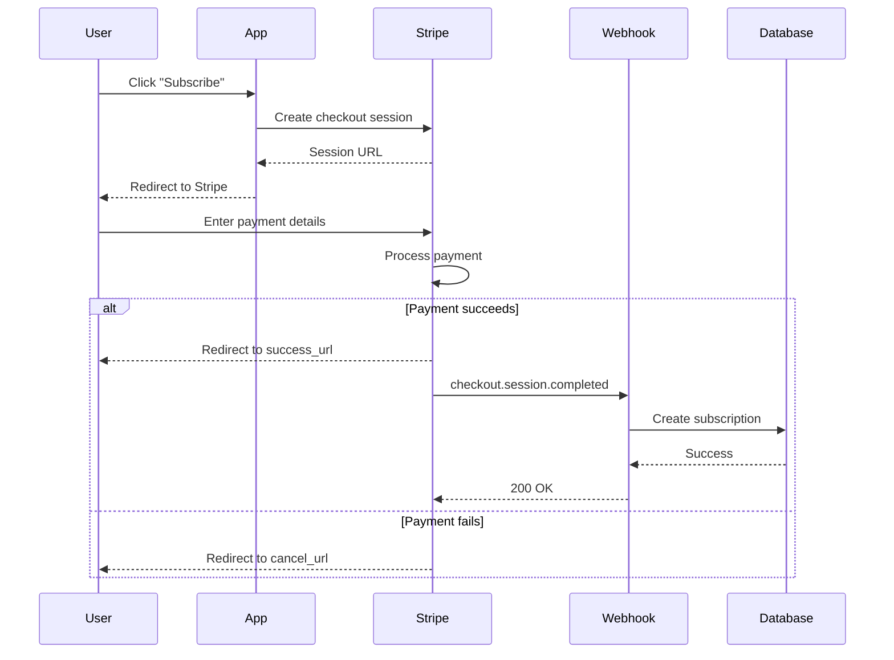
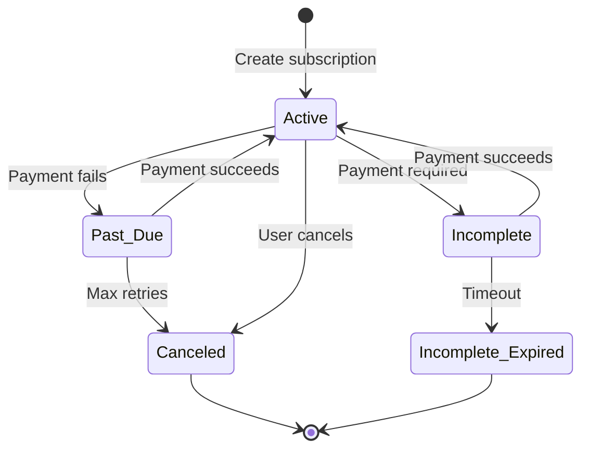
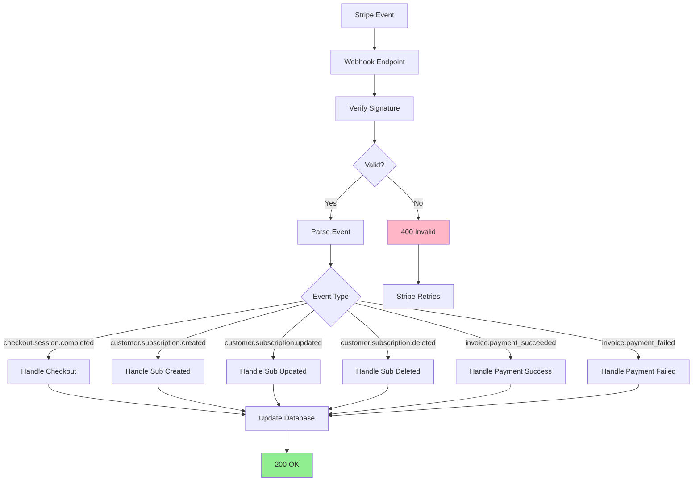

# Processing Stripe Payments

Stripe integration for payments, subscriptions, and webhook handling with production-first patterns.

## Quick Start

### 1. Installation & Setup

```bash
npm install stripe @stripe/stripe-js
```

**Environment Variables**:
```bash
STRIPE_SECRET_KEY=sk_test_...
NEXT_PUBLIC_STRIPE_PUBLISHABLE_KEY=pk_test_...
STRIPE_WEBHOOK_SECRET=whsec_...

# Production override
CONVEX_MOCK_PAYMENTS=false  # Use real Stripe in prod
```

### 2. Initialize Stripe

**lib/stripe.ts**:
```typescript
import Stripe from 'stripe';

export const stripe = new Stripe(process.env.STRIPE_SECRET_KEY!, {
  apiVersion: '2023-10-16',
  typescript: true,
});
```

**lib/stripe-client.ts** (Frontend):
```typescript
import { loadStripe } from '@stripe/stripe-js';

export const stripePromise = loadStripe(
  process.env.NEXT_PUBLIC_STRIPE_PUBLISHABLE_KEY!
);
```

## Checkout Sessions

**Payment Flow Overview:**


### 1. Create Checkout Session

**app/api/checkout/route.ts**:
```typescript
import { stripe } from '@/lib/stripe';
import { auth } from '@clerk/nextjs';
import { NextResponse } from 'next/server';

export async function POST(req: Request) {
  const { userId } = auth();

  if (!userId) {
    return new NextResponse('Unauthorized', { status: 401 });
  }

  const { priceId, quantity = 1 } = await req.json();

  try {
    const session = await stripe.checkout.sessions.create({
      mode: 'subscription',
      payment_method_types: ['card'],
      line_items: [
        {
          price: priceId,
          quantity,
        },
      ],
      success_url: `${process.env.NEXT_PUBLIC_APP_URL}/dashboard?success=true`,
      cancel_url: `${process.env.NEXT_PUBLIC_APP_URL}/pricing?canceled=true`,
      metadata: {
        userId,
      },
    });

    return NextResponse.json({ sessionId: session.id });
  } catch (error) {
    console.error('Checkout error:', error);
    return new NextResponse('Internal error', { status: 500 });
  }
}
```

### 2. Redirect to Checkout (Frontend)

```typescript
'use client';

import { useState } from 'react';
import { stripePromise } from '@/lib/stripe-client';

export function CheckoutButton({ priceId }: { priceId: string }) {
  const [loading, setLoading] = useState(false);

  const handleCheckout = async () => {
    setLoading(true);

    try {
      // Create checkout session
      const res = await fetch('/api/checkout', {
        method: 'POST',
        headers: { 'Content-Type': 'application/json' },
        body: JSON.stringify({ priceId }),
      });

      const { sessionId } = await res.json();

      // Redirect to Stripe Checkout
      const stripe = await stripePromise;
      await stripe?.redirectToCheckout({ sessionId });
    } catch (error) {
      console.error('Checkout failed:', error);
    } finally {
      setLoading(false);
    }
  };

  return (
    <button onClick={handleCheckout} disabled={loading}>
      {loading ? 'Loading...' : 'Subscribe Now'}
    </button>
  );
}
```

## Subscriptions

**Subscription Lifecycle:**


### Create Subscription

```typescript
import { stripe } from '@/lib/stripe';

export async function createSubscription(
  customerId: string,
  priceId: string
) {
  const subscription = await stripe.subscriptions.create({
    customer: customerId,
    items: [{ price: priceId }],
    payment_behavior: 'default_incomplete',
    payment_settings: { save_default_payment_method: 'on_subscription' },
    expand: ['latest_invoice.payment_intent'],
  });

  return subscription;
}
```

### Cancel Subscription

```typescript
export async function cancelSubscription(subscriptionId: string) {
  const subscription = await stripe.subscriptions.cancel(subscriptionId);
  return subscription;
}
```

### Update Subscription

```typescript
export async function updateSubscription(
  subscriptionId: string,
  newPriceId: string
) {
  const subscription = await stripe.subscriptions.retrieve(subscriptionId);

  const updatedSubscription = await stripe.subscriptions.update(
    subscriptionId,
    {
      items: [
        {
          id: subscription.items.data[0].id,
          price: newPriceId,
        },
      ],
    }
  );

  return updatedSubscription;
}
```

## Webhooks

**Webhook Processing Flow:**


### 1. Create Webhook Endpoint

**app/api/webhooks/stripe/route.ts**:
```typescript
import { headers } from 'next/headers';
import { stripe } from '@/lib/stripe';
import Stripe from 'stripe';

export async function POST(req: Request) {
  const body = await req.text();
  const signature = headers().get('stripe-signature');

  if (!signature) {
    return new Response('Missing signature', { status: 400 });
  }

  let event: Stripe.Event;

  try {
    event = stripe.webhooks.constructEvent(
      body,
      signature,
      process.env.STRIPE_WEBHOOK_SECRET!
    );
  } catch (err) {
    console.error('Webhook signature verification failed:', err);
    return new Response('Invalid signature', { status: 400 });
  }

  // Handle events
  switch (event.type) {
    case 'checkout.session.completed':
      await handleCheckoutCompleted(event.data.object);
      break;

    case 'customer.subscription.created':
      await handleSubscriptionCreated(event.data.object);
      break;

    case 'customer.subscription.updated':
      await handleSubscriptionUpdated(event.data.object);
      break;

    case 'customer.subscription.deleted':
      await handleSubscriptionDeleted(event.data.object);
      break;

    case 'invoice.payment_succeeded':
      await handleInvoicePaymentSucceeded(event.data.object);
      break;

    case 'invoice.payment_failed':
      await handleInvoicePaymentFailed(event.data.object);
      break;

    default:
      console.log(`Unhandled event type: ${event.type}`);
  }

  return new Response('Webhook processed', { status: 200 });
}
```

### 2. Webhook Handlers

```typescript
async function handleCheckoutCompleted(
  session: Stripe.Checkout.Session
) {
  const userId = session.metadata?.userId;
  const customerId = session.customer as string;

  // Update user with Stripe customer ID
  await db.users.update(userId, {
    stripeCustomerId: customerId,
  });
}

async function handleSubscriptionCreated(
  subscription: Stripe.Subscription
) {
  const customerId = subscription.customer as string;
  const user = await db.users.findByStripeId(customerId);

  await db.subscriptions.create({
    userId: user.id,
    stripeSubscriptionId: subscription.id,
    status: subscription.status,
    priceId: subscription.items.data[0].price.id,
    currentPeriodEnd: new Date(subscription.current_period_end * 1000),
  });
}

async function handleSubscriptionUpdated(
  subscription: Stripe.Subscription
) {
  await db.subscriptions.update({
    stripeSubscriptionId: subscription.id,
    status: subscription.status,
    priceId: subscription.items.data[0].price.id,
    currentPeriodEnd: new Date(subscription.current_period_end * 1000),
  });
}

async function handleSubscriptionDeleted(
  subscription: Stripe.Subscription
) {
  await db.subscriptions.update({
    stripeSubscriptionId: subscription.id,
    status: 'canceled',
  });
}

async function handleInvoicePaymentSucceeded(
  invoice: Stripe.Invoice
) {
  // Update subscription payment status
  await db.subscriptions.update({
    stripeSubscriptionId: invoice.subscription as string,
    lastPaymentDate: new Date(),
  });
}

async function handleInvoicePaymentFailed(
  invoice: Stripe.Invoice
) {
  // Notify user of payment failure
  await sendPaymentFailedEmail(invoice.customer as string);
}
```

### 3. Configure Webhook in Stripe

```bash
# Install Stripe CLI
brew install stripe/stripe-cli/stripe

# Login
stripe login

# Forward webhooks to local dev
stripe listen --forward-to localhost:3000/api/webhooks/stripe

# Get webhook secret
stripe listen --print-secret
```

## Customer Management

### Create Customer

```typescript
export async function createCustomer(email: string, name: string) {
  const customer = await stripe.customers.create({
    email,
    name,
    metadata: {
      // Add custom metadata
    },
  });

  return customer;
}
```

### Retrieve Customer

```typescript
export async function getCustomer(customerId: string) {
  const customer = await stripe.customers.retrieve(customerId);
  return customer;
}
```

### Update Customer

```typescript
export async function updateCustomer(
  customerId: string,
  data: Stripe.CustomerUpdateParams
) {
  const customer = await stripe.customers.update(customerId, data);
  return customer;
}
```

## Payment Intents (One-Time Payments)

### Create Payment Intent

**app/api/payment-intent/route.ts**:
```typescript
export async function POST(req: Request) {
  const { amount, currency = 'usd' } = await req.json();

  const paymentIntent = await stripe.paymentIntents.create({
    amount: amount * 100, // Convert to cents
    currency,
    automatic_payment_methods: { enabled: true },
  });

  return NextResponse.json({ clientSecret: paymentIntent.client_secret });
}
```

### Process Payment (Frontend)

```typescript
'use client';

import { useState } from 'react';
import { useStripe, useElements, CardElement } from '@stripe/react-stripe-js';

export function PaymentForm({ amount }: { amount: number }) {
  const stripe = useStripe();
  const elements = useElements();
  const [error, setError] = useState<string | null>(null);
  const [processing, setProcessing] = useState(false);

  const handleSubmit = async (e: React.FormEvent) => {
    e.preventDefault();

    if (!stripe || !elements) return;

    setProcessing(true);

    // Create payment intent
    const res = await fetch('/api/payment-intent', {
      method: 'POST',
      headers: { 'Content-Type': 'application/json' },
      body: JSON.stringify({ amount }),
    });

    const { clientSecret } = await res.json();

    // Confirm payment
    const { error, paymentIntent } = await stripe.confirmCardPayment(
      clientSecret,
      {
        payment_method: {
          card: elements.getElement(CardElement)!,
        },
      }
    );

    if (error) {
      setError(error.message ?? 'Payment failed');
    } else if (paymentIntent.status === 'succeeded') {
      // Payment successful
      console.log('Payment succeeded!');
    }

    setProcessing(false);
  };

  return (
    <form onSubmit={handleSubmit}>
      <CardElement />
      {error && <div className="error">{error}</div>}
      <button disabled={!stripe || processing}>
        {processing ? 'Processing...' : 'Pay'}
      </button>
    </form>
  );
}
```

## Production Patterns

### Mock Payments in Test Mode

```typescript
export async function processPayment(amount: number) {
  // Feature flag for testing
  if (process.env.CONVEX_MOCK_PAYMENTS === 'true') {
    return {
      id: 'mock_payment_' + Date.now(),
      status: 'succeeded',
      amount,
    };
  }

  // Real Stripe payment
  const paymentIntent = await stripe.paymentIntents.create({
    amount: amount * 100,
    currency: 'usd',
  });

  return paymentIntent;
}
```

### Validate Amounts

```typescript
export function validatePaymentAmount(amount: number) {
  if (amount < 0.50) {
    throw new Error('Minimum charge is $0.50');
  }

  if (amount > 999999.99) {
    throw new Error('Maximum charge is $999,999.99');
  }

  return Math.round(amount * 100); // Convert to cents
}
```

### Handle Errors

```typescript
try {
  const payment = await stripe.paymentIntents.create({...});
} catch (error) {
  if (error instanceof Stripe.errors.StripeCardError) {
    // Card declined
    return { error: 'Your card was declined' };
  } else if (error instanceof Stripe.errors.StripeRateLimitError) {
    // Rate limit
    return { error: 'Too many requests. Please try again later' };
  } else {
    // Other error
    return { error: 'Payment failed. Please try again' };
  }
}
```

## Best Practices

1. **Always validate amounts** - Stripe uses cents, validate before converting
2. **Use webhooks for fulfillment** - Never rely on client-side success
3. **Verify webhook signatures** - Prevent replay attacks
4. **Store minimal payment data** - Let Stripe be the source of truth
5. **Handle idempotency** - Use idempotency keys for retries
6. **Test with Stripe CLI** - Use local webhook forwarding
7. **Use metadata** - Track your internal IDs in Stripe objects
8. **Log webhook events** - Debug payment issues faster

## Resources

- [Stripe API Documentation](https://stripe.com/docs/api)
- [Checkout Sessions Guide](https://stripe.com/docs/payments/checkout)
- [Webhooks Guide](https://stripe.com/docs/webhooks)

