# Stripe Payment Architecture

Visual guide to Stripe integration, payment flows, subscription management, and webhook handling.

## Complete Payment Integration

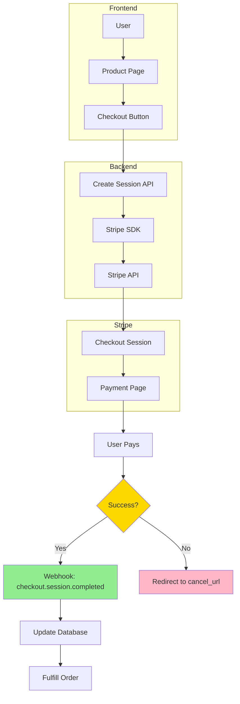
```mermaid
graph TB
    subgraph Frontend
        A[User] --> B[Product Page]
        B --> C[Checkout Button]
    end

    subgraph Backend
        C --> D[Create Session API]
        D --> E[Stripe SDK]
        E --> F[Stripe API]
    end

    subgraph Stripe
        F --> G[Checkout Session]
        G --> H[Payment Page]
    end

    H --> I[User Pays]
    I --> J{Success?}

    J -->|Yes| K[Webhook: checkout.session.completed]
    J -->|No| L[Redirect to cancel_url]

    K --> M[Update Database]
    M --> N[Fulfill Order]

    style J fill:#FFD700
    style K fill:#90EE90
    style L fill:#FFB6C6
```

## Subscription Payment Flow

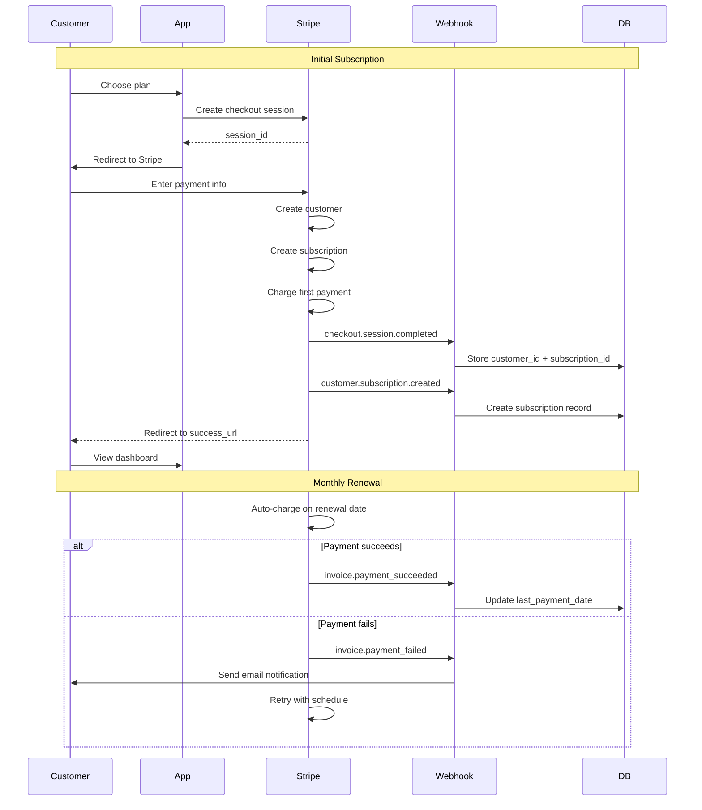
```mermaid
sequenceDiagram
    participant C as Customer
    participant A as App
    participant S as Stripe
    participant W as Webhook
    participant D as DB

    Note over C,D: Initial Subscription

    C->>A: Choose plan
    A->>S: Create checkout session
    S-->>A: session_id
    A->>C: Redirect to Stripe

    C->>S: Enter payment info
    S->>S: Create customer
    S->>S: Create subscription
    S->>S: Charge first payment

    S->>W: checkout.session.completed
    W->>D: Store customer_id + subscription_id
    S->>W: customer.subscription.created
    W->>D: Create subscription record

    S-->>C: Redirect to success_url
    C->>A: View dashboard

    Note over C,D: Monthly Renewal

    S->>S: Auto-charge on renewal date
    alt Payment succeeds
        S->>W: invoice.payment_succeeded
        W->>D: Update last_payment_date
    else Payment fails
        S->>W: invoice.payment_failed
        W->>C: Send email notification
        S->>S: Retry with schedule
    end
```

## Webhook Event Hierarchy

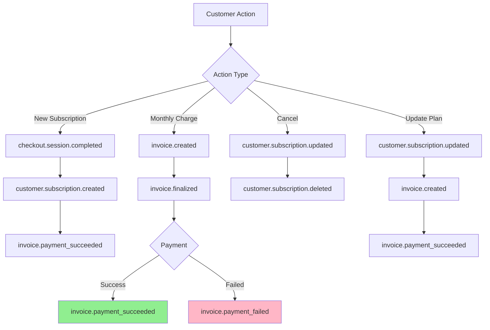
```mermaid
graph TB
    A[Customer Action] --> B{Action Type}

    B -->|New Subscription| C[checkout.session.completed]
    C --> D[customer.subscription.created]
    D --> E[invoice.payment_succeeded]

    B -->|Monthly Charge| F[invoice.created]
    F --> G[invoice.finalized]
    G --> H{Payment}
    H -->|Success| I[invoice.payment_succeeded]
    H -->|Failed| J[invoice.payment_failed]

    B -->|Cancel| K[customer.subscription.updated]
    K --> L[customer.subscription.deleted]

    B -->|Update Plan| M[customer.subscription.updated]
    M --> N[invoice.created]
    N --> O[invoice.payment_succeeded]

    style I fill:#90EE90
    style J fill:#FFB6C6
```

## Payment Intent Lifecycle

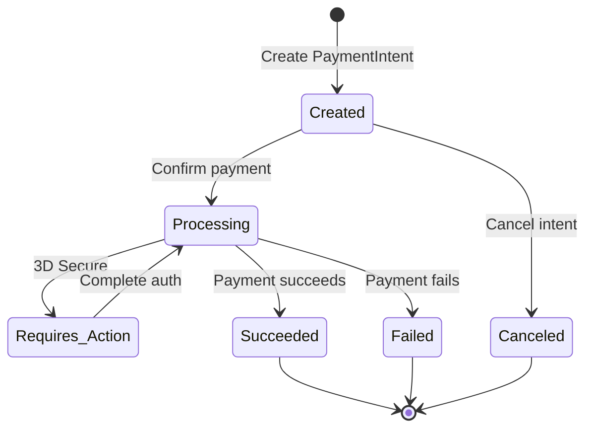
```mermaid
stateDiagram-v2
    [*] --> Created: Create PaymentIntent
    Created --> Processing: Confirm payment
    Processing --> Requires_Action: 3D Secure
    Requires_Action --> Processing: Complete auth
    Processing --> Succeeded: Payment succeeds
    Processing --> Failed: Payment fails
    Succeeded --> [*]
    Failed --> [*]
    Created --> Canceled: Cancel intent
    Canceled --> [*]
```

## Subscription Status Transitions

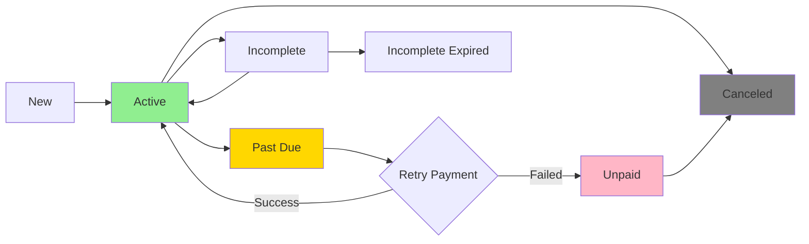
```mermaid
graph LR
    A[New] --> B[Active]
    B --> C[Past Due]
    C --> D{Retry Payment}

    D -->|Success| B
    D -->|Failed| E[Unpaid]

    B --> F[Canceled]
    E --> F

    B --> G[Incomplete]
    G --> B
    G --> H[Incomplete Expired]

    style B fill:#90EE90
    style C fill:#FFD700
    style E fill:#FFB6C6
    style F fill:#808080
```

## Checkout Session vs Payment Intent

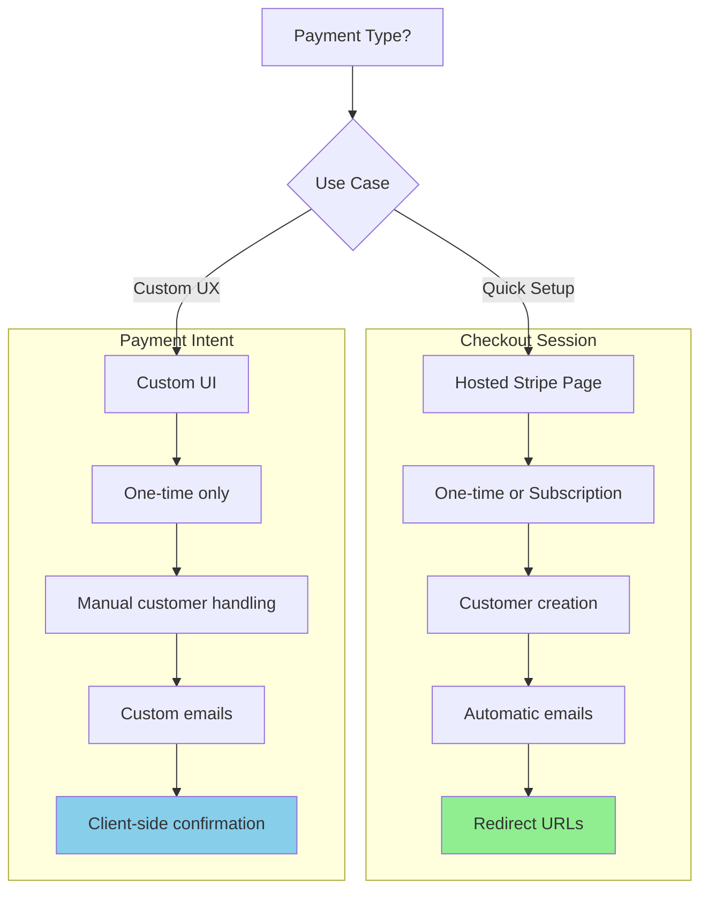
```mermaid
graph TB
    subgraph Checkout Session
        CS1[Hosted Stripe Page] --> CS2[One-time or Subscription]
        CS2 --> CS3[Customer creation]
        CS3 --> CS4[Automatic emails]
        CS4 --> CS5[Redirect URLs]
    end

    subgraph Payment Intent
        PI1[Custom UI] --> PI2[One-time only]
        PI2 --> PI3[Manual customer handling]
        PI3 --> PI4[Custom emails]
        PI4 --> PI5[Client-side confirmation]
    end

    A[Payment Type?] --> B{Use Case}
    B -->|Quick Setup| CS1
    B -->|Custom UX| PI1

    style CS5 fill:#90EE90
    style PI5 fill:#87CEEB
```

## Customer Data Flow

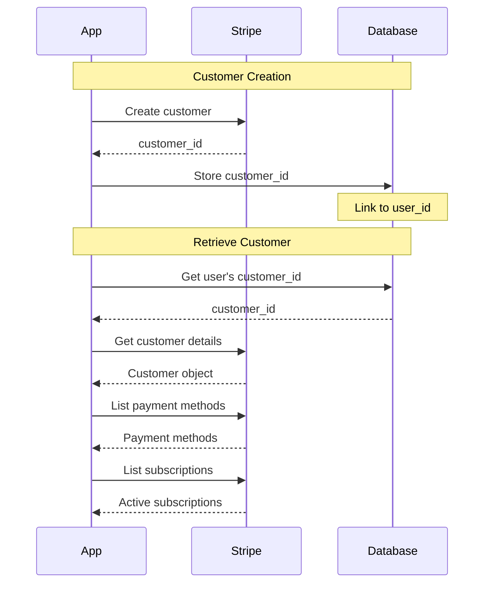
```mermaid
sequenceDiagram
    participant A as App
    participant S as Stripe
    participant D as Database

    Note over A,D: Customer Creation

    A->>S: Create customer
    S-->>A: customer_id

    A->>D: Store customer_id
    Note over D: Link to user_id

    Note over A,D: Retrieve Customer

    A->>D: Get user's customer_id
    D-->>A: customer_id

    A->>S: Get customer details
    S-->>A: Customer object

    A->>S: List payment methods
    S-->>A: Payment methods

    A->>S: List subscriptions
    S-->>A: Active subscriptions
```

## Invoice Payment Retry Logic

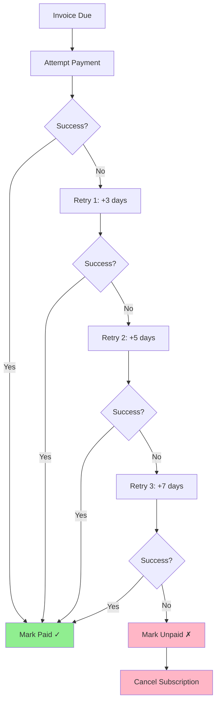
```mermaid
graph TB
    A[Invoice Due] --> B[Attempt Payment]
    B --> C{Success?}

    C -->|Yes| D[Mark Paid ✓]
    C -->|No| E[Retry 1: +3 days]

    E --> F{Success?}
    F -->|Yes| D
    F -->|No| G[Retry 2: +5 days]

    G --> H{Success?}
    H -->|Yes| D
    H -->|No| I[Retry 3: +7 days]

    I --> J{Success?}
    J -->|Yes| D
    J -->|No| K[Mark Unpaid ✗]

    K --> L[Cancel Subscription]

    style D fill:#90EE90
    style K fill:#FFB6C6
    style L fill:#FFB6C6
```

## Webhook Idempotency

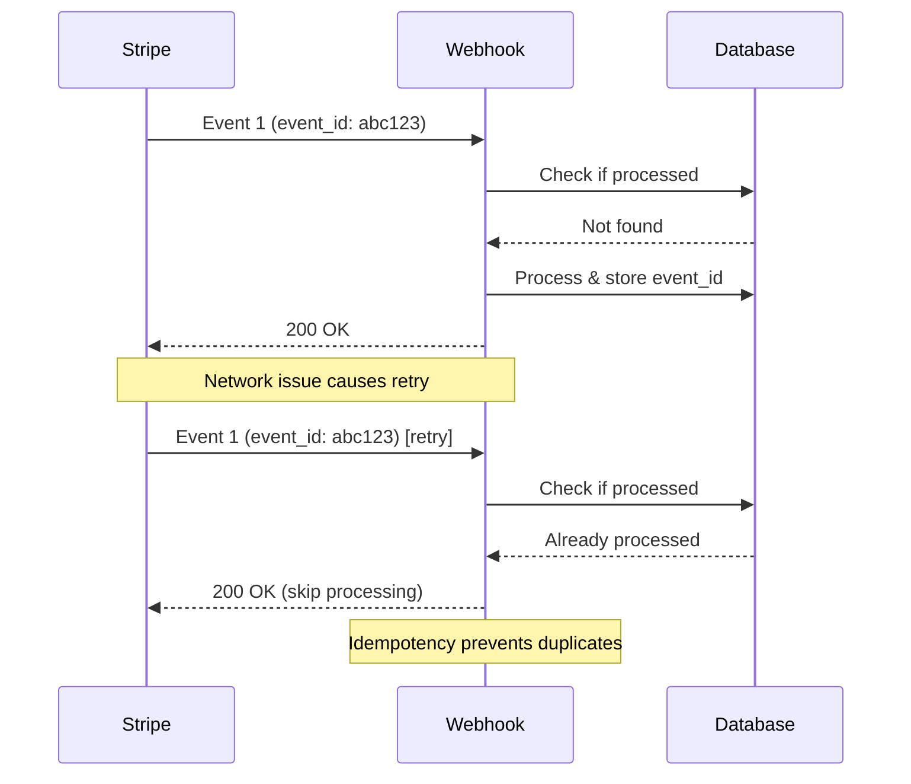
```mermaid
sequenceDiagram
    participant S as Stripe
    participant W as Webhook
    participant D as Database

    S->>W: Event 1 (event_id: abc123)
    W->>D: Check if processed
    D-->>W: Not found
    W->>D: Process & store event_id
    W-->>S: 200 OK

    Note over S,W: Network issue causes retry

    S->>W: Event 1 (event_id: abc123) [retry]
    W->>D: Check if processed
    D-->>W: Already processed
    W-->>S: 200 OK (skip processing)

    Note over W: Idempotency prevents duplicates
```

## Pricing Models

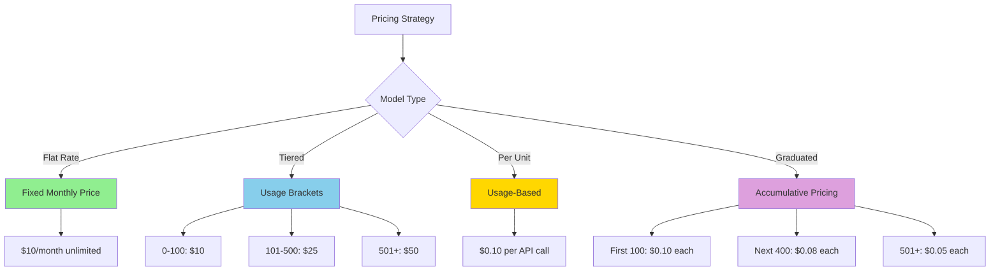
```mermaid
graph TB
    A[Pricing Strategy] --> B{Model Type}

    B -->|Flat Rate| C[Fixed Monthly Price]
    C --> C1[$10/month unlimited]

    B -->|Tiered| D[Usage Brackets]
    D --> D1[0-100: $10]
    D --> D2[101-500: $25]
    D --> D3[501+: $50]

    B -->|Per Unit| E[Usage-Based]
    E --> E1[$0.10 per API call]

    B -->|Graduated| F[Accumulative Pricing]
    F --> F1[First 100: $0.10 each]
    F --> F2[Next 400: $0.08 each]
    F --> F3[501+: $0.05 each]

    style C fill:#90EE90
    style D fill:#87CEEB
    style E fill:#FFD700
    style F fill:#DDA0DD
```

## Customer Portal Flow

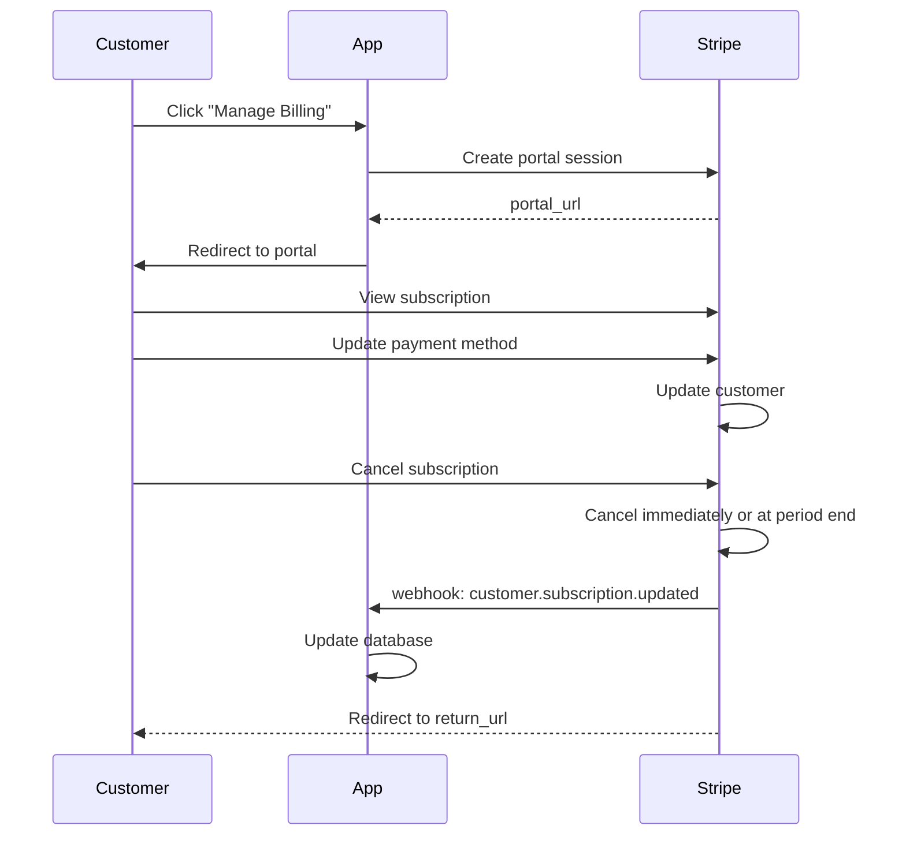
```mermaid
sequenceDiagram
    participant C as Customer
    participant A as App
    participant S as Stripe

    C->>A: Click "Manage Billing"
    A->>S: Create portal session
    S-->>A: portal_url

    A->>C: Redirect to portal
    C->>S: View subscription

    C->>S: Update payment method
    S->>S: Update customer

    C->>S: Cancel subscription
    S->>S: Cancel immediately or at period end

    S->>A: webhook: customer.subscription.updated
    A->>A: Update database

    S-->>C: Redirect to return_url
```

## Test Mode vs Live Mode

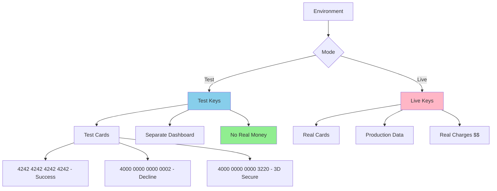
```mermaid
graph TB
    A[Environment] --> B{Mode}

    B -->|Test| C[Test Keys]
    B -->|Live| D[Live Keys]

    C --> E[Test Cards]
    E --> E1[4242 4242 4242 4242 - Success]
    E --> E2[4000 0000 0000 0002 - Decline]
    E --> E3[4000 0000 0000 3220 - 3D Secure]

    C --> F[Separate Dashboard]
    C --> G[No Real Money]

    D --> H[Real Cards]
    D --> I[Production Data]
    D --> J[Real Charges $$]

    style C fill:#87CEEB
    style D fill:#FFB6C6
    style G fill:#90EE90
```

## Proration Example

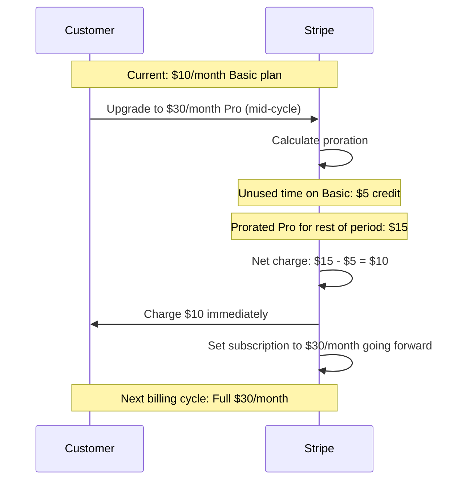
```mermaid
sequenceDiagram
    participant C as Customer
    participant S as Stripe

    Note over C,S: Current: $10/month Basic plan

    C->>S: Upgrade to $30/month Pro (mid-cycle)
    S->>S: Calculate proration

    Note over S: Unused time on Basic: $5 credit
    Note over S: Prorated Pro for rest of period: $15

    S->>S: Net charge: $15 - $5 = $10

    S->>C: Charge $10 immediately
    S->>S: Set subscription to $30/month going forward

    Note over C,S: Next billing cycle: Full $30/month
```

## Failed Payment Recovery

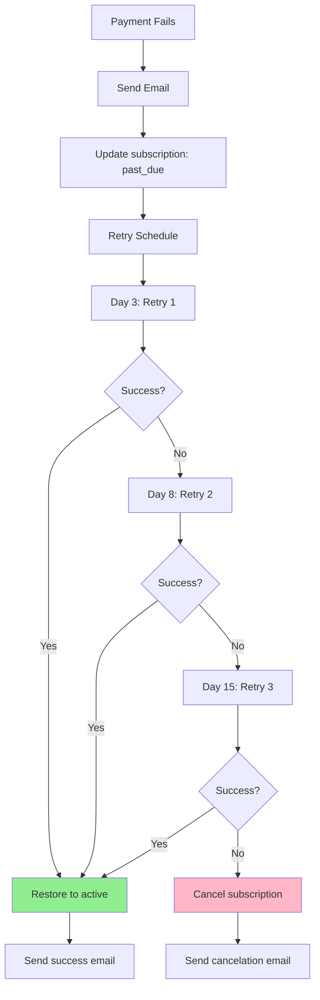
```mermaid
graph TB
    A[Payment Fails] --> B[Send Email]
    B --> C[Update subscription: past_due]

    C --> D[Retry Schedule]
    D --> E[Day 3: Retry 1]
    E --> F{Success?}

    F -->|Yes| G[Restore to active]
    F -->|No| H[Day 8: Retry 2]

    H --> I{Success?}
    I -->|Yes| G
    I -->|No| J[Day 15: Retry 3]

    J --> K{Success?}
    K -->|Yes| G
    K -->|No| L[Cancel subscription]

    L --> M[Send cancelation email]

    G --> N[Send success email]

    style G fill:#90EE90
    style L fill:#FFB6C6
```

## Stripe Elements Integration

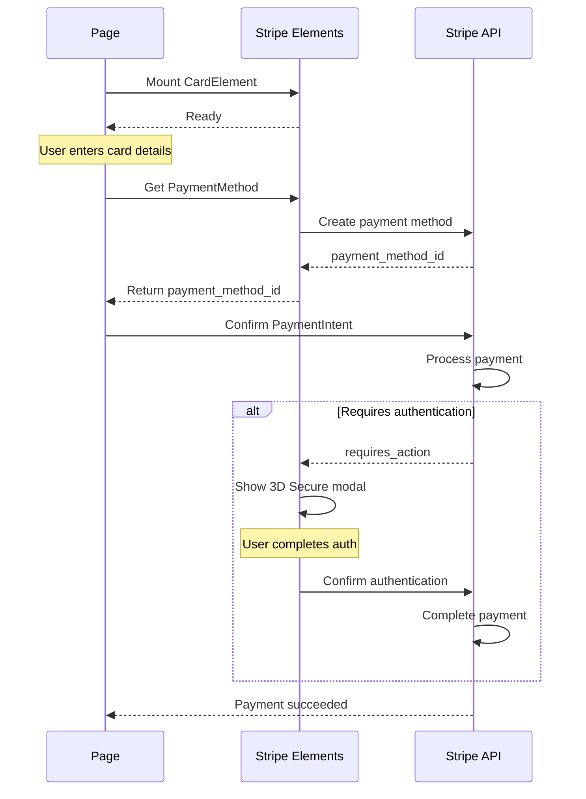
```mermaid
sequenceDiagram
    participant P as Page
    participant E as Stripe Elements
    participant S as Stripe API

    P->>E: Mount CardElement
    E-->>P: Ready

    Note over P: User enters card details

    P->>E: Get PaymentMethod
    E->>S: Create payment method
    S-->>E: payment_method_id

    E-->>P: Return payment_method_id

    P->>S: Confirm PaymentIntent
    S->>S: Process payment

    alt Requires authentication
        S-->>E: requires_action
        E->>E: Show 3D Secure modal
        Note over E: User completes auth
        E->>S: Confirm authentication
        S->>S: Complete payment
    end

    S-->>P: Payment succeeded
```

## Metadata Strategy

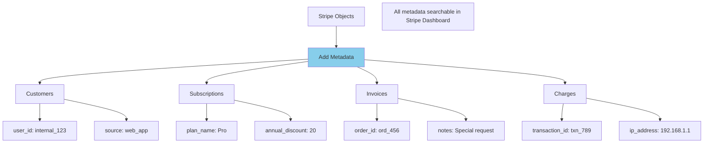
```mermaid
graph TB
    A[Stripe Objects] --> B[Add Metadata]

    B --> C[Customers]
    C --> C1[user_id: internal_123]
    C --> C2[source: web_app]

    B --> D[Subscriptions]
    D --> D1[plan_name: Pro]
    D --> D2[annual_discount: 20]

    B --> E[Invoices]
    E --> E1[order_id: ord_456]
    E --> E2[notes: Special request]

    B --> F[Charges]
    F --> F1[transaction_id: txn_789]
    F --> F2[ip_address: 192.168.1.1]

    style B fill:#87CEEB
    Note[All metadata searchable in Stripe Dashboard]
```

## Refund Flow

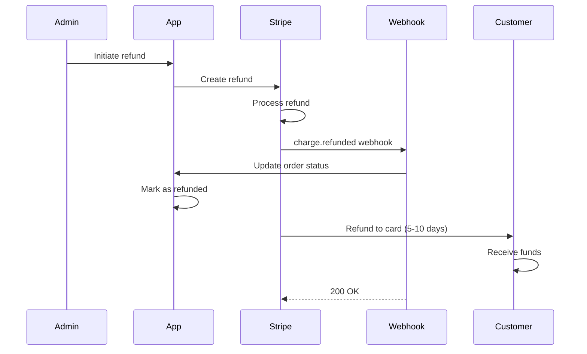
```mermaid
sequenceDiagram
    participant A as Admin
    participant App
    participant S as Stripe
    participant W as Webhook
    participant C as Customer

    A->>App: Initiate refund
    App->>S: Create refund
    S->>S: Process refund

    S->>W: charge.refunded webhook
    W->>App: Update order status
    App->>App: Mark as refunded

    S->>C: Refund to card (5-10 days)
    C->>C: Receive funds

    W-->>S: 200 OK
```

## Multi-Currency Support

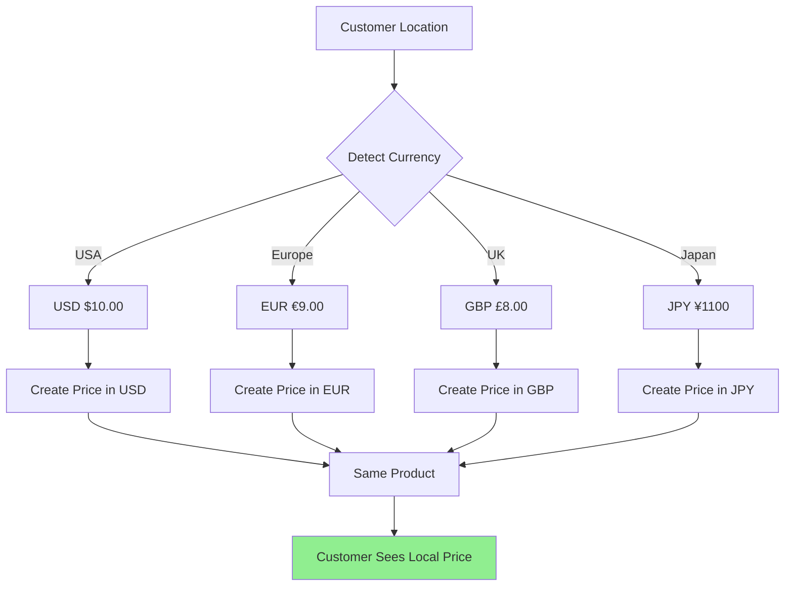
```mermaid
graph TB
    A[Customer Location] --> B{Detect Currency}

    B -->|USA| C[USD $10.00]
    B -->|Europe| D[EUR €9.00]
    B -->|UK| E[GBP £8.00]
    B -->|Japan| F[JPY ¥1100]

    C --> G[Create Price in USD]
    D --> H[Create Price in EUR]
    E --> I[Create Price in GBP]
    F --> J[Create Price in JPY]

    G --> K[Same Product]
    H --> K
    I --> K
    J --> K

    K --> L[Customer Sees Local Price]

    style L fill:#90EE90
```

## Production Checklist

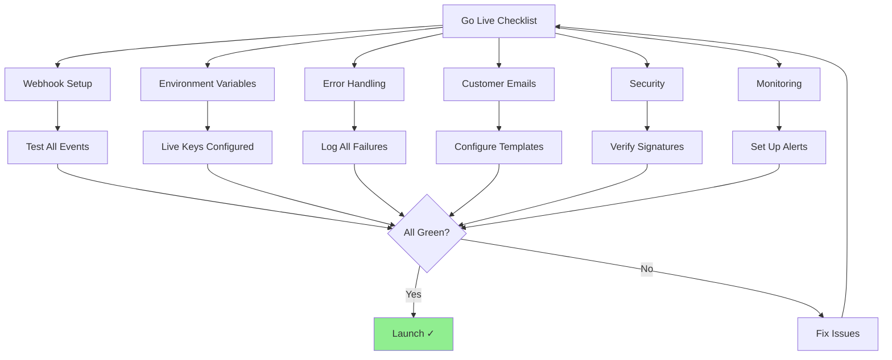
```mermaid
graph TB
    A[Go Live Checklist] --> B[Webhook Setup]
    B --> C[Test All Events]

    A --> D[Environment Variables]
    D --> E[Live Keys Configured]

    A --> F[Error Handling]
    F --> G[Log All Failures]

    A --> H[Customer Emails]
    H --> I[Configure Templates]

    A --> J[Security]
    J --> K[Verify Signatures]

    A --> L[Monitoring]
    L --> M[Set Up Alerts]

    C --> N{All Green?}
    E --> N
    G --> N
    I --> N
    K --> N
    M --> N

    N -->|Yes| O[Launch ✓]
    N -->|No| P[Fix Issues]

    P --> A

    style O fill:#90EE90
```

