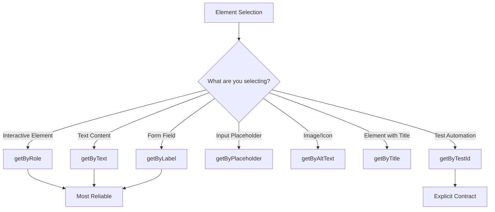

# Researching with Playwright

Complete guide for web research automation using Playwright's browser automation capabilities for data extraction, testing, and interaction.

## What is Playwright?

**Playwright** is a browser automation framework that enables:

- **Multi-browser support**: Chromium, Firefox, WebKit
- **Auto-waiting**: Automatically waits for elements to be ready
- **Reliable selectors**: User-facing locators that mirror how users interact
- **Rich capabilities**: Screenshots, PDFs, network interception, file uploads

---

## Quick Start

### Installation

```bash
npm init playwright@latest
```

**What gets created:**
- `playwright.config.ts` - Configuration
- `package.json` - Dependencies
- `tests/` - Test directory
- Browser binaries

### Basic Script

```typescript
import { chromium } from 'playwright';

(async () => {
  const browser = await chromium.launch();
  const page = await browser.newPage();

  await page.goto('https://example.com');
  const title = await page.title();
  console.log('Page title:', title);

  await browser.close();
})();
```

---

## Locator Strategies

Playwright uses **user-facing locators** that prioritize how users perceive the page.



### 1. getByRole (Recommended)

**Use for**: Interactive elements with ARIA roles

```typescript
// Buttons
await page.getByRole('button', { name: 'Sign up' }).click();

// Links
await page.getByRole('link', { name: 'Contact Us' }).click();

// Headings
const title = await page.getByRole('heading', { level: 1 }).textContent();

// Form controls
await page.getByRole('checkbox', { name: 'Accept terms' }).check();
await page.getByRole('textbox', { name: 'Email' }).fill('user@example.com');
```

**Common roles**:
- `button`, `link`, `heading`, `textbox`, `checkbox`, `radio`, `combobox`, `listbox`

### 2. getByText

**Use for**: Elements containing specific text

```typescript
// Exact match
await page.getByText('Welcome back').click();

// Substring match
await page.getByText('Welcome', { exact: false }).click();

// Regex match
await page.getByText(/welcome back/i).click();
```

### 3. getByLabel

**Use for**: Form inputs with labels

```typescript
await page.getByLabel('Email address').fill('user@example.com');
await page.getByLabel('Password').fill('secret123');
await page.getByLabel('Remember me').check();
```

### 4. getByPlaceholder

**Use for**: Inputs by placeholder text

```typescript
await page.getByPlaceholder('Search...').fill('playwright');
await page.getByPlaceholder('Enter your email').fill('user@example.com');
```

### 5. getByTestId

**Use for**: Elements with data-testid attributes

```typescript
// HTML: <button data-testid="submit-btn">Submit</button>
await page.getByTestId('submit-btn').click();
```

**Custom test ID attribute:**
```typescript
// playwright.config.ts
export default {
  use: {
    testIdAttribute: 'data-test-id', // or 'data-cy', etc.
  },
};
```

---

## Auto-Waiting and Actionability

Playwright automatically waits for elements to be ready before performing actions.

### Automatic Checks

Before clicking, Playwright verifies:
1. **Visible**: Element has non-empty bounding box
2. **Stable**: Element maintains consistent dimensions
3. **Enabled**: Element is not disabled
4. **Not obscured**: Element receives click events
5. **Editable** (for inputs): Element is editable

```typescript
// This automatically waits for button to be clickable
await page.getByRole('button', { name: 'Submit' }).click();

// Even if button is disabled initially:
// <button disabled>Submit</button>
// ... becomes enabled later
// <button>Submit</button>
// Playwright waits and then clicks
```

### Explicit Waiting

```typescript
// Wait for element to appear
await page.getByText('Success!').waitFor();

// Wait for element to disappear
await page.getByText('Loading...').waitFor({ state: 'hidden' });

// Wait for navigation
await page.waitForURL('**/dashboard');

// Wait for network idle
await page.waitForLoadState('networkidle');
```

---

## Filtering and Chaining

### Filter Locators

```typescript
// Filter by text
await page
  .getByRole('listitem')
  .filter({ hasText: 'Product 2' })
  .click();

// Filter by NOT having text
await page
  .getByRole('listitem')
  .filter({ hasNotText: 'Out of stock' })
  .first()
  .click();

// Filter by child element
await page
  .getByRole('listitem')
  .filter({ has: page.getByRole('button', { name: 'Add to cart' }) })
  .click();
```

### Chaining Locators

```typescript
// Navigate DOM hierarchy
await page
  .getByRole('article')
  .getByRole('heading')
  .click();

// Complex selection
await page
  .locator('.product-card')
  .filter({ hasText: 'In Stock' })
  .getByRole('button', { name: 'Buy Now' })
  .click();
```

---

## Data Extraction

### Text Content

```typescript
// Single element
const title = await page.getByRole('heading').textContent();
const price = await page.locator('.price').textContent();

// Multiple elements
const products = await page.getByRole('listitem').allTextContents();
// Returns: ['Product 1', 'Product 2', 'Product 3']

// With formatting
const rawText = await page.locator('.description').innerText();
```

### Attributes

```typescript
// Get attribute value
const href = await page.getByRole('link').getAttribute('href');
const src = await page.locator('img').getAttribute('src');

// Get multiple attributes
const links = await page.getByRole('link').evaluateAll(
  elements => elements.map(el => ({
    text: el.textContent,
    href: el.href,
    target: el.target
  }))
);
```

### Structured Data

```typescript
// Extract table data
const tableData = await page.locator('table tbody tr').evaluateAll(rows =>
  rows.map(row => ({
    name: row.cells[0]?.textContent,
    email: row.cells[1]?.textContent,
    status: row.cells[2]?.textContent,
  }))
);

// Extract card data
const products = await page.locator('.product-card').evaluateAll(cards =>
  cards.map(card => ({
    title: card.querySelector('h3')?.textContent,
    price: card.querySelector('.price')?.textContent,
    image: card.querySelector('img')?.src,
  }))
);
```

---

## Screenshots and PDFs

### Screenshots

```typescript
// Full page screenshot
await page.screenshot({ path: 'screenshot.png', fullPage: true });

// Element screenshot
await page.getByRole('article').screenshot({ path: 'article.png' });

// Screenshot with options
await page.screenshot({
  path: 'page.png',
  fullPage: true,
  clip: { x: 0, y: 0, width: 1920, height: 1080 }, // Crop
});

// Buffer for processing
const buffer = await page.screenshot();
```

### PDFs

```typescript
// Generate PDF
await page.pdf({ path: 'page.pdf', format: 'A4' });

// PDF with options
await page.pdf({
  path: 'document.pdf',
  format: 'Letter',
  margin: { top: '1cm', right: '1cm', bottom: '1cm', left: '1cm' },
  printBackground: true,
});
```

---

## Common Research Patterns

### Pattern 1: Documentation Scraper

```typescript
import { chromium } from 'playwright';
import fs from 'fs/promises';

async function scrapeDocumentation(url: string) {
  const browser = await chromium.launch();
  const page = await browser.newPage();

  await page.goto(url);

  // Extract documentation structure
  const docs = await page.locator('article').evaluateAll(articles =>
    articles.map(article => ({
      title: article.querySelector('h1')?.textContent?.trim(),
      sections: Array.from(article.querySelectorAll('h2')).map(h2 => ({
        heading: h2.textContent?.trim(),
        content: h2.nextElementSibling?.textContent?.trim(),
      })),
      code: Array.from(article.querySelectorAll('pre code')).map(
        code => code.textContent?.trim()
      ),
    }))
  );

  await fs.writeFile('docs.json', JSON.stringify(docs, null, 2));
  await browser.close();
}
```

### Pattern 2: Product Data Extraction

```typescript
async function extractProducts(url: string) {
  const browser = await chromium.launch();
  const page = await browser.newPage();

  await page.goto(url);

  // Wait for products to load
  await page.getByRole('heading', { name: /products/i }).waitFor();

  // Extract product data
  const products = await page.locator('.product-item').evaluateAll(items =>
    items.map(item => ({
      name: item.querySelector('h3')?.textContent?.trim(),
      price: item.querySelector('.price')?.textContent?.trim(),
      rating: item.querySelector('.rating')?.getAttribute('data-rating'),
      image: item.querySelector('img')?.src,
      inStock: !item.querySelector('.out-of-stock'),
    }))
  );

  await browser.close();
  return products;
}
```

### Pattern 3: Form Interaction

```typescript
async function submitContactForm(data: {
  name: string;
  email: string;
  message: string;
}) {
  const browser = await chromium.launch();
  const page = await browser.newPage();

  await page.goto('https://example.com/contact');

  // Fill form
  await page.getByLabel('Name').fill(data.name);
  await page.getByLabel('Email').fill(data.email);
  await page.getByLabel('Message').fill(data.message);

  // Submit
  await page.getByRole('button', { name: 'Send' }).click();

  // Wait for success message
  await page.getByText('Message sent successfully').waitFor();

  await browser.close();
}
```

### Pattern 4: Pagination Handling

```typescript
async function scrapeAllPages(baseUrl: string) {
  const browser = await chromium.launch();
  const page = await browser.newPage();
  const allData: any[] = [];

  let pageNum = 1;
  let hasNextPage = true;

  while (hasNextPage) {
    await page.goto(`${baseUrl}?page=${pageNum}`);

    // Extract data from current page
    const pageData = await page.locator('.item').evaluateAll(items =>
      items.map(item => ({
        title: item.querySelector('h2')?.textContent?.trim(),
        description: item.querySelector('p')?.textContent?.trim(),
      }))
    );

    allData.push(...pageData);

    // Check for next page
    hasNextPage = await page.getByRole('button', { name: 'Next' }).isVisible();
    pageNum++;
  }

  await browser.close();
  return allData;
}
```

### Pattern 5: Dynamic Content Loading

```typescript
async function scrapeInfiniteScroll(url: string) {
  const browser = await chromium.launch();
  const page = await browser.newPage();

  await page.goto(url);

  let previousHeight = 0;
  const items: any[] = [];

  while (true) {
    // Scroll to bottom
    await page.evaluate(() => window.scrollTo(0, document.body.scrollHeight));

    // Wait for new content
    await page.waitForTimeout(2000);

    // Get current height
    const currentHeight = await page.evaluate(() => document.body.scrollHeight);

    // Extract new items
    const newItems = await page.locator('.item').evaluateAll(elements =>
      elements.map(el => ({
        title: el.querySelector('h2')?.textContent?.trim(),
      }))
    );

    items.push(...newItems);

    // Break if no new content
    if (currentHeight === previousHeight) break;
    previousHeight = currentHeight;
  }

  await browser.close();
  return items;
}
```

---

## Network Handling

### Intercept Requests

```typescript
// Block images for faster loading
await page.route('**/*.{png,jpg,jpeg,gif,svg}', route => route.abort());

// Modify requests
await page.route('**/api/data', route => {
  route.continue({
    headers: {
      ...route.request().headers(),
      'Authorization': 'Bearer token',
    },
  });
});
```

### Wait for API Responses

```typescript
// Wait for specific API call
const responsePromise = page.waitForResponse('**/api/products');
await page.getByRole('button', { name: 'Load' }).click();
const response = await responsePromise;
const data = await response.json();
```

---

## Error Handling

### Timeout Configuration

```typescript
// Global timeout
const page = await browser.newPage();
page.setDefaultTimeout(30000); // 30 seconds

// Per-action timeout
await page.getByRole('button').click({ timeout: 5000 });
```

### Retry Logic

```typescript
async function clickWithRetry(page, locator, maxRetries = 3) {
  for (let i = 0; i < maxRetries; i++) {
    try {
      await locator.click({ timeout: 5000 });
      return;
    } catch (error) {
      if (i === maxRetries - 1) throw error;
      await page.waitForTimeout(1000);
    }
  }
}
```

### Error Screenshots

```typescript
try {
  await page.getByRole('button').click();
} catch (error) {
  await page.screenshot({ path: 'error.png' });
  throw error;
}
```

---

## Performance Optimization

### Headless Mode

```typescript
// Faster, no GUI
const browser = await chromium.launch({ headless: true });

// Visible browser (debugging)
const browser = await chromium.launch({ headless: false });
```

### Disable Unnecessary Features

```typescript
const context = await browser.newContext({
  javaScriptEnabled: true,
  images: false, // Don't load images
  fonts: false, // Don't load fonts
});
```

### Parallel Execution

```typescript
async function scrapeMultiplePages(urls: string[]) {
  const browser = await chromium.launch();

  // Process pages in parallel
  const results = await Promise.all(
    urls.map(async url => {
      const page = await browser.newPage();
      await page.goto(url);
      const data = await page.locator('.content').textContent();
      await page.close();
      return data;
    })
  );

  await browser.close();
  return results;
}
```

---

## Best Practices

1. **Use user-facing locators**: Prefer `getByRole`, `getByLabel`, `getByText`
2. **Let Playwright wait**: Rely on auto-waiting instead of manual delays
3. **Test in multiple browsers**: Chromium, Firefox, WebKit
4. **Handle errors gracefully**: Implement retries and error screenshots
5. **Clean up resources**: Always close browsers and pages
6. **Respect robots.txt**: Check site's scraping policy
7. **Rate limit requests**: Add delays between pages
8. **Cache results**: Store scraped data to avoid re-scraping

---

## Advanced Topics

For detailed information on:
- **Selector strategies** → `resources/selector-strategies.md`
- **Anti-detection techniques** → `resources/anti-detection.md`
- **Basic scraper example** → `scripts/basic-scraper.js`
- **Documentation extractor** → `scripts/extract-documentation.js`

## References

- **Playwright Docs**: https://playwright.dev/docs/intro
- **Locators Guide**: https://playwright.dev/docs/locators
- **Best Practices**: https://playwright.dev/docs/best-practices
- **API Reference**: https://playwright.dev/docs/api/class-playwright

