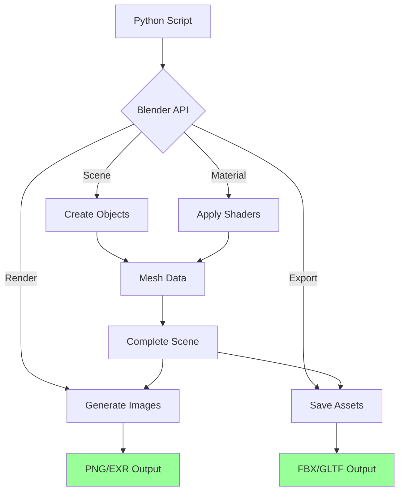

# Scripting Blender

Automate Blender 3D modeling, rendering, and asset generation using Python scripting.

## What This Skill Does

Master Blender automation:

- **Scene creation**: Programmatically build 3D scenes
- **Model generation**: Create meshes, curves, surfaces
- **Material automation**: Apply textures and shaders
- **Rendering**: Batch render with custom settings
- **Asset export**: Convert to FBX, OBJ, GLTF, USD
- **Addon development**: Extend Blender functionality

## Quick Start

### Create Basic Scene

```python
python scripts/create-scene.py
```

### Batch Render

```bash
blender scene.blend --background --python scripts/batch-render.py
```

### Export Models

```python
python scripts/export-assets.py input/ output/
```

---

## Blender Automation Workflow



---

## Setup and Basic Usage

### Installation

```bash
# Blender comes with Python bundled
# Access via blender executable

# Windows
C:\Program Files\Blender Foundation\Blender\blender.exe

# Mac
/Applications/Blender.app/Contents/MacOS/Blender

# Linux
/usr/bin/blender
```

### Running Scripts

```bash
# Interactive mode
blender --python script.py

# Background mode (no GUI)
blender --background --python script.py

# With .blend file
blender myfile.blend --background --python script.py
```

### Basic Script Structure

```python
import bpy
import math

# Clear existing scene
bpy.ops.object.select_all(action='SELECT')
bpy.ops.object.delete()

# Create object
bpy.ops.mesh.primitive_cube_add(location=(0, 0, 0))
cube = bpy.context.active_object

# Modify object
cube.scale = (2, 2, 2)
cube.rotation_euler = (0, 0, math.radians(45))

# Save
bpy.ops.wm.save_as_mainfile(filepath='output.blend')
```

---

## Creating 3D Objects

### Primitives

```python
import bpy

# Cube
bpy.ops.mesh.primitive_cube_add(
    size=2,
    location=(0, 0, 0)
)

# Sphere
bpy.ops.mesh.primitive_uv_sphere_add(
    radius=1,
    location=(3, 0, 0),
    segments=32,
    ring_count=16
)

# Cylinder
bpy.ops.mesh.primitive_cylinder_add(
    radius=1,
    depth=2,
    location=(-3, 0, 0)
)

# Torus
bpy.ops.mesh.primitive_torus_add(
    major_radius=1,
    minor_radius=0.25,
    location=(0, 3, 0)
)
```

### Custom Meshes

```python
import bpy

# Create mesh data
vertices = [
    (0, 0, 0),
    (1, 0, 0),
    (1, 1, 0),
    (0, 1, 0)
]

edges = []

faces = [(0, 1, 2, 3)]

# Create mesh
mesh = bpy.data.meshes.new(name="CustomMesh")
mesh.from_pydata(vertices, edges, faces)
mesh.update()

# Create object from mesh
obj = bpy.data.objects.new("CustomObject", mesh)

# Link to scene
bpy.context.collection.objects.link(obj)
```

### Modifiers

```python
# Add subdivision surface
obj = bpy.context.active_object
modifier = obj.modifiers.new(name="Subsurf", type='SUBSURF')
modifier.levels = 2
modifier.render_levels = 3

# Add array modifier
array = obj.modifiers.new(name="Array", type='ARRAY')
array.count = 5
array.relative_offset_displace = (1.5, 0, 0)

# Apply modifier
bpy.ops.object.modifier_apply(modifier="Subsurf")
```

---

## Materials and Textures

### Basic Materials

```python
import bpy

# Create material
material = bpy.data.materials.new(name="MyMaterial")
material.use_nodes = True

# Get node tree
nodes = material.node_tree.nodes
links = material.node_tree.links

# Clear default nodes
nodes.clear()

# Add Principled BSDF
bsdf = nodes.new(type='ShaderNodeBsdfPrincipled')
bsdf.location = (0, 0)

# Set properties
bsdf.inputs['Base Color'].default_value = (0.8, 0.2, 0.2, 1.0)
bsdf.inputs['Metallic'].default_value = 0.5
bsdf.inputs['Roughness'].default_value = 0.3

# Add output
output = nodes.new(type='ShaderNodeOutputMaterial')
output.location = (300, 0)

# Connect nodes
links.new(bsdf.outputs['BSDF'], output.inputs['Surface'])

# Assign to object
obj = bpy.context.active_object
if obj.data.materials:
    obj.data.materials[0] = material
else:
    obj.data.materials.append(material)
```

### Image Textures

```python
# Load image
image = bpy.data.images.load("/path/to/texture.png")

# Create texture node
tex_node = nodes.new(type='ShaderNodeTexImage')
tex_node.image = image
tex_node.location = (-300, 0)

# Connect to BSDF
links.new(tex_node.outputs['Color'], bsdf.inputs['Base Color'])

# UV mapping
obj = bpy.context.active_object
bpy.ops.object.mode_set(mode='EDIT')
bpy.ops.uv.smart_project()
bpy.ops.object.mode_set(mode='OBJECT')
```

---

## Rendering

### Basic Render

```python
import bpy

# Set render settings
scene = bpy.context.scene
scene.render.engine = 'CYCLES'  # or 'BLENDER_EEVEE'
scene.render.resolution_x = 1920
scene.render.resolution_y = 1080
scene.render.resolution_percentage = 100

# Set output
scene.render.filepath = '/output/render.png'
scene.render.image_settings.file_format = 'PNG'

# Render
bpy.ops.render.render(write_still=True)
```

### Batch Rendering

```python
import bpy
import os

# Setup scenes
scenes_to_render = [
    {"name": "Scene1", "camera": "Camera1", "output": "render1.png"},
    {"name": "Scene2", "camera": "Camera2", "output": "render2.png"},
]

for scene_config in scenes_to_render:
    # Set active scene
    bpy.context.window.scene = bpy.data.scenes[scene_config["name"]]
    scene = bpy.context.scene

    # Set camera
    scene.camera = bpy.data.objects[scene_config["camera"]]

    # Set output
    scene.render.filepath = f'/output/{scene_config["output"]}'

    # Render
    bpy.ops.render.render(write_still=True)

    print(f"✓ Rendered {scene_config['name']}")
```

### Animation Rendering

```python
# Set frame range
scene.frame_start = 1
scene.frame_end = 250
scene.frame_step = 1

# Set output format
scene.render.image_settings.file_format = 'FFMPEG'
scene.render.ffmpeg.format = 'MPEG4'
scene.render.ffmpeg.codec = 'H264'

# Render animation
scene.render.filepath = '/output/animation.mp4'
bpy.ops.render.render(animation=True)
```

---

## Exporting Assets

### FBX Export

```python
import bpy

# Select objects to export
bpy.ops.object.select_all(action='DESELECT')
obj = bpy.data.objects["MyObject"]
obj.select_set(True)

# Export
bpy.ops.export_scene.fbx(
    filepath='/output/model.fbx',
    use_selection=True,
    global_scale=1.0,
    apply_unit_scale=True,
    apply_scale_options='FBX_SCALE_ALL',
    axis_forward='-Z',
    axis_up='Y'
)
```

### GLTF Export

```python
bpy.ops.export_scene.gltf(
    filepath='/output/model.gltf',
    export_format='GLTF_SEPARATE',  # or 'GLB'
    export_texcoords=True,
    export_normals=True,
    export_materials='EXPORT',
    export_colors=True,
    use_selection=True
)
```

### OBJ Export

```python
bpy.ops.export_scene.obj(
    filepath='/output/model.obj',
    use_selection=True,
    use_materials=True,
    use_triangles=False,
    use_mesh_modifiers=True,
    axis_forward='-Z',
    axis_up='Y'
)
```

### Batch Export

```python
import bpy
import os

output_dir = '/output/models/'

# Export each object
for obj in bpy.data.objects:
    if obj.type == 'MESH':
        # Select only this object
        bpy.ops.object.select_all(action='DESELECT')
        obj.select_set(True)
        bpy.context.view_layer.objects.active = obj

        # Export
        filepath = os.path.join(output_dir, f'{obj.name}.fbx')
        bpy.ops.export_scene.fbx(
            filepath=filepath,
            use_selection=True
        )

        print(f'✓ Exported {obj.name}')
```

---

## Procedural Generation

### Procedural Trees

```python
import bpy
import random

def create_tree(location=(0, 0, 0)):
    # Trunk
    bpy.ops.mesh.primitive_cylinder_add(
        radius=0.2,
        depth=3,
        location=(location[0], location[1], location[2] + 1.5)
    )
    trunk = bpy.context.active_object

    # Leaves (sphere)
    bpy.ops.mesh.primitive_uv_sphere_add(
        radius=1.5,
        location=(location[0], location[1], location[2] + 4)
    )
    leaves = bpy.context.active_object

    # Materials
    trunk_mat = bpy.data.materials.new(name="Trunk")
    trunk_mat.diffuse_color = (0.4, 0.25, 0.1, 1.0)
    trunk.data.materials.append(trunk_mat)

    leaves_mat = bpy.data.materials.new(name="Leaves")
    leaves_mat.diffuse_color = (0.1, 0.6, 0.1, 1.0)
    leaves.data.materials.append(leaves_mat)

# Generate forest
for x in range(-10, 10, 3):
    for y in range(-10, 10, 3):
        offset_x = random.uniform(-1, 1)
        offset_y = random.uniform(-1, 1)
        create_tree((x + offset_x, y + offset_y, 0))
```

### Parametric Surfaces

```python
import bpy
import math

def create_wave_surface(size=10, segments=50):
    vertices = []
    faces = []

    # Generate vertices
    for i in range(segments + 1):
        for j in range(segments + 1):
            x = (i / segments - 0.5) * size
            y = (j / segments - 0.5) * size
            z = math.sin(x) * math.cos(y)

            vertices.append((x, y, z))

    # Generate faces
    for i in range(segments):
        for j in range(segments):
            v1 = i * (segments + 1) + j
            v2 = v1 + 1
            v3 = (i + 1) * (segments + 1) + j + 1
            v4 = v3 - 1

            faces.append((v1, v2, v3, v4))

    # Create mesh
    mesh = bpy.data.meshes.new(name="Wave")
    mesh.from_pydata(vertices, [], faces)
    mesh.update()

    obj = bpy.data.objects.new("WaveSurface", mesh)
    bpy.context.collection.objects.link(obj)

create_wave_surface()
```

---

## Animation

### Keyframe Animation

```python
import bpy

obj = bpy.context.active_object

# Set keyframes
obj.location = (0, 0, 0)
obj.keyframe_insert(data_path="location", frame=1)

obj.location = (5, 0, 0)
obj.keyframe_insert(data_path="location", frame=50)

obj.location = (5, 5, 0)
obj.keyframe_insert(data_path="location", frame=100)

# Set interpolation
for fcurve in obj.animation_data.action.fcurves:
    for keyframe in fcurve.keyframe_points:
        keyframe.interpolation = 'BEZIER'
```

### Procedural Animation

```python
import bpy
import math

obj = bpy.context.active_object

for frame in range(1, 251):
    # Calculate position
    t = frame / 250.0
    x = math.sin(t * math.pi * 2) * 5
    y = math.cos(t * math.pi * 2) * 5
    z = t * 3

    # Set location
    obj.location = (x, y, z)
    obj.keyframe_insert(data_path="location", frame=frame)

    # Set rotation
    obj.rotation_euler = (0, 0, t * math.pi * 4)
    obj.keyframe_insert(data_path="rotation_euler", frame=frame)
```

---

## Best Practices

### Performance
1. Use `bpy.ops` sparingly (slow)
2. Prefer direct data access (`bpy.data`)
3. Batch operations when possible
4. Use background mode for automation

### Organization
1. Name objects descriptively
2. Use collections for grouping
3. Clean up unused data
4. Save intermediate files

### Scripting
1. Add error handling
2. Log progress for long operations
3. Make scripts reusable
4. Document parameters

---

## Advanced Topics

For detailed information:
- **Geometry Nodes**: `resources/geometry-nodes.md`
- **Shader Programming**: `resources/shader-nodes.md`
- **Addon Development**: `resources/addon-development.md`

## References

- [Blender Python API](https://docs.blender.org/api/current/)
- [Blender Scripting](https://docs.blender.org/manual/en/latest/advanced/scripting/)
- [bpy Module Documentation](https://docs.blender.org/api/current/bpy.html)

