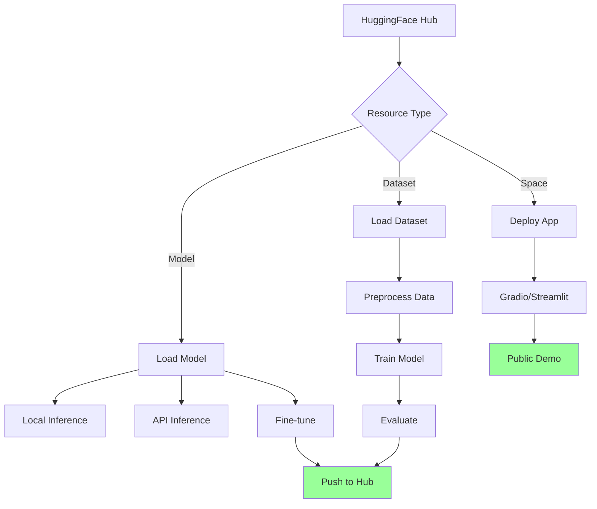

# Using HuggingFace

Comprehensive integration with HuggingFace Hub for AI model deployment, dataset management, and inference.

## What This Skill Does

Connects your projects to HuggingFace ecosystem:

- **Model integration**: Load and use pre-trained models
- **Dataset management**: Access and process HuggingFace datasets
- **Inference API**: Call models via HuggingFace API
- **Fine-tuning**: Train models on custom data
- **Spaces deployment**: Deploy interactive ML demos
- **Model hub search**: Discover and compare models

## Quick Start

### Load a Model

```python
from transformers import pipeline

# Sentiment analysis
classifier = pipeline("sentiment-analysis")
result = classifier("I love using HuggingFace!")
# [{'label': 'POSITIVE', 'score': 0.9998}]
```

### Use a Dataset

```python
from datasets import load_dataset

# Load dataset
dataset = load_dataset("imdb")
print(dataset["train"][0])
```

### Inference API

```bash
node scripts/huggingface-inference.js "Translate to French: Hello world"
```

---

## HuggingFace Workflow



---

## Model Integration

### Transformers Library

**Installation**:
```bash
pip install transformers torch
```

**Basic usage**:
```python
from transformers import AutoTokenizer, AutoModel

# Load pre-trained model
model_name = "bert-base-uncased"
tokenizer = AutoTokenizer.from_pretrained(model_name)
model = AutoModel.from_pretrained(model_name)

# Tokenize input
inputs = tokenizer("Hello, world!", return_tensors="pt")

# Get embeddings
outputs = model(**inputs)
embeddings = outputs.last_hidden_state
```

### Common Pipelines

**Text Classification**:
```python
from transformers import pipeline

classifier = pipeline("text-classification",
                     model="distilbert-base-uncased-finetuned-sst-2-english")

result = classifier("This product is amazing!")
# [{'label': 'POSITIVE', 'score': 0.9998}]
```

**Named Entity Recognition (NER)**:
```python
ner = pipeline("ner", model="dbmdz/bert-large-cased-finetuned-conll03-english")

text = "Apple Inc. was founded by Steve Jobs in California."
entities = ner(text)

for entity in entities:
    print(f"{entity['word']}: {entity['entity']}")
# Apple: B-ORG
# Steve Jobs: B-PER
# California: B-LOC
```

**Text Generation**:
```python
generator = pipeline("text-generation", model="gpt2")

prompt = "Once upon a time"
result = generator(prompt, max_length=50, num_return_sequences=1)
print(result[0]['generated_text'])
```

**Translation**:
```python
translator = pipeline("translation_en_to_fr",
                     model="Helsinki-NLP/opus-mt-en-fr")

result = translator("Hello, how are you?")
# [{'translation_text': 'Bonjour, comment allez-vous?'}]
```

**Question Answering**:
```python
qa = pipeline("question-answering")

context = "HuggingFace is a company that develops NLP tools."
question = "What does HuggingFace develop?"

result = qa(question=question, context=context)
# {'answer': 'NLP tools', 'score': 0.98}
```

### Model Selection Guide

| Task | Recommended Models | Use Case |
|------|-------------------|----------|
| **Text Classification** | `distilbert-base`, `roberta-base` | Sentiment, topic classification |
| **NER** | `bert-large-cased`, `roberta-large` | Entity extraction |
| **Text Generation** | `gpt2`, `gpt-neo-2.7B` | Content creation |
| **Translation** | `Helsinki-NLP/opus-mt-*` | Language translation |
| **Summarization** | `facebook/bart-large-cnn` | Document summarization |
| **Question Answering** | `bert-base-uncased`, `distilbert-base` | Q&A systems |
| **Zero-shot** | `facebook/bart-large-mnli` | Classification without training |

---

## Dataset Management

### Loading Datasets

**From Hub**:
```python
from datasets import load_dataset

# Load full dataset
dataset = load_dataset("imdb")
print(dataset.keys())  # ['train', 'test', 'unsupervised']

# Load specific split
train_dataset = load_dataset("imdb", split="train")

# Load subset
small_dataset = load_dataset("imdb", split="train[:1000]")
```

**Custom datasets**:
```python
from datasets import Dataset

# From dictionary
data = {
    "text": ["Hello", "World"],
    "label": [1, 0]
}
dataset = Dataset.from_dict(data)

# From pandas
import pandas as pd
df = pd.read_csv("data.csv")
dataset = Dataset.from_pandas(df)

# From CSV directly
dataset = load_dataset("csv", data_files="data.csv")
```

### Dataset Operations

**Filtering**:
```python
# Filter by condition
long_texts = dataset.filter(lambda x: len(x["text"]) > 100)

# Filter by index
subset = dataset.select(range(1000))
```

**Mapping**:
```python
# Preprocess function
def preprocess(example):
    example["text"] = example["text"].lower()
    return example

# Apply to dataset
processed = dataset.map(preprocess)

# Batch processing
def batch_preprocess(examples):
    examples["text"] = [text.lower() for text in examples["text"]]
    return examples

processed = dataset.map(batch_preprocess, batched=True)
```

**Shuffling and Splitting**:
```python
# Shuffle
shuffled = dataset.shuffle(seed=42)

# Train/test split
split_dataset = dataset.train_test_split(test_size=0.2)
train = split_dataset["train"]
test = split_dataset["test"]
```

### Dataset Features

```python
from datasets import ClassLabel, Value, Features

# Define schema
features = Features({
    "text": Value("string"),
    "label": ClassLabel(names=["negative", "positive"]),
    "score": Value("float")
})

# Create dataset with schema
dataset = Dataset.from_dict(data, features=features)
```

---

## Inference API

### REST API Integration

**Setup**:
```javascript
// scripts/huggingface-inference.js
import fetch from 'node-fetch';

const HF_API_KEY = process.env.HUGGINGFACE_API_KEY;
const API_URL = "https://api-inference.huggingface.co/models/";

async function query(model, inputs) {
  const response = await fetch(`${API_URL}${model}`, {
    headers: {
      "Authorization": `Bearer ${HF_API_KEY}`,
      "Content-Type": "application/json"
    },
    method: "POST",
    body: JSON.stringify({ inputs })
  });

  return await response.json();
}

// Text generation
const result = await query(
  "gpt2",
  "The future of AI is"
);

console.log(result);
```

**Common API endpoints**:

```javascript
// Sentiment analysis
await query("distilbert-base-uncased-finetuned-sst-2-english",
           "I love this product!");

// Translation
await query("Helsinki-NLP/opus-mt-en-fr",
           "Hello, how are you?");

// Image classification
await query("google/vit-base-patch16-224",
           imageBuffer);

// Text-to-image
await query("stabilityai/stable-diffusion-2-1",
           "A beautiful sunset over mountains");

// Speech-to-text
await query("openai/whisper-large-v2",
           audioBuffer);
```

### Python API Client

```python
from huggingface_hub import InferenceClient

client = InferenceClient(token=HF_API_KEY)

# Text generation
response = client.text_generation(
    "The future of AI is",
    model="gpt2",
    max_new_tokens=50
)

# Image generation
image = client.text_to_image(
    "A beautiful sunset over mountains",
    model="stabilityai/stable-diffusion-2-1"
)
image.save("output.png")

# Chat completion
messages = [
    {"role": "user", "content": "What is machine learning?"}
]
response = client.chat_completion(
    messages,
    model="meta-llama/Llama-2-7b-chat-hf"
)
```

---

## Fine-Tuning Models

### Training Setup

```python
from transformers import (
    AutoModelForSequenceClassification,
    AutoTokenizer,
    TrainingArguments,
    Trainer
)
from datasets import load_dataset

# Load model and tokenizer
model_name = "distilbert-base-uncased"
model = AutoModelForSequenceClassification.from_pretrained(
    model_name,
    num_labels=2
)
tokenizer = AutoTokenizer.from_pretrained(model_name)

# Prepare dataset
dataset = load_dataset("imdb")

def tokenize_function(examples):
    return tokenizer(
        examples["text"],
        padding="max_length",
        truncation=True
    )

tokenized_datasets = dataset.map(tokenize_function, batched=True)

# Training arguments
training_args = TrainingArguments(
    output_dir="./results",
    evaluation_strategy="epoch",
    learning_rate=2e-5,
    per_device_train_batch_size=16,
    num_train_epochs=3,
    weight_decay=0.01,
    save_strategy="epoch",
    load_best_model_at_end=True
)

# Trainer
trainer = Trainer(
    model=model,
    args=training_args,
    train_dataset=tokenized_datasets["train"],
    eval_dataset=tokenized_datasets["test"]
)

# Train
trainer.train()

# Save model
trainer.save_model("./my-finetuned-model")
```

### Push to Hub

```python
from huggingface_hub import HfApi

# Login
from huggingface_hub import login
login(token=HF_API_KEY)

# Push model
model.push_to_hub("my-username/my-model-name")
tokenizer.push_to_hub("my-username/my-model-name")

# Push dataset
dataset.push_to_hub("my-username/my-dataset-name")
```

---

## Spaces Deployment

### Gradio App

**Create app**:
```python
# app.py
import gradio as gr
from transformers import pipeline

# Load model
classifier = pipeline("sentiment-analysis")

def predict(text):
    result = classifier(text)[0]
    return {
        "label": result["label"],
        "confidence": result["score"]
    }

# Create interface
demo = gr.Interface(
    fn=predict,
    inputs=gr.Textbox(lines=3, placeholder="Enter text here..."),
    outputs=[
        gr.Label(label="Sentiment"),
        gr.Number(label="Confidence")
    ],
    title="Sentiment Analysis",
    description="Analyze the sentiment of text"
)

demo.launch()
```

**Deploy to Space**:
```bash
# Create requirements.txt
echo "transformers
torch
gradio" > requirements.txt

# Push to HuggingFace Space
git init
git add .
git commit -m "Initial commit"
git remote add origin https://huggingface.co/spaces/username/space-name
git push origin main
```

### Streamlit App

```python
# app.py
import streamlit as st
from transformers import pipeline

st.title("Text Summarization")

# Load model
@st.cache_resource
def load_model():
    return pipeline("summarization", model="facebook/bart-large-cnn")

summarizer = load_model()

# Input
text = st.text_area("Enter text to summarize", height=200)

if st.button("Summarize"):
    if text:
        summary = summarizer(text, max_length=130, min_length=30)[0]
        st.write("**Summary:**")
        st.write(summary['summary_text'])
```

---

## Advanced Features

### Model Hub Search

```python
from huggingface_hub import HfApi

api = HfApi()

# Search models
models = api.list_models(
    filter="text-classification",
    sort="downloads",
    direction=-1,
    limit=10
)

for model in models:
    print(f"{model.modelId}: {model.downloads} downloads")

# Get model info
model_info = api.model_info("bert-base-uncased")
print(model_info.tags)
print(model_info.pipeline_tag)
```

### Private Models

```python
from huggingface_hub import login

# Login with token
login(token=HF_API_KEY)

# Load private model
model = AutoModel.from_pretrained("my-org/private-model")

# Push private model
model.push_to_hub(
    "my-username/my-private-model",
    private=True
)
```

### Model Versioning

```python
# Load specific revision
model = AutoModel.from_pretrained(
    "bert-base-uncased",
    revision="v1.0.0"
)

# List model revisions
from huggingface_hub import list_repo_refs

refs = list_repo_refs("bert-base-uncased")
for branch in refs.branches:
    print(branch.name)
```

---

## Best Practices

### Model Selection

1. **Start small**: Use distilled models (distilbert, distilgpt2) for faster iteration
2. **Check benchmarks**: Review model performance on common datasets
3. **Consider size**: Larger models = better performance but slower inference
4. **License awareness**: Check model licenses before commercial use

### Performance Optimization

**Quantization**:
```python
from transformers import AutoModelForCausalLM

# Load in 8-bit
model = AutoModelForCausalLM.from_pretrained(
    "gpt2",
    load_in_8bit=True,
    device_map="auto"
)
```

**Caching**:
```python
# Cache models locally
from transformers import AutoModel

model = AutoModel.from_pretrained(
    "bert-base-uncased",
    cache_dir="./model_cache"
)
```

**Batching**:
```python
# Process multiple inputs
classifier = pipeline("sentiment-analysis")

texts = ["Great product!", "Terrible service", "Okay experience"]
results = classifier(texts)
```

### Error Handling

```python
from transformers import pipeline
import logging

try:
    model = pipeline("sentiment-analysis")
    result = model("Test text")
except Exception as e:
    logging.error(f"Model loading failed: {e}")
    # Fallback to simpler model
    model = pipeline("sentiment-analysis",
                    model="distilbert-base-uncased-finetuned-sst-2-english")
```

---

## Common Use Cases

### 1. Content Moderation

```python
classifier = pipeline("text-classification",
                     model="unitary/toxic-bert")

comments = [
    "This is a great post!",
    "You're an idiot",
    "Nice work, keep it up"
]

for comment in comments:
    result = classifier(comment)[0]
    if result['label'] == 'toxic' and result['score'] > 0.8:
        print(f"⚠️ Toxic: {comment}")
```

### 2. Document Search

```python
from sentence_transformers import SentenceTransformer, util

model = SentenceTransformer('all-MiniLM-L6-v2')

# Encode documents
documents = [
    "Python is a programming language",
    "Machine learning is a subset of AI",
    "HuggingFace provides ML tools"
]
doc_embeddings = model.encode(documents)

# Search
query = "What is Python?"
query_embedding = model.encode(query)

similarities = util.cos_sim(query_embedding, doc_embeddings)
best_match = documents[similarities.argmax()]
print(f"Best match: {best_match}")
```

### 3. Chatbot

```python
from transformers import pipeline

chatbot = pipeline("conversational",
                  model="microsoft/DialoGPT-medium")

from transformers import Conversation

conversation = Conversation("Hello!")
conversation = chatbot(conversation)
print(conversation.generated_responses[-1])

conversation.add_user_input("How are you?")
conversation = chatbot(conversation)
print(conversation.generated_responses[-1])
```

---

## Integration Patterns

### Next.js API Route

```typescript
// app/api/sentiment/route.ts
import { HfInference } from '@huggingface/inference';

const hf = new HfInference(process.env.HUGGINGFACE_API_KEY);

export async function POST(request: Request) {
  const { text } = await request.json();

  try {
    const result = await hf.textClassification({
      model: 'distilbert-base-uncased-finetuned-sst-2-english',
      inputs: text
    });

    return Response.json(result);
  } catch (error) {
    return Response.json({ error: 'Analysis failed' }, { status: 500 });
  }
}
```

### React Component

```typescript
// components/SentimentAnalyzer.tsx
'use client';

import { useState } from 'react';

export function SentimentAnalyzer() {
  const [text, setText] = useState('');
  const [result, setResult] = useState(null);

  const analyze = async () => {
    const response = await fetch('/api/sentiment', {
      method: 'POST',
      headers: { 'Content-Type': 'application/json' },
      body: JSON.stringify({ text })
    });

    const data = await response.json();
    setResult(data);
  };

  return (
    <div>
      <textarea value={text} onChange={(e) => setText(e.target.value)} />
      <button onClick={analyze}>Analyze</button>
      {result && <div>Sentiment: {result[0].label}</div>}
    </div>
  );
}
```

---

## Advanced Topics

For detailed information:
- **Model Fine-tuning Guide**: `resources/fine-tuning-guide.md`
- **Dataset Processing**: `resources/dataset-processing.md`
- **Inference Optimization**: `resources/inference-optimization.md`
- **Spaces Deployment**: `resources/spaces-deployment.md`

## References

- [HuggingFace Documentation](https://huggingface.co/docs)
- [Transformers Library](https://huggingface.co/docs/transformers)
- [Datasets Library](https://huggingface.co/docs/datasets)
- [Inference API](https://huggingface.co/docs/api-inference)
- [HuggingFace Hub](https://huggingface.co/docs/hub)

