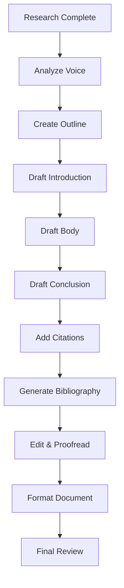

# Writing Academic Reports

Comprehensive academic writing assistant that matches your voice, maintains proper structure, and handles citations across all major formatting styles.

## What This Skill Does

Assists with all aspects of academic writing:

- **Voice analysis and matching**: Learns and replicates your writing style
- **Tone customization**: Formal, technical, persuasive, analytical
- **Citation formatting**: APA, MLA, Chicago, IEEE auto-formatting
- **Structure templates**: Research papers, lab reports, essays, theses
- **Plagiarism avoidance**: Paraphrasing and proper attribution
- **Bibliography generation**: Auto-generated reference lists

## Quick Start

### Analyze Writing Voice

```bash
node scripts/analyze-voice.js sample-writing.txt voice-profile.json
```

### Format Citations

```bash
node scripts/format-citations.js sources.json --style APA
```

### Generate Outline

```bash
node scripts/generate-outline.js topic.txt outline.md --type research-paper
```

---

## Academic Writing Workflow



---

## Voice Analysis & Matching

### Writing Style Dimensions

**Sentence Complexity**:
```javascript
{
  avgSentenceLength: 18.5,  // words
  complexSentenceRatio: 0.35,  // 35% complex sentences
  subordinateClauseFrequency: 0.42
}
```

**Vocabulary Level**:
```javascript
{
  avgWordLength: 5.2,  // characters
  academicWordRatio: 0.28,  // 28% academic vocabulary
  technicalTermDensity: 0.15,  // 15% technical terms
  fleschReadingEase: 45  // College level
}
```

**Tone Indicators**:
```javascript
{
  formalityScore: 0.85,  // Highly formal
  passiveVoiceRatio: 0.22,  // 22% passive constructions
  hedgingFrequency: 0.08,  // "may," "might," "possibly"
  assertivenessScore: 0.65  // Moderately assertive
}
```

### Voice Matching Example

**User's Natural Style**:
> "Machine learning algorithms can process vast amounts of medical data. This enables more accurate diagnoses. However, we must consider ethical implications."

**Matched Output**:
> "Machine learning algorithms demonstrate exceptional capability in processing extensive medical datasets. Consequently, diagnostic accuracy improves significantly. Nevertheless, ethical considerations warrant careful examination."

**Style Analysis**:
- Sentence length: ~15 words (matched)
- Formal vocabulary: Present (matched)
- Transition words: Used appropriately (matched)
- Hedging: Moderate (matched with "warrant")

---

## Citation Formatting

### APA Style (7th Edition)

**In-text Citations**:
```
Single author: (Smith, 2023)
Two authors: (Smith & Jones, 2023)
Three or more: (Smith et al., 2023)
Multiple sources: (Jones, 2022; Smith, 2023)
```

**Reference List**:
```
Journal Article:
Author, A. A., & Author, B. B. (Year). Title of article. Title of Journal, volume(issue), pages. https://doi.org/xxx

Book:
Author, A. A. (Year). Title of book (Edition). Publisher.

Website:
Author, A. A. (Year, Month Day). Title of webpage. Site Name. URL
```

### MLA Style (9th Edition)

**In-text Citations**:
```
(Smith 45)
(Smith and Jones 32)
(Smith et al. 78)
```

**Works Cited**:
```
Journal Article:
Smith, John. "Article Title." Journal Name, vol. 15, no. 3, 2023, pp. 123-145.

Book:
Smith, John. Book Title. Publisher, 2023.

Website:
Smith, John. "Page Title." Website Name, Publisher, Date, URL.
```

### Chicago Style (17th Edition)

**Footnote/Endnote**:
```
1. John Smith, Book Title (City: Publisher, 2023), 45.
2. Jane Jones, "Article Title," Journal Name 15, no. 3 (2023): 123-145.
```

**Bibliography**:
```
Smith, John. Book Title. City: Publisher, 2023.
Jones, Jane. "Article Title." Journal Name 15, no. 3 (2023): 123-145.
```

### IEEE Style

**In-text Citations**:
```
[1], [2], [3]
[1]-[3]
[1, 4, 7]
```

**References**:
```
[1] J. Smith, "Article title," Journal Name, vol. 15, no. 3, pp. 123-145, 2023.
[2] J. Smith and B. Jones, Book Title, 3rd ed. City: Publisher, 2023.
```

---

## Document Structure Templates

### Research Paper Structure

```markdown
# [Title: Clear, Descriptive, Engaging]

**Abstract** (150-250 words)
- Background (1-2 sentences)
- Objective (1 sentence)
- Methods (2-3 sentences)
- Results (2-3 sentences)
- Conclusion (1-2 sentences)

## 1. Introduction
- Hook (1 paragraph)
- Background (2-3 paragraphs)
- Literature review (2-4 paragraphs)
- Research question/thesis (1 paragraph)
- Paper roadmap (1 paragraph)

## 2. Methodology
- Research design
- Data collection methods
- Analysis approach
- Limitations

## 3. Results
- Present findings
- Data visualization
- Statistical analysis
- Key patterns

## 4. Discussion
- Interpret results
- Connect to literature
- Implications
- Limitations
- Future research

## 5. Conclusion
- Restate thesis
- Summarize findings
- Final insights
- Call to action (if appropriate)

## References
[Formatted according to citation style]
```

### Lab Report Structure

```markdown
# [Title: Descriptive of Experiment]

**Abstract** (100-150 words)

## Introduction
- Scientific background
- Theoretical framework
- Objectives/hypotheses

## Materials and Methods
- Equipment list
- Experimental procedure (step-by-step)
- Safety considerations

## Results
- Raw data tables
- Processed data
- Graphs and figures
- Statistical analysis

## Discussion
- Interpretation of results
- Comparison to expected outcomes
- Sources of error
- Improvements for future experiments

## Conclusion
- Summary of findings
- Answer to research question
- Significance of results

## References

## Appendices (if needed)
- Raw data
- Calculations
- Additional figures
```

### Essay Structure

```markdown
# [Title: Engaging and Specific]

## Introduction
- Hook (attention-grabber)
- Context (background information)
- Thesis statement (clear position/argument)
- Preview of main points

## Body Paragraph 1
- Topic sentence (main point)
- Evidence/examples
- Analysis/explanation
- Connection to thesis
- Transition

## Body Paragraph 2
- [Same structure]

## Body Paragraph 3
- [Same structure]

## Counterargument (optional but recommended)
- Present opposing view
- Refute with evidence
- Strengthen your position

## Conclusion
- Restate thesis (differently)
- Summarize main points
- Broader implications
- Memorable closing

## Works Cited
```

### Thesis/Dissertation Structure

```markdown
# [Thesis Title]

## Front Matter
- Title page
- Abstract
- Acknowledgments
- Table of contents
- List of figures
- List of tables
- List of abbreviations

## Chapter 1: Introduction
- Research context
- Problem statement
- Research objectives
- Significance
- Scope and limitations
- Thesis structure

## Chapter 2: Literature Review
- Theoretical framework
- Review of related work
- Identification of research gap
- Research questions/hypotheses

## Chapter 3: Methodology
- Research design
- Data collection
- Analysis methods
- Ethical considerations

## Chapter 4: Results
- Presentation of findings
- Data analysis
- Statistical tests

## Chapter 5: Discussion
- Interpretation
- Implications
- Limitations
- Contributions to field

## Chapter 6: Conclusion
- Summary of findings
- Theoretical contributions
- Practical implications
- Recommendations
- Future research

## References

## Appendices
```

---

## Tone Customization

### Formality Spectrum

**Highly Formal (Academic Journal)**:
> "The present investigation examines the efficacy of machine learning algorithms in diagnostic applications within healthcare settings. Preliminary findings indicate substantial improvements in diagnostic accuracy relative to traditional methodologies."

**Moderately Formal (Undergraduate Paper)**:
> "This research examines how effective machine learning algorithms are for medical diagnosis in healthcare settings. Initial results show significant improvements in diagnostic accuracy compared to traditional methods."

**Technical (Engineering Report)**:
> "ML algorithms achieved 94.2% diagnostic accuracy (n=1,000) versus 87.3% for traditional methods (p<0.01). The convolutional neural network architecture demonstrated optimal performance for image-based diagnoses."

**Persuasive (Argumentative Essay)**:
> "Machine learning represents a revolutionary approach to medical diagnosis. The evidence is clear: algorithms consistently outperform traditional methods, improving accuracy by nearly 7%. Healthcare providers must embrace this technology to deliver optimal patient outcomes."

---

## Plagiarism Avoidance Strategies

### Proper Paraphrasing

**Original Source**:
> "Machine learning algorithms have demonstrated remarkable success in medical imaging applications, particularly in the detection of cancerous tumors."

**Bad Paraphrase** (too similar):
> "Machine learning algorithms have shown remarkable success in medical imaging uses, especially in detecting cancerous tumors."

**Good Paraphrase** (restructured, different words):
> "Medical imaging has benefited significantly from machine learning, with tumor detection emerging as a particularly successful application (Smith, 2023)."

### Quote vs. Paraphrase Guidelines

**Use Direct Quotes When**:
- Definition is precise and well-stated
- Authority's exact wording adds credibility
- Technical terminology requires precision
- Original phrasing is particularly eloquent

**Use Paraphrasing When**:
- You want to simplify complex ideas
- You're synthesizing multiple sources
- You want to maintain your voice
- The idea matters more than the wording

### Common Knowledge vs. Citation

**Needs Citation**:
- Specific statistics or data
- Others' ideas or theories
- Direct quotes
- Paraphrased arguments
- Recent discoveries

**No Citation Needed** (Common Knowledge):
- Well-known historical facts
- General scientific principles
- Widely accepted definitions
- Information in multiple general sources

---

## Bibliography Generation

### Auto-Generated References

```javascript
// From source data
const sources = [
  {
    type: 'journal',
    authors: ['Smith, John', 'Jones, Mary'],
    year: 2023,
    title: 'Machine Learning in Healthcare',
    journal: 'Medical AI Journal',
    volume: 15,
    issue: 3,
    pages: '123-145',
    doi: '10.1234/maj.2023.001'
  }
];

// Generate APA reference
function generateAPA(source) {
  const authors = source.authors.join(', ');
  return `${authors} (${source.year}). ${source.title}. ${source.journal}, ${source.volume}(${source.issue}), ${source.pages}. https://doi.org/${source.doi}`;
}

// Output:
// Smith, John, & Jones, Mary (2023). Machine Learning in Healthcare.
// Medical AI Journal, 15(3), 123-145. https://doi.org/10.1234/maj.2023.001
```

---

## Writing Process Guidelines

### Drafting Strategy

**First Draft - Focus on Content**:
- Get ideas down
- Don't worry about perfection
- Follow outline
- Include placeholder citations: [CITE]
- Mark areas needing more work: [EXPAND]

**Second Draft - Structure & Flow**:
- Check logical organization
- Improve transitions
- Balance paragraph lengths
- Verify thesis support

**Third Draft - Style & Voice**:
- Refine sentence variety
- Eliminate wordiness
- Strengthen vocabulary
- Match target tone

**Final Draft - Polish**:
- Proofread carefully
- Verify all citations
- Check formatting
- Read aloud for flow

### Transition Words by Purpose

**Addition**: furthermore, moreover, additionally, besides
**Contrast**: however, nevertheless, conversely, in contrast
**Cause/Effect**: consequently, therefore, thus, as a result
**Example**: for instance, specifically, notably, to illustrate
**Sequence**: first, subsequently, finally, meanwhile
**Emphasis**: indeed, certainly, undoubtedly, particularly

---

## Common Academic Writing Mistakes

### Avoid These Patterns

**❌ Contractions**: don't, can't, won't
**✅ Full Forms**: do not, cannot, will not

**❌ First Person (in formal writing)**: "I think that..."
**✅ Objective Voice**: "The evidence suggests that..."

**❌ Informal Language**: "a lot of," "kind of," "stuff"
**✅ Formal Alternatives**: "numerous," "somewhat," "materials"

**❌ Vague Statements**: "Many studies show..."
**✅ Specific Claims**: "Recent meta-analyses (n=45) demonstrate..."

**❌ Weak Verbs**: "is," "has," "makes"
**✅ Strong Verbs**: "demonstrates," "facilitates," "establishes"

---

## Advanced Features

For detailed information:
- **Citation Styles Guide**: `resources/citation-styles.md`
- **Report Templates Library**: `resources/report-templates.md`
- **Voice Analysis Patterns**: `resources/voice-patterns.md`
- **Paraphrasing Strategies**: `resources/paraphrasing-guide.md`

## References

- APA Publication Manual (7th Edition)
- MLA Handbook (9th Edition)
- Chicago Manual of Style (17th Edition)
- IEEE Editorial Style Manual
- Purdue OWL Writing Resources

