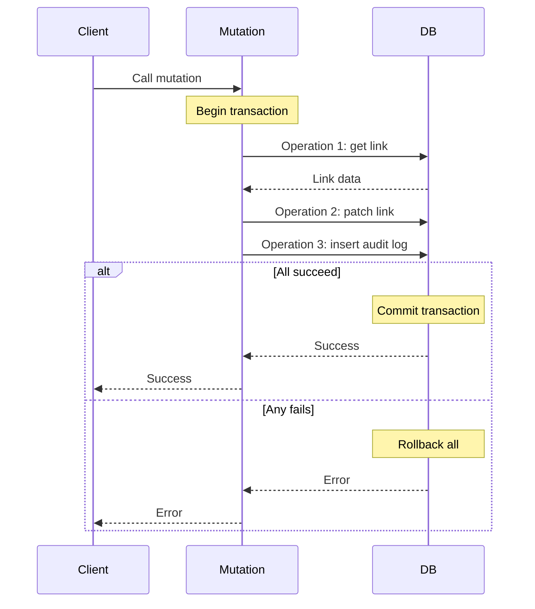
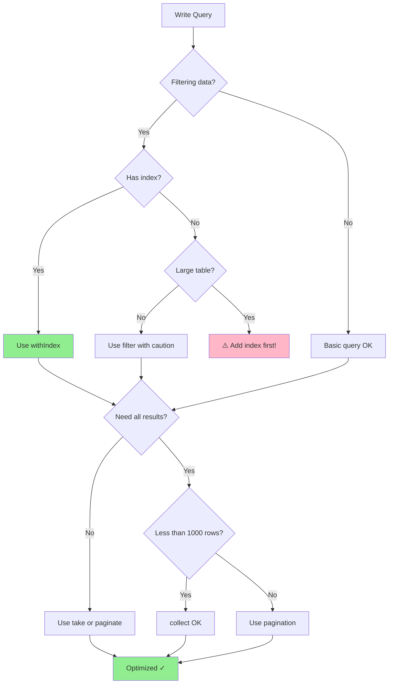

# Writing Convex Queries and Mutations

Complete guide for reading data with queries and modifying data with mutations in Convex.

## Queries: Reading Data

### Basic Query Structure

```typescript
import { query } from "./_generated/server";
import { v } from "convex/values";

export const listProfiles = query({
  args: {},
  handler: async (ctx) => {
    return await ctx.db.query("profiles").collect();
  },
});
```

### Get Single Document

```typescript
export const getProfile = query({
  args: { profileId: v.id("profiles") },
  handler: async (ctx, { profileId }) => {
    return await ctx.db.get(profileId);
  },
});
```

### Query with Index

```typescript
export const getProfileBySlug = query({
  args: { slug: v.string() },
  handler: async (ctx, { slug }) => {
    return await ctx.db
      .query("profiles")
      .withIndex("by_slug", q => q.eq("slug", slug))
      .first();
  },
});
```

### Compound Index Queries

```typescript
export const getActiveLinksForProfile = query({
  args: { profileId: v.id("profiles") },
  handler: async (ctx, { profileId }) => {
    return await ctx.db
      .query("links")
      .withIndex("by_profile_active", q =>
        q.eq("profileId", profileId).eq("isActive", true)
      )
      .collect();
  },
});
```

### Range Queries

```typescript
export const getRecentAnalytics = query({
  args: {
    linkId: v.id("links"),
    startTime: v.number(),
  },
  handler: async (ctx, { linkId, startTime }) => {
    return await ctx.db
      .query("analytics")
      .withIndex("by_link_time", q =>
        q.eq("linkId", linkId).gte("timestamp", startTime)
      )
      .collect();
  },
});
```

## Result Methods

### collect()
Returns all matching documents:

```typescript
const allProfiles = await ctx.db
  .query("profiles")
  .collect();
```

### first()
Returns first result or `null`:

```typescript
const profile = await ctx.db
  .query("profiles")
  .withIndex("by_slug", q => q.eq("slug", slug))
  .first();

if (!profile) {
  throw new Error("Profile not found");
}
```

### unique()
Returns exactly one result or throws error:

```typescript
const profile = await ctx.db
  .query("profiles")
  .withIndex("by_slug", q => q.eq("slug", slug))
  .unique();
// Throws if 0 or >1 results
```

### take(n)
Returns first n results:

```typescript
const recentProfiles = await ctx.db
  .query("profiles")
  .order("desc")
  .take(10);
```

### paginate()
Returns paginated results:

```typescript
export const listProfilesPaginated = query({
  args: {
    paginationOpts: v.object({
      numItems: v.number(),
      cursor: v.union(v.string(), v.null()),
    }),
  },
  handler: async (ctx, { paginationOpts }) => {
    return await ctx.db
      .query("profiles")
      .paginate(paginationOpts);
  },
});

// Returns: { page: Doc[], continueCursor: string | null, isDone: boolean }
```

## Ordering

### Default Order
```typescript
// Ascending by _creationTime (oldest first)
const profiles = await ctx.db
  .query("profiles")
  .collect();
```

### Reverse Order
```typescript
// Descending by _creationTime (newest first)
const profiles = await ctx.db
  .query("profiles")
  .order("desc")
  .collect();
```

### Order by Index
```typescript
// Order by indexed field
const profiles = await ctx.db
  .query("profiles")
  .withIndex("by_slug", q => q.eq("userId", userId))
  .order("desc")
  .collect();
```

## Filtering

### With Index (Recommended)
```typescript
export const getActiveLinks = query({
  args: { profileId: v.id("profiles") },
  handler: async (ctx, { profileId }) => {
    return await ctx.db
      .query("links")
      .withIndex("by_profile", q => q.eq("profileId", profileId))
      .filter(q => q.eq(q.field("isActive"), true))
      .collect();
  },
});
```

### Without Index (Less Efficient)
```typescript
// Full table scan - avoid on large tables
const activeProfiles = await ctx.db
  .query("profiles")
  .filter(q => q.eq(q.field("isActive"), true))
  .collect();
```

## Mutations: Writing Data

### Insert

```typescript
import { mutation } from "./_generated/server";
import { v } from "convex/values";

export const createProfile = mutation({
  args: {
    userId: v.string(),
    slug: v.string(),
    displayName: v.string(),
  },
  handler: async (ctx, args) => {
    const profileId = await ctx.db.insert("profiles", {
      userId: args.userId,
      slug: args.slug,
      displayName: args.displayName,
      isActive: true,
      _updatedTime: Date.now(),
    });

    return profileId;
  },
});
```

### Patch (Partial Update)

```typescript
export const updateProfile = mutation({
  args: {
    profileId: v.id("profiles"),
    displayName: v.optional(v.string()),
    bio: v.optional(v.string()),
  },
  handler: async (ctx, { profileId, ...updates }) => {
    await ctx.db.patch(profileId, {
      ...updates,
      _updatedTime: Date.now(),
    });
  },
});
```

### Replace (Full Update)

```typescript
export const replaceProfile = mutation({
  args: {
    profileId: v.id("profiles"),
    profile: v.object({
      userId: v.string(),
      slug: v.string(),
      displayName: v.string(),
      bio: v.optional(v.string()),
    }),
  },
  handler: async (ctx, { profileId, profile }) => {
    await ctx.db.replace(profileId, {
      ...profile,
      isActive: true,
      _updatedTime: Date.now(),
    });
  },
});
```

### Delete

```typescript
export const deleteProfile = mutation({
  args: { profileId: v.id("profiles") },
  handler: async (ctx, { profileId }) => {
    await ctx.db.delete(profileId);
  },
});
```

## Transactions

All database operations in a mutation are transactional:

```typescript
export const transferLink = mutation({
  args: {
    linkId: v.id("links"),
    fromProfileId: v.id("profiles"),
    toProfileId: v.id("profiles"),
  },
  handler: async (ctx, { linkId, fromProfileId, toProfileId }) => {
    // All operations succeed or fail together
    const link = await ctx.db.get(linkId);

    if (!link || link.profileId !== fromProfileId) {
      throw new Error("Link not found or unauthorized");
    }

    await ctx.db.patch(linkId, {
      profileId: toProfileId,
    });

    // Log transfer
    await ctx.db.insert("auditLogs", {
      entityType: "LINK",
      entityId: linkId,
      action: "TRANSFER",
      from: fromProfileId,
      to: toProfileId,
      timestamp: Date.now(),
    });

    // If any operation fails, all are rolled back
  },
});
```

**Transaction Flow:**


## Validation

### Runtime Validation

```typescript
export const createLink = mutation({
  args: {
    profileId: v.id("profiles"),
    type: v.union(v.literal("URL"), v.literal("EMAIL")),
    title: v.string(),
    url: v.optional(v.string()),
    email: v.optional(v.string()),
  },
  handler: async (ctx, args) => {
    // Validate type-specific fields
    if (args.type === "URL" && !args.url) {
      throw new Error("URL required for URL links");
    }
    if (args.type === "EMAIL" && !args.email) {
      throw new Error("Email required for EMAIL links");
    }

    return await ctx.db.insert("links", {
      profileId: args.profileId,
      type: args.type,
      title: args.title,
      url: args.url,
      email: args.email,
      isActive: true,
      clicks: 0,
    });
  },
});
```

### Authorization

```typescript
async function requireProfileOwner(
  ctx: MutationCtx,
  profileId: Id<"profiles">
) {
  const identity = await ctx.auth.getUserIdentity();
  if (!identity) throw new Error("Unauthenticated");

  const profile = await ctx.db.get(profileId);
  if (!profile) throw new Error("Profile not found");

  if (profile.userId !== identity.subject) {
    throw new Error("Unauthorized");
  }

  return profile;
}

export const updateProfileAuthorized = mutation({
  args: {
    profileId: v.id("profiles"),
    displayName: v.string(),
  },
  handler: async (ctx, { profileId, displayName }) => {
    // Check authorization
    await requireProfileOwner(ctx, profileId);

    await ctx.db.patch(profileId, {
      displayName,
      _updatedTime: Date.now(),
    });
  },
});
```

## Optimistic Updates

Frontend pattern with Convex:

```typescript
// Mutation
export const incrementClicks = mutation({
  args: { linkId: v.id("links") },
  handler: async (ctx, { linkId }) => {
    const link = await ctx.db.get(linkId);
    if (!link) throw new Error("Link not found");

    await ctx.db.patch(linkId, {
      clicks: link.clicks + 1,
      lastClickedAt: Date.now(),
    });
  },
});

// Frontend (React)
function LinkCard({ linkId }: { linkId: Id<"links"> }) {
  const link = useQuery(api.links.get, { linkId });
  const incrementClicks = useMutation(api.links.incrementClicks);

  const [optimisticClicks, setOptimisticClicks] = useState(0);

  const handleClick = () => {
    // Optimistic update
    setOptimisticClicks(prev => prev + 1);

    // Actual mutation
    incrementClicks({ linkId })
      .catch(() => {
        // Rollback on error
        setOptimisticClicks(prev => prev - 1);
      });
  };

  const displayClicks = (link?.clicks ?? 0) + optimisticClicks;

  return (
    <button onClick={handleClick}>
      Clicks: {displayClicks}
    </button>
  );
}
```

## Error Handling

```typescript
export const createProfileSafe = mutation({
  args: {
    userId: v.string(),
    slug: v.string(),
    displayName: v.string(),
  },
  handler: async (ctx, args) => {
    try {
      // Check for existing slug
      const existing = await ctx.db
        .query("profiles")
        .withIndex("by_slug", q => q.eq("slug", args.slug))
        .first();

      if (existing) {
        throw new Error(`Slug "${args.slug}" already taken`);
      }

      const profileId = await ctx.db.insert("profiles", {
        ...args,
        isActive: true,
      });

      return { success: true, profileId };
    } catch (error) {
      console.error("Profile creation failed:", error);
      return {
        success: false,
        error: error instanceof Error ? error.message : "Unknown error",
      };
    }
  },
});
```

## Best Practices

1. **Always use indexes** for filtering large tables
2. **Use `.first()` for single results**, not `.collect()[0]`
3. **Validate inputs** before database operations
4. **Check authorization** before mutations
5. **Use transactions** implicitly - all operations in a mutation are atomic
6. **Return meaningful data** from mutations for optimistic updates
7. **Handle errors gracefully** with try-catch
8. **Use pagination** for large result sets
9. **Order by indexed fields** for better performance
10. **Avoid full table scans** on production data

## Performance Tips

### Use Indexes
```typescript
// ❌ Slow: Full table scan
const profiles = await ctx.db
  .query("profiles")
  .filter(q => q.eq(q.field("userId"), userId))
  .collect();

// ✅ Fast: Index lookup
const profiles = await ctx.db
  .query("profiles")
  .withIndex("by_user", q => q.eq("userId", userId))
  .collect();
```

**Query Optimization Decision Tree:**


### Limit Results
```typescript
// ❌ Expensive: Load all results
const profiles = await ctx.db.query("profiles").collect();

// ✅ Efficient: Load only what's needed
const profiles = await ctx.db.query("profiles").take(20);
```

### Paginate Large Lists
```typescript
// ✅ Memory efficient pagination
const result = await ctx.db
  .query("profiles")
  .paginate({ numItems: 50, cursor: null });
```

For more advanced patterns including search, aggregations, and complex joins, see:
- `resources/advanced-queries.md`
- `resources/real-time-patterns.md`
- `scripts/query-examples.ts`
- `scripts/mutation-examples.ts`

