# Convex Query & Mutation Architecture

Visual guide to understanding Convex data operations, optimization patterns, and real-time updates.

## Query vs Mutation Lifecycle

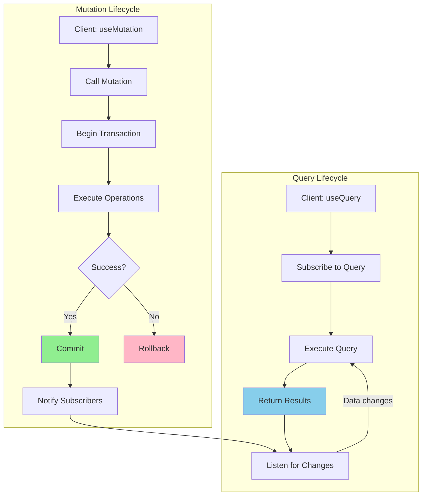

## Query Execution Path

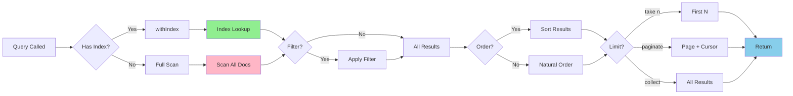

## Mutation Transaction Flow

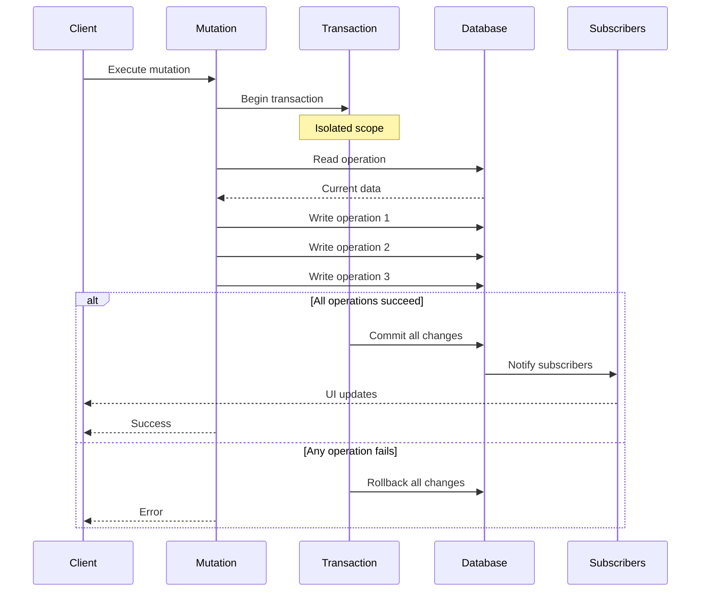

## Index vs Filter Performance

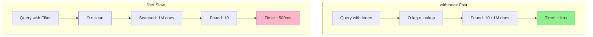

## Real-Time Update Flow

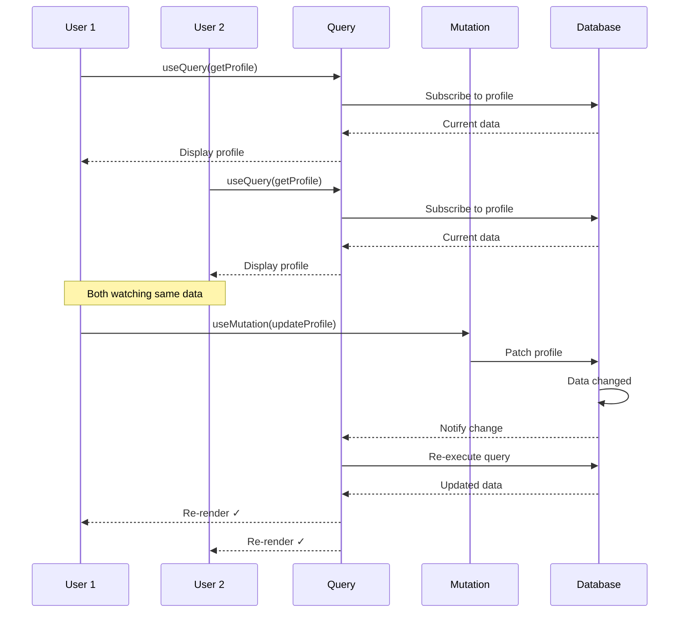

## Pagination Strategy

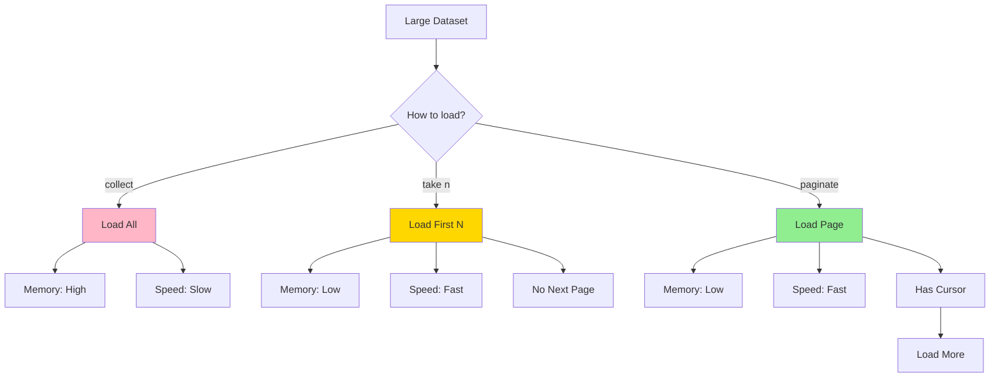

## Query Optimization Workflow

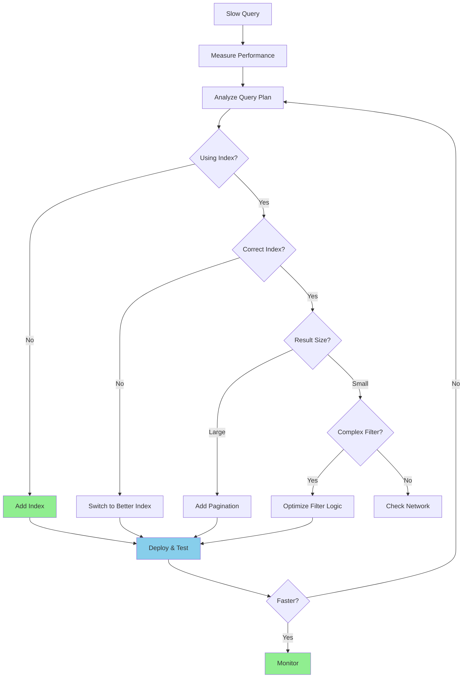

## Authorization Pattern

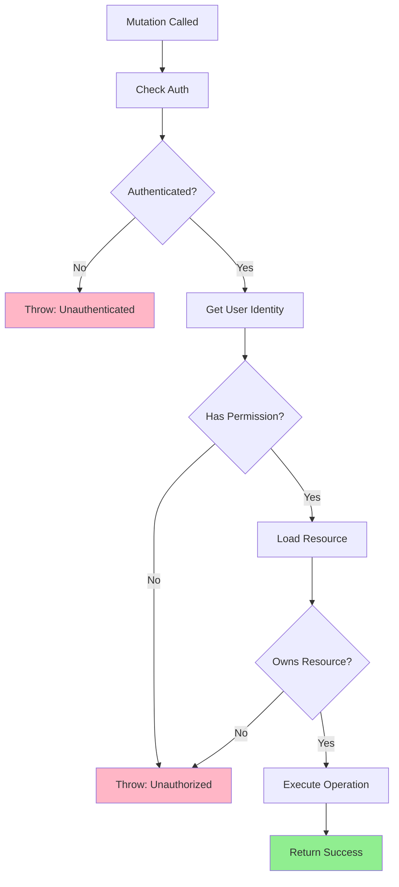

## Optimistic Update Pattern

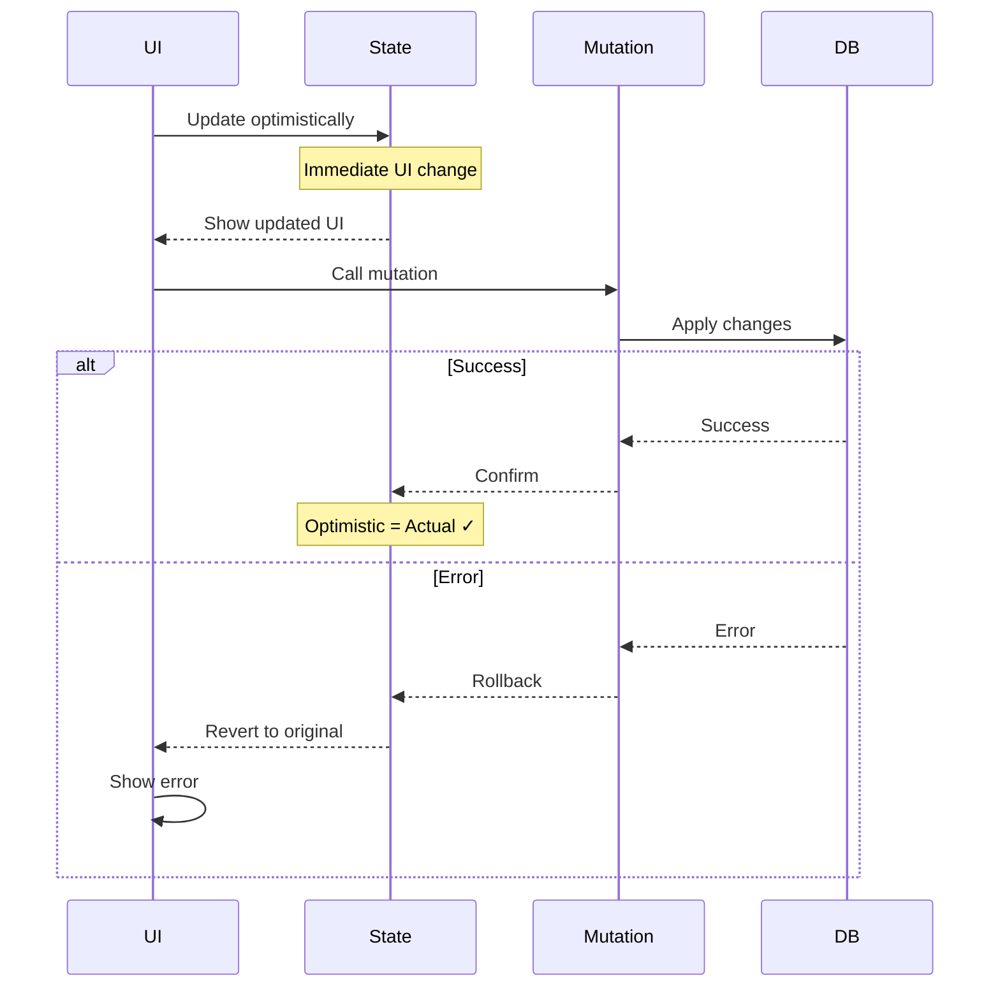

## Compound Index Query Patterns

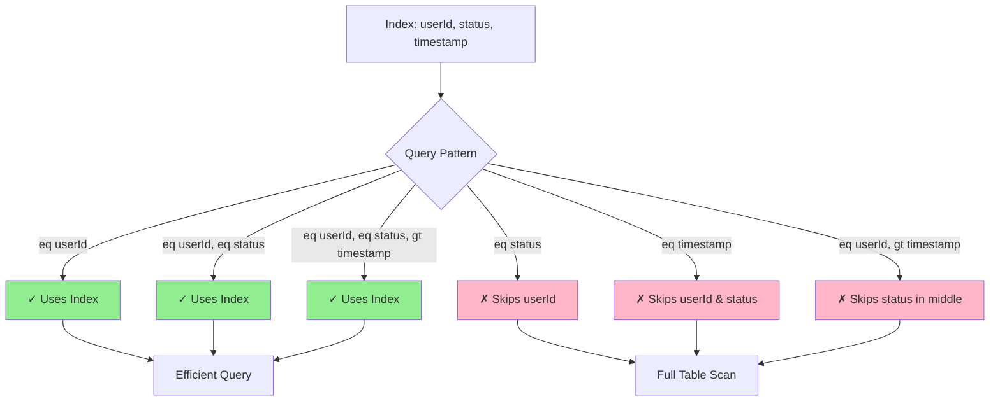

## CRUD Operations Flow

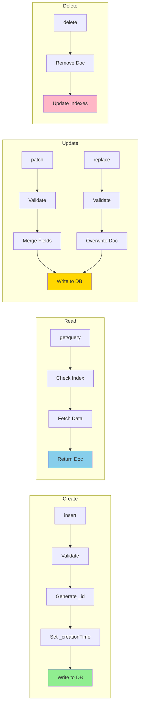

## Search Index Query Flow

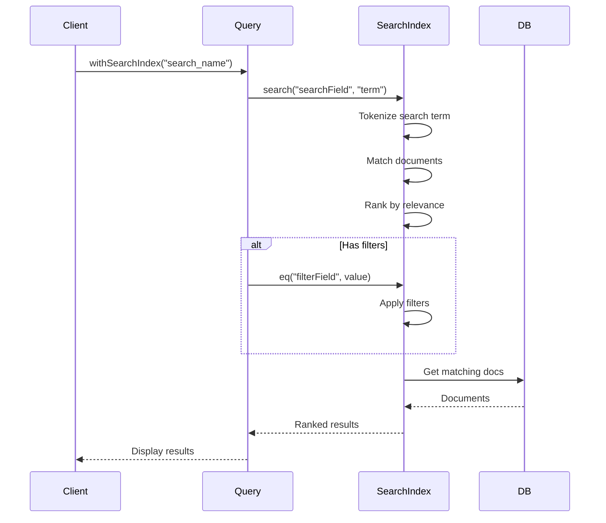

## Error Handling Strategy

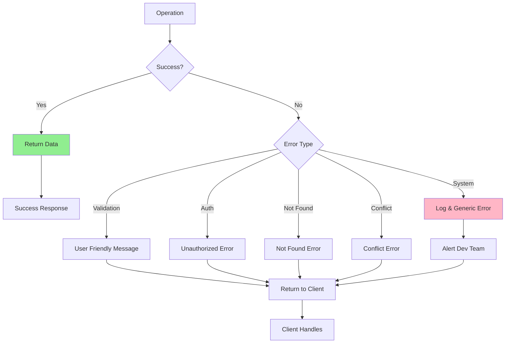

## Batch Operations Pattern

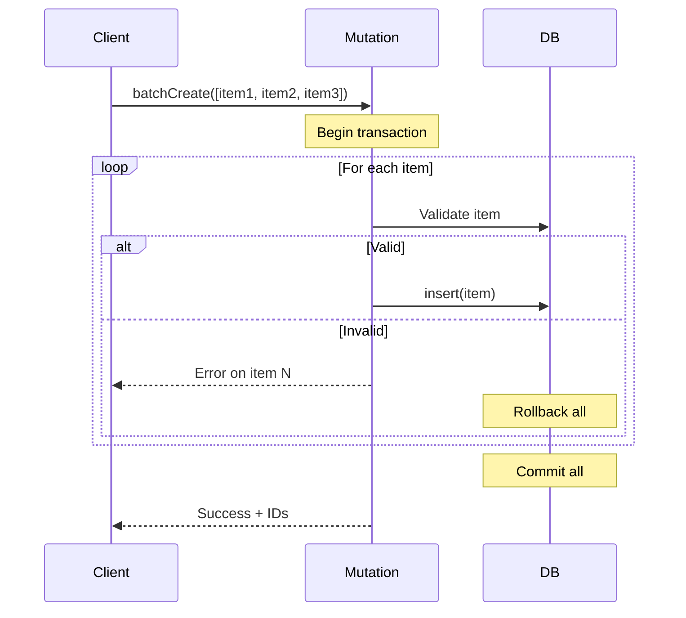

## Query Result Methods Comparison

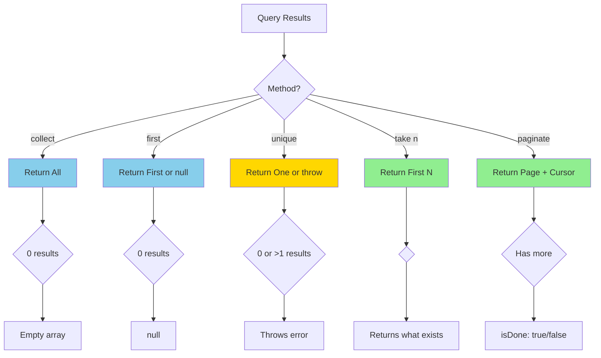

## Data Consistency Model

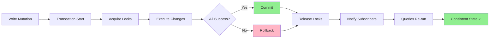

